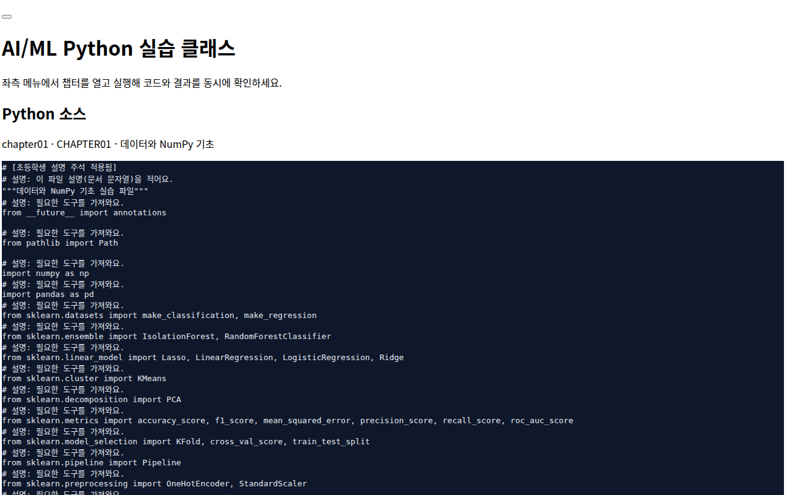
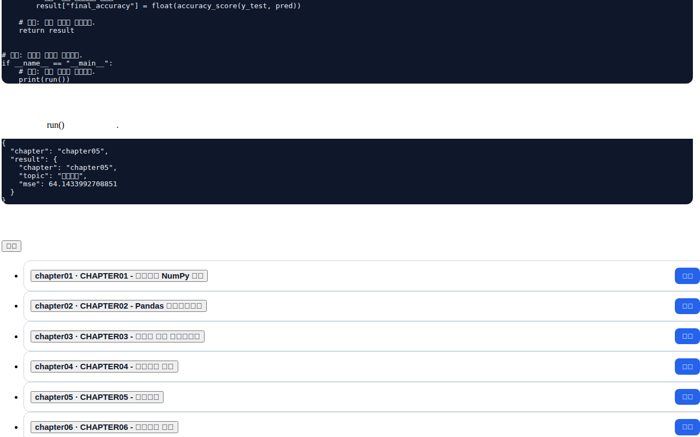

# AI/ML Basic Class 실습 프로젝트

이 저장소의 기존 Markdown 자료(수학/통계 용어, 수식-코드 매핑, Python 예제)를 기반으로, **Chapter01~Chapter99 실습 코드**와 **FastAPI + 프론트엔드 실습 앱**을 구성했습니다.

## 프로젝트 구성

- `chapters/chapter01` ~ `chapters/chapter99`: 챕터별 `README.md` + `practice.py`
- `backend/app/main.py`: FastAPI 백엔드
- `frontend/`: 브라우저에서 챕터 실행/결과 확인 UI
- `requirements.txt`: 실행 의존성
- `DOCS/`: 학습 문서 인덱스 및 확장 설명 문서
- `scripts/`: 자동 생성/검증 스크립트

## 실행 방법

```bash
python3 -m venv .venv
source .venv/bin/activate
pip install -r requirements.txt
uvicorn backend.app.main:app --reload --host 0.0.0.0 --port 8888
```

브라우저에서 `http://localhost:8888` 접속 후 챕터를 실행하면 결과(JSON)를 확인할 수 있습니다.

런타임 스모크 테스트(의존성 설치 후):

```bash
./scripts/runtime_smoke_check.sh
```

초등학생 친화 자산 자동 생성(주석/설명문서/음성):

```bash
python3 scripts/generate_kids_assets.py --mode all
```

## 초등학생 친화 구성

- 모든 Python 소스(챕터 + 백엔드)에 줄 단위 설명 주석을 추가했습니다.
- Python 소스가 있는 각 폴더마다 `python_explain.md`를 생성했습니다.
- 각 `python_explain.md` 내용을 한국 여성 음성(mp3)으로 생성했습니다.
  - 파일명: `python_explain_ko_female.mp3`
  - 예시: `chapters/chapter31/python_explain_ko_female.mp3`

## 학습 흐름

1. chapter01~04: 데이터/수학 기초
2. chapter05~11: 핵심 ML 모델 + 평가/검증
3. chapter12~18: 실무형 전처리/재현성/배포 준비
4. chapter19~20: FastAPI 서빙 및 통합 미니 프로젝트
5. chapter21: 신경망 모델 전체 흐름(요약)
6. chapter22~30: 신경망 학습 요소를 세분화한 확장 실습(행렬/활성화/소프트맥스/손실/역전파/최적화/CNN)

## 재구성 커리큘럼(초급자/초등학생 친화)

- `chapter01~99` 확장 로드맵(각 챕터: 10분 개념 + 30분 Python 실습)
- 문서: `DOCS/chapter01_99_restructured_ko.md`
- `chapter31~99`는 초급자 실습용 스타터 코드(`run()` + phase별 demo)가 생성되어 있어 바로 확장 가능합니다.
- 진행 상태: `chapter31~99` 주제별 전용 실습 코드 확장 완료

## 실행 화면 캡쳐 (fe 실행 결과)

프론트엔드(fe)를 실행하여 주요 챕터의 Python 코드를 브라우저에서 실행한 결과 화면입니다.

### Chapter01 · 데이터와 NumPy 기초



> `numpy` 배열의 평균(mean=3.0)과 표준편차(std≈1.414)를 계산하는 기초 실습입니다.

### Chapter05 · 선형회귀 (Linear Regression)



> `sklearn`의 `LinearRegression`으로 회귀 모델을 학습하고 MSE(≈64.14)를 출력합니다.

### Chapter08 · 랜덤포레스트 (Random Forest)


> `RandomForestClassifier` 120개 트리로 학습 후 F1 Score(0.75)를 측정합니다.

### Chapter21 · 신경망 기초와 학습 (Forward/Backward)


> 순전파(Forward)·역전파(Backward)·경사하강법을 NumPy로 직접 구현하여 300 에폭 학습 후 train_accuracy를 확인합니다.

### Chapter28 · 2층 신경망 fitting 루프


> 2층 신경망을 250 에폭 학습: initial_loss≈1.09 → final_loss≈0.005, train_accuracy=1.0 달성.

## 문서 인덱스

- 전체 문서 정리: `DOCS/README.md`
