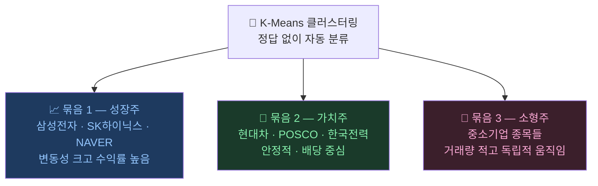

# 비슷한 주식끼리 묶기: 클러스터링

> 개발자의 질문: "삼성전자랑 LG전자는 비슷한 종목일까요?"
> 컴퓨터에게 주식 데이터를 주면 스스로 비슷한 것끼리 묶어줍니다!

---

## 왜 배우나요?

주식시장에는 수천 개의 종목이 있습니다.  
"이 종목들이 서로 얼마나 비슷하게 움직일까?"를 손으로 하나하나 비교하기엔 너무 많습니다.

클러스터링은 **컴퓨터가 스스로 비슷한 주식끼리 그룹을 만들어주는 방법**입니다.  
예를 들어, 전자 회사들끼리, 은행끼리, 바이오끼리 자동으로 묶어줍니다.

---

## 어떻게 가르치나요?

주식 데이터에서 여러 특성을 뽑아 컴퓨터에게 줍니다.
- 최근 한 달 수익률이 얼마나 됐나?
- 얼마나 자주 올랐나?
- 거래량이 많은 편인가?

컴퓨터는 이 숫자들을 보고 **비슷한 숫자를 가진 종목끼리** 자동으로 묶습니다.
정답(레이블)을 알려주지 않아도 됩니다!

---

## 어떤 결과를 기대하나요?



이런 그룹을 알면 포트폴리오를 다양하게 구성하거나, 비슷한 종목이 오를 때 다른 종목도 따라 오를지 예측할 수 있습니다.

---

## 1. 주식 데이터 준비

```python
import pandas as pd
import numpy as np
from sklearn.cluster import KMeans
from sklearn.preprocessing import StandardScaler
from sklearn.decomposition import PCA
import matplotlib.pyplot as plt

np.random.seed(42)

# 주식 10종목, 각각 60일치 데이터 만들기
n_stocks = 30
n_days   = 60

# 3가지 그룹으로 주가 시뮬레이션
# 그룹1: 성장주 (많이 오름, 변동 큼)
# 그룹2: 안정주 (조금 오름, 변동 작음)
# 그룹3: 하락주 (내려감)

stock_names = [f'종목{i+1:02d}' for i in range(n_stocks)]

returns_list = []
for i in range(n_stocks):
    if i < 10:    # 성장주
        daily = np.random.randn(n_days) * 0.02 + 0.003
    elif i < 20:  # 안정주
        daily = np.random.randn(n_days) * 0.008 + 0.001
    else:         # 하락주
        daily = np.random.randn(n_days) * 0.015 - 0.002
    returns_list.append(daily)

returns_matrix = np.array(returns_list)  # (30종목, 60일)
print(f"데이터 크기: {returns_matrix.shape}")
print(f"  - 행: {returns_matrix.shape[0]}개 종목")
print(f"  - 열: {returns_matrix.shape[1]}일치 수익률")
```

---

## 2. 종목별 특성 계산

```python
# 각 종목의 특성 요약
features = []
for i, name in enumerate(stock_names):
    ret = returns_matrix[i]
    features.append({
        '종목':     name,
        '평균수익률': ret.mean(),         # 평균적으로 얼마나 올랐나?
        '변동성':   ret.std(),           # 얼마나 들쭉날쭉한가?
        '상승일수': (ret > 0).sum(),     # 몇 번 올랐나?
        '최대상승': ret.max(),           # 가장 많이 오른 날
        '최대하락': ret.min(),           # 가장 많이 내린 날
    })

feat_df = pd.DataFrame(features)
print(feat_df.round(4))
```

---

## 3. K-Means로 그룹 나누기

K-Means는 **K개의 그룹으로 나누는 방법**입니다.

"몇 그룹으로 나눌까?" (K값)를 우리가 정해줘야 합니다.

```python
# 특성 데이터만 추출
X = feat_df[['평균수익률', '변동성', '상승일수', '최대상승', '최대하락']].values

# 숫자 크기 맞추기 (크기가 다른 숫자들을 비슷하게 맞춤)
scaler = StandardScaler()
X_sc = scaler.fit_transform(X)

# K=3으로 3그룹으로 나누기
km = KMeans(n_clusters=3, n_init=20, random_state=42)
labels = km.fit_predict(X_sc)

feat_df['그룹'] = labels
print("\n그룹별 종목:")
for g in range(3):
    stocks_in_g = feat_df[feat_df['그룹'] == g]['종목'].tolist()
    print(f"  그룹 {g}: {stocks_in_g}")
```

---

## 4. 최적 그룹 수 찾기

몇 개 그룹으로 나눠야 가장 잘 나뉠까요? **엘보우 방법**으로 찾습니다.

```python
# 그룹 수를 바꿔가며 "얼마나 잘 나뉘었는지" 점수 계산
inertias = []
k_range = range(2, 9)

for k in k_range:
    km_k = KMeans(n_clusters=k, n_init=20, random_state=42)
    km_k.fit(X_sc)
    inertias.append(km_k.inertia_)  # 낮을수록 잘 나뉜 것

plt.figure(figsize=(7, 4))
plt.plot(k_range, inertias, 'bo-', linewidth=2, markersize=8)
plt.xlabel('그룹 수 (K)')
plt.ylabel('흩어짐 정도 (낮을수록 좋음)')
plt.title('몇 개 그룹으로 나누는 게 좋을까?\n(꺾이는 지점이 최적!)')
plt.tight_layout()
plt.savefig('elbow_method.png', dpi=120)
print("저장: elbow_method.png")
```

---

## 5. 그룹 결과 시각화

```python
# 2개 주요 특성으로 그래프 그리기
group_colors  = ['#E74C3C', '#2ECC71', '#3498DB']  # 빨강, 초록, 파랑
group_labels  = ['하락주 그룹', '안정주 그룹', '성장주 그룹']

# PCA로 2차원으로 압축 (시각화용)
pca = PCA(n_components=2)
X_2d = pca.fit_transform(X_sc)

plt.figure(figsize=(8, 6))
for g in range(3):
    mask = labels == g
    plt.scatter(X_2d[mask, 0], X_2d[mask, 1],
                c=group_colors[g], s=100, label=group_labels[g], alpha=0.8)
    # 종목 이름 표시
    for idx in np.where(mask)[0]:
        plt.annotate(feat_df.iloc[idx]['종목'],
                     (X_2d[idx, 0], X_2d[idx, 1]),
                     fontsize=7, alpha=0.7)

plt.xlabel('주성분 1')
plt.ylabel('주성분 2')
plt.title('주식 종목 자동 그룹화 결과')
plt.legend()
plt.tight_layout()
plt.savefig('cluster_result.png', dpi=120)
print("저장: cluster_result.png")
```

---

## 6. 그룹별 특성 비교

```python
# 각 그룹의 평균 특성 보기
summary = feat_df.groupby('그룹')[['평균수익률', '변동성', '상승일수']].mean().round(4)
summary.index = [f'그룹 {i}' for i in summary.index]
print("\n그룹별 평균 특성:")
print(summary)

# 막대 그래프
fig, axes = plt.subplots(1, 3, figsize=(12, 4))
cols = ['평균수익률', '변동성', '상승일수']
for ax, col in zip(axes, cols):
    values = [summary.loc[f'그룹 {i}', col] for i in range(3)]
    ax.bar(group_labels, values, color=group_colors)
    ax.set_title(col)
    ax.tick_params(axis='x', rotation=20)
plt.suptitle('그룹별 특성 비교')
plt.tight_layout()
plt.savefig('cluster_comparison.png', dpi=120)
print("저장: cluster_comparison.png")
```

---

## 핵심 정리

- **클러스터링**: 정답 없이 비슷한 주식끼리 자동으로 묶어주는 방법
- **K-Means**: 몇 개 그룹으로 나눌지(K)를 정하고, 비슷한 것끼리 묶음
- **엘보우 방법**: 적당한 그룹 수를 찾는 방법 — 그래프가 꺾이는 지점!
- **활용**: 비슷한 종목 찾기, 포트폴리오 다양화

## 실습 과제

```python
# 과제: 실제처럼 더 많은 종목 그룹화
# 1) 50개 종목, 90일치 수익률 데이터 만들기
# 2) K=5로 5그룹 분류
# 3) 각 그룹에 이름 붙이기 (예: "고성장", "안정형", "하락형" 등)
# 4) 각 그룹에서 대표 종목 1개씩 골라 포트폴리오 구성

np.random.seed(99)
n_stocks_large = 50
# 나머지를 채워보세요!
```

## 관련 실습 파일

| 챕터 | 주제 | 실행 방법 |
|------|------|---------|
| [chapter09](../chapters/chapter09/practice.py) | 클러스터링 기초 | `cd chapters/chapter09 && python practice.py` |
| [chapter109](../chapters/chapter109/practice.py) | 주식 클러스터링 | `cd chapters/chapter109 && python practice.py` |

---

➡️ [Day 035 — 컴퓨터 뇌 만들기: 신경망(MLP)](21.md) 에서 계속됩니다.
