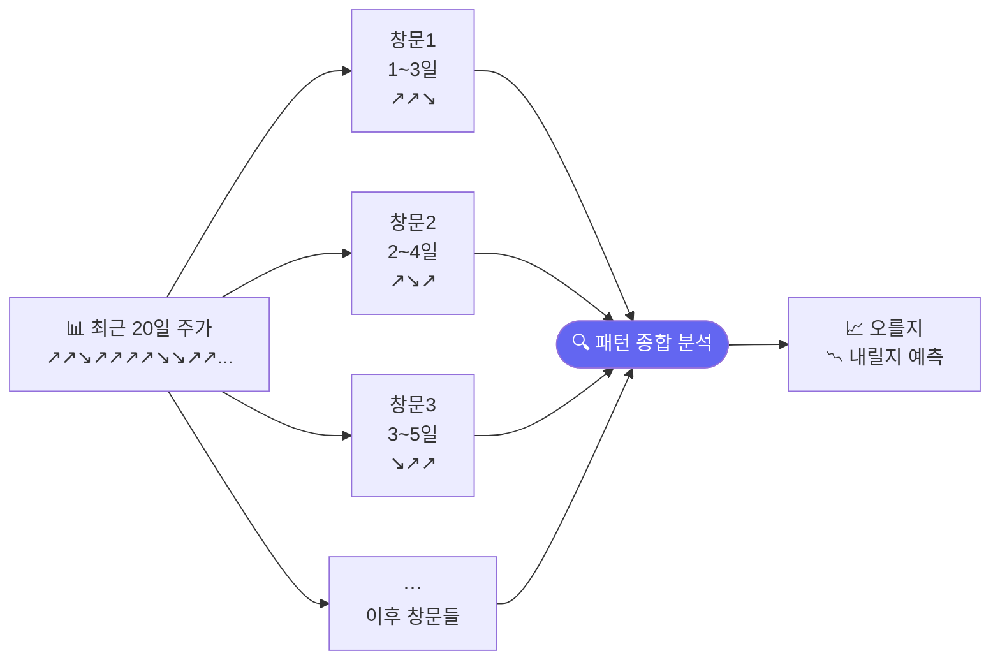
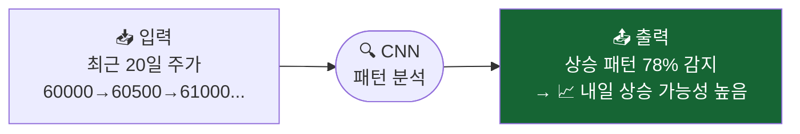

# 주가 그래프의 패턴 찾기: CNN

> 개발자의 질문: "컴퓨터가 주가 그래프를 보고 패턴을 찾을 수 있나요?"
> 네! CNN은 그래프 모양(패턴)을 학습해서 "이 모양이 나타나면 주가가 오른다"를 배웁니다.

---

## 왜 배우나요?

사람이 주가 차트를 볼 때 이런 생각을 합니다:
- "최근 5일 동안 꾸준히 오르는 모양이네 → 더 오를 것 같은데?"
- "갑자기 거래량이 폭발했네 → 뭔가 일어나려나?"

**CNN(합성곱 신경망)**은 컴퓨터에게 이런 **패턴을 학습**시키는 방법입니다.

이미지 인식에 많이 쓰이지만, 주가 데이터처럼 **시간에 따른 숫자들의 패턴**을 찾는 데도 활용됩니다.

---

## 어떻게 가르치나요?

최근 20일치 주가 흐름을 "작은 창문"으로 훑으면서 패턴을 찾습니다.



이 패턴들을 모아서 "오를지 내릴지"를 판단합니다.

---

## 어떤 결과를 기대하나요?



---

## 1. 주가 패턴 데이터 만들기

```python
import pandas as pd
import numpy as np
from sklearn.neural_network import MLPClassifier
from sklearn.preprocessing import StandardScaler
from sklearn.metrics import accuracy_score, classification_report
import matplotlib.pyplot as plt

np.random.seed(42)

# 삼성전자 주가 1000일치
days = 1000
prices = 60000 + np.cumsum(np.random.randn(days) * 500)
volume = np.random.randint(5000000, 20000000, days)

# 20일치 데이터를 하나의 "샘플"로 만들기 (슬라이딩 윈도우)
WINDOW = 20  # 20일치를 묶어서 하나의 입력으로 사용

X_list, y_list = [], []
for i in range(WINDOW, days - 1):
    # 최근 20일 주가 변화율 (수익률)
    window_prices = prices[i-WINDOW:i]
    window_ret    = np.diff(window_prices) / window_prices[:-1]  # 19개 수익률

    # 거래량 비율도 추가
    window_vol = volume[i-WINDOW:i]
    vol_ratio  = window_vol / window_vol.mean()

    # 두 가지를 합쳐서 입력 만들기
    sample = np.concatenate([window_ret, vol_ratio[1:]])  # 38개 특성

    X_list.append(sample)
    y_list.append(1 if prices[i+1] > prices[i] else 0)  # 다음날 오를지

X_arr = np.array(X_list)
y_arr = np.array(y_list)

print(f"샘플 수: {len(X_arr)}개")
print(f"샘플 하나의 크기: {X_arr.shape[1]}개 숫자 (20일치 데이터)")
print(f"상승 샘플 비율: {y_arr.mean():.1%}")
```

---

## 2. 슬라이딩 윈도우 개념 이해

```python
# 슬라이딩 윈도우 시각화
fig, axes = plt.subplots(3, 1, figsize=(12, 8))

# 전체 주가
axes[0].plot(prices[:60], 'b-', linewidth=1.5)
axes[0].set_title('삼성전자 주가 (처음 60일)')
axes[0].set_ylabel('주가 (원)')

# 첫 번째 윈도우 (1~20일)
axes[1].plot(range(WINDOW), prices[:WINDOW], 'g-o', markersize=4)
axes[1].axvspan(0, WINDOW-1, alpha=0.2, color='green')
axes[1].set_title(f'첫 번째 윈도우 (1~{WINDOW}일) → 21일째 예측')
axes[1].set_ylabel('주가 (원)')

# 두 번째 윈도우 (2~21일)
axes[2].plot(range(1, WINDOW+1), prices[1:WINDOW+1], 'r-o', markersize=4)
axes[2].axvspan(1, WINDOW, alpha=0.2, color='red')
axes[2].set_title(f'두 번째 윈도우 (2~{WINDOW+1}일) → 22일째 예측')
axes[2].set_ylabel('주가 (원)')

plt.tight_layout()
plt.savefig('sliding_window.png', dpi=120)
print("저장: sliding_window.png")
```

---

## 3. 패턴을 학습시키기

```python
# 데이터 나누기
split = int(len(X_arr) * 0.8)
X_train, X_test = X_arr[:split], X_arr[split:]
y_train, y_test = y_arr[:split], y_arr[split:]

# 정규화
scaler = StandardScaler()
X_train_sc = scaler.fit_transform(X_train)
X_test_sc  = scaler.transform(X_test)

# 신경망으로 패턴 학습 (CNN 개념을 MLP로 시뮬레이션)
# 실제 CNN은 PyTorch로 구현하지만, 여기서는 이해를 위해 MLP 사용
pattern_model = MLPClassifier(
    hidden_layer_sizes=(128, 64, 32),
    activation='relu',
    max_iter=500,
    random_state=42,
    early_stopping=True,
    validation_fraction=0.1,
)
pattern_model.fit(X_train_sc, y_train)

train_acc = accuracy_score(y_train, pattern_model.predict(X_train_sc))
test_acc  = accuracy_score(y_test,  pattern_model.predict(X_test_sc))
print(f"학습 정확도: {train_acc:.1%}")
print(f"테스트 정확도: {test_acc:.1%}")
```

---

## 4. 윈도우 크기 실험

"며칠치 데이터를 보는 게 가장 좋을까?"를 실험해봅니다.

```python
window_sizes = [5, 10, 20, 30, 40]
accs = []

for w in window_sizes:
    # 윈도우 크기별 데이터 만들기
    X_w, y_w = [], []
    for i in range(w, days - 1):
        ret = np.diff(prices[i-w:i]) / prices[i-w:i-1]
        X_w.append(ret)
        y_w.append(1 if prices[i+1] > prices[i] else 0)

    X_w = np.array(X_w)
    y_w = np.array(y_w)

    sp = int(len(X_w) * 0.8)
    sc = StandardScaler()
    X_sc = sc.fit_transform(X_w)

    m = MLPClassifier(hidden_layer_sizes=(64, 32), max_iter=300,
                      random_state=42, early_stopping=True)
    m.fit(X_sc[:sp], y_w[:sp])
    acc = accuracy_score(y_w[sp:], m.predict(X_sc[sp:]))
    accs.append(acc)
    print(f"윈도우 {w:2d}일: 테스트 정확도 {acc:.1%}")

plt.figure(figsize=(7, 4))
plt.plot(window_sizes, accs, 'b-o', linewidth=2, markersize=8)
plt.xlabel('윈도우 크기 (며칠치를 볼지)')
plt.ylabel('테스트 정확도')
plt.title('몇 일치 데이터를 보는 게 가장 좋을까?')
plt.tight_layout()
plt.savefig('window_size.png', dpi=120)
print("저장: window_size.png")
```

---

## 5. 패턴 종류 구분하기 (3가지 신호)

상승 / 하락 / 횡보로 3가지를 구분해봅니다.

```python
# 3클래스 레이블 만들기
X3_list, y3_list = [], []
for i in range(WINDOW, days - 1):
    window_ret = np.diff(prices[i-WINDOW:i]) / prices[i-WINDOW:i-1]
    X3_list.append(window_ret)

    next_ret = (prices[i+1] - prices[i]) / prices[i]
    if next_ret > 0.01:     # 1% 이상 상승
        label = 2
    elif next_ret < -0.01:  # 1% 이상 하락
        label = 0
    else:                   # 횡보
        label = 1
    y3_list.append(label)

X3 = np.array(X3_list)
y3 = np.array(y3_list)

sp3 = int(len(X3) * 0.8)
sc3 = StandardScaler()
X3_sc = sc3.fit_transform(X3)

m3 = MLPClassifier(hidden_layer_sizes=(128, 64), max_iter=500,
                   random_state=42, early_stopping=True)
m3.fit(X3_sc[:sp3], y3[:sp3])

y3_pred = m3.predict(X3_sc[sp3:])
print("\n3가지 패턴 분류 결과:")
print(classification_report(y3[sp3:], y3_pred,
                             target_names=['하락', '횡보', '상승']))
```

---

## 핵심 정리

- **CNN**: 주가의 시간적 패턴을 자동으로 찾는 방법
- **슬라이딩 윈도우**: 최근 N일치 데이터를 묶어서 하나의 입력으로 만드는 기법
- **윈도우 크기**: 몇 일치를 볼지 — 너무 짧으면 정보 부족, 너무 길면 오래된 정보가 방해
- **3가지 신호**: 상승 / 하락 / 횡보로 나누면 더 세밀한 전략 가능

## 실습 과제

```python
# 과제: OHLCV 5개 채널로 더 풍부한 패턴 학습
# 1) 삼성전자 시가/고가/저가/종가/거래량 500일치 만들기
# 2) 20일 윈도우로 샘플 생성 (입력: 20일 × 5개 = 100개 숫자)
# 3) 학습 후 테스트 정확도 출력
# 힌트: 5개 채널을 flatten해서 MLPClassifier에 입력

np.random.seed(55)
close  = 60000 + np.cumsum(np.random.randn(500) * 500)
high   = close + np.abs(np.random.randn(500) * 200)
low    = close - np.abs(np.random.randn(500) * 200)
volume = np.random.randint(5000000, 20000000, 500)
# 나머지를 채워보세요!
```

## 관련 실습 파일

| 챕터 | 주제 | 실행 방법 |
|------|------|---------|
| [chapter30](../chapters/chapter30/practice.py) | CNN 패턴 인식 | `cd chapters/chapter30 && python practice.py` |

---

➡️ [Day 037 — 주가 흐름 기억하기: RNN과 LSTM](23.md) 에서 계속됩니다.
