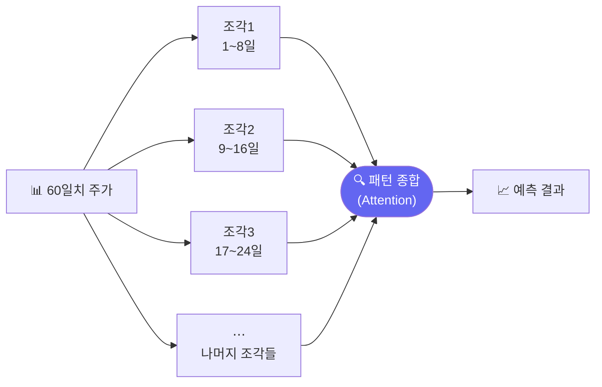
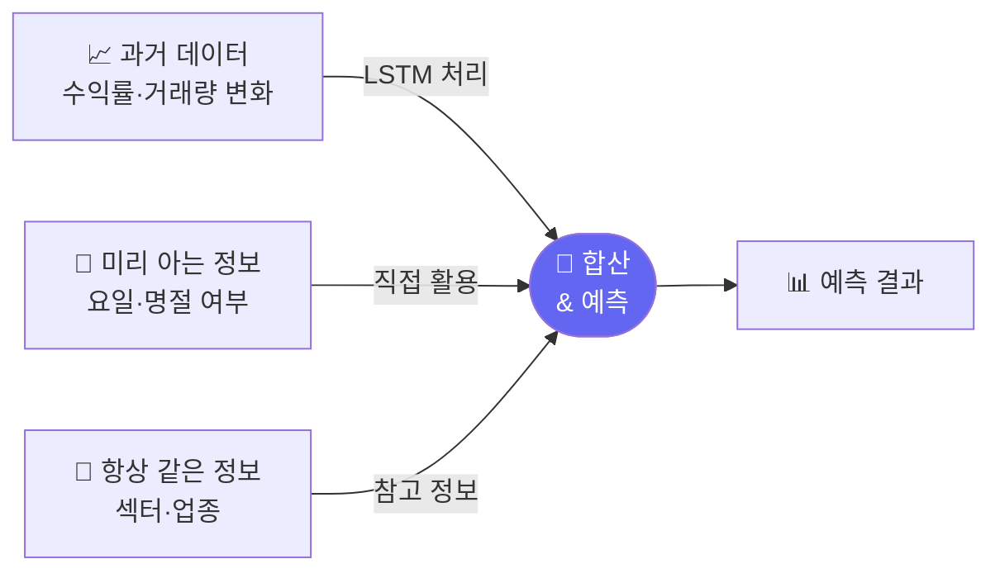

# 더 스마트한 주가 예측 모델들

> 개발자의 질문: "Transformer보다 더 좋은 방법도 있나요?"
> 네! 주식 데이터에 특화된 더 스마트한 모델들이 있습니다.

---

## 왜 배우나요?

지금까지 배운 Transformer는 원래 언어 번역을 위해 만들었습니다.  
주가 데이터는 언어와 달리 이런 특성이 있습니다:

- **주기**: 매주 패턴, 매월 패턴이 있음 (월말 효과 등)
- **여러 종목 동시 변화**: 삼성전자가 오르면 반도체 관련주도 오름
- **긴 역사**: 수십 년치 데이터를 효율적으로 처리해야 함

이런 특성을 잘 다루는 **전용 모델들**을 소개합니다.

---

## 주요 시계열 모델 소개

| 모델 | 한마디 설명 | 강점 |
|------|----------|------|
| **PatchTST** | 주가를 조각(patch)으로 나눠 분석 | 긴 주가 흐름 파악 |
| **TFT** | 여러 종류의 정보를 분리해서 처리 | 해석 가능한 예측 |
| **iTransformer** | 여러 종목의 관계를 분석 | 종목 간 상관관계 |

이 수업에서는 개념을 이해하고, 비슷한 방식으로 직접 구현해봅니다.

---

## 1. PatchTST — 조각으로 나눠 분석하기

PatchTST는 긴 주가 흐름을 **여러 조각(patch)**으로 잘라서 분석합니다.



긴 역사를 직접 보면 너무 복잡하니, 짧은 조각들의 패턴을 보는 방식입니다.

```python
import pandas as pd
import numpy as np
from sklearn.neural_network import MLPClassifier
from sklearn.preprocessing import StandardScaler
from sklearn.metrics import accuracy_score
import matplotlib.pyplot as plt

np.random.seed(42)

# 삼성전자 1000일치
days = 1000
prices = 60000 + np.cumsum(np.random.randn(days) * 500)
rets = np.diff(prices) / prices[:-1]

SEQ_LEN   = 64   # 64일치 주가를 한 번에
PATCH_SIZE = 8   # 8일씩 조각으로 나눔
N_PATCHES  = SEQ_LEN // PATCH_SIZE  # 8개 조각

def make_patch_data(rets, seq_len, patch_size):
    """주가 수익률을 패치(조각)로 나눈 데이터 만들기"""
    n_patches = seq_len // patch_size
    X_list, y_list = [], []
    for i in range(seq_len, len(rets) - 1):
        window = rets[i-seq_len:i]
        # 각 패치의 요약 특성 계산
        patch_features = []
        for p in range(n_patches):
            patch = window[p*patch_size:(p+1)*patch_size]
            patch_features.extend([
                patch.mean(),    # 패치 평균 수익률
                patch.std(),     # 패치 변동성
                patch.max(),     # 최대 상승
                patch.min(),     # 최대 하락
            ])
        X_list.append(patch_features)
        y_list.append(1 if rets[i+1] > 0 else 0)
    return np.array(X_list), np.array(y_list)

X_patch, y_patch = make_patch_data(rets, SEQ_LEN, PATCH_SIZE)
print(f"패치 데이터 크기: {X_patch.shape}")
print(f"  = {N_PATCHES}개 조각 × 4가지 특성 = {N_PATCHES*4}개 숫자")
```

---

## 2. PatchTST 방식 학습

```python
split = int(len(X_patch) * 0.8)
X_tr, X_te = X_patch[:split], X_patch[split:]
y_tr, y_te = y_patch[:split], y_patch[split:]

sc = StandardScaler()
X_tr_sc = sc.fit_transform(X_tr)
X_te_sc = sc.transform(X_te)

patch_model = MLPClassifier(
    hidden_layer_sizes=(128, 64),
    activation='relu',
    max_iter=500,
    random_state=42,
    early_stopping=True,
)
patch_model.fit(X_tr_sc, y_tr)

patch_acc = accuracy_score(y_te, patch_model.predict(X_te_sc))
print(f"PatchTST 방식 정확도: {patch_acc:.1%}")

# 조각 크기 실험
patch_sizes  = [4, 8, 16, 32]
patch_accs   = []

for ps in patch_sizes:
    X_p, y_p = make_patch_data(rets, SEQ_LEN, ps)
    if len(X_p) < 100:
        continue
    sp = int(len(X_p) * 0.8)
    sc_p = StandardScaler()
    X_sc_p = sc_p.fit_transform(X_p)
    m = MLPClassifier(hidden_layer_sizes=(64, 32), max_iter=300,
                      random_state=42, early_stopping=True)
    m.fit(X_sc_p[:sp], y_p[:sp])
    acc = accuracy_score(y_p[sp:], m.predict(X_sc_p[sp:]))
    patch_accs.append(acc)
    print(f"조각 크기 {ps:2d}일: 정확도 {acc:.1%}")
```

---

## 3. TFT — 여러 종류의 정보 분리하기

TFT(Temporal Fusion Transformer)는 정보를 종류별로 나눠 처리합니다.



```python
# TFT 개념: 다양한 정보 소스를 합치기
np.random.seed(0)

# 기본 주가 데이터
days2 = 600
prices2 = 60000 + np.cumsum(np.random.randn(days2) * 500)
rets2   = np.diff(prices2) / prices2[:-1]

# 추가 정보 (미리 알 수 있는 것들)
weekday   = np.array([(i % 5) for i in range(days2-1)])     # 요일 (0=월, 4=금)
month_end = np.array([1 if (i+1) % 20 == 0 else 0 for i in range(days2-1)])  # 월말 여부
volume2   = np.random.randint(5000000, 20000000, days2-1)
vol_ratio2 = volume2 / volume2.mean()

# 다양한 정보를 합쳐서 특성 만들기
SEQ_LEN2 = 20
X_tft, y_tft = [], []
for i in range(SEQ_LEN2, len(rets2) - 1):
    # 과거 수익률 (시계열)
    past_rets = rets2[i-SEQ_LEN2:i]
    # 현재 추가 정보
    current_info = [
        weekday[i],        # 오늘 요일
        month_end[i],      # 월말 여부
        vol_ratio2[i],     # 거래량 비율
    ]
    combined = np.concatenate([past_rets, current_info])
    X_tft.append(combined)
    y_tft.append(1 if rets2[i+1] > 0 else 0)

X_tft = np.array(X_tft)
y_tft = np.array(y_tft)

split2 = int(len(X_tft) * 0.8)
sc2 = StandardScaler()
X_tft_sc = sc2.fit_transform(X_tft)

tft_model = MLPClassifier(hidden_layer_sizes=(128, 64), max_iter=400,
                           random_state=42, early_stopping=True)
tft_model.fit(X_tft_sc[:split2], y_tft[:split2])

tft_acc = accuracy_score(y_tft[split2:], tft_model.predict(X_tft_sc[split2:]))
print(f"\nTFT 방식 (다양한 정보 활용) 정확도: {tft_acc:.1%}")
```

---

## 4. 여러 종목 동시 분석 (iTransformer 개념)

iTransformer는 **여러 종목이 서로 어떻게 영향을 주는지** 분석합니다.

```python
# 여러 종목 데이터
np.random.seed(77)
n_stocks3 = 5
n_days3   = 300
stock_names = ['삼성전자', 'LG전자', 'SK하이닉스', '현대차', '카카오']

# 공통 시장 움직임 + 종목별 노이즈
market = np.random.randn(n_days3) * 0.01
stock_rets = {}
for name in stock_names:
    noise = np.random.randn(n_days3) * 0.015
    stock_rets[name] = 0.6 * market + 0.4 * noise  # 시장과 60% 연동

rets_df = pd.DataFrame(stock_rets)

# 종목 간 상관관계
corr = rets_df.corr().round(3)
print("\n종목 간 상관관계:")
print(corr)

# 상관관계 히트맵
plt.figure(figsize=(7, 5))
import seaborn as sns
sns.heatmap(corr, annot=True, cmap='RdYlGn', center=0,
            vmin=-1, vmax=1, fmt='.2f')
plt.title('종목 간 상관관계\n(1에 가까울수록 함께 움직임)')
plt.tight_layout()
plt.savefig('stock_correlation.png', dpi=120)
print("저장: stock_correlation.png")

# 삼성전자 수익률로 다른 종목 예측
target_stock = 'SK하이닉스'
X_multi = rets_df.drop(columns=[target_stock]).values
y_multi = (rets_df[target_stock].shift(-1) > 0).astype(int).values[:-1]
X_multi = X_multi[:-1]

sp_m = int(len(X_multi) * 0.8)
sc_m = StandardScaler()
X_m_sc = sc_m.fit_transform(X_multi)
m_model = MLPClassifier(hidden_layer_sizes=(64, 32), max_iter=300,
                         random_state=42, early_stopping=True)
m_model.fit(X_m_sc[:sp_m], y_multi[:sp_m])
m_acc = accuracy_score(y_multi[sp_m:], m_model.predict(X_m_sc[sp_m:]))
print(f"\n다른 4종목으로 {target_stock} 예측 정확도: {m_acc:.1%}")
```

---

## 5. 모델 성능 비교

```python
results = {
    '기본 20일 시계열': 0,
    'PatchTST 방식':  patch_acc,
    'TFT 방식':       tft_acc,
    '멀티 종목':      m_acc,
}

# 기본 모델 성능 계산
X_base, y_base = make_patch_data(rets, 20, 20)  # 조각 1개 = 전체
sp_b = int(len(X_base) * 0.8)
sc_b = StandardScaler()
X_base_sc = sc_b.fit_transform(X_base)
m_base = MLPClassifier(hidden_layer_sizes=(64, 32), max_iter=300,
                        random_state=42, early_stopping=True)
m_base.fit(X_base_sc[:sp_b], y_base[:sp_b])
results['기본 20일 시계열'] = accuracy_score(y_base[sp_b:], m_base.predict(X_base_sc[sp_b:]))

plt.figure(figsize=(8, 4))
bars = plt.bar(results.keys(), results.values(),
               color=['gray', 'steelblue', 'orange', 'green'])
for bar, acc in zip(bars, results.values()):
    plt.text(bar.get_x() + bar.get_width()/2, bar.get_height() + 0.002,
             f'{acc:.1%}', ha='center', fontsize=11)
plt.ylim(0.4, 0.7)
plt.ylabel('테스트 정확도')
plt.title('모델 방식별 성능 비교')
plt.xticks(rotation=15)
plt.tight_layout()
plt.savefig('model_comparison.png', dpi=120)
print("저장: model_comparison.png")
```

---

## 핵심 정리

- **PatchTST**: 긴 주가 흐름을 조각으로 나눠 분석 → 긴 패턴도 놓치지 않음
- **TFT**: 과거 데이터 + 미리 알 수 있는 정보(요일 등)를 함께 활용
- **iTransformer**: 여러 종목이 서로 영향을 주는 관계를 학습
- **앙상블**: 여러 모델 결과를 평균 내면 더 안정적

## 실습 과제

```python
# 과제: 삼성전자 + 코스피 지수로 예측
# 1) 삼성전자 300일, 코스피 300일 만들기
# 2) 코스피도 특성에 추가해서 학습
# 3) 코스피 없는 경우 vs 있는 경우 정확도 비교
# 4) "코스피가 예측에 얼마나 도움이 됐나?" 결론 내리기

np.random.seed(33)
samsung2 = 60000 + np.cumsum(np.random.randn(300) * 500)
kospi    = 2500 + np.cumsum(np.random.randn(300) * 20)
# 나머지를 채워보세요!
```

## 관련 실습 파일

| 챕터 | 주제 | 실행 방법 |
|------|------|---------|
| [chapter103](../chapters/chapter103/practice.py) | Transformer 시계열 | `cd chapters/chapter103 && python practice.py` |
| [chapter112](../chapters/chapter112/practice.py) | 주가 예측 미니 프로젝트 | `cd chapters/chapter112 && python practice.py` |

---

➡️ [Day 040 — 내 예측, 얼마나 정확한가?: 모델 평가](26.md) 에서 계속됩니다.
