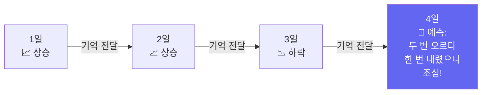
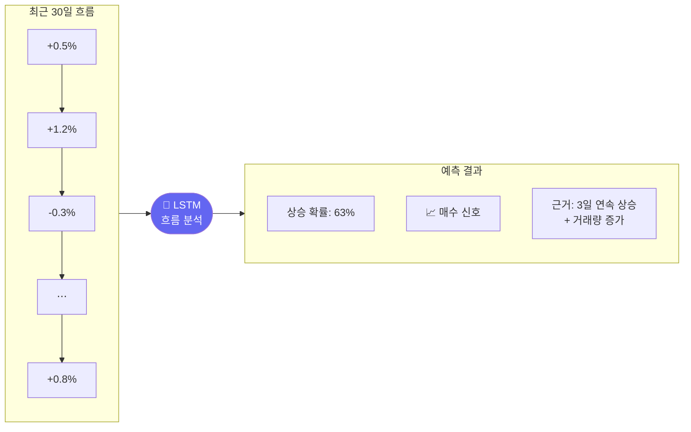

# Day 037 — 주가 흐름 기억하기: RNN과 LSTM

> 초등학생의 질문: "어제 주가가 어떻게 변했는지 기억하면서 오늘 예측할 수 있나요?"
> 네! RNN과 LSTM은 과거 흐름을 기억하면서 다음을 예측합니다.

---

## 왜 배우나요?

주가는 어제와 오늘이 연결되어 있습니다.

예를 들어:
- "3일 연속 상승했다" → 내일도 오를 가능성 있음
- "급격히 올랐다가 갑자기 내렸다" → 조심해야 할 신호

CNN은 특정 구간의 패턴을 찾았다면, **RNN/LSTM은 시간의 흐름(연속성)을 기억**합니다.

마치 이야기를 읽을 때 앞 내용을 기억하면서 뒷내용을 이해하는 것과 같습니다.

---

## 어떻게 가르치나요?

RNN은 데이터를 **시간 순서대로** 처리하면서 이전 기억을 계속 이어갑니다.



LSTM은 RNN의 업그레이드 버전입니다:
- **중요한 것은 오래 기억** (장기 기억)
- **불필요한 것은 빨리 잊음** (단기 기억 조절)

---

## 어떤 결과를 기대하나요?



---

## 1. 시계열 데이터 준비 (30일 단위로 묶기)

```python
import pandas as pd
import numpy as np
from sklearn.neural_network import MLPClassifier, MLPRegressor
from sklearn.preprocessing import StandardScaler
from sklearn.metrics import accuracy_score, mean_absolute_error
import matplotlib.pyplot as plt

np.random.seed(42)

# 삼성전자 주가 800일치
days = 800
prices = 60000 + np.cumsum(np.random.randn(days) * 500)
volume = np.random.randint(5000000, 20000000, days)

df = pd.DataFrame({'close': prices, 'volume': volume})
df['ret']     = df['close'].pct_change()
df['vol_avg'] = df['volume'].rolling(5).mean()
df = df.dropna()

# 시계열 특성: 30일의 수익률 흐름을 하나의 입력으로
SEQ_LEN = 30

def make_sequence_data(rets, labels, seq_len):
    X_list, y_list = [], []
    for i in range(seq_len, len(rets)):
        # 최근 seq_len일치 수익률을 하나의 행으로
        X_list.append(rets[i-seq_len:i])
        y_list.append(labels[i])
    return np.array(X_list), np.array(y_list)

ret_values = df['ret'].values
y_up = (np.roll(ret_values, -1) > 0).astype(int)  # 다음날 상승 여부
y_up = y_up[:-1]  # 마지막 날 제거

X_seq, y_seq = make_sequence_data(ret_values[:-1], y_up, SEQ_LEN)

print(f"시퀀스 샘플 수: {len(X_seq)}개")
print(f"샘플 하나 크기: {X_seq.shape[1]}일치 수익률")
print(f"상승 비율: {y_seq.mean():.1%}")
```

---

## 2. 30일 흐름으로 학습하기

```python
# 데이터 나누기 (시간 순서 유지)
split = int(len(X_seq) * 0.8)
X_train, X_test = X_seq[:split], X_seq[split:]
y_train, y_test = y_seq[:split], y_seq[split:]

# 정규화
scaler = StandardScaler()
X_train_sc = scaler.fit_transform(X_train)
X_test_sc  = scaler.transform(X_test)

# 시계열 흐름을 기억하는 신경망
# (실제 LSTM은 PyTorch가 필요하지만, 개념 이해를 위해 MLP 사용)
seq_model = MLPClassifier(
    hidden_layer_sizes=(128, 64, 32),
    activation='tanh',   # tanh는 -1~1 사이 출력 (시계열에 적합)
    max_iter=500,
    random_state=42,
    early_stopping=True,
    validation_fraction=0.1,
)
seq_model.fit(X_train_sc, y_train)

train_acc = accuracy_score(y_train, seq_model.predict(X_train_sc))
test_acc  = accuracy_score(y_test,  seq_model.predict(X_test_sc))
print(f"학습 정확도: {train_acc:.1%}")
print(f"테스트 정확도: {test_acc:.1%}")
```

---

## 3. 시퀀스 길이 실험

"얼마나 과거를 기억할수록 예측이 잘 될까?"

```python
seq_lengths = [5, 10, 20, 30, 45, 60]
length_accs = []

for sl in seq_lengths:
    X_s, y_s = make_sequence_data(ret_values[:-1], y_up, sl)
    sp = int(len(X_s) * 0.8)
    sc = StandardScaler()
    X_sc = sc.fit_transform(X_s)
    m = MLPClassifier(hidden_layer_sizes=(64, 32), activation='tanh',
                      max_iter=300, random_state=42, early_stopping=True)
    m.fit(X_sc[:sp], y_s[:sp])
    acc = accuracy_score(y_s[sp:], m.predict(X_sc[sp:]))
    length_accs.append(acc)
    print(f"과거 {sl:2d}일 기억: 테스트 정확도 {acc:.1%}")

plt.figure(figsize=(8, 4))
plt.plot(seq_lengths, length_accs, 'b-o', linewidth=2, markersize=8)
plt.xlabel('기억하는 날짜 수 (시퀀스 길이)')
plt.ylabel('테스트 정확도')
plt.title('과거를 얼마나 기억할수록 예측이 잘 될까?')
plt.tight_layout()
plt.savefig('seq_length.png', dpi=120)
print("저장: seq_length.png")
```

---

## 4. 주가 수준 예측 (회귀 — 얼마나 오를지)

방향(오를지/내릴지) 말고, **얼마나 오를지** 예측해봅니다.

```python
# 다음날 수익률 예측 (회귀 문제)
y_reg = ret_values[SEQ_LEN+1:]  # 다음날 수익률
X_reg, _ = make_sequence_data(ret_values[:-1], y_up, SEQ_LEN)
X_reg = X_reg[:len(y_reg)]

split_r = int(len(X_reg) * 0.8)
X_r_tr, X_r_te = X_reg[:split_r], X_reg[split_r:]
y_r_tr, y_r_te = y_reg[:split_r], y_reg[split_r:]

sc_r = StandardScaler()
X_r_tr_sc = sc_r.fit_transform(X_r_tr)
X_r_te_sc = sc_r.transform(X_r_te)

reg_model = MLPRegressor(
    hidden_layer_sizes=(128, 64),
    activation='tanh',
    max_iter=500,
    random_state=42,
    early_stopping=True,
)
reg_model.fit(X_r_tr_sc, y_r_tr)

y_r_pred = reg_model.predict(X_r_te_sc)
mae = mean_absolute_error(y_r_te, y_r_pred)
print(f"\n수익률 예측 평균 오차: {mae*100:.3f}%")

# 예측 vs 실제 그래프
n_plot = 60
plt.figure(figsize=(12, 4))
plt.plot(range(n_plot), y_r_te[:n_plot]*100, 'b-', label='실제 수익률', alpha=0.7)
plt.plot(range(n_plot), y_r_pred[:n_plot]*100, 'r--', label='예측 수익률', alpha=0.7)
plt.axhline(y=0, color='black', linestyle=':', alpha=0.5)
plt.xlabel('날짜 (일 번호)')
plt.ylabel('수익률 (%)')
plt.title(f'LSTM 스타일 수익률 예측 (평균 오차: {mae*100:.3f}%)')
plt.legend()
plt.tight_layout()
plt.savefig('seq_pred.png', dpi=120)
print("저장: seq_pred.png")
```

---

## 5. 방향 예측 결과 시각화

```python
probs = seq_model.predict_proba(X_test_sc)[:, 1]
n_plot = 80

plt.figure(figsize=(12, 5))

# 위: 실제 주가
ax1 = plt.subplot(2, 1, 1)
ax1.plot(df['close'].values[-len(y_test)-n_plot:-len(y_test)], 'b-', linewidth=1)
ax1.set_title('삼성전자 실제 주가')
ax1.set_ylabel('주가 (원)')

# 아래: 상승 확률
ax2 = plt.subplot(2, 1, 2)
ax2.plot(probs[:n_plot], 'purple', linewidth=1.5, label='상승 확률')
ax2.axhline(y=0.6, color='green', linestyle='--', alpha=0.7, label='매수 기준선')
ax2.axhline(y=0.5, color='gray', linestyle=':', alpha=0.5)
ax2.scatter(range(n_plot),
            [1.05 if v == 1 else -0.05 for v in y_test[:n_plot]],
            c=['green' if v == 1 else 'red' for v in y_test[:n_plot]],
            s=15, zorder=5)
ax2.set_ylabel('상승 확률')
ax2.set_xlabel('날짜')
ax2.set_ylim(-0.1, 1.1)
ax2.legend()

plt.tight_layout()
plt.savefig('lstm_signal.png', dpi=120)
print("저장: lstm_signal.png")
```

---

## 핵심 정리

- **RNN**: 과거 데이터를 기억하면서 순서대로 처리하는 신경망
- **LSTM**: RNN을 개선해서 중요한 정보는 오래, 불필요한 것은 빨리 잊음
- **시퀀스 길이**: 몇 일치를 묶어서 볼지 — 너무 짧으면 흐름 파악 불가, 너무 길면 과거 정보가 방해
- **활용**: 주가 방향 예측, 수익률 예측, 이상 거래 감지

## 실습 과제

```python
# 과제: 멀티 스텝 예측 (다음 5일 예측하기)
# 1) 삼성전자 30일 흐름을 보고 다음 5일이 모두 오를지 예측
# 2) 5일 연속 상승하면 1, 아니면 0으로 레이블
# 3) MLPClassifier로 학습하고 정확도 출력

np.random.seed(7)
prices2 = 60000 + np.cumsum(np.random.randn(600) * 500)
# 힌트: 다음 5일 평균 수익률 > 0이면 1, 아니면 0으로 레이블 만들기
# 나머지를 채워보세요!
```

## 관련 실습 파일

| 챕터 | 주제 | 실행 방법 |
|------|------|---------|
| [chapter101](../chapters/chapter101/practice.py) | RNN 기초 | `cd chapters/chapter101 && python practice.py` |
| [chapter102](../chapters/chapter102/practice.py) | LSTM 기초 | `cd chapters/chapter102 && python practice.py` |

---

➡️ [Day 038 — 전체 흐름 한눈에 보기: Transformer](24.md) 에서 계속됩니다.
