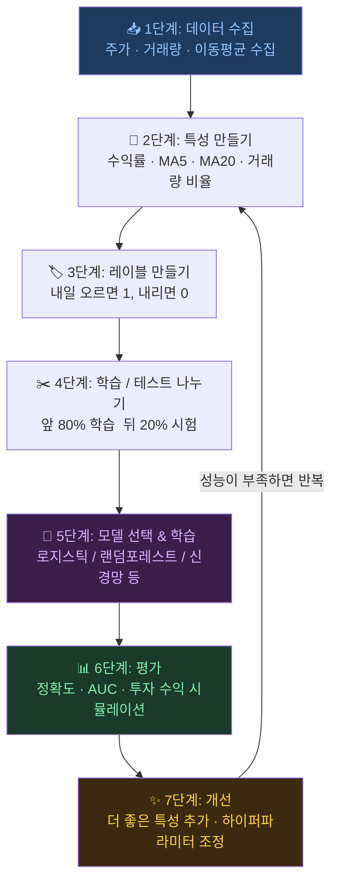

# 주식 AI 용어 사전

> 어려운 말을 쉽게! 초등학생도 이해할 수 있는 AI 주식 용어 설명

---

## 가

| 용어 | 쉬운 설명 | 주식 예시 |
|------|---------|---------|
| **가중치 (Weight)** | 컴퓨터가 배운 "중요도 점수". 클수록 그 정보를 더 많이 사용함 | "모멘텀 팩터"에 높은 가중치 → 최근 많이 오른 주식에 더 집중 |
| **거래량 (Volume)** | 하루에 주식이 얼마나 많이 사고 팔렸는지 | 거래량이 갑자기 늘면 뭔가 일어나고 있다는 신호! |
| **골든크로스** | 5일 평균 주가가 20일 평균 주가를 위로 뚫을 때 | 상승 신호로 많이 사용됨 |
| **과적합 (Overfitting)** | 공부는 잘했는데 시험은 못 보는 것. 학습 데이터만 외워버린 상태 | 학습 정확도 95%, 테스트 정확도 52% → 과적합! |

---

## 나

| 용어 | 쉬운 설명 | 주식 예시 |
|------|---------|---------|
| **뉴런 (Neuron)** | 신경망의 기본 단위. 여러 입력을 받아 계산하고 출력함 | 뇌의 신경세포처럼 정보를 전달 |

---

## 다

| 용어 | 쉬운 설명 | 주식 예시 |
|------|---------|---------|
| **데드크로스** | 5일 평균이 20일 평균 아래로 내려갈 때 | 하락 신호로 많이 사용됨 |
| **드롭아웃 (Dropout)** | 학습할 때 뉴런 일부를 랜덤으로 끔. 외우지 않고 진짜로 배우게 함 | 과적합 방지 방법 중 하나 |

---

## 마

| 용어 | 쉬운 설명 | 주식 예시 |
|------|---------|---------|
| **머신러닝 (Machine Learning)** | 컴퓨터가 데이터를 보고 스스로 규칙을 배우는 것 | 주가 데이터 보고 "이런 패턴일 때 오른다"를 스스로 발견 |
| **모멘텀 (Momentum)** | 최근에 많이 올랐던 주식은 계속 오르는 경향 | 최근 3개월 수익률로 계산 |

---

## 바

| 용어 | 쉬운 설명 | 주식 예시 |
|------|---------|---------|
| **배깅 (Bagging)** | 여러 모델을 독립적으로 만들고 평균 낸 것 | 랜덤 포레스트가 대표 예시 |
| **백테스트 (Backtest)** | 과거 데이터로 투자 전략을 테스트해보는 것 | "이 전략을 2020년부터 썼으면 얼마나 벌었을까?" |
| **부스팅 (Boosting)** | 이전 모델의 실수를 다음 모델이 보완하며 발전 | XGBoost, LightGBM이 대표 예시 |

---

## 사

| 용어 | 쉬운 설명 | 주식 예시 |
|------|---------|---------|
| **샤프 비율 (Sharpe Ratio)** | 수익 대비 위험. 높을수록 안전하게 많이 번 것 | 수익 10%, 변동성 5% → 샤프 비율 2.0 (우수!) |
| **수익률 (Return)** | 주가가 얼마나 변했는지 %로 표현 | 6만원 → 6만2천원 = +3.3% 수익률 |
| **순전파 (Forward Pass)** | 입력에서 출력까지 순서대로 계산하는 과정 | 주가 특성 입력 → 층마다 계산 → 예측값 출력 |
| **슬라이딩 윈도우** | 최근 N일치 데이터를 묶어서 하나의 입력으로 만드는 방법 | 최근 20일 주가를 한 묶음으로 보기 |

---

## 아

| 용어 | 쉬운 설명 | 주식 예시 |
|------|---------|---------|
| **앙상블 (Ensemble)** | 여러 모델을 합쳐서 예측하는 방법. 다수결! | 로지스틱 + RF + 부스팅 → 세 모델 투표로 결정 |
| **역전파 (Backpropagation)** | 틀렸을 때 뒤에서부터 책임을 나눠 수정하는 과정 | 예측이 틀리면 모든 뉴런이 조금씩 조정됨 |
| **은닉층 (Hidden Layer)** | 입력층과 출력층 사이의 층. 여기서 복잡한 계산이 일어남 | 층이 많을수록 복잡한 패턴 학습 가능 |
| **이동평균 (Moving Average)** | 최근 N일치 주가의 평균. 주가의 흐름을 부드럽게 보여줌 | MA5 = 최근 5일 평균, MA20 = 최근 20일 평균 |

---

## 자

| 용어 | 쉬운 설명 | 주식 예시 |
|------|---------|---------|
| **정규화 (Normalization)** | 서로 다른 크기의 숫자들을 비슷한 범위로 맞추는 것 | 주가(6만)와 거래량(1천만)을 같은 크기로 맞춤 |
| **정밀도 (Precision)** | "오른다"고 했을 때 정말 오른 비율 | 10번 매수 신호 중 6번 오름 → 정밀도 60% |
| **지도학습** | 정답을 알려주며 가르치는 방법 | "이 날 주가 올랐어"라고 레이블 주며 학습 |

---

## 차

| 용어 | 쉬운 설명 | 주식 예시 |
|------|---------|---------|
| **초과 수익** | 시장 평균보다 더 번 금액 | 시장 +5%, 내 전략 +8% → 초과 수익 +3% |

---

## 카

| 용어 | 쉬운 설명 | 주식 예시 |
|------|---------|---------|
| **클러스터링 (Clustering)** | 비슷한 것끼리 자동으로 묶는 방법. 정답 불필요 | 비슷한 주가 패턴을 가진 종목들을 자동 그룹화 |

---

## 타

| 용어 | 쉬운 설명 | 주식 예시 |
|------|---------|---------|
| **테스트 데이터** | 학습에 사용하지 않고 최종 시험용으로 남겨둔 데이터 | 뒤 20% 기간으로 모델 최종 평가 |
| **트리 (Tree)** | 스무고개처럼 질문을 반복해서 답을 찾는 모델 구조 | "5일 평균 > 6만?" → Yes/No → 다음 질문 |
| **특성 (Feature)** | 예측에 사용하는 입력 정보 | 수익률, 이동평균, 거래량 등 |

---

## 파

| 용어 | 쉬운 설명 | 주식 예시 |
|------|---------|---------|
| **패치 (Patch)** | 긴 시계열을 잘게 나눈 조각 | 60일 주가를 8일씩 7조각으로 나눔 |
| **포트폴리오** | 여러 종목을 함께 보유하는 것. 계란을 한 바구니에 담지 않기! | 삼성전자 30% + 카카오 20% + 현대차 50% |

---

## 하

| 용어 | 쉬운 설명 | 주식 예시 |
|------|---------|---------|
| **하이퍼파라미터** | 모델 설정값. 학습 전에 사람이 정해주는 것 | 트리 깊이, 학습 횟수, 학습 속도 등 |
| **학습 데이터 (Training Data)** | 모델에게 가르쳐줄 데이터 | 앞 80% 기간 데이터로 학습 |
| **훈련 (Training)** | 모델이 데이터에서 패턴을 배우는 과정 | 수백~수천 번 반복하며 조금씩 개선 |

---

## 영어 약어 사전

| 약어 | 전체 이름 | 뜻 |
|------|---------|---|
| **AUC** | Area Under Curve | 모델이 얼마나 잘 구분하는지. 0.5=찍기, 1.0=완벽 |
| **CNN** | Convolutional Neural Network | 패턴을 창문으로 훑으며 찾는 신경망 |
| **GBM** | Gradient Boosting Machine | 실수를 보완하며 발전하는 모델 |
| **LSTM** | Long Short-Term Memory | 중요한 건 오래, 불필요한 건 빨리 잊는 신경망 |
| **MA** | Moving Average | 이동평균 |
| **MDD** | Maximum Drawdown | 최대 낙폭. 얼마나 많이 잃었나의 최악값 |
| **ML** | Machine Learning | 머신러닝 |
| **MLP** | Multi-Layer Perceptron | 여러 층이 있는 기본 신경망 |
| **RF** | Random Forest | 랜덤 포레스트 |
| **RNN** | Recurrent Neural Network | 순서를 기억하며 처리하는 신경망 |
| **SVM** | Support Vector Machine | 구분선으로 나누는 분류 모델 |

---

## 주식 투자 AI를 만드는 순서

