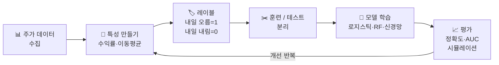
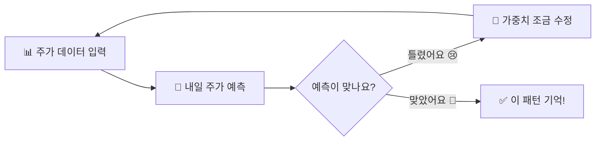

# 머신러닝이란 무엇일까?

> 컴퓨터가 주식 데이터를 보고 스스로 배우는 방법을 알아봅니다.

---

## 1. 머신러닝이란?

머신러닝은 **컴퓨터가 데이터를 보고 스스로 규칙을 배우는 것**입니다.

예를 들어, 삼성전자 주가 데이터 1년치를 컴퓨터에 보여주면, 컴퓨터가 "이런 패턴일 때 주가가 올랐구나"를 스스로 배웁니다.

### 머신러닝의 3가지 종류

| 종류 | 설명 | 주식 예시 |
|------|------|---------|
| **지도학습** | 정답을 알려주며 가르침 | "이날 주가가 올랐어" 라고 알려주고 학습 |
| **비지도학습** | 정답 없이 혼자 패턴 찾기 | 비슷한 주식끼리 스스로 묶기 |
| **강화학습** | 보상을 받으며 배움 | 게임처럼 수익 나면 칭찬, 손해 나면 벌점 |

### 지도학습과 비지도학습은 뭐가 다를까요?

| 구분 | 지도학습 | 비지도학습 |
|------|------|------|
| **정답(레이블)** | 있음 | 없음 |
| **컴퓨터가 배우는 것** | "이 입력이면 이 답" | "서로 비슷한 것끼리 어떤 무리가 있지?" |
| **대표 예시** | 회귀, 이진 분류, 다중 클래스 분류 | 군집화, 차원 축소 |
| **주식 예시** | 내일 주가가 오를지 내릴지 예측 | 비슷한 움직임의 종목끼리 자동 묶기 |

### 레이블(Label)은 왜 중요할까요?

**레이블**은 데이터에 붙어 있는 **정답 이름표**입니다.

- 지도학습에서는 레이블이 꼭 필요합니다.
- 비지도학습에서는 레이블 없이도 시작할 수 있습니다.
- 그래서 `상승/하락`이 적혀 있으면 지도학습, 그런 정답이 없으면 비지도학습에 가깝다고 생각하면 쉽습니다.

예를 들어:

| 최근 5일 수익률 | 거래량 변화 | 레이블 |
|------|------|------|
| `+3.2%` | `+18%` | `상승` |
| `-1.1%` | `-5%` | `하락` |

여기서 **레이블 열**이 바로 정답입니다.

### 군집화(Clustering)는 어떤 일인가요?

군집화는 컴퓨터가 **정답 없이 비슷한 데이터끼리 묶는 작업**입니다.

> 쉬운 비유: 색연필을 색깔별로 자동 정리하는 것과 비슷합니다.  
> 미리 "이건 빨강 팀"이라고 써주지 않아도, 비슷한 색끼리 모으는 거예요.

주식에서는 이런 식으로 씁니다.

- 최근 수익률이 비슷한 종목끼리 묶기
- 변동성이 비슷한 종목끼리 묶기
- 거래량 패턴이 비슷한 종목끼리 묶기

즉, 군집화는 "정답 맞히기"보다 **시장 안의 무리를 찾는 것**에 가깝습니다.

### 주식 AI 개발 흐름



---

## 2. 학습 · 훈련 · 추론 — AI의 세 단계

> 개발자의 질문: "컴퓨터가 배운다는 게 무슨 뜻이에요? 책을 읽나요? 🤔"

AI가 똑똑해지려면 꼭 거쳐야 하는 세 가지 단계가 있습니다.  
마치 수학 시험을 준비하고 치르는 것처럼요!

### 📖 학습(學習, Learning) — "배우는 것"

**학습(學習)**은 컴퓨터가 많은 데이터를 보면서 스스로 규칙을 발견하는 **전체 과정**입니다.

> 쉬운 비유: 삼성전자 주가가 500일 동안 어떻게 움직였는지 매일 보면서  
> "거래량이 확 늘어나면 다음 날 주가가 오르는 경향이 있구나!" 를 스스로 깨닫는 것

**한자·유래·영단어 풀이**

| 항목 | 내용 |
|------|------|
| **한자** | 學(배울 학) + 習(익힐 습) → "배우고 거듭 익히다" |
| **유래** | 공자의 논어 첫 구절 "학이시습지(學而時習之)" — 배운 뒤 때때로 익혀야 한다 |
| **Learning** | 영어 *learn* (고대 영어 *leornian* = "흔적을 따라가다") → 경험을 쌓아 지식을 얻는 것 |

---

### 🏋️ 훈련(訓練, Training) — "반복 연습하는 것"

**훈련(訓練)**은 학습 과정 중에서 **실제로 문제를 풀고, 틀리면 조금씩 고치는 반복 연습** 단계입니다.

> 쉬운 비유: 수학 문제집을 처음엔 많이 틀리지만, 틀릴 때마다 "왜 틀렸지?"를 보고  
> 조금씩 고쳐나가다 보면 어느새 잘 풀게 되는 것

컴퓨터는 이 과정을 **수백~수천 번** 자동으로 반복합니다:



**한자·유래·영단어 풀이**

| 항목 | 내용 |
|------|------|
| **한자** | 訓(가르칠 훈) + 練(익힐 련) → "가르치고 거듭 단련하다" |
| **유래** | 원래 군사 용어. 병사를 반복 훈련시켜 몸에 익히게 하는 것에서 유래 |
| **Training** | 영어 *train* (라틴어 *trahere* = "끌어당기다") → 잠재력을 끌어내도록 반복해서 연습시키는 것 |

---

### 🔮 추론(推論, Inference) — "배운 걸로 새 문제 풀기"

**추론(推論)**은 훈련이 끝난 AI가 **한 번도 본 적 없는 새 데이터**를 보고 예측하는 단계입니다.

> 쉬운 비유: 열심히 공부한 뒤 시험장에서 새 문제를 푸는 것!  
> 배운 패턴으로 "오늘 주식을 사야 할까? 팔아야 할까?" 에 바로 답합니다.

**한자·유래·영단어 풀이**

| 항목 | 내용 |
|------|------|
| **한자** | 推(밀 추) + 論(논할 론) → "근거를 밀어서(바탕으로) 결론을 끌어내다" |
| **유래** | 논리학·철학 용어. "이미 아는 사실"로부터 "모르는 사실"을 이끌어 내는 사고 방식 |
| **Inference** | 영어 *infer* (라틴어 *inferre* = in(안으로) + ferre(나르다)) → 주어진 사실로부터 결론을 "안으로 끌어들이다" |

---

### 세 단계 한눈에 비교

| 단계 | 한자 | 영어 | 쉬운 말 | 언제 하나요? | 주식 AI 예시 |
|------|------|------|--------|------------|------------|
| **학습** | 學習 | Learning | 배우는 과정 전체 | 훈련 + 추론 모두 포함 | 과거 주가 데이터를 보며 패턴 발견 |
| **훈련** | 訓練 | Training | 반복 연습 | AI를 만들 때 | 수천 번 예측하고 틀릴 때마다 조금씩 조정 |
| **추론** | 推論 | Inference | 시험 보기 | AI를 쓸 때 | 오늘 주가 보고 내일 오를지 예측 |

> 💡 중요한 규칙: **훈련 때 사용한 데이터**와 **추론 때 보는 데이터**는 반드시 달라야 합니다!  
> 시험 문제를 미리 알고 외우면 진짜 실력이 아닌 것처럼, 같은 데이터로 테스트하면 정확한 평가가 안 됩니다.

---

## 3. 주식 데이터 준비하기

```python
import pandas as pd
import numpy as np
import matplotlib.pyplot as plt

# 삼성전자 주가 흉내내기 (200일치)
np.random.seed(42)
days = 200
dates = pd.date_range('2024-01-01', periods=days, freq='B')  # 영업일

# 주가는 조금씩 오르내리며 변함
changes = np.random.randn(days) * 500  # 하루 변화폭 약 500원
prices = 60000 + np.cumsum(changes)    # 6만원에서 시작
prices = np.clip(prices, 30000, 100000)  # 3만~10만 사이로 제한

df = pd.DataFrame({
    'date': dates,
    'close': prices.round(0),                             # 종가
    'volume': np.random.randint(5000000, 20000000, days), # 거래량
})

print(df.head(10))
print(f"\n평균 주가: {df['close'].mean():,.0f}원")
print(f"최고 주가: {df['close'].max():,.0f}원")
print(f"최저 주가: {df['close'].min():,.0f}원")
```

---

## 4. 데이터 나누기 (훈련 / 테스트)

컴퓨터에게 가르칠 때는 **공부할 데이터(훈련)**와 **시험 볼 데이터(테스트)**를 따로 나눕니다.

주식 데이터는 시간 순서가 중요하므로, 앞부분으로 학습하고 뒷부분으로 테스트합니다.

```python
# 앞 80%는 공부, 뒤 20%는 시험
split = int(days * 0.8)
train_df = df[:split]
test_df  = df[split:]

print(f"공부용 데이터: {len(train_df)}일")
print(f"시험용 데이터: {len(test_df)}일")

# 시각화
plt.figure(figsize=(10, 4))
plt.plot(train_df['date'], train_df['close'], label='공부용 (훈련)', color='blue')
plt.plot(test_df['date'],  test_df['close'],  label='시험용 (테스트)', color='orange')
plt.axvline(x=train_df['date'].iloc[-1], color='red', linestyle='--', label='나누는 선')
plt.title('삼성전자 주가 데이터 나누기')
plt.xlabel('날짜')
plt.ylabel('주가 (원)')
plt.legend()
plt.tight_layout()
plt.savefig('stock_split.png', dpi=120)
print("저장: stock_split.png")
```

---

## 5. 선형 회귀 — 직선으로 주가 예측하기

> 🌟 **초등생도 알 수 있어요!**  
> 우리 반 친구들의 키와 발 사이즈를 점으로 찍어보면, 키가 클수록 발 사이즈도 커지는 경향이 보여요.  
> 선형 회귀는 그 점들 사이에 **가장 잘 맞는 직선 하나**를 찾아냅니다.  
> 그 직선으로 "키가 160cm이면 발 사이즈는 몇일까?" 처럼 **미래를 예측**하는 거예요! 📏

선형 회귀는 데이터에 **가장 잘 맞는 직선**을 그어서 예측합니다.

"어제 주가가 높았으면 오늘도 높을까?" 같은 질문에 답할 수 있습니다.

### 먼저 헷갈리는 말부터 정리해요

| 말 | 아주 쉬운 뜻 | 주식 예시 |
|------|------|------|
| **연속값** | 숫자 사이가 계속 이어지는 값 | `61,000원`, `61,001원`, `61,001.5원` |
| **이산값** | 답이 몇 개로 끊어져 있는 값 | `상승/하락`, `매수/관망/매도`, `1등급/2등급/3등급` |
| **회귀** | 연속값을 맞히는 문제 | "내일 종가가 **얼마**일까?" |
| **분류** | 이산값(범주)을 맞히는 문제 | "내일 주가가 **오를까, 내릴까?**" |

> 한 줄 감각으로 보면 이렇습니다.  
> **숫자를 정확히 찍으면 회귀**, **이름표를 고르면 분류**입니다.

### 최소제곱법이란?

선형 회귀가 "가장 잘 맞는 직선"을 찾을 때 자주 쓰는 생각이 바로 **최소제곱법(Least Squares)** 입니다.

아주 쉽게 말하면:

- 각 점과 직선 사이의 차이 = **오차**
- 그 오차를 **제곱**
- 전부 더한 값을 **가장 작게** 만드는 직선을 찾기

즉, 이름 그대로 **"제곱한 오차들의 합을 최소로 만드는 방법"** 입니다.

예를 들어 오차가 이렇게 있다면:

```python
오차 = [2, -3, 1]
```

그냥 더하면:

```python
2 + (-3) + 1 = 0
```

틀렸는데도 0이 되어버릴 수 있습니다.  
그래서 부호가 사라지도록 **제곱**해서 봅니다.

```python
2**2 + (-3)**2 + 1**2 = 4 + 9 + 1 = 14
```

이제는 크게 틀린 값이 더 크게 벌점을 받습니다.

> 쉬운 비유: 시험에서 조금 틀린 문제보다 많이 틀린 문제에 더 큰 벌점을 주는 방식과 비슷합니다.  
> 최소제곱법은 "전체 벌점이 가장 작은 직선"을 찾는 방법이라고 생각하면 쉽습니다.

### 최소제곱법과 MSE는 어떻게 연결될까요?

- **최소제곱법**: 제곱 오차 합이 가장 작아지도록 직선을 찾는 생각
- **MSE**: 제곱 오차를 평균낸 값

둘 다 핵심은 같습니다.  
**오차를 제곱해서 작게 만드는 방향으로 본다**는 점입니다.

```python
from sklearn.linear_model import LinearRegression
from sklearn.metrics import mean_absolute_error
import numpy as np

# 특성(X): 며칠째 날인지
# 정답(y): 그날 주가
X_train = np.array(range(split)).reshape(-1, 1)
y_train = train_df['close'].values

X_test  = np.array(range(split, days)).reshape(-1, 1)
y_test  = test_df['close'].values

# 직선 학습
model = LinearRegression()
model.fit(X_train, y_train)

# 예측
y_pred = model.predict(X_test)

# 오차 계산 (예측이 실제와 평균 얼마나 다른지)
mae = mean_absolute_error(y_test, y_pred)
print(f"평균 오차: {mae:,.0f}원")

# 결과 시각화
plt.figure(figsize=(10, 4))
plt.plot(range(split), y_train, label='학습 주가', color='blue', alpha=0.5)
plt.plot(range(split, days), y_test, label='실제 주가', color='green')
plt.plot(range(split, days), y_pred, label='예측 주가', color='red', linestyle='--')
plt.title(f'선형 회귀로 주가 예측 (평균 오차: {mae:,.0f}원)')
plt.xlabel('날짜 (일 번호)')
plt.ylabel('주가 (원)')
plt.legend()
plt.tight_layout()
plt.savefig('linear_regression.png', dpi=120)
print("저장: linear_regression.png")
```

---

## 6. 오를까? 내릴까? — 분류 문제

> 🌟 **초등생도 알 수 있어요!**  
> 내일 소풍을 갈 수 있을지 없을지 — 답은 딱 두 가지(간다 / 못 간다)예요.  
> 로지스틱 회귀는 이런 **"예 / 아니오"** 문제를 풀어줍니다.  
> 날씨, 기온 같은 정보를 보고 "소풍 갈 확률이 70%예요!" 처럼 알려준답니다. 🌤️

주가가 "내일 오를지 내릴지"를 맞추는 것은 **분류** 문제입니다.

### 분류도 종류가 두 가지예요

| 종류 | 쉬운 설명 | 예시 |
|------|------|------|
| **이진 분류** | 답이 딱 2개 | `상승/하락`, `스팸/정상`, `합격/불합격` |
| **다중 클래스 분류** | 답이 3개 이상 | `강한 하락/보합/강한 상승`, `고양이/개/토끼` |

지금 이 문서의 로지스틱 회귀 예시는 **이진 분류**입니다.  
즉, "오른다(1) / 내린다(0)" 두 칸 중 하나를 고르는 문제를 풀고 있어요.

반대로, 주가 움직임을 `하락 / 보합 / 상승` 세 칸으로 나누면 그것은 **다중 클래스 분류**입니다.

### 레이블(Label)이란? — "정답 이름표"

AI를 가르치려면 각 데이터에 **정답(레이블)**을 붙여줘야 합니다.

> 쉬운 비유: 선생님이 학생 답안지에 빨간 펜으로 O / X 를 표시하는 것  
> 컴퓨터도 마찬가지로, 각 날짜의 주가 데이터에 "다음 날 올랐나요(1)? 내렸나요(0)?" 를 미리 표시해 줍니다.

| 날짜 | 주가 데이터 | 레이블(정답) | 의미 |
|------|------------|------------|------|
| 1월 3일 | 종가 60,000원, 거래량 1천만 | **1** | 다음 날(4일)에 주가가 올랐음 |
| 1월 4일 | 종가 61,500원, 거래량 900만 | **0** | 다음 날(5일)에 주가가 내렸음 |
| 1월 5일 | 종가 60,800원, 거래량 1.2천만 | **1** | 다음 날(6일)에 주가가 올랐음 |

```python
from sklearn.linear_model import LogisticRegression
from sklearn.preprocessing import StandardScaler
from sklearn.metrics import accuracy_score

# 특성 만들기: 5일 평균, 거래량 변화
df['ma5']     = df['close'].rolling(5).mean()        # 5일 평균 주가
df['vol_chg'] = df['volume'].pct_change()             # 거래량 변화율
df['ret']     = df['close'].pct_change()              # 하루 수익률

# 내일 오를지(1) 내릴지(0) 레이블 — 정답 이름표 만들기
df['target'] = (df['close'].shift(-1) > df['close']).astype(int)

# 결측값 제거
df_clean = df.dropna()

features = ['ma5', 'vol_chg', 'ret']
X = df_clean[features].values
y = df_clean['target'].values

split2 = int(len(df_clean) * 0.8)
X_train, X_test = X[:split2], X[split2:]
y_train, y_test = y[:split2], y[split2:]

# 데이터 정규화 (숫자 크기를 비슷하게 맞춤)
scaler = StandardScaler()
X_train_sc = scaler.fit_transform(X_train)
X_test_sc  = scaler.transform(X_test)

# 로지스틱 회귀 학습
clf = LogisticRegression(random_state=42)
clf.fit(X_train_sc, y_train)

# 테스트
y_pred = clf.predict(X_test_sc)
acc = accuracy_score(y_test, y_pred)
print(f"맞춘 비율: {acc:.1%}")

# 상승/하락 확률도 볼 수 있음
probs = clf.predict_proba(X_test_sc)
print(f"\n처음 5개 예측:")
for i in range(5):
    print(f"  {i+1}번: 하락 확률 {probs[i,0]:.1%}, 상승 확률 {probs[i,1]:.1%} → {'상승' if y_pred[i]==1 else '하락'}")
```

---

## 7. 예측 성능 보기

```python
from sklearn.metrics import confusion_matrix
import seaborn as sns

# 혼동 행렬: 맞춘 것과 틀린 것 한눈에 보기
cm = confusion_matrix(y_test, y_pred)

plt.figure(figsize=(5, 4))
sns.heatmap(cm, annot=True, fmt='d', cmap='Blues',
            xticklabels=['하락 예측', '상승 예측'],
            yticklabels=['실제 하락', '실제 상승'])
plt.title('예측 결과 확인판')
plt.tight_layout()
plt.savefig('confusion_matrix.png', dpi=120)
print("저장: confusion_matrix.png")

# 결과 해석
tn, fp, fn, tp = cm.ravel()
print(f"\n올바르게 상승 예측: {tp}번")
print(f"올바르게 하락 예측: {tn}번")
print(f"상승인데 하락 예측: {fn}번 (놓친 기회)")
print(f"하락인데 상승 예측: {fp}번 (잘못된 매수)")
```

---

## 핵심 정리

- **머신러닝**: 컴퓨터가 데이터를 보고 스스로 배우는 것
- **훈련/테스트 나누기**: 주식은 시간 순서대로 앞부분 학습, 뒷부분 시험
- **연속값**: 중간 값이 자연스럽게 이어지는 숫자
- **이산값**: 답이 몇 개의 칸으로 끊어진 값
- **선형 회귀**: 연속값 예측 (주가가 얼마일지)
- **로지스틱 회귀**: 이산값 분류 (오를지 내릴지)
- **이진 분류**: 정답이 2개인 분류
- **다중 클래스 분류**: 정답이 3개 이상인 분류
- **정확도**: 100번 예측 중 몇 번 맞혔는지

## 실습 과제

```python
# 과제: 카카오 주가 예측해보기
# 1) 카카오 주가 200일치 만들기 (시작 가격 40,000원, 변화폭 300원)
# 2) 5일 평균 주가(ma5), 거래량 변화(vol_chg) 계산
# 3) 내일 오를지 내릴지 로지스틱 회귀로 예측
# 4) 정확도 출력하기

np.random.seed(123)
kakao_prices = 40000 + np.cumsum(np.random.randn(200) * 300)
# 나머지를 채워보세요!
```

---

---

## 실전 확장: 실제 한국 주식 데이터 적용 (16.md 통합)

> 컴퓨터가 **실제 코스피 데이터**를 보고 스스로 배우는 방법을 알아봅니다.

---

## 1. 머신러닝이란?

머신러닝은 **컴퓨터가 데이터를 보고 스스로 규칙을 배우는 것**입니다.

예를 들어, 삼성전자 주가 데이터 1년치를 컴퓨터에 보여주면, 컴퓨터가 "이런 패턴일 때 주가가 올랐구나"를 스스로 배웁니다.

### 머신러닝의 3가지 종류

| 종류 | 설명 | 주식 예시 |
|------|------|---------|
| **지도학습** | 정답을 알려주며 가르침 | "이날 주가가 올랐어" 라고 알려주고 학습 |
| **비지도학습** | 정답 없이 혼자 패턴 찾기 | 비슷한 주식끼리 스스로 묶기 |
| **강화학습** | 보상을 받으며 배움 | 게임처럼 수익 나면 칭찬, 손해 나면 벌점 |

### 주식 AI 개발 흐름


---

## 2. 국내 증시 데이터 수집하기 (FinanceDataReader)

실제 삼성전자(005930) 주가 데이터를 불러와 머신러닝에 활용합니다.

```python
import pandas as pd
import numpy as np
import matplotlib.pyplot as plt

# FinanceDataReader로 실제 국내 주가 데이터 수집
try:
    import FinanceDataReader as fdr

    # 삼성전자 2022~2024 주가
    df = fdr.DataReader('005930', '2022-01-01', '2024-12-31')
    df = df[['Close', 'Volume']].rename(columns={'Close': 'close', 'Volume': 'volume'})
    df.index = pd.to_datetime(df.index)
    print("✅ 실제 삼성전자 데이터 로드 완료")

except Exception:
    # 오프라인 환경 대체 데이터
    np.random.seed(42)
    days = 500
    dates = pd.date_range('2022-01-01', periods=days, freq='B')
    prices = 60000 + np.cumsum(np.random.randn(days) * 800)
    prices = np.clip(prices, 40000, 90000)
    df = pd.DataFrame({
        'close': prices.round(0),
        'volume': np.random.randint(8_000_000, 25_000_000, days),
    }, index=dates)
    print("⚠️  오프라인 모드: 시뮬레이션 데이터 사용")

days = len(df)
print(f"\n데이터 기간: {df.index[0].date()} ~ {df.index[-1].date()}")
print(f"총 거래일: {days}일")
print(f"평균 주가: {df['close'].mean():,.0f}원")
print(f"최고 주가: {df['close'].max():,.0f}원")
print(f"최저 주가: {df['close'].min():,.0f}원")
print(df.tail())
```

---

### 주요 코스피 종목 티커 코드

| 종목 | 티커 | fdr 코드 |
|------|------|---------|
| 삼성전자 | 005930 | `fdr.DataReader('005930', ...)` |
| SK하이닉스 | 000660 | `fdr.DataReader('000660', ...)` |
| 카카오 | 035720 | `fdr.DataReader('035720', ...)` |
| NAVER | 035420 | `fdr.DataReader('035420', ...)` |
| 현대차 | 005380 | `fdr.DataReader('005380', ...)` |
| KOSPI 지수 | KS11 | `fdr.DataReader('KS11', ...)` |

---

## 3. 데이터 나누기 (훈련 / 테스트)

주식 데이터는 시간 순서가 중요하므로, 앞부분으로 학습하고 뒷부분으로 테스트합니다.

```python
# 앞 80%는 공부, 뒤 20%는 시험
split = int(days * 0.8)
train_df = df.iloc[:split]
test_df  = df.iloc[split:]

print(f"공부용 데이터: {len(train_df)}일 ({train_df.index[0].date()} ~ {train_df.index[-1].date()})")
print(f"시험용 데이터: {len(test_df)}일  ({test_df.index[0].date()} ~ {test_df.index[-1].date()})")

# 시각화
plt.figure(figsize=(10, 4))
plt.plot(train_df.index, train_df['close'], label='공부용 (훈련)', color='blue')
plt.plot(test_df.index,  test_df['close'],  label='시험용 (테스트)', color='orange')
plt.axvline(x=train_df.index[-1], color='red', linestyle='--', label='나누는 선')
plt.title('삼성전자 주가 데이터 나누기 (국내 실제 데이터)')
plt.xlabel('날짜')
plt.ylabel('주가 (원)')
plt.legend()
plt.tight_layout()
plt.savefig('stock_split.png', dpi=120)
print("저장: stock_split.png")
```

---

## 4. 선형 회귀 — 직선으로 주가 예측하기

선형 회귀는 데이터에 **가장 잘 맞는 직선**을 그어서 예측합니다.

```python
from sklearn.linear_model import LinearRegression
from sklearn.metrics import mean_absolute_error
import numpy as np

# 특성(X): 며칠째 날인지
# 정답(y): 그날 주가
X_train = np.array(range(split)).reshape(-1, 1)
y_train = train_df['close'].values

X_test  = np.array(range(split, days)).reshape(-1, 1)
y_test  = test_df['close'].values

# 직선 학습
model = LinearRegression()
model.fit(X_train, y_train)

# 예측
y_pred = model.predict(X_test)

# 오차 계산 (예측이 실제와 평균 얼마나 다른지)
mae = mean_absolute_error(y_test, y_pred)
print(f"평균 오차: {mae:,.0f}원")

# 결과 시각화
plt.figure(figsize=(10, 4))
plt.plot(range(split), y_train, label='학습 주가', color='blue', alpha=0.5)
plt.plot(range(split, days), y_test, label='실제 주가', color='green')
plt.plot(range(split, days), y_pred, label='예측 주가', color='red', linestyle='--')
plt.title(f'삼성전자 선형 회귀 예측 (평균 오차: {mae:,.0f}원)')
plt.xlabel('날짜 (일 번호)')
plt.ylabel('주가 (원)')
plt.legend()
plt.tight_layout()
plt.savefig('linear_regression.png', dpi=120)
print("저장: linear_regression.png")
```

---

## 5. 오를까? 내릴까? — 분류 문제

주가가 "내일 오를지 내릴지"를 맞추는 것은 **분류** 문제입니다.

```python
from sklearn.linear_model import LogisticRegression
from sklearn.preprocessing import StandardScaler
from sklearn.metrics import accuracy_score

# 특성 만들기: 5일 평균, 거래량 변화
df['ma5']     = df['close'].rolling(5).mean()        # 5일 평균 주가
df['vol_chg'] = df['volume'].pct_change()             # 거래량 변화율
df['ret']     = df['close'].pct_change()              # 하루 수익률
df['ret_5']   = df['close'].pct_change(5)             # 5일 수익률

# 내일 오를지(1) 내릴지(0) 레이블
df['target'] = (df['close'].shift(-1) > df['close']).astype(int)

# 결측값 제거
df_clean = df.dropna()

features = ['ma5', 'vol_chg', 'ret', 'ret_5']
X = df_clean[features].values
y = df_clean['target'].values

split2 = int(len(df_clean) * 0.8)
X_train, X_test = X[:split2], X[split2:]
y_train, y_test = y[:split2], y[split2:]

# 데이터 정규화
scaler = StandardScaler()
X_train_sc = scaler.fit_transform(X_train)
X_test_sc  = scaler.transform(X_test)

# 로지스틱 회귀 학습
clf = LogisticRegression(random_state=42)
clf.fit(X_train_sc, y_train)

# 테스트
y_pred = clf.predict(X_test_sc)
acc = accuracy_score(y_test, y_pred)
print(f"삼성전자 방향 예측 정확도: {acc:.1%}")

# 상승/하락 확률
probs = clf.predict_proba(X_test_sc)
print(f"\n처음 5개 예측:")
for i in range(5):
    print(f"  {i+1}번: 하락 확률 {probs[i,0]:.1%}, 상승 확률 {probs[i,1]:.1%} → {'상승' if y_pred[i]==1 else '하락'}")
```

---

## 6. 예측 성능 보기

```python
from sklearn.metrics import confusion_matrix
import seaborn as sns

# 혼동 행렬: 맞춘 것과 틀린 것 한눈에 보기
cm = confusion_matrix(y_test, y_pred)

plt.figure(figsize=(5, 4))
sns.heatmap(cm, annot=True, fmt='d', cmap='Blues',
            xticklabels=['하락 예측', '상승 예측'],
            yticklabels=['실제 하락', '실제 상승'])
plt.title('예측 결과 확인판')
plt.tight_layout()
plt.savefig('confusion_matrix.png', dpi=120)
print("저장: confusion_matrix.png")

# 결과 해석
tn, fp, fn, tp = cm.ravel()
print(f"\n올바르게 상승 예측: {tp}번")
print(f"올바르게 하락 예측: {tn}번")
print(f"상승인데 하락 예측: {fn}번 (놓친 기회)")
print(f"하락인데 상승 예측: {fp}번 (잘못된 매수)")
```

---

## 핵심 정리

- **머신러닝**: 컴퓨터가 데이터를 보고 스스로 배우는 것
- **훈련/테스트 나누기**: 주식은 시간 순서대로 앞부분 학습, 뒷부분 시험
- **선형 회귀**: 숫자 예측 (주가가 얼마일지)
- **로지스틱 회귀**: 종류 예측 (오를지 내릴지)
- **정확도**: 100번 예측 중 몇 번 맞혔는지

## 실습 과제

```python
# 과제: SK하이닉스(000660) 주가로 방향 예측
# 1) FinanceDataReader로 SK하이닉스 2023~2024 데이터 수집
# 2) 5일 평균(ma5), 수익률(ret), 거래량 변화(vol_chg) 계산
# 3) 내일 오를지 내릴지 로지스틱 회귀로 예측
# 4) 삼성전자 정확도와 비교하기

try:
    import FinanceDataReader as fdr
    skhynix = fdr.DataReader('000660', '2023-01-01', '2024-12-31')
    skhynix = skhynix[['Close', 'Volume']].rename(columns={'Close': 'close', 'Volume': 'volume'})
except Exception:
    np.random.seed(123)
    skhynix_prices = 100000 + np.cumsum(np.random.randn(400) * 2000)
    skhynix = pd.DataFrame({
        'close': skhynix_prices.round(0),
        'volume': np.random.randint(3_000_000, 12_000_000, 400),
    })

# 나머지를 채워보세요!
```

---

➡️ [다음 문서: SVM: 주식을 두 그룹으로 나누기](02.md) 에서 계속됩니다.
