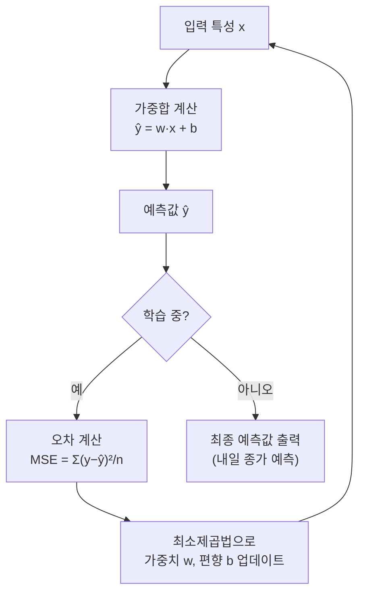
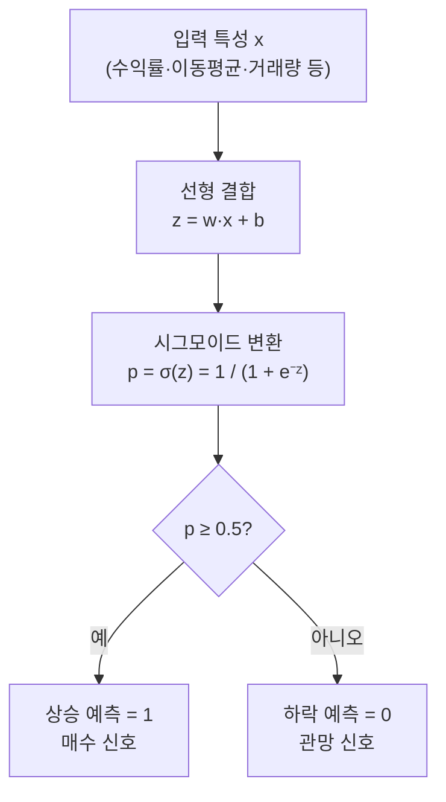
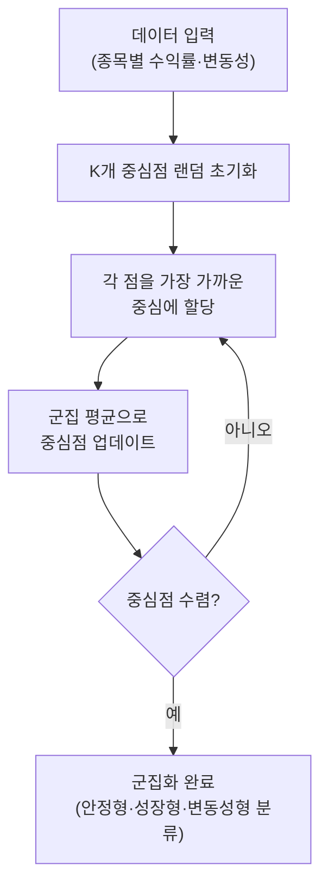
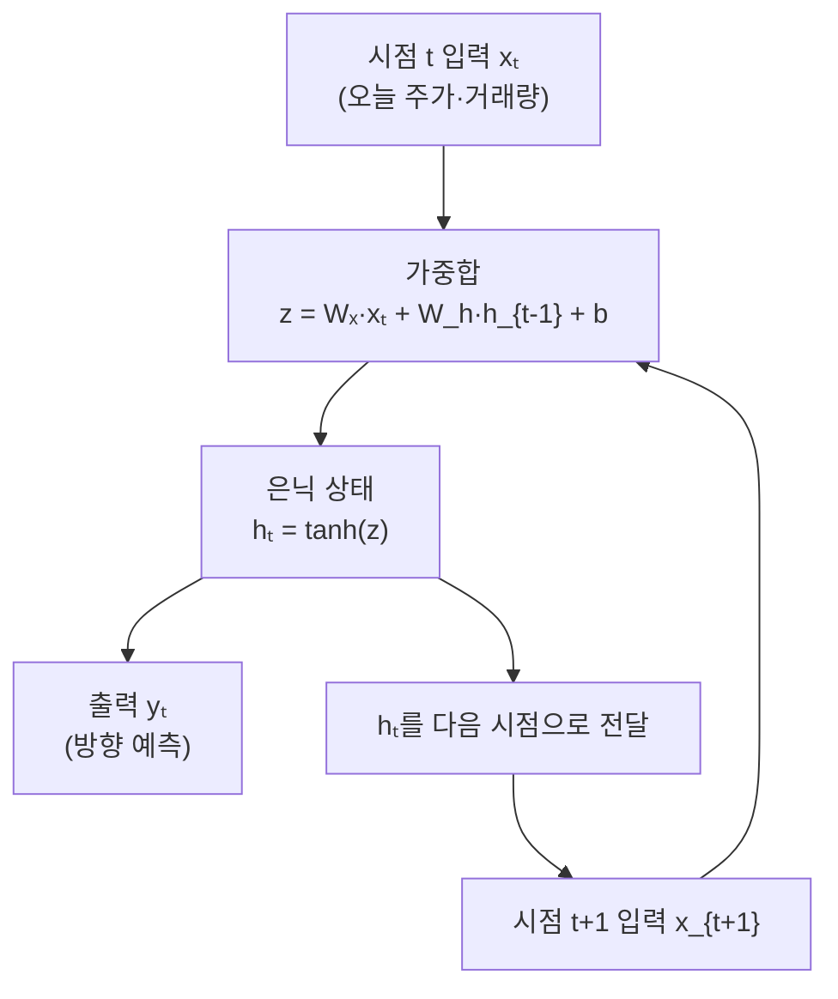

# Day 1. AI 지도 산책: 어떤 문제를 푸는 걸까?

> 오늘은 12일 수업의 첫날입니다. 어려운 이름을 다 외우기보다, "AI가 주식 예측에서 무슨 역할을 하는지" 감을 잡는 날입니다.

---

## 오늘의 목표

- 이 저장소의 12일 학습 흐름을 한눈에 봅니다.
- `회귀`, `분류`, `군집화`, `시계열`을 초등학생도 이해할 말로 구분합니다.
- 문서만 읽고 끝내지 않고 웹앱에서 첫 실행까지 해봅니다.

---

## 12일 커리큘럼 한눈에 보기

| Day | 주제 | 오늘 여는 웹앱 |
|---|---|---|
| 1 | AI 지도 보기 | 웹앱 첫 화면의 `메인 학습 허브` |
| 2 | 모델 기본기 | `메인 학습 허브` + 첫 화면의 `실데이터 모델 비교` 메뉴 |
| 3 | 순서 읽는 모델 | `메인 학습 허브` |
| 4 | 최신 시계열 모델 | `메인 학습 허브` + `모델 비교실` 메뉴 |
| 5 | 허브 사용법 익히기 | `메인 학습 허브` |
| 6 | 같은 데이터로 모델 4개 비교 | 첫 화면의 `실데이터 모델 비교` 메뉴 |
| 7 | 지도학습과 군집화 놀이터 | 첫 화면의 `실데이터 모델 비교` 메뉴 |
| 8 | 뉴런 계산 맛보기 | 첫 화면의 `실데이터 모델 비교` 메뉴 |
| 9 | CSV 업로드 실험 | 첫 화면의 `파일 업로드형 예측` 메뉴 |
| 10 | 평가와 백테스트 읽기 | `실데이터 모델 비교` 메뉴 + `모델 비교실` 메뉴 |
| 11 | 호텔-주가 멀티모델 비교 | 첫 화면의 `모델 비교실` 메뉴 |
| 12 | 종합 미니 프로젝트 | `메인 학습 허브` + `실데이터 모델 비교` + `파일 업로드형 예측` 메뉴 |

---

## 아주 쉽게 이해하기

AI 모델은 마법 상자가 아닙니다.  
컴퓨터가 문제를 푸는 **작은 계산 규칙 묶음**입니다.

문제 종류는 크게 6가지로 보면 쉽습니다.

| 문제 이름 | 쉬운 뜻 | 생활 비유 |
|---|---|---|
| 회귀 | 숫자를 맞히기 | 내일 종가가 몇 원일까? |
| 분류(클래스분류) | 이름표 고르기 | 내일 주가가 오를까, 내릴까? |
| 군집화(클러스터링) | 비슷한 것끼리 모으기 | 비슷하게 움직이는 종목끼리 묶기 |
| 추천 | 좋아할 것 골라주기 | "이 종목도 봐봐!" 하고 알려주기 |
| 차원축소 | 복잡한 걸 간단하게 줄이기 | 100가지 정보를 2~3가지로 요약하기 |
| 시계열 | 시간 순서로 읽기 | 지난주부터 오늘까지 주가 흐름 이어 읽기 |

주가 공부에 대입하면 이렇게 됩니다.

- 회귀: "내일 가격이 몇 원쯤일까?"
- 분류: "내일 오를까, 내릴까?"
- 군집화: "비슷하게 움직이는 종목끼리 묶을 수 있을까?"
- 추천: "내가 관심 가질 만한 다른 종목이 뭘까?"
- 차원축소: "100개 지표 중 핵심 2~3개만 뽑아 보면 어떨까?"
- 시계열: "지난주부터 오늘까지 흐름을 같이 보면 뭐가 보일까?"

---

## ML 응용분야 5가지 — 초등학생도 이해하는 예시

### 🍎 1. 클래스분류 (Classification) — "이름표 붙이기"

컴퓨터가 사진이나 숫자를 보고 **"이건 A야, 저건 B야"** 하고 이름표를 붙이는 일입니다.

| 쉬운 비유 | 실생활 예시 | AI 적용 예시 |
|---|---|---|
| 과일 바구니 정리 | "이건 사과, 저건 배, 이건 바나나!" | 사진을 보고 강아지/고양이/새 구분 |
| 우편함 정리 | "이 편지는 중요한 것, 저건 광고지!" | 이메일이 스팸인지 아닌지 자동 분류 |
| 신호등 보기 | "빨강=멈춰, 초록=가!" | 운전 중 신호등 색 인식 |

**주식에서는?**  
"내일 이 종목이 오를까(↑), 내릴까(↓), 유지될까(→)?" — 세 가지 중 하나를 골라 이름표를 붙입니다.

> 🌟 **초등학생 버전**: 색종이를 보고 "빨강/파랑/노랑" 중 하나를 말하는 것처럼, AI도 데이터를 보고 가장 어울리는 이름을 말합니다.

---

### 🧩 2. 클러스터링 (Clustering) — "비슷한 것끼리 모으기"

정답을 알려주지 않아도 컴퓨터가 스스로 **비슷한 것끼리 묶어** 그룹을 만드는 일입니다.

| 쉬운 비유 | 실생활 예시 | AI 적용 예시 |
|---|---|---|
| 레고 정리 | 같은 색깔·모양 레고끼리 바구니에 담기 | 고객을 구매 패턴별로 자동 그룹 나누기 |
| 반 친구 모둠 | 취미가 비슷한 친구들끼리 자연스럽게 모이기 | 음악 취향이 비슷한 사람들 묶기 |
| 동물원 우리 | 초식동물/육식동물/조류 우리를 따로 두기 | 동물 사진을 종류별로 자동 분류 |

**주식에서는?**  
종목들을 "안정형 주식 / 성장형 주식 / 변동성 큰 주식"처럼 성격별로 자동으로 묶어 봅니다.

> 🌟 **초등학생 버전**: 선생님이 "비슷한 애들끼리 앉아봐!" 했을 때 AI가 알아서 그룹을 정해주는 것과 같아요.

---

### 🎁 3. 추천 (Recommendation) — "네가 좋아할 것 같아!"

내가 좋아했던 것들을 기억해서 **앞으로 좋아할 것**을 골라 알려주는 일입니다.

| 쉬운 비유 | 실생활 예시 | AI 적용 예시 |
|---|---|---|
| 단짝 친구 | "너 어제 액션 영화 좋아했잖아, 이것도 봐봐!" | 넷플릭스·유튜브 "다음 영상 추천" |
| 도서관 사서 | "공룡 책 좋아하면 이 공룡 책도 읽어봐!" | 온라인 서점 "이 책도 어때요?" |
| 급식 메뉴 추천 | "어제 치킨카레 다 먹었으니 오늘은 닭갈비 어때?" | 배달 앱 "자주 시키는 음식 추천" |

**주식에서는?**  
"삼성전자에 관심 있으신가요? SK하이닉스도 비슷하게 움직입니다!" 하고 관련 종목을 알려줍니다.

> 🌟 **초등학생 버전**: 유튜브에서 영상 하나 보면 옆에 "이것도 보세요!" 목록이 뜨는 것, 그게 바로 추천 AI예요.

---

### 📏 4. 회귀 (Regression) — "숫자를 딱 맞히기"

미래의 **숫자값**을 예측하는 일입니다. "얼마나?"라는 질문에 답합니다.

| 쉬운 비유 | 실생활 예시 | AI 적용 예시 |
|---|---|---|
| 키 재기 | "키가 160cm면 몸무게는 몇 kg쯤?" | 집 크기·위치·층수로 집값 예측 |
| 성적 예측 | "공부를 5시간 하면 몇 점쯤 맞을까?" | 광고비를 얼마 쓰면 매출이 얼마 오를까? |
| 날씨 예측 | "오늘 최고 기온이 몇 도일까?" | 전력 회사가 내일 전기 사용량 예측 |

**주식에서는?**  
"내일 삼성전자 주가가 몇 원쯤일까?" — 딱 떨어지는 숫자를 예측합니다.

> 🌟 **초등학생 버전**: "사과가 3개면 값이 얼마야?" 하고 곱하기 계산하는 것처럼, AI도 관계를 배워서 숫자를 맞힙니다.

---

### 🗺️ 5. 차원축소 (Dimensionality Reduction) — "복잡한 걸 간단하게 줄이기"

엄청나게 많은 정보를 **핵심만 남겨 2~3가지로 요약**하는 일입니다.

| 쉬운 비유 | 실생활 예시 | AI 적용 예시 |
|---|---|---|
| 지도 만들기 | 3D 지구를 2D 종이 지도로 펼치기 | 고차원 데이터를 2D 그래프로 시각화 |
| 성적표 요약 | "10개 과목 점수 대신 문과형/이과형으로 요약" | 수백 개 유전자 정보를 몇 가지 특징으로 묶기 |
| 짐 싸기 | "여행 가방에 꼭 필요한 것만 넣기" | 100개 주식 지표 중 핵심 2개만 뽑아내기 |

**주식에서는?**  
거래량·이동평균·RSI·볼린저밴드 등 수십 개 지표를 2~3개의 "핵심 요약"으로 줄여 차트로 보기 쉽게 만듭니다.

> 🌟 **초등학생 버전**: 100쪽짜리 책을 읽고 "한 줄 요약"을 만드는 것처럼, AI도 복잡한 데이터를 간단한 숫자 몇 개로 요약합니다.

---

### 한눈에 비교하기

| 응용분야 | 한 마디 요약 | 질문 유형 | 초등 비유 |
|---|---|---|---|
| 클래스분류 | 이름표 붙이기 | "이게 뭐야?" | 과일 바구니 정리 |
| 클러스터링 | 비슷한 것 묶기 | "어떤 그룹이야?" | 레고 색깔별 정리 |
| 추천 | 좋아할 것 찾기 | "다음에 뭘 보여줄까?" | 단짝이 영화 골라주기 |
| 회귀 | 숫자 예측 | "얼마야?" | 키 보고 몸무게 맞히기 |
| 차원축소 | 핵심만 요약 | "줄이면 뭐가 남아?" | 100쪽 책 한 줄 요약 |

## 대표 알고리즘을 수학으로 보면

Day 1에서는 문제 이름만 익혀도 충분하지만,  
이 저장소에서 실제로 연결되는 대표 알고리즘을 수학 한 줄로 보면 감이 더 빨리 잡힙니다.

| 문제 종류 | 대표 알고리즘 | 핵심 식 | 쉬운 수학 해석 | GitHub 설명/구현 |
|---|---|---|---|---|
| 회귀 | 선형회귀 | `ŷ = w·x + b`, minimize `Σ(y - ŷ)^2` | 입력 힌트를 직선으로 합쳐 숫자를 예측하고, 전체 오차 제곱합이 가장 작아지게 맞춥니다. | [README](https://github.com/edumgt/python-ai-basic-lab/blob/main/backend/app/chapters/chapter05/README.md) · [practice.py](https://github.com/edumgt/python-ai-basic-lab/blob/main/backend/app/chapters/chapter05/practice.py) |
| 분류 | 로지스틱 회귀 | `p(y = 1 | x) = σ(w·x + b)` | 점수를 시그모이드로 눌러 0~1 확률로 바꾼 뒤 상승/하락 둘 중 하나를 고릅니다. | [README](https://github.com/edumgt/python-ai-basic-lab/blob/main/backend/app/chapters/chapter06/README.md) · [practice.py](https://github.com/edumgt/python-ai-basic-lab/blob/main/backend/app/chapters/chapter06/practice.py) |
| 군집화 | K-Means | minimize `Σ ||x_i - μ_{c(i)}||^2` | 각 점을 가장 가까운 중심에 붙여 비슷한 데이터끼리 무리를 만듭니다. | [README](https://github.com/edumgt/python-ai-basic-lab/blob/main/backend/app/chapters/chapter09/README.md) · [practice.py](https://github.com/edumgt/python-ai-basic-lab/blob/main/backend/app/chapters/chapter09/practice.py) |
| 시계열 | RNN | `h_t = tanh(W_x x_t + W_h h_{t-1} + b)` | 바로 전 상태를 다음 계산에 넘겨 시간 순서를 기억하며 다음 값을 읽습니다. | [README](https://github.com/edumgt/python-ai-basic-lab/blob/main/backend/app/chapters/chapter101/README.md) · [practice.py](https://github.com/edumgt/python-ai-basic-lab/blob/main/backend/app/chapters/chapter101/practice.py) |

---

## 오늘의 낱말 4개

| 낱말 | 한자·영어 | 아주 쉬운 뜻 |
|---|---|---|
| 모델 | 模型 / *model* | 현실을 흉내 내는 계산 틀. 模(본뜰 모)+型(모형 형). 진짜 세상을 그대로 담는 대신 중요한 부분만 작게 흉내 낸 것 |
| 특성 | 特性 / *feature* | 모델이 보는 힌트. 特(특별할 특)+性(성질 성). 가격·거래량·이동평균처럼 모델에 넣는 각각의 숫자 정보 |
| 확률 | 確率 / *probability* | 얼마나 그럴 것 같은지 숫자로 말한 것. 確(확실할 확)+率(비율 률). "상승 확률 72%"처럼 가능성을 0~1 사이 숫자로 표현 |
| 패턴 | *pattern* | 반복해서 보이는 모양. 데이터에서 일정하게 되풀이되는 구조나 흐름 |

---

## 오늘 열 페이지

- 웹앱 첫 화면의 `메인 학습 허브`
- 첫 화면에서 들어가는 `실데이터 모델 비교` 메뉴(주식 AI 실험실)

---

## 오늘의 20분 코스

| 시간 | 할 일 |
|---|---|
| 5분 | 이 문서에서 문제 4종류를 읽습니다. |
| 5분 | 웹앱 첫 화면의 `메인 학습 허브`에서 `chapter05`, `chapter06`, `chapter09`, `chapter101`처럼 이름이 다른 챕터를 눈으로만 훑습니다. |
| 10분 | 첫 화면의 `실데이터 모델 비교` 메뉴로 들어가 샘플 데이터를 불러오고 모델 하나를 실행합니다. |

---

## 웹앱 따라 하기

1. 웹앱 첫 화면을 열고 `메인 학습 허브`부터 봅니다.
2. 왼쪽에서 아무 챕터나 하나 눌러 `설명` 탭을 봅니다.
3. 이번에는 첫 화면 카드 중 `실데이터 모델 비교` 메뉴로 이동합니다.
4. 샘플 데이터를 불러온 뒤 모델 하나를 선택합니다.
5. `AI 분석 시작!`을 눌러 결과 카드가 나온다는 것만 확인합니다.

오늘은 숫자를 완벽히 해석하지 않아도 괜찮습니다.  
`문서 읽기 -> 버튼 누르기 -> 결과 보기` 흐름을 몸으로 익히는 게 더 중요합니다.

---

## 관찰 미션

- 결과 화면에서 제일 먼저 보이는 숫자는 무엇이었나요?
- 모델 이름이 달라도 "데이터를 넣고 결과를 본다"는 흐름은 같았나요?
- 네 가지 문제 중 오늘 내가 제일 궁금한 것은 무엇이었나요?

---

## 한 줄 숙제

아래 문장을 빈칸 채우기처럼 적어보세요.

`AI 모델은 ________을(를) 보고 ________을(를) 예측하는 계산 도구다.`

예시:

`AI 모델은 가격과 거래량을 보고 내일 오를지 내릴지를 예측하는 계산 도구다.`

---

## 쉬운 주식 예시 3종 세트

| 보는 것 | 초등학생식 질문 | 쉬운 예시 |
|---|---|---|
| 종목 | "삼성전자 내일 오를까?" | 최근 며칠 가격과 거래량을 보고 `오를까/내릴까`를 맞혀 봅니다. |
| 기술 지표 | "5일 이동평균선이 20일 이동평균선 위로 올라갔네?" | `골든크로스`가 나오면 상승 힘이 붙는지 예측해 봅니다. |
| 거시경제 | "미국 금리가 오르면 우리 시장은 어떨까?" | 금리, 환율, 유가가 같이 움직일 때 자동차주나 반도체주가 흔들리는지 살펴봅니다. |

아주 쉽게 말하면:

- 종목 예측은 `한 회사의 내일`을 보는 일
- 지표 예측은 `차트 신호의 뜻`을 읽는 일
- 거시경제 예측은 `시장 전체 날씨`를 보는 일

---

## 밖에서 가져오면 좋은 데이터는 무엇일까요?

주가만 보면 `한 회사의 움직임`만 보입니다.  
하지만 투자자는 바깥 날씨도 같이 봐야 합니다.

예를 들면:

- `DART`: 회사가 직접 낸 성적표
- `FRED`: 금리, 물가, 실업률, VIX 같은 세계 시장 날씨
- `World Bank`: 한국 경제 체력 같은 긴 흐름
- `KOSIS`: 한국 안의 더 자세한 통계

아주 쉽게 말하면

- DART는 `학교 생활기록부`
- FRED는 `운동장 날씨판`
- World Bank는 `나라 건강검진표`
- KOSIS는 `우리 동네 자세한 기록장`

입니다.

이 저장소의 새 `거시경제 투자 파이프라인` 메뉴는  
이런 바깥 데이터를 모아서 ML/DL 학습 예제로 연결해 줍니다.

---

## 알고리즘 처리 흐름 (Day 1)

### 선형회귀 흐름

### 로지스틱 회귀 흐름

### K-Means 군집화 흐름

### RNN 흐름

---

## 모델 상세 참고 (Day 1)

| 모델 | 수학적 의미 | 탄생 배경 | 주식투자 활용 | 만든 사람/대표 GitHub |
|---|---|---|---|---|
| 선형회귀 | `y = w^Tx + b`에서 MSE(평균제곱오차)를 최소화해 계수를 구합니다. | 천문·측지 오차 보정을 위해 최소제곱법(르장드르/가우스)이 정립되며 발전했습니다. | 수익률·가격을 연속값으로 예측하는 기준선(Baseline) 모델로 유용합니다. | Adrien-Marie Legendre, C.F. Gauss · <https://github.com/scikit-learn/scikit-learn/blob/main/sklearn/linear_model/_base.py> |
| 로지스틱 회귀 | `P(y=1|x)=σ(w^Tx+b)`로 상승/하락 확률을 추정합니다. | 의학·사회통계의 이진 사건 분석 문제에서 확률 분류기로 확장되었습니다. | 내일 상승 확률, 이벤트 발생 확률 같은 이진 의사결정에 적합합니다. | David Cox(현대 통계 정립) · <https://github.com/scikit-learn/scikit-learn/blob/main/sklearn/linear_model/_logistic.py> |
| K-Means | `Σ||x_i-μ_{c(i)}||^2`를 최소화하도록 군집 중심을 반복 갱신합니다. | 대용량 표본을 빠르게 묶는 산업 통계 요구에서 1967년 표준화되었습니다. | 종목을 변동성형/추세형/테마형처럼 성향별 바구니로 나누는 데 씁니다. | James MacQueen · <https://github.com/scikit-learn/scikit-learn/blob/main/sklearn/cluster/_kmeans.py> |
| RNN | `h_t=f(W_xx_t+W_hh_{t-1}+b)`로 이전 상태를 다음 시점 계산에 전달합니다. | 시퀀스(언어·음성·시계열)에서 "순서 기억"이 필요해 1990년대 본격 연구되었습니다. | 최근 며칠 흐름을 반영한 다음 날 방향/수익률 예측의 기본 시계열 신경망입니다. | Jeffrey Elman(Elman RNN) · <https://github.com/pytorch/pytorch> |

## 분야별 모델 쓰임새 및 적합도 (Day 1)

| 모델 | 데이터셋 형태 | 헬스케어 | 자율주행 | 주식투자 | 로봇 | AI Ops |
|---|---|---|---|---|---|---|
| 선형회귀 | 정형 수치 CSV, 연속값 레이블 | 혈압·혈당 수치 예측, 복용량-반응 곡선 추정 | 속도·가속도 제어 값 예측(단순 보간) | 가격·수익률 기준선 예측, 지표 회귀 분석 | 관절 토크·위치 보간 계산 | 서버 자원 사용량 추이 예측, 비용 추정 |
| 로지스틱 회귀 | 정형 수치·범주 데이터, 이진 레이블 | 질병 진단(암 유무), 재입원 위험 분류 | 장애물 유무 이진 분류(저복잡도 환경) | 상승/하락 기준선 분류, 이벤트 발생 확률 | 이상 동작 감지(OK/NG 이진 분류) | 서비스 장애 발생 여부 분류, 알림 트리거 |
| K-Means | 레이블 없는 정형 수치 데이터 | 환자 증상 유형 군집, 유전자 발현 패턴 분류 | 도로 환경 상황 군집, 센서 이상 패턴 묶기 | 종목 성향 군집(방어주·성장주·테마주) | 환경 상태 군집화, 태스크 유형 자동 분류 | 로그 이상 패턴 군집, 트래픽 프로파일 분류 |
| RNN | 순서 있는 시계열·텍스트 데이터 | ECG·EEG 신호 분석, 환자 상태 추이 예측 | 차량 궤적 단기 예측, 센서 시계열 처리 | 단기 주가 방향·모멘텀 예측 | 모션 시퀀스 학습, 작업 순서 기억 처리 | 로그 시퀀스 이상 감지, 메트릭 단기 추이 |

## 모델 혼합 & 검증 아이디어 (Day 1)

주식 투자 솔루션을 만들 때는 모델 하나만 믿기보다 **여러 모델을 섞어서 서로를 보완**하면 더 안정적입니다.  
Day 1에서 소개한 4가지 모델을 조합하면 이런 파이프라인을 생각해볼 수 있습니다.

### 혼합 아이디어

| 혼합 방법 | 어떻게 섞나요? | 왜 좋을까요? |
|---|---|---|
| 회귀 + 분류 이중 모델 | 선형회귀로 "내일 가격"을 예측하고, 로지스틱 회귀로 "방향(오를지/내릴지)"을 예측해 두 신호를 함께 봄 | 가격 예측과 방향 예측이 모두 같은 방향을 가리킬 때만 신호를 믿을 수 있음 |
| 군집화 → 분류 파이프라인 | K-Means로 "이 종목은 안정형인지 변동성형인지" 먼저 나눈 뒤, 각 군집에 맞는 로지스틱/RNN 모델을 따로 학습 | 성격이 다른 종목을 한 모델로 억지로 학습하면 패턴이 섞이므로, 먼저 묶고 나서 학습하면 더 깔끔한 결과를 얻음 |
| 시계열 앞단 + 분류 뒷단 | RNN이 최근 흐름을 읽어 "요약 신호"를 만들고, 로지스틱 회귀가 그 신호로 상승/하락을 판단 | 시간 흐름 정보와 정형 특성을 함께 쓰는 간단한 혼합 방식 |

### 검증 방법

- **회귀 모델 검증**: 예측 가격과 실제 가격의 차이를 `RMSE`(평균제곱근오차)로 확인합니다.
- **분류 모델 검증**: `AUC`와 `정확도`로 방향이 잘 맞는지 확인합니다.
- **군집화 검증**: `K` 값을 2, 3, 4로 바꾸며 군집이 의미 있게 나뉘는지 봅니다. 같은 군집 안의 종목이 실제로 비슷하게 움직이는지 차트로 비교합니다.
- **교차 검증 기본 원칙**: 미래 날짜 데이터가 학습에 들어가지 않도록 항상 "앞쪽 기간 학습 → 뒤쪽 기간 테스트" 순서를 지킵니다.

> 아주 쉽게 말하면: 회귀는 "몇 원?"을 맞히고, 분류는 "오를까 내릴까?"를 맞힙니다.  
> 둘 다 같은 방향을 가리킬 때 신호를 더 신뢰할 수 있습니다.

---

## 웹앱 안쪽 들여다보기

### 프론트엔드와 백엔드는 어떻게 나뉠까요?
- **프론트엔드**는 버튼, 표, 차트처럼 눈에 보이는 화면입니다.
- **백엔드**는 FastAPI 서버 안에서 Python으로 계산하는 주방입니다.
- 이 저장소의 중심 파일은 `backend/app/main.py`이고, 챕터 실습 코드는 `backend/app/chapters/` 아래에 있습니다.

### 화면과 서버 주소를 짝지어 보면
| 화면 | 하는 일 | 주로 연결되는 API |
|---|---|---|
| `/` | 메인 학습 허브 | `/api/chapters`, `/api/docs` |
| `/lab` | 주식 AI 실험실 | `/api/stock/analyze` |
| `/predict` | CSV 업로드 실험 | `/api/stock/predict-target`, `/api/stock/sample-csv` |
| `/hotel-stock` | 멀티특성 비교 실험 | `/api/hotel-stock/train` |
| `/datasets` | CSV 미리보기 | `/api/datasets`, `/api/datasets/{id}` |
| `/dart` | 공시 투자 파이프라인 | `/api/dart/overview`, `/api/dart/companies` |
| `/macro` | 거시경제 투자 파이프라인 | `/api/macro/overview`, `/api/macro/train` |
| `/advisor` | 뉴스 이벤트 컨설팅 | `/api/stock/news-consult` |

### API는 무엇일까요?
- `GET`은 **가져오기**입니다. 예: `GET /api/docs`
- `POST`는 **데이터를 보내고 계산시키기**입니다. 예: `POST /api/stock/analyze`

즉, 웹앱에서 버튼을 누르면 화면이 API로 주문서를 보내고, 서버가 계산한 뒤 JSON 결과를 다시 돌려주는 구조입니다.
