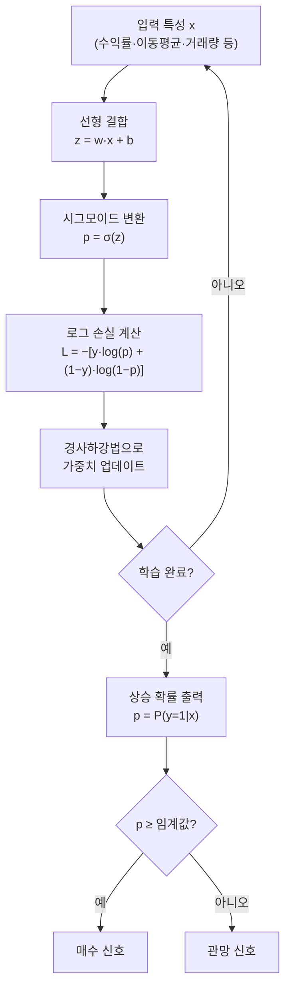
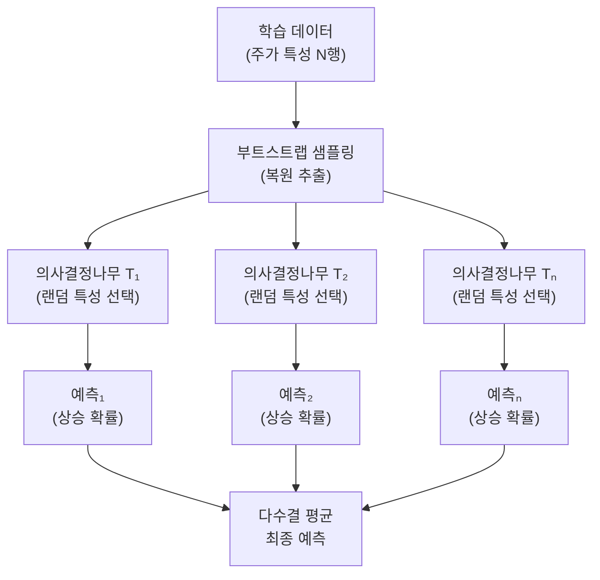
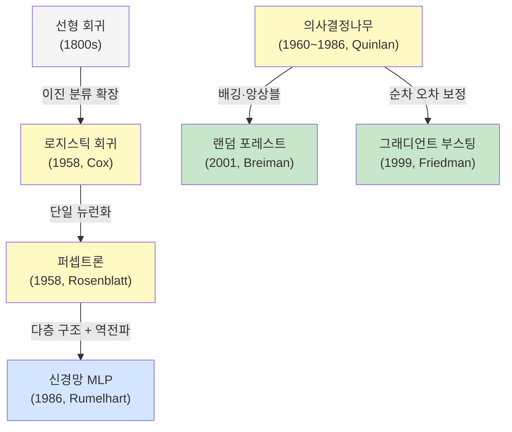

# 모델 기본기: 점수는 왜 여러 개를 볼까?

> 오늘은 "한 번 맞춘 모델"보다 "계속 믿고 쓸 수 있는 주식 예측 모델"이 더 중요하다는 걸 배우는 날입니다.

---

## 오늘의 목표

- `튜닝`, `검증`, `평가`, `군집화`가 무엇인지 아주 쉽게 이해합니다.
- 점수 하나만 보고 모델을 고르면 왜 위험한지 압니다.
- 웹앱에서 같은 모델을 다시 돌려 보며 숫자 읽는 연습을 시작합니다.

---

## 오늘 먼저 기억할 말

좋은 모델은 하루 데이터에서만 잘 맞는 모델이 아닙니다.  
**다른 기간의 주가에서도 비슷하게 잘하는 모델**입니다.

그래서 우리는 아래 4가지를 같이 봅니다.

| 이름 | 쉬운 뜻 | 비유 |
|---|---|
| 튜닝 | 설정값 조절하기 | 이동평균 길이, 모델 깊이 같은 버튼 바꾸기 |
| 검증 | 중간 점검하기 | 다른 기간 주가로 다시 확인하기 |
| 평가 | 몇 점인지 보기 | 예측 점수표 보기 |
| 군집화 | 비슷한 것끼리 묶기 | 비슷한 종목 무리 나누기 |

---

## 오늘의 핵심 낱말

| 낱말 | 한자·영어 | 쉬운 뜻 |
|---|---|---|
| 하이퍼파라미터 | *hyperparameter* | 사람이 먼저 정하는 버튼값. '학습 전에 손으로 설정하는 값'이라는 뜻으로, 트리 깊이·학습 횟수 같은 설정값 |
| 교차 검증 | 交叉 檢證 / *cross validation* | 데이터를 여러 묶음으로 바꿔가며 확인하는 방법. 交叉(서로 교차)+檢(검사할 검)+證(증명할 증). 어느 묶음으로 테스트해도 비슷하게 잘 되는지 확인 |
| 정확도 | 正確度 / *accuracy* | 전체 중 몇 개를 맞혔는지. 正(바를 정)+確(확실할 확)+度(정도 도). 예측이 맞은 비율 |
| 누출 | 漏出 / *data leakage* | 보면 안 될 미래 정보가 몰래 들어온 상태. 漏(샐 루)+出(날 출). 미래 날짜 데이터가 과거 학습에 섞이는 것 |

---

## 왜 점수 하나만 보면 안 될까요?

예를 들어 어떤 모델이 `정확도 90%`라고 해도,

- 급등락 구간은 놓치고 있을 수 있고
- 특정 기간 주가에서만 우연히 잘했을 수 있고
- 미래 정보를 몰래 본 결과일 수도 있습니다

그래서 아래처럼 여러 질문을 해야 합니다.

- 정말 다른 기간에서도 괜찮은가?
- 오를 거라고 했을 때 진짜 잘 맞히는가?
- 시간 순서를 어기지 않았는가?

---

## 오늘 열 페이지

- 웹앱 첫 화면의 `메인 학습 허브`
- 첫 화면 카드의 `실데이터 모델 비교` 메뉴

---

## 오늘의 25분 코스

| 시간 | 할 일 |
|---|---|
| 10분 | 이 문서에서 검증과 평가 뜻을 읽습니다. |
| 5분 | 웹앱 첫 화면의 `메인 학습 허브`에서 `chapter10`, `chapter11` 설명을 차례로 엽니다. |
| 10분 | 첫 화면 카드의 `실데이터 모델 비교` 메뉴에서 같은 샘플을 두고 모델 2개를 실행해 점수를 비교합니다. |

---

## 웹앱 따라 하기

1. 웹앱 첫 화면에서 `메인 학습 허브`를 열고 `chapter10`을 선택합니다.
2. `설명` 탭에서 `accuracy`, `precision`, `AUC`라는 말을 먼저 봅니다.
3. 같은 화면에서 `chapter11`도 열어 `검증`이라는 말을 읽습니다.
4. 첫 화면 카드 중 `실데이터 모델 비교` 메뉴로 이동합니다.
5. 같은 샘플 데이터로 `로지스틱 회귀`와 `랜덤 포레스트`를 각각 실행합니다.
6. 숫자가 완전히 같지 않다는 점과, 한 숫자만 보면 부족하다는 점을 적어봅니다.

---

## 초급자식 해석 팁

- `accuracy`: 전체 맞힌 개수 보기
- `precision`: "맞다!"라고 말했을 때 진짜 잘 맞았는지 보기
- `AUC`: 전체적으로 잘 구분하는지 보기
- `검증`: 운이 아니라 실력인지 확인하기

---

## 관찰 미션

- 모델 A와 모델 B 중 어느 쪽이 더 안정적으로 보였나요?
- 높은 숫자가 하나 있어도 다른 숫자가 아쉬운 경우가 있었나요?
- "좋은 모델보다 좋은 검증이 먼저"라는 말이 왜 맞을까요?

---


## 쉬운 예시로 다시 보기

### 1. 종목 예시

어떤 모델이 삼성전자 데이터에서 `정확도 90%`가 나왔다고 해도,

- 조용한 날만 잘 맞히고
- 크게 떨어지는 날은 자꾸 놓치면

실제로는 불편한 모델일 수 있습니다.

### 2. 기술 지표 예시

`RSI`, `이동평균`, `거래량 급증`을 같이 넣었더니 점수는 높아졌는데,
사실 미래 날짜의 값을 실수로 먼저 본 상태라면 그 점수는 믿으면 안 됩니다.  
이걸 `누출`이라고 생각하면 쉽습니다.

### 3. 거시경제 예시

금리 인상기, 환율 급등기, 유가 급등기처럼 시장 분위기가 바뀌는 시기에는  
예전 장세에서 잘 맞던 모델이 갑자기 흔들릴 수 있습니다.

그래서 우리는 늘 이렇게 묻습니다.

- 다른 기간에서도 괜찮은가?
- 다른 시장 분위기에서도 괜찮은가?
- 점수가 높아진 이유가 진짜 실력인가?

---


## 알고리즘 처리 흐름 

### 로지스틱 회귀 흐름



### 랜덤 포레스트 흐름



### 알고리즘 계보도 (Day 2)



---

## 모델 상세 참고 

| 모델 | 수학적 의미 | 탄생 배경 | 주식투자 활용 | 만든 사람/대표 GitHub |
|---|---|---|---|---|
| 로지스틱 회귀 | 선형 점수를 시그모이드로 확률화해 분류 경계를 만듭니다. | 해석 가능한 확률 분류가 필요해 통계학에서 널리 확립되었습니다. | 상승/하락 확률 임계값(예: 0.55 이상 매수) 기반 전략에 자주 사용됩니다. | David Cox(현대 통계 정립) · <https://github.com/scikit-learn/scikit-learn/blob/main/sklearn/linear_model/_logistic.py> |
| 랜덤 포레스트 | 여러 의사결정나무 `T_b`를 학습해 `\hat y=majority(T_b(x))`로 앙상블합니다. | 단일 트리 과적합을 줄이려는 Bagging 연구가 2001년 RF로 체계화되었습니다. | 비선형 패턴·특성 상호작용을 잘 잡고, 중요 특성 해석이 쉬워 실무에서 많이 씁니다. | Leo Breiman · <https://github.com/scikit-learn/scikit-learn/blob/main/sklearn/ensemble/_forest.py> |

## 분야별 모델 쓰임새 및 적합도 

| 모델 | 데이터셋 형태 | 헬스케어 | 자율주행 | 주식투자 | 로봇 | AI Ops |
|---|---|---|---|---|---|---|
| 로지스틱 회귀 | 정형 수치·범주 데이터, 이진 레이블 | 재입원 위험·질환 유무 분류, 해석 가능한 임상 지표 | 장애물 유무 판별(단순 환경, 저복잡도) | 상승/하락 확률 임계값 기반 매수 신호 생성 | 이상 동작 감지(OK/NG), 안전 인터록 판단 | 서비스 장애 발생 여부 분류, 알림 조건 설정 |
| 랜덤 포레스트 | 정형 수치·범주 데이터, 중간 크기 | 진단 보조·치료 효과 예측, 특성 중요도 해석 | 도로 조건 분류, 센서 이상 감지(다변량 특성) | 안정적 신호 분류, 특성 중요도로 힌트 해석 | 상태 분류·고장 예측, 다변량 센서 융합 | 장애 원인 분류, 리소스 이상 감지, 이슈 우선순위 |

## 모델 혼합 & 검증 아이디어 

Day 2의 핵심은 "점수 하나만 믿지 않기"입니다.  
로지스틱 회귀와 랜덤 포레스트를 함께 쓰면 **서로의 단점을 보완**할 수 있습니다.

### 혼합 아이디어

| 혼합 방법 | 어떻게 섞나요? | 왜 좋을까요? |
|---|---|---|
| 소프트 투표 앙상블 | 두 모델이 각각 내놓은 "상승 확률"을 평균 냄. 예: 로지스틱 55% + 랜덤포레스트 65% → 평균 60% | 한 모델이 크게 틀려도 다른 모델이 균형을 잡아줌 |
| 순차 필터링 | 먼저 로지스틱 회귀로 명확한 하락 신호(상승 확률 40% 이하)를 걸러내고, 나머지에만 랜덤 포레스트를 적용 | 간단한 모델이 빠르게 틀린 후보를 제거하고, 복잡한 모델은 애매한 케이스에만 집중 |
| 특성 분리 활용 | 로지스틱 회귀는 선형 특성(이동평균, 수익률)에, 랜덤 포레스트는 비선형 특성(거래량 패턴, 이벤트 여부)에 따로 적용 | 각 모델이 잘 보는 영역에 집중하게 함 |

### 검증 방법

- **교차 검증**: 데이터를 시간 순서대로 5구간으로 나눠 "앞 4구간 학습 → 마지막 구간 테스트"를 반복합니다. 5번 반복한 점수의 평균과 표준편차를 봅니다.
- **안정성 확인**: 점수의 표준편차가 작을수록 어느 기간에서도 비슷하게 잘하는 안정된 모델입니다.
- **점수 조합 보기**: `accuracy`만 보지 말고 `AUC`, `precision`, `recall`을 동시에 확인해 어느 모델이 더 균형 잡혀 있는지 비교합니다.
- **앙상블 전후 비교**: 단일 모델 점수와 두 모델을 섞은 앙상블 점수를 나란히 놓고, 섞었을 때 실제로 좋아졌는지 확인합니다.

> 아주 쉽게 말하면: 두 모델이 모두 "오른다"고 할 때만 행동하면, 한 모델만 믿을 때보다 틀릴 확률을 줄일 수 있습니다.

---

## 웹앱 안쪽 들여다보기

### 서버가 살아 있는지 먼저 확인하는 주소
- `GET /api/health`
- 응답 예: `{ "status": "ok", "version": "..." }`

이 주소는 “서버야, 준비됐니?”를 묻는 가장 작은 확인 버튼입니다.

### 점수는 서버가 어떤 순서로 만들까요?
주식 AI 실험실의 핵심 호출은 `POST /api/stock/analyze` 입니다.

1. 날짜 순서대로 데이터를 정리합니다.
2. 비어 있는 OHLCV 값이 있으면 기본값으로 채웁니다.
3. 아래 **7개 특성**을 계산합니다.
   - `ret`, `ret_5`, `ma5_gap`, `ma20_gap`, `vol_ratio`, `range_pct`, `body_pct`
4. `내일 종가가 오늘보다 오르면 1, 아니면 0` 형태의 정답을 만듭니다.
5. 앞 80% 구간으로 학습하고 뒤 20% 구간으로 점수를 확인합니다.
6. `accuracy`, `AUC`, `precision`을 계산합니다.

그래서 Day 2에서 보는 점수는 화면이 임의로 꾸민 숫자가 아니라, 서버가 시간 순서를 지켜 계산한 결과입니다.

---

### 하이퍼파라미터가 실제로 쓰인 소스 파일

**파일 경로:** `backend/app/main.py`  
**함수:** `stock_analyze()` — `POST /api/stock/analyze` 엔드포인트

#### ① 이동평균 윈도우 (롤링 기간) — 특성 계산부

```python
# backend/app/main.py  (stock_analyze 함수 내)
ma5  = df["close"].rolling(5).mean()          # 하이퍼파라미터: 단기 이동평균 기간 = 5
ma20 = df["close"].rolling(20).mean()         # 하이퍼파라미터: 중기 이동평균 기간 = 20
df["vol_ratio"] = df["volume"] / df["volume"].rolling(10).mean()  # 거래량 비교 기간 = 10
```

> `5`, `20`, `10`은 모두 사람이 미리 정한 **하이퍼파라미터**입니다.  
> 이 숫자를 바꾸면 만들어지는 특성값이 달라지고, 그 결과 모델 점수도 달라집니다.

#### ② 학습/테스트 비율 — 데이터 분할부

```python
# backend/app/main.py  (stock_analyze 함수 내)
split = max(int(len(X) * 0.8), len(X) - 15)  # 하이퍼파라미터: 학습 비율 = 80 %
split = min(split, len(X) - 5)
X_train, X_test = X[:split], X[split:]
```

> `0.8`(80% 학습, 20% 테스트)도 사람이 정하는 **하이퍼파라미터**입니다.

#### ③ 모델별 하이퍼파라미터 — 분류 모델 정의부

```python
# backend/app/main.py  (stock_analyze 함수 내)
clf_model_map = {
    "logistic": LogisticRegression(random_state=42, max_iter=300),
    "rf":       RandomForestClassifier(n_estimators=50, max_depth=5, random_state=42),
    "nn":       MLPClassifier(hidden_layer_sizes=(64, 32), max_iter=300, random_state=42),
    "gbm":      GradientBoostingClassifier(n_estimators=50, max_depth=3, random_state=42),
}
```

| 모델 | 하이퍼파라미터 | 의미 |
|---|---|---|
| 로지스틱 회귀 | `max_iter=300` | 경사하강법 최대 반복 횟수 |
| 랜덤 포레스트 | `n_estimators=50` | 만드는 의사결정나무 개수 |
| 랜덤 포레스트 | `max_depth=5` | 각 트리의 최대 깊이 |
| 신경망(MLP) | `hidden_layer_sizes=(64, 32)` | 은닉층 크기(64개 노드 → 32개 노드) |
| 그래디언트 부스팅 | `n_estimators=50` | 순차적으로 추가할 트리 개수 |
| 그래디언트 부스팅 | `max_depth=3` | 각 트리의 최대 깊이 |

#### ④ 모델별 하이퍼파라미터 — 회귀 모델 정의부

```python
# backend/app/main.py  (stock_analyze 함수 내)
reg_model_map = {
    "logistic": Ridge(alpha=1.0),
    "rf":       RandomForestRegressor(n_estimators=80, max_depth=6, random_state=42),
    "nn":       MLPRegressor(hidden_layer_sizes=(64, 32), max_iter=500, random_state=42),
    "gbm":      GradientBoostingRegressor(n_estimators=80, max_depth=3, random_state=42),
}
```

| 모델 | 하이퍼파라미터 | 의미 |
|---|---|---|
| Ridge 회귀 | `alpha=1.0` | 정규화 강도(클수록 과적합 억제) |
| 랜덤 포레스트(회귀) | `n_estimators=80` | 트리 개수 |
| 랜덤 포레스트(회귀) | `max_depth=6` | 트리 최대 깊이 |
| 신경망(MLP 회귀) | `max_iter=500` | 최대 학습 반복 횟수 |
| 그래디언트 부스팅(회귀) | `n_estimators=80` | 순차 트리 개수 |

> 웹앱 화면에서 모델을 바꾸면 위 표의 다른 행이 실행됩니다.  
> 예를 들어 `랜덤 포레스트`를 고르면 `n_estimators=50, max_depth=5`가 적용되고,  
> `그래디언트 부스팅`을 고르면 `n_estimators=50, max_depth=3`이 적용됩니다.

---

## 📚 Overfitting vs Underfitting

### 🔎 Overfitting
- **정의**: 모델이 학습 데이터에 너무 과하게 맞춰져서 노이즈까지 학습하는 상태.  
- **원인**:  
  - 지나치게 복잡한 모델  
  - 데이터 부족  
  - 규제(regularization) 없음  
  - 너무 많은 특징(feature)  
- **특징**:  
  - 학습 데이터 성능은 높음  
  - 새로운 데이터(테스트 데이터) 성능은 낮음  
- **Bias/Variance**: **Low Bias, High Variance**  
- **비유**: 기출문제 답만 외워서 변형 문제를 못 푸는 경우  

---

### 🔎 Underfitting
- **정의**: 모델이 너무 단순해서 데이터의 중요한 패턴을 잡지 못하는 상태.  
- **원인**:  
  - 단순한 모델 (예: 직선으로 곡선 데이터 맞추기)  
  - 과도한 규제  
  - 부족한 특징(feature)  
- **특징**:  
  - 학습 데이터와 테스트 데이터 모두 성능 낮음  
- **Bias/Variance**: **High Bias, Low Variance**  
- **비유**: 개념을 너무 단순하게 이해해서 문제를 못 푸는 경우  

---

### ⚖️ Bias-Variance (바이어스-베리언스) Tradeoff
- **Bias(편향)**: 모델이 데이터에 대해 강한 가정을 해서 단순화하는 정도 → 높으면 underfitting 발생  
- **Variance(분산)**: 모델이 데이터의 변동에 민감하게 반응하는 정도 → 높으면 overfitting 발생  
- **핵심**: 좋은 모델은 bias와 variance 사이에서 균형을 맞춰야 함  

---

### 📊 비교 표

| 구분 | **Underfitting** | **Overfitting** |
|------|------------------|-----------------|
| **정의** | 패턴을 못 잡음 | 노이즈까지 학습 |
| **원인** | 단순 모델, 과도한 규제 | 복잡 모델, 데이터 부족 |
| **Bias/Variance** | High Bias, Low Variance | Low Bias, High Variance |
| **성능** | 학습/테스트 모두 낮음 | 학습 높음, 테스트 낮음 |
| **비유** | 개념 단순화 → 문제 못 풂 | 답 외우기 → 변형 문제 못 풂 |

---

### ✅ 요약
- **Underfitting** → 너무 단순 → **High Bias**  
- **Overfitting** → 너무 복잡 → **High Variance**  
- 해결책: 데이터 양 늘리기, 모델 복잡성 조절, Regularization, Cross-validation 활용  

### 🛠️ 해결책과 쉬운 예시

- **1. 데이터 양 늘리기**  
  → 책을 한 권만 읽고 시험 보는 대신, 많은 책을 읽고 공부하면 더 다양한 문제를 잘 풀 수 있게 된다. 데이터가 많아질수록 모델이 세상을 더 잘 이해하게 된다.

- **2. 모델 복잡성 조절**  
  → 너무 어려운 수학 문제(복잡한 모델)로 공부하지 않고, 적당한 난이도의 문제를 풀면서 공부하는 것. 모델을 너무 복잡하게 만들지 않고 적당한 수준으로 맞춘다.

- **3. Regularization (정규화)**  
  → 답을 외울 때 “이건 너무 이상한 답이야, 좀 정상적으로 외워!”라고 스스로 제한을 두는 것. 모델이 이상한 패턴(노이즈)을 너무 많이 외우지 못하게 벌칙을 주는 기법이다.

- **4. Cross-validation (교차 검증)**  
  → 한 번만 시험 보는 게 아니라, 문제를 여러 번 섞어서 여러 번 테스트해보는 것. 모델이 진짜 실력을 가졌는지 여러 번 확인하는 방법이다.


---

## 🤖 AI(인공지능)에서 노이즈(Noise)의 개념

### 1. 기본 정의
**노이즈(Noise)**란, 데이터에 포함된 **불필요하거나 무작위적인 변동(random variation)**을 의미합니다.  
모델이 학습해야 할 **진짜 신호(signal)**가 아닌, **방해 요소**로 작용합니다.

- **신호(Signal)**: 실제 패턴이나 의미 (학습 목표)
- **노이즈(Noise)**: 무의미한 오차나 불규칙한 변동

### 2. AI/ML에서 노이즈의 주요 유형

| 유형 | 설명 | 예시 |
|------|------|------|
| **측정 노이즈** | 센서나 기기에서 발생하는 오차 | 온도 센서가 ±0.5℃ 오차 |
| **레이블 노이즈** | 정답 라벨이 잘못된 경우 | 고양이 사진에 '강아지' 표시 |
| **입력 노이즈** | 입력 데이터 자체의 변동 | 사진의 먼지, 빛 반사 |
| **프로세스 노이즈** | 데이터 생성 과정의 자연 변동 | 주식 가격의 불규칙한 일일 변동 |

### 3. 노이즈가 모델에 미치는 영향
- Overfitting(과적합)의 주요 원인
- 일반화(Generalization) 성능 저하
- High Variance 유발

### 4. 쉬운 비유
- **깨끗한 물 vs 더러운 물**: 깨끗한 물 = 신호, 모래·먼지 = 노이즈
- **시험 공부**: 교과서 내용 = 신호, 오답 노트의 잘못된 정보 = 노이즈

### 5. 노이즈 대처 방법
1. 데이터 클리닝
2. 데이터 증강 (Data Augmentation(데이터 어그멘테이션))
3. Regularization(레귤러라이제이션) - L1, L2, Dropout
4. Robust Loss Function
5. 앙상블(Ensemble)
6. Noise-robust 학습 기법 (Label Smoothing, Mixup 등)

### ✅ 요약
AI에서 노이즈는 데이터에 섞인 무의미한 무작위 성분으로, 모델이 진짜 패턴 대신 우연을 학습하게 만들어 성능을 떨어뜨립니다. 좋은 모델은 **노이즈를 무시하고 신호만 잘 잡아내는 모델**입니다.

---

# 🤖 Data Augmentation — 증강(增強)

## 여기서 “증강”이 무엇인가?

**증강(Augmentation)**은 **기존 데이터를 인위적으로 변형하여 새로운 학습 데이터를 만들어 내는 기법**입니다.

기존 데이터의 본질(신호)은 유지하면서 약간의 변화를 주어 데이터의 **양**과 **다양성**을 증가시키는 기술입니다.

### 주요 목적
- Overfitting(과적합) 방지
- 데이터 부족 문제 해결
- 모델의 일반화(Generalization) 능력 향상
- 다양한 현실 상황에 강한 모델 만들기

### 쉬운 비유
- 수학 문제를 10개만 가지고 공부하는 대신, 같은 문제를 각도를 바꾸거나 숫자를 조금 바꿔 **100개**로 만들어 공부하는 것
- 고양이 사진 1장을 → 좌우반전, 회전, 밝기 조절 등을 통해 10장으로 만드는 것

---

## 증강(增強)의 한자어와 유래

### 1. 한자 표기
- **증강(增強)**

**한자 분해**:
- **增 (증)**: 더하다, 늘리다, 증가시키다  
  (土 + 曾 — 땅에서 물건이 자라듯 양을 늘린다는 의미)
- **強 (강)**: 강하다, 세다, 강화하다  
  (弓 + 虫 — 활을 세게 당긴다는 의미에서 강함으로 확장)

→ **증강(增強)** 전체 의미: **“늘려서 강화하다”**, **“양을 늘려 더 강하게 만들다”**

### 2. 어원 및 유래
- 고전 중국어에서 유래한 한자어입니다.
- 본래 군사, 의학, 교육 분야에서 “전력을 늘려 강화한다”, “기능을 증대시켜 강화한다”는 뜻으로 사용되었습니다.
- 현대 AI·머신러닝 분야에서 영어 **Augmentation**의 번역어로 채택되었습니다.
- 의미: 기존 데이터를 늘려(**增**) 모델을 더 강하게(**強**) 만드는 기법

### 3. 영어 어원
- **Augmentation** ← 라틴어 *augmentare* (늘리다, 확대하다)
- “augment” = 증가시키다, 보강하다
- 한국어 **증강**은 의미적으로 거의 완벽하게 일치하는 번역입니다.

### 4. 실제 적용 예시 (이미지)
- 좌우반전 (Horizontal Flip)
- 회전 (Rotation)
- 밝기·대비 조절
- 크롭 (Crop)
- 노이즈 추가
- MixUp, CutMix 등

### ✅ 요약
**증강** = 데이터를 **늘려서(增) 모델을 강화(強)**하는 기술  
과적합을 줄이고, 적은 데이터로도 더 좋은 성능을 내게 해주는 매우 중요한 머신러닝 기법입니다.
