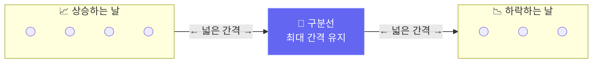

# SVM: 주식을 두 그룹으로 나누기

> "오늘 삼성전자 주가가 오를까? 내릴까?" 를 SVM으로 맞춰봅니다.

---

## 1. SVM이란?

SVM(Support Vector Machine)은 두 그룹을 가장 넓은 간격으로 나누는 **구분선**을 찾는 방법입니다.

마치 "상승하는 날"과 "하락하는 날" 사이에 가장 두꺼운 선을 그어 구분하는 것입니다.



> 간격이 넓을수록 새로운 데이터도 잘 맞춥니다!

---

## 2. 주식 데이터 준비

```python
import pandas as pd
import numpy as np
from sklearn.svm import SVC
from sklearn.preprocessing import StandardScaler
from sklearn.metrics import accuracy_score, classification_report
import matplotlib.pyplot as plt

np.random.seed(42)

# 삼성전자 주가 데이터 만들기
days = 300
prices = 60000 + np.cumsum(np.random.randn(days) * 500)
volume = np.random.randint(5000000, 20000000, days)

df = pd.DataFrame({'close': prices, 'volume': volume})

# 특성 계산
df['ret']     = df['close'].pct_change()           # 오늘 수익률
df['ma5']     = df['close'].rolling(5).mean()      # 5일 평균
df['ma20']    = df['close'].rolling(20).mean()     # 20일 평균
df['vol_avg'] = df['volume'].rolling(5).mean()     # 5일 평균 거래량

# 내일 오를지(1) 내릴지(0)
df['target'] = (df['close'].shift(-1) > df['close']).astype(int)

df = df.dropna()

# 특성과 정답 나누기
features = ['ret', 'ma5', 'ma20', 'vol_avg']
X = df[features].values
y = df['target'].values

# 훈련 / 테스트 나누기 (시간 순서 유지)
split = int(len(X) * 0.8)
X_train, X_test = X[:split], X[split:]
y_train, y_test = y[:split], y[split:]

print(f"학습 데이터: {len(X_train)}일")
print(f"테스트 데이터: {len(X_test)}일")
print(f"상승일 비율: {y_test.mean():.1%}")
```

---

## 3. SVM으로 예측하기

```python
# 숫자 크기 맞추기 (SVM은 이게 매우 중요!)
scaler = StandardScaler()
X_train_sc = scaler.fit_transform(X_train)
X_test_sc  = scaler.transform(X_test)

# SVM 3가지 방식 비교
models = {
    '직선 SVM':    SVC(kernel='linear', probability=True, random_state=42),
    '곡선 SVM':    SVC(kernel='rbf',    probability=True, random_state=42),
    '다항식 SVM': SVC(kernel='poly', degree=3, probability=True, random_state=42),
}

results = {}
for name, model in models.items():
    model.fit(X_train_sc, y_train)
    pred  = model.predict(X_test_sc)
    acc   = accuracy_score(y_test, pred)
    results[name] = acc
    print(f"{name}: 정확도 {acc:.1%}")

# 가장 좋은 모델 선택
best_name = max(results, key=results.get)
best_model = models[best_name]
print(f"\n가장 좋은 방식: {best_name} ({results[best_name]:.1%})")
```

---

## 4. C 값 — 얼마나 엄격하게 나눌까?

C 값은 SVM에서 **엄격함의 정도**를 조절합니다.

- **C가 작으면**: 좀 틀려도 괜찮아, 전체적으로 잘 나누자 (유연하게)
- **C가 크면**: 하나도 틀리면 안 돼! (엄격하게)

주식 데이터처럼 노이즈가 많을 때는 C를 작게 하는 게 좋습니다.

```python
c_values = [0.01, 0.1, 1.0, 10.0, 100.0]
train_accs = []
test_accs  = []

for c in c_values:
    m = SVC(kernel='rbf', C=c, probability=True, random_state=42)
    m.fit(X_train_sc, y_train)
    train_accs.append(accuracy_score(y_train, m.predict(X_train_sc)))
    test_accs.append(accuracy_score(y_test,  m.predict(X_test_sc)))

plt.figure(figsize=(8, 4))
plt.semilogx(c_values, train_accs, 'b-o', label='학습 정확도')
plt.semilogx(c_values, test_accs,  'r-o', label='테스트 정확도')
plt.xlabel('C 값 (크면 엄격, 작으면 유연)')
plt.ylabel('정확도')
plt.title('C 값에 따른 예측 정확도 변화')
plt.legend()
plt.tight_layout()
plt.savefig('svm_c_values.png', dpi=120)
print("저장: svm_c_values.png")

best_c_idx = test_accs.index(max(test_accs))
print(f"가장 좋은 C 값: {c_values[best_c_idx]}")
```

---

## 5. 상승 확률로 투자 신호 만들기

SVM은 "오를 확률"도 알려줄 수 있습니다. 이를 활용해 투자 신호를 만들어봅니다.

```python
# 가장 좋은 C로 최종 모델
final_model = SVC(kernel='rbf', C=1.0, probability=True, random_state=42)
final_model.fit(X_train_sc, y_train)

# 상승 확률 계산
probs = final_model.predict_proba(X_test_sc)[:, 1]

# 투자 신호
signal = []
for p in probs:
    if p > 0.6:
        signal.append('강한 매수')
    elif p > 0.5:
        signal.append('약한 매수')
    elif p < 0.4:
        signal.append('강한 관망')
    else:
        signal.append('약한 관망')

# 결과 보기
result_df = pd.DataFrame({
    '상승확률': probs.round(3),
    '신호': signal,
    '실제': ['상승' if v == 1 else '하락' for v in y_test]
})
print(result_df.head(10))

# 신호별 실제 상승 비율
print("\n신호별 실제 상승 비율:")
print(result_df.groupby('신호')['실제'].apply(lambda x: (x == '상승').mean()).round(3))
```

---

## 6. 결과 시각화

```python
n_plot = min(60, len(y_test))
plt.figure(figsize=(12, 4))
plt.plot(range(n_plot), probs[:n_plot], 'b-o', markersize=3, label='상승 확률')
plt.axhline(y=0.6, color='green', linestyle='--', label='매수 기준선 (60%)')
plt.axhline(y=0.4, color='red',   linestyle='--', label='관망 기준선 (40%)')
plt.scatter(range(n_plot),
            [1.05 if v == 1 else -0.05 for v in y_test[:n_plot]],
            c=['green' if v == 1 else 'red' for v in y_test[:n_plot]],
            s=20, label='실제(녹=상승, 적=하락)', zorder=5)
plt.ylim(-0.1, 1.1)
plt.xlabel('날짜 (일 번호)')
plt.ylabel('상승 확률')
plt.title('SVM으로 예측한 삼성전자 상승 확률')
plt.legend()
plt.tight_layout()
plt.savefig('svm_signal.png', dpi=120)
print("저장: svm_signal.png")
```

---

## 핵심 정리

- **SVM**: 두 그룹(상승/하락) 사이에 가장 넓은 구분선을 찾는 방법
- **C 값**: 작을수록 유연, 클수록 엄격 — 주식 데이터엔 보통 1.0 정도가 적당
- **스케일링**: SVM을 쓰기 전에 숫자 크기를 반드시 맞춰야 함 (StandardScaler)
- **확률 출력**: `probability=True`로 설정하면 상승/하락 확률을 알 수 있음

## 실습 과제

```python
# 과제: 카카오 vs NAVER 주가 방향 예측 비교
# 1) 카카오(시작 40,000원), NAVER(시작 150,000원) 각각 200일치 만들기
# 2) 같은 SVM 모델로 두 종목 예측
# 3) 어느 종목이 더 예측하기 쉬운지 비교
# 힌트: 변화폭이 작을수록 예측이 쉬울 수 있습니다

np.random.seed(0)
kakao = 40000 + np.cumsum(np.random.randn(200) * 300)
naver = 150000 + np.cumsum(np.random.randn(200) * 1000)
# 나머지를 채워보세요!
```

## 관련 실습 파일

| 챕터 | 주제 | 실행 방법 |
|------|------|---------|
| [chapter100](/api/chapters/chapter100/source/raw) | SVM 실습 | `POST /api/chapters/chapter100/run` |

---

---

## 실전 확장: 실제 한국 주식 데이터 적용 (17.md 통합)

> "오늘 삼성전자 주가가 오를까? 내릴까?" 를 실제 코스피 데이터로 SVM이 맞춰봅니다.

---

## 1. SVM이란?

SVM(Support Vector Machine)은 두 그룹을 가장 넓은 간격으로 나누는 **구분선**을 찾는 방법입니다.

마치 "상승하는 날"과 "하락하는 날" 사이에 가장 두꺼운 선을 그어 구분하는 것입니다.


> 간격이 넓을수록 새로운 데이터도 잘 맞춥니다!

---

## 2. 국내 주가 데이터 준비 (FinanceDataReader)

```python
import pandas as pd
import numpy as np
from sklearn.svm import SVC
from sklearn.preprocessing import StandardScaler
from sklearn.metrics import accuracy_score, classification_report
import matplotlib.pyplot as plt

# 실제 삼성전자 주가 데이터 수집
try:
    import FinanceDataReader as fdr
    df_raw = fdr.DataReader('005930', '2021-01-01', '2024-12-31')
    df = df_raw[['Close', 'Volume']].rename(columns={'Close': 'close', 'Volume': 'volume'})
    print(f"✅ 삼성전자 실제 데이터: {len(df)}일")
except Exception:
    np.random.seed(42)
    n = 800
    prices = 60000 + np.cumsum(np.random.randn(n) * 800)
    df = pd.DataFrame({'close': prices, 'volume': np.random.randint(8_000_000, 25_000_000, n)})
    print("⚠️  오프라인 시뮬레이션 데이터 사용")

# 시계열 특성 계산
df['ret']     = df['close'].pct_change()           # 오늘 수익률
df['ret_3']   = df['close'].pct_change(3)          # 3일 수익률
df['ma5']     = df['close'].rolling(5).mean()      # 5일 평균
df['ma20']    = df['close'].rolling(20).mean()     # 20일 평균
df['vol_avg'] = df['volume'].rolling(5).mean()     # 5일 평균 거래량
df['ma_cross'] = (df['ma5'] > df['ma20']).astype(int)  # 골든크로스

# 내일 오를지(1) 내릴지(0)
df['target'] = (df['close'].shift(-1) > df['close']).astype(int)

df = df.dropna()

# 특성과 정답 나누기
features = ['ret', 'ret_3', 'ma5', 'ma20', 'vol_avg', 'ma_cross']
X = df[features].values
y = df['target'].values

# 훈련 / 테스트 나누기 (시간 순서 유지)
split = int(len(X) * 0.8)
X_train, X_test = X[:split], X[split:]
y_train, y_test = y[:split], y[split:]

print(f"학습 데이터: {len(X_train)}일")
print(f"테스트 데이터: {len(X_test)}일")
print(f"상승일 비율: {y_test.mean():.1%}")
```

---

## 3. SVM으로 예측하기

```python
# 숫자 크기 맞추기 (SVM은 이게 매우 중요!)
scaler = StandardScaler()
X_train_sc = scaler.fit_transform(X_train)
X_test_sc  = scaler.transform(X_test)

# SVM 3가지 방식 비교
models = {
    '직선 SVM':    SVC(kernel='linear', probability=True, random_state=42),
    '곡선 SVM':    SVC(kernel='rbf',    probability=True, random_state=42),
    '다항식 SVM': SVC(kernel='poly', degree=3, probability=True, random_state=42),
}

results = {}
for name, model in models.items():
    model.fit(X_train_sc, y_train)
    pred  = model.predict(X_test_sc)
    acc   = accuracy_score(y_test, pred)
    results[name] = acc
    print(f"{name}: 정확도 {acc:.1%}")

# 가장 좋은 모델 선택
best_name = max(results, key=results.get)
best_model = models[best_name]
print(f"\n가장 좋은 방식: {best_name} ({results[best_name]:.1%})")
```

---

## 4. C 값 — 얼마나 엄격하게 나눌까?

C 값은 SVM에서 **엄격함의 정도**를 조절합니다.

- **C가 작으면**: 좀 틀려도 괜찮아, 전체적으로 잘 나누자 (유연하게)
- **C가 크면**: 하나도 틀리면 안 돼! (엄격하게)

주식 데이터처럼 노이즈가 많을 때는 C를 작게 하는 게 좋습니다.

```python
c_values = [0.01, 0.1, 1.0, 10.0, 100.0]
train_accs = []
test_accs  = []

for c in c_values:
    m = SVC(kernel='rbf', C=c, probability=True, random_state=42)
    m.fit(X_train_sc, y_train)
    train_accs.append(accuracy_score(y_train, m.predict(X_train_sc)))
    test_accs.append(accuracy_score(y_test,  m.predict(X_test_sc)))

plt.figure(figsize=(8, 4))
plt.semilogx(c_values, train_accs, 'b-o', label='학습 정확도')
plt.semilogx(c_values, test_accs,  'r-o', label='테스트 정확도')
plt.xlabel('C 값 (크면 엄격, 작으면 유연)')
plt.ylabel('정확도')
plt.title('C 값에 따른 예측 정확도 변화')
plt.legend()
plt.tight_layout()
plt.savefig('svm_c_values.png', dpi=120)
print("저장: svm_c_values.png")

best_c_idx = test_accs.index(max(test_accs))
print(f"가장 좋은 C 값: {c_values[best_c_idx]}")
```

---

## 5. 상승 확률로 투자 신호 만들기

SVM은 "오를 확률"도 알려줄 수 있습니다. 이를 활용해 투자 신호를 만들어봅니다.

```python
# 가장 좋은 C로 최종 모델
final_model = SVC(kernel='rbf', C=1.0, probability=True, random_state=42)
final_model.fit(X_train_sc, y_train)

# 상승 확률 계산
probs = final_model.predict_proba(X_test_sc)[:, 1]

# 투자 신호
signal = []
for p in probs:
    if p > 0.6:
        signal.append('강한 매수')
    elif p > 0.5:
        signal.append('약한 매수')
    elif p < 0.4:
        signal.append('강한 관망')
    else:
        signal.append('약한 관망')

# 결과 보기
result_df = pd.DataFrame({
    '상승확률': probs.round(3),
    '신호': signal,
    '실제': ['상승' if v == 1 else '하락' for v in y_test]
})
print(result_df.head(10))

# 신호별 실제 상승 비율
print("\n신호별 실제 상승 비율:")
print(result_df.groupby('신호')['실제'].apply(lambda x: (x == '상승').mean()).round(3))
```

---

## 6. 결과 시각화

```python
n_plot = min(60, len(y_test))
plt.figure(figsize=(12, 4))
plt.plot(range(n_plot), probs[:n_plot], 'b-o', markersize=3, label='상승 확률')
plt.axhline(y=0.6, color='green', linestyle='--', label='매수 기준선 (60%)')
plt.axhline(y=0.4, color='red',   linestyle='--', label='관망 기준선 (40%)')
plt.scatter(range(n_plot),
            [1.05 if v == 1 else -0.05 for v in y_test[:n_plot]],
            c=['green' if v == 1 else 'red' for v in y_test[:n_plot]],
            s=20, label='실제(녹=상승, 적=하락)', zorder=5)
plt.ylim(-0.1, 1.1)
plt.xlabel('날짜 (일 번호)')
plt.ylabel('상승 확률')
plt.title('SVM으로 예측한 삼성전자 상승 확률')
plt.legend()
plt.tight_layout()
plt.savefig('svm_signal.png', dpi=120)
print("저장: svm_signal.png")
```

---

## 핵심 정리

- **SVM**: 두 그룹(상승/하락) 사이에 가장 넓은 구분선을 찾는 방법
- **C 값**: 작을수록 유연, 클수록 엄격 — 주식 데이터엔 보통 1.0 정도가 적당
- **스케일링**: SVM을 쓰기 전에 숫자 크기를 반드시 맞춰야 함 (StandardScaler)
- **확률 출력**: `probability=True`로 설정하면 상승/하락 확률을 알 수 있음

## 실습 과제

```python
# 과제: 카카오(035720) vs NAVER(035420) 주가 방향 예측 비교
# 1) FinanceDataReader로 카카오, NAVER 2023~2024 데이터 수집
# 2) 같은 SVM 모델로 두 종목 예측
# 3) 어느 종목이 더 예측하기 쉬운지 비교

try:
    import FinanceDataReader as fdr
    kakao = fdr.DataReader('035720', '2023-01-01', '2024-12-31')[['Close', 'Volume']]
    naver = fdr.DataReader('035420', '2023-01-01', '2024-12-31')[['Close', 'Volume']]
    kakao = kakao.rename(columns={'Close': 'close', 'Volume': 'volume'})
    naver = naver.rename(columns={'Close': 'close', 'Volume': 'volume'})
except Exception:
    np.random.seed(0)
    kakao = pd.DataFrame({'close': 40000 + np.cumsum(np.random.randn(400) * 600),
                           'volume': np.random.randint(2_000_000, 10_000_000, 400)})
    naver = pd.DataFrame({'close': 150000 + np.cumsum(np.random.randn(400) * 2000),
                           'volume': np.random.randint(1_000_000, 5_000_000, 400)})

# 나머지를 채워보세요!
```

## 관련 실습 파일

| 챕터 | 주제 | 실행 방법 |
|------|------|---------|
| [chapter100](/api/chapters/chapter100/source/raw) | SVM 실습 | `POST /api/chapters/chapter100/run` |

---

➡️ [다음 문서: 스무고개로 주식 맞추기: 결정 트리 & 랜덤 포레스트](03.md) 에서 계속됩니다.
