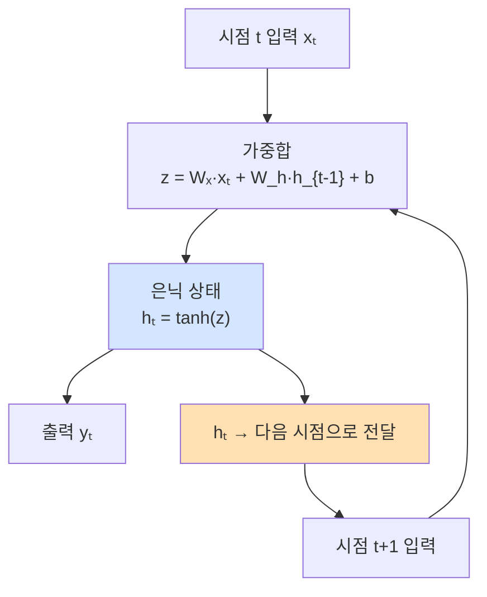
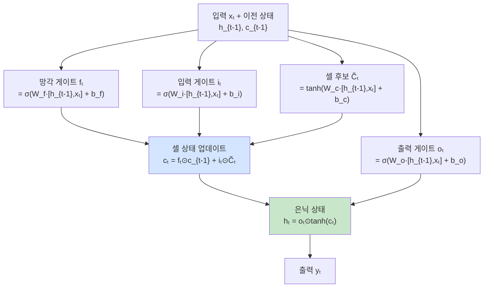
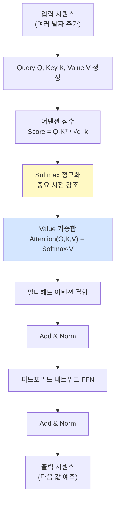
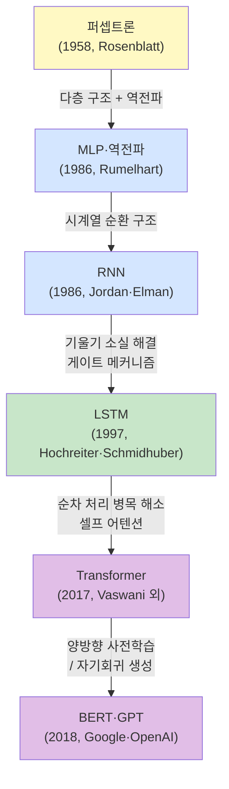
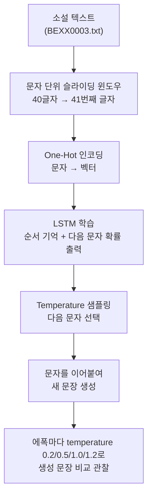

# 시계열 모델 기초: 주가 흐름을 읽는 모델들

> 오늘은 `RNN`, `LSTM`, `Transformer`를 무서운 이름이 아니라 "주가 흐름을 읽는 방법이 다른 모델들"로 이해하는 날입니다.

---

## 오늘의 목표

- 시계열 데이터가 왜 특별한지 이해합니다.
- `RNN`, `LSTM`, `Transformer`의 차이를 쉬운 비유로 구분합니다.
- 메인 허브에서 관련 챕터를 열어 시간 흐름을 읽는 감각을 익힙니다.

---

## 시계열이 뭐예요?

시계열은 **시간 순서대로 줄 세운 데이터**입니다.

예를 들면:

- 월요일 가격
- 화요일 가격
- 수요일 가격

이렇게 앞뒤 순서가 바뀌면 뜻이 달라지는 데이터입니다.

주가, 거래량, 환율, 예약률은 모두 시계열입니다.

---

## 세 친구를 아주 쉽게 나누면

| 모델 | 쉬운 비유 | 잘하는 일 |
|---|---|---|
| RNN | 차트를 하루씩 넘겨 보는 모델 | 바로 앞 흐름 기억하기 |
| LSTM | 중요한 급등락 구간에 표시해 두는 모델 | 더 긴 기억 붙잡기 |
| Transformer | 긴 차트를 한꺼번에 펴 놓고 중요한 날짜를 찾는 모델 | 멀리 떨어진 시점도 한 번에 보기 |

---

## 오늘의 낱말 4개

| 낱말 | 한자·영어 | 쉬운 뜻 |
|---|---|---|
| 시점 | 時點 / *time step* | 시간의 한 칸. 時(때 시)+點(점 점). 하루, 한 시간처럼 데이터가 쌓이는 시간 단위 |
| 문맥 | 文脈 / *context* | 앞뒤 흐름 전체. 文(글 문)+脈(맥 맥). 현재 값을 이해하려면 앞뒤 여러 시점을 함께 봐야 하는 이유 |
| 기억 | 記憶 / *memory* | 이전 정보가 다음 판단에 남는 것. 記(기록할 기)+憶(기억할 억). LSTM이 오래된 정보를 다음 계산에 전달하는 것 |
| attention | 注目 / *attention* | 중요한 곳에 더 눈길 주기. 注(쏟을 주)+目(눈 목). Transformer가 전체 시점 중 관련 높은 부분을 더 크게 반영하는 방식 |

---

## 오늘 열 페이지

- [메인 학습 허브](/)

추천 챕터:

- `chapter101` RNN
- `chapter102` LSTM
- `chapter103` Transformer

---

## 오늘의 20분 코스

| 시간 | 할 일 |
|---|---|
| 8분 | 이 문서에서 세 모델 비유를 읽습니다. |
| 6분 | [메인 학습 허브](/)에서 `chapter101`, `chapter102`, `chapter103` 설명을 차례로 읽습니다. |
| 6분 | 각 챕터의 `실행` 결과를 눌러 보고, 무엇을 기억하는 모델인지 한 줄씩 적습니다. |

---

## 웹앱 따라 하기

1. [메인 학습 허브](/)를 엽니다.
2. `chapter101`을 눌러 RNN 설명을 읽습니다.
3. 같은 방식으로 `chapter102`, `chapter103`도 엽니다.
4. 각 챕터에서 `실행` 버튼을 눌러 결과가 나온다는 것만 확인합니다.
5. 아래 표를 직접 채워봅니다.

| 모델 | 내가 이해한 한 줄 |
|---|---|
| RNN |  |
| LSTM |  |
| Transformer |  |

---

## 초등학생식 이해 포인트

- RNN: "조금 전 이야기를 들고 다음 칸으로 가는 모델"
- LSTM: "중요한 건 오래 기억하고 덜 중요한 건 잊는 모델"
- Transformer: "전체를 한꺼번에 보고 중요한 부분을 골라보는 모델"

---

## 관찰 미션

- 주가처럼 시간 흐름이 있는 데이터에 왜 순서가 중요할까요?
- RNN과 LSTM은 둘 다 순서대로 읽는데 뭐가 더 좋아졌나요?
- Transformer는 왜 "한 번에 보기"라는 말이 붙을까요?

---

## 한 줄 숙제

`시계열 모델은 숫자 하나보다 ________를 더 중요하게 본다.`

---

## 종목 · 지표 · 거시경제를 시계열로 보면

| 구분 | 시계열로 읽는 예시 | 왜 순서가 중요할까요? |
|---|---|---|
| 종목 | 현대차 종가가 월요일, 화요일, 수요일에 어떻게 바뀌었는지 | 수요일 가격은 앞의 이틀 흐름과 이어져 있기 때문입니다. |
| 기술 지표 | RSI가 45 → 55 → 68로 올라가는 흐름 | 숫자 하나보다 `점점 뜨거워지는 중인지`가 더 중요할 수 있습니다. |
| 거시경제 | 환율이 3주 연속 오르고 금리도 같이 오르는 흐름 | 시장 전체가 불안해지는 방향인지 함께 읽어야 하기 때문입니다. |

초등학생식으로 말하면,  
시계열 모델은 사진 1장만 보는 것이 아니라 **움직이는 만화책을 순서대로 읽는 모델**입니다.

---


## 알고리즘 처리 흐름 

### RNN 흐름



### LSTM 흐름



### Transformer Self-Attention 흐름



### 알고리즘 계보도 



---

## 모델 상세 참고 

| 모델 | 수학적 의미 | 탄생 배경 | 주식투자 활용 | 만든 사람/대표 GitHub |
|---|---|---|---|---|
| RNN | `h_t=f(W_xx_t+W_hh_{t-1}+b)` 구조로 짧은 문맥을 전달합니다. | 시퀀스 순서를 보존하는 학습이 필요해 신경망 연구에서 발전했습니다. | 단기 추세·모멘텀을 반영한 단기 방향 예측의 출발점 모델입니다. | Jeffrey Elman · <https://github.com/pytorch/pytorch> |
| LSTM | 입력/망각/출력 게이트로 셀 상태 `c_t`를 조절해 장기 의존성을 학습합니다. | RNN의 기울기 소실 문제를 해결하려고 1997년에 제안되었습니다. | 이벤트 전후 수주~수개월 흐름처럼 긴 의존 구간 예측에 유리합니다. | Sepp Hochreiter, Jürgen Schmidhuber · <https://github.com/pytorch/pytorch> |
| Transformer | 자기어텐션 `Attention(Q,K,V)=softmax(QK^T/√d)V`로 시점 간 중요도를 직접 계산합니다. | RNN의 순차 처리 병목을 줄이고 장거리 의존을 병렬로 학습하려고 등장했습니다. | 장기 패턴, 이벤트 구간 상호작용, 다변량 시계열 특징 추출에 강점이 있습니다. | Ashish Vaswani 외(Attention Is All You Need) · <https://github.com/huggingface/transformers> |

## 분야별 모델 쓰임새 및 적합도 

| 모델 | 데이터셋 형태 | 헬스케어 | 자율주행 | 주식투자 | 로봇 | AI Ops |
|---|---|---|---|---|---|---|
| RNN | 순서 있는 시계열·텍스트 시퀀스 | ECG·EEG 단기 신호 분류, 환자 상태 연속 모니터링 | 차량 단기 궤적 예측, 센서 시퀀스 처리 | 단기 추세·모멘텀 반영 방향 예측의 출발점 | 모션 시퀀스 학습, 반복 작업 순서 처리 | 로그 시퀀스 이상 감지, 메트릭 단기 추이 예측 |
| LSTM | 장기 시계열·텍스트·음성 데이터 | 장기 병세 진행 예측, 연속 혈당·산소포화도 모니터링 | 장기 주행 패턴 기억, 보행자 궤적 중장기 예측 | 이벤트 전후 수주~수개월 흐름 예측 | 복잡한 동작 시퀀스 기억, 장기 계획 수립 | 서비스 장기 성능 추이 이상 감지, 용량 계획 |
| Transformer | 텍스트·장기 시계열·이미지(ViT) | 의료 기록 NLP 분석, 게놈 서열 패턴 학습 | 다중 센서 융합, 장거리 교통 환경 인식 | 장기 패턴·이벤트 구간 상호작용 분석 | 자연어 명령 처리, 복잡 환경 맥락 이해 | 다변량 메트릭 이상 탐지, 로그 패턴 분류 |

## 모델 혼합 & 검증 아이디어 

RNN, LSTM, Transformer는 각각 **기억하는 범위와 방식**이 다릅니다.  
이 세 모델을 섞으면 단기·중기·장기 패턴을 모두 잡을 수 있습니다.

### 혼합 아이디어

| 혼합 방법 | 어떻게 섞나요? | 왜 좋을까요? |
|---|---|---|
| 멀티스케일 앙상블 | RNN으로 최근 5일 단기 신호, LSTM으로 최근 20일 중기 신호, Transformer로 최근 60일 장기 패턴을 잡아 세 출력을 평균 냄 | 짧은 모멘텀과 긴 추세를 동시에 반영할 수 있음 |
| 단계별 파이프라인 | Transformer로 중요 날짜(이벤트, 급등락)를 먼저 찾고, LSTM이 그 날짜 전후 흐름을 집중해서 학습 | 중요 구간을 먼저 선별하고 나서 시계열 학습을 하면 노이즈가 줄어듦 |
| 단기-장기 투표 | RNN 신호와 Transformer 신호가 모두 같은 방향일 때만 매수, 엇갈리면 관망 | 단기와 장기 관점이 일치할 때 신호 품질이 높음 |

### 검증 방법

- **워크포워드 검증**: 1개월씩 앞으로 이동하며 "이전 6개월 학습 → 다음 1개월 테스트"를 반복합니다. 시계열에서는 미래 정보가 섞이지 않도록 이 방법이 필수입니다.
- **구간별 성능 비교**: 상승장, 하락장, 횡보장 구간을 따로 나눠 각 모델이 어느 구간에서 더 잘 맞는지 비교합니다.
- **학습-검증 손실 곡선**: 학습 횟수(epoch)가 늘어날수록 학습 손실은 줄어드는데 검증 손실이 오히려 커지면 과적합이므로 주의합니다.
- **예측 오차 분석**: 큰 급등락 날에 세 모델이 각각 어떻게 틀렸는지 비교해, 어떤 모델이 이벤트 구간에 더 강한지 확인합니다.

> 아주 쉽게 말하면: RNN은 오늘 뉴스를, LSTM은 이번 달 흐름을, Transformer는 올해 큰 그림을 봅니다.  
> 세 가지를 함께 보면 더 넓은 시야를 가진 투자 판단을 할 수 있습니다.

---

## 웹앱 안쪽 들여다보기

### 시간 순서를 지키는 백엔드 습관
주가처럼 순서가 중요한 데이터는 섞어버리면 안 됩니다. 그래서 `/api/stock/analyze` 는 보통 이렇게 움직입니다.

- 먼저 과거에서 현재 순으로 정렬합니다.
- 앞쪽 80%를 학습용, 뒤쪽 20%를 확인용으로 나눕니다.
- 즉, **미래 구간을 먼저 보고 배우지 않도록** 막습니다.

### 화면에 그려지는 결과는 어디서 올까요?
서버는 예측이 끝나면 아래 같은 재료를 JSON으로 돌려줍니다.
- `signals`: 날짜별 매수/관망 같은 신호 표
- `portfolio`, `buyhold`: 전략 곡선과 그냥 보유 곡선
- `predicted_next_close`, `predicted_next_date`: 다음 값 예측

### 신경망을 고르면 무엇이 더 오나요?
`model="nn"` 으로 실행하면 응답에 `nn_viz` 가 함께 들어와 뉴런 연결 그림을 그릴 수 있습니다.

즉, 현재 웹앱이 RNN/LSTM/Transformer를 직접 학습하진 않아도, **시계열에서는 순서를 지키는 처리**를 가장 먼저 실천하고 있습니다.

---

## LSTM 텍스트 생성: 시계열 모델을 언어에 적용하기

LSTM은 주가 시계열뿐 아니라 **텍스트(문자·단어 시퀀스)** 에도 그대로 적용할 수 있습니다.  
문자 하나하나를 시점(time step)으로 보면, LSTM이 앞 문자들의 패턴을 기억하며 다음 문자를 예측합니다.

### 문자 단위 LSTM 언어 모델

```python
from tensorflow import keras
import numpy as np

# 텍스트를 40글자씩 잘라 입력, 41번째 글자가 정답
SEQ_LEN = 40
step    = 3

# 문자 → 정수 인덱스 변환
chars   = sorted(set(text))
char2id = {c: i for i, c in enumerate(chars)}

sequences, next_chars = [], []
for i in range(0, len(text) - SEQ_LEN, step):
    sequences.append(text[i:i + SEQ_LEN])
    next_chars.append(text[i + SEQ_LEN])

# one-hot 인코딩
X = np.zeros((len(sequences), SEQ_LEN, len(chars)), dtype=np.float32)
y = np.zeros((len(sequences), len(chars)), dtype=np.float32)
for i, seq in enumerate(sequences):
    for t, c in enumerate(seq):
        X[i, t, char2id[c]] = 1
    y[i, char2id[next_chars[i]]] = 1

# LSTM 모델 정의
model = keras.Sequential([
    keras.layers.LSTM(128, input_shape=(SEQ_LEN, len(chars))),
    keras.layers.Dense(len(chars), activation='softmax')
])
model.compile(optimizer='adam', loss='categorical_crossentropy')
model.fit(X, y, batch_size=128, epochs=20)
```

### Temperature 샘플링: 창의성 조절

학습된 모델로 문장을 생성할 때 **temperature**를 조절하면 생성 스타일이 달라집니다.

```python
def sample(preds, temperature=1.0):
    """확률 분포에서 다음 문자를 샘플링"""
    preds = np.asarray(preds).astype('float64')
    preds = np.log(preds) / temperature   # temperature로 분포 조절
    exp_preds = np.exp(preds)
    preds = exp_preds / np.sum(exp_preds)
    return np.random.choice(len(preds), p=preds)
```

| temperature 값 | 생성 특성 | 쉬운 비유 |
|---|---|---|
| 0.2 (낮음) | 가장 확률 높은 문자를 자주 선택 → 반복적·안전한 문장 | 모범 답안만 쓰는 학생 |
| 1.0 (기본) | 학습된 확률 분포 그대로 샘플링 | 보통 작성 |
| 1.5 (높음) | 낮은 확률 문자도 자주 선택 → 창의적·불규칙한 문장 | 자유롭게 창작하는 작가 |

### 주가 예측에 연결하면

LSTM 텍스트 생성의 원리를 주가 시계열에 그대로 연결할 수 있습니다.

| 텍스트 생성 | 주가 예측 |
|---|---|
| 앞 40개 문자 → 다음 문자 예측 | 앞 20일 가격·거래량 → 다음 날 등락 예측 |
| 문자 어휘 사전 (one-hot) | 종가·거래량·RSI 등 특성 벡터 |
| temperature로 다양성 조절 | 임계값(threshold)으로 신호 민감도 조절 |
| 에폭별 생성 문장 품질 변화 관찰 | 에폭별 검증 손실 변화로 학습 수렴 확인 |

### LSTM 텍스트 생성 흐름



> **핵심 포인트**: LSTM은 주가처럼 숫자 시퀀스뿐 아니라 텍스트 시퀀스에도 적용됩니다.  
> "앞 시점들을 기억해 다음 값을 예측한다"는 원리는 동일하며, 입력·출력 형태만 달라집니다.

---

## 심화 실습 1. KOSPI 시계열을 해부해 보기

시계열 모델을 바로 돌리기 전에, 먼저 데이터가 어떤 성격인지 살펴보면 해석이 훨씬 쉬워집니다.

| 먼저 볼 것 | 왜 볼까요? | 쉬운 해석 |
|---|---|---|
| 추세 | 시장이 장기적으로 오르는지 내리는지 | 큰 강물 방향 보기 |
| 계절성 | 반복되는 월별·요일별 패턴이 있는지 | 매년 비슷한 습관 보기 |
| 정상성 | 평균과 분산이 너무 크게 흔들리지 않는지 | 모델이 공부하기 쉬운 모양인지 |
| 자기상관 | 어제 흐름이 오늘에도 이어지는지 | 앞 장면이 다음 장면에 영향을 주는지 |

### KOSPI 기초 분석 흐름

1. `KS11` 지수나 관심 종목 종가를 가져옵니다.
2. 종가 그대로 보기보다 `pct_change()`로 수익률을 만듭니다.
3. 이동평균, 월별 평균 수익률, 자기상관을 같이 확인합니다.
4. "추세가 강한지", "반복 패턴이 있는지", "과거가 미래에 힌트를 주는지"를 정리합니다.

### 초급자 체크리스트

- 종가는 계속 우상향할 수 있어서 그대로 넣으면 모델이 속기 쉽습니다.
- 수익률로 바꾸면 상승·하락 폭을 더 공평하게 볼 수 있습니다.
- 월별 효과나 요일 효과는 "항상 통한다"가 아니라 "반복 경향이 있었는지"를 보는 참고 자료입니다.

### 추천 미니 과제

- 삼성전자와 SK하이닉스의 월별 평균 수익률을 비교해 봅니다.
- NAVER와 카카오의 상관계수를 구해 "같이 움직이는지" 적어봅니다.
- `chapter101` 또는 `chapter102`를 보기 전에, 먼저 수익률 그래프를 직접 그려 봅니다.

---

## 심화 실습 2. LSTM 입력은 어떻게 만들까요?

LSTM은 하루치 숫자 하나만 받지 않고, **최근 여러 날을 한 묶음 시퀀스**로 받습니다.  
이때 가장 중요한 준비 단계가 `슬라이딩 윈도우`입니다.

| 단계 | 하는 일 | 예시 |
|---|---|---|
| 1 | 특성 만들기 | 수익률, 거래량 비율, 변동성 |
| 2 | 최근 N일씩 묶기 | 최근 20일 데이터 → 입력 1개 |
| 3 | 다음 날 정답 붙이기 | 내일 상승=1, 하락=0 |
| 4 | 시간 순서 유지 분리 | 앞 80% 학습, 뒤 20% 테스트 |

### 왜 시퀀스 길이를 실험할까요?

- 너무 짧으면 최근 잡음만 보고 끝날 수 있습니다.
- 너무 길면 오래된 정보까지 끌고 와 오히려 흐려질 수 있습니다.
- 그래서 `10일`, `20일`, `30일`처럼 바꿔 보며 어느 길이가 잘 맞는지 비교합니다.

### LSTM 실습에서 같이 볼 포인트

- 방향 예측: 내일 오를지 내릴지 맞히기
- 회귀 예측: 내일 종가 숫자를 맞히기
- 신호 변환: 상승 확률이 `0.55` 이상이면 매수 같은 규칙 만들기

### 관련 실습 파일

| 챕터 | 주제 | 실행 방법 |
|---|---|---|
| [chapter101](../chapters/chapter101/practice.py) | RNN 기초 | `cd chapters/chapter101 && python practice.py` |
| [chapter102](../chapters/chapter102/practice.py) | LSTM 기초 | `cd chapters/chapter102 && python practice.py` |

### 추천 미니 과제

- 삼성전자와 SK하이닉스를 같은 윈도우 길이로 학습해 정확도를 비교합니다.
- `15일`, `20일`, `30일` 입력 중 어떤 길이가 더 안정적인지 적어봅니다.
- 확률 기준을 `0.55`, `0.65`로 바꿔 신호 횟수와 적중률이 어떻게 달라지는지 비교합니다.

---

## 심화 실습 3. Self-Attention 첫걸음

Transformer를 어렵게 느낄 필요는 없습니다.  
핵심은 **"최근 20일 중 어느 날이 오늘 예측에 중요했는지 점수로 매긴다"** 입니다.

| 구성 요소 | 쉬운 뜻 | 기억할 포인트 |
|---|---|---|
| Score | 날짜끼리 얼마나 관련 있는지 | 비슷하거나 강한 움직임에 점수 부여 |
| Softmax | 점수를 0~1 비중으로 바꾸기 | 모든 중요도 합이 1 |
| Context | 중요한 날짜를 더 많이 반영한 요약값 | "핵심 장면만 모아 본 결과" |
| Positional Encoding | 날짜 순서를 알려주는 장치 | Transformer도 순서를 알아야 함 |

### LSTM과 Attention의 차이

- LSTM: 앞에서 뒤로 순서대로 읽으며 기억을 전달합니다.
- Attention: 모든 날짜를 한 번에 펼쳐 놓고 중요한 날짜를 직접 고릅니다.

### 이런 날이 높은 Attention을 받기 쉽습니다

- 급등락이 컸던 날
- 거래량이 평소보다 많이 터진 날
- 최근 흐름을 바꾸는 전환점이 된 날

### 관련 실습 파일

| 챕터 | 주제 | 실행 방법 |
|---|---|---|
| [chapter103](../chapters/chapter103/practice.py) | Transformer 기초 | `cd chapters/chapter103 && python practice.py` |

### 추천 미니 과제

1. 삼성전자 수익률 20일 구간을 잡고, 어떤 날이 가장 중요할지 먼저 사람 눈으로 골라봅니다.
2. `chapter103` 실행 결과와 비교해 사람이 본 중요 날짜와 모델이 본 중요 날짜가 비슷한지 확인합니다.
3. 같은 방법으로 `KS11` 지수에도 적용해, 급락 구간이 높은 가중치를 받는지 살펴봅니다.
