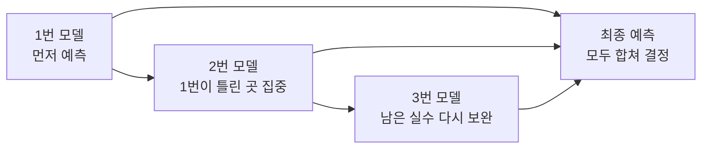

# 친구들이 돌아가며 실수 고치기: 부스팅, XGBoost, LightGBM

> 한 명이 계속 틀리면 끝이 아니에요. 다음 친구가 그 실수를 보고 더 잘 맞히면 됩니다.

---

## 왜 배우나요?

> 🌟 **초등학생도 알 수 있어요!**  
> 시험 문제를 풀 때 친구 1명만 답을 말하면 틀릴 수도 있어요.  
> 그런데 친구 A가 먼저 풀고, 친구 B는 A가 틀린 문제를 다시 보고, 친구 C는 아직도 틀린 문제를 또 고치면 점점 더 정답에 가까워지겠죠?  
> **부스팅(Boosting)**은 바로 이런 생각으로 만든 방법이에요.

주식 데이터도 마찬가지입니다.  
어제보다 오늘 오른 이유는 하나만 있는 게 아니라,

- 최근 며칠 동안 계속 올랐는지
- 거래량이 갑자기 늘었는지
- 5일 평균과 20일 평균의 위치가 어떤지

같은 여러 힌트를 함께 봐야 합니다.

부스팅은 이런 힌트를 보면서 **앞 모델의 실수를 뒤 모델이 조금씩 고쳐 가는 팀플레이 모델**입니다.

---

## 1. 앙상블이란?

앙상블은 **여러 모델이 힘을 합쳐 예측하는 방법**입니다.

쉽게 말해,

- 한 명이 찍는 것보다
- 여러 명이 함께 보고
- 마지막에 의견을 합치면
- 더 잘 맞을 가능성이 커집니다.

### 대표적인 세 가지

| 방법 | 쉬운 뜻 | 대표 모델 |
|------|------|------|
| **배깅** | 여러 친구가 따로 풀고 마지막에 다수결 | 랜덤 포레스트 |
| **부스팅** | 앞 친구의 실수를 다음 친구가 고침 | Gradient Boosting, XGBoost, LightGBM |
| **스태킹** | 여러 친구의 답을 다시 반장이 정리 | 여러 모델 조합 |

---

## 2. 부스팅은 어떻게 움직일까요?

부스팅은 **"틀린 문제를 다음 모델이 더 열심히 본다"**는 생각으로 움직입니다.

### 아주 쉬운 예시

내일 주가가 오를지 내릴지 맞히는 게임이 있다고 해봅시다.

| 날짜 | 실제 결과 | 1번 모델 | 2번 모델 | 3번 모델 |
|------|------|------|------|------|
| 월요일 | 상승 | 상승 | 상승 | 상승 |
| 화요일 | 하락 | 상승 ❌ | 하락 ✅ | 하락 ✅ |
| 수요일 | 상승 | 하락 ❌ | 상승 ✅ | 상승 ✅ |
| 목요일 | 하락 | 하락 ✅ | 하락 ✅ | 하락 ✅ |

여기서 중요한 점은:

1. **1번 모델**이 먼저 대충 예측합니다.
2. **2번 모델**은 1번 모델이 틀린 화요일, 수요일을 더 신경 씁니다.
3. **3번 모델**은 아직도 헷갈리는 부분을 다시 고칩니다.
4. 마지막에는 세 모델의 결과를 합쳐 더 나은 답을 만듭니다.

즉, 부스팅은 **같은 실수를 그냥 두지 않고 계속 보완하는 방식**입니다.



---

## 3. 주식 예측에서는 무엇을 볼까요?

웹앱과 아래 코드에서는 이런 힌트를 사용합니다.

| 힌트 | 뜻 | 쉬운 설명 |
|------|------|------|
| `ret` | 하루 수익률 | 오늘 가격이 어제보다 얼마나 달라졌나 |
| `ret_5` | 5일 수익률 | 최근 5일 동안 얼마나 올랐나 |
| `ma5` | 5일 이동평균 | 최근 5일 평균 가격 |
| `ma20` | 20일 이동평균 | 최근 20일 평균 가격 |
| `vol_ratio` | 거래량 비율 | 평소보다 사람이 많이 사고팔았나 |

예를 들어:

- `ret_5`가 크면 "최근 며칠 동안 힘이 좋았네?"
- `ma5 > ma20`이면 "짧은 기간 흐름이 더 강하네?"
- `vol_ratio`가 크면 "갑자기 관심이 몰렸네?"

처럼 생각할 수 있습니다.

---

## 4. 아주 작은 장난감 데이터로 먼저 보기

아래 코드는 진짜 주식 데이터가 없어도 돌아갑니다.  
숫자를 직접 만들고, 부스팅 모델이 어떻게 학습하는지 보는 첫 연습이에요.

```python
import numpy as np
import pandas as pd
from sklearn.ensemble import GradientBoostingClassifier
from sklearn.metrics import accuracy_score

np.random.seed(42)
days = 220

# 가짜 주가와 거래량 만들기
prices = 60000 + np.cumsum(np.random.randn(days) * 450)
volume = np.random.randint(5_000_000, 20_000_000, days)

df = pd.DataFrame({
    "close": prices,
    "volume": volume,
})

# 힌트(특성) 만들기
df["ret"] = df["close"].pct_change()
df["ret_5"] = df["close"].pct_change(5)
df["ma5"] = df["close"].rolling(5).mean()
df["ma20"] = df["close"].rolling(20).mean()
df["vol_ratio"] = df["volume"] / df["volume"].rolling(10).mean()

# 내일 오를지(1), 내릴지(0)
df["target"] = (df["close"].shift(-1) > df["close"]).astype(int)
df = df.dropna().reset_index(drop=True)

features = ["ret", "ret_5", "ma5", "ma20", "vol_ratio"]
X = df[features].values
y = df["target"].values

split = int(len(X) * 0.8)
X_train, X_test = X[:split], X[split:]
y_train, y_test = y[:split], y[split:]

model = GradientBoostingClassifier(
    n_estimators=80,   # 작은 모델 80개가 차례대로 협력
    learning_rate=0.05,
    max_depth=3,
    random_state=42,
)

model.fit(X_train, y_train)
pred = model.predict(X_test)
acc = accuracy_score(y_test, pred)

print(f"학습 데이터: {len(X_train)}개")
print(f"테스트 데이터: {len(X_test)}개")
print(f"정확도: {acc:.1%}")
```

### 출력 예시

```text
학습 데이터: 160개
테스트 데이터: 40개
정확도: 57.5%
```

여기서 `57.5%`는  
테스트 40개 중 약 23개 정도를 맞혔다는 뜻입니다.

완벽하진 않아도, **모델이 데이터의 패턴을 조금 배웠다**고 볼 수 있어요.

---

## 5. 핵심 조절 장치 3개

부스팅 모델에는 특히 중요한 손잡이 3개가 있습니다.

### `n_estimators`

- 작은 모델을 몇 명이나 불러올지 정하는 값
- 너무 적으면 도움을 많이 못 받고
- 너무 많으면 시간이 오래 걸리고 과하게 배울 수 있습니다

### `learning_rate`

- 한 번에 얼마나 조금씩 배울지 정하는 값
- 너무 크면 성급하게 배워 실수가 커질 수 있고
- 너무 작으면 배우는 속도가 너무 느립니다

### `max_depth`

- 각 작은 나무 모델이 얼마나 복잡하게 질문할지 정하는 값
- 너무 깊으면 학습 데이터만 외울 수 있습니다

### 쉬운 비유

| 설정 | 쉬운 비유 |
|------|------|
| `n_estimators` | 도와주는 친구 수 |
| `learning_rate` | 한 번에 고치는 양 |
| `max_depth` | 질문을 얼마나 깊게 파고드는지 |

---

## 6. XGBoost와 LightGBM은 뭐가 다른가요?

둘 다 **부스팅 가족**입니다.

### XGBoost

- 부스팅을 더 강력하고 빠르게 만든 유명한 도구
- 대회나 실무에서 아주 자주 사용됩니다

### LightGBM

- 많은 데이터에서도 빠르게 학습하도록 만든 도구
- 메모리도 아끼는 편이라 큰 데이터에 유리합니다

즉,

- **Gradient Boosting**: 부스팅 기본형
- **XGBoost**: 더 강력한 고급형
- **LightGBM**: 더 빠르고 가벼운 고급형

이라고 생각하면 쉽습니다.

---

## 7. XGBoost, LightGBM 코드도 맛보기

> 아래 코드는 라이브러리가 설치되어 있을 때만 돌아갑니다.  
> 웹앱 실습은 같은 가족인 **Gradient Boosting(GBM)** 으로 바로 체험할 수 있습니다.

### XGBoost

```python
try:
    from xgboost import XGBClassifier

    xgb = XGBClassifier(
        n_estimators=120,
        learning_rate=0.05,
        max_depth=4,
        random_state=42,
        verbosity=0,
    )
    xgb.fit(X_train, y_train)
    xgb_acc = accuracy_score(y_test, xgb.predict(X_test))
    print(f"XGBoost 정확도: {xgb_acc:.1%}")
except ImportError:
    print("XGBoost가 없으면 건너뛰어도 괜찮아요.")
```

### LightGBM

```python
try:
    from lightgbm import LGBMClassifier

    lgb = LGBMClassifier(
        n_estimators=150,
        learning_rate=0.05,
        num_leaves=31,
        random_state=42,
        verbose=-1,
    )
    lgb.fit(X_train, y_train)
    lgb_acc = accuracy_score(y_test, lgb.predict(X_test))
    print(f"LightGBM 정확도: {lgb_acc:.1%}")
except ImportError:
    print("LightGBM이 없으면 건너뛰어도 괜찮아요.")
```

---

## 8. 웹앱에서 바로 실습하기

이 문서는 읽기만 하면 금방 잊어버릴 수 있어요.  
아래 링크를 눌러 **브라우저에서 직접 실행하고 결과를 보는 것**까지 해보세요.

### 실습 1. 그래디언트 부스팅 결과 바로 보기

- [주식 AI 실험실에서 GBM 열기](/lab?chapter=chapter04&model=gbm&sample=samsung)

이 화면에서는 이미 삼성전자 샘플 데이터가 들어 있고,  
모델도 **그래디언트 부스팅(GBM)** 으로 맞춰져 있습니다.

#### 이렇게 해보세요

1. 페이지가 열리면 **실행** 버튼을 누릅니다.
2. 잠깐 기다리면 정확도, AUC, 예측 확률이 나옵니다.
3. 아래 차트와 중요 특성 표도 함께 봅니다.

#### 꼭 확인할 것

- `accuracy`: 맞힌 비율
- `auc`: 상승/하락을 얼마나 잘 구분하는지
- `pred_prob`: 마지막 날 기준 상승 확률
- `feature importance`: 어떤 힌트를 중요하게 봤는지

### 실습 2. 랜덤 포레스트와 비교하기

- [같은 데이터로 랜덤 포레스트 열기](/lab?chapter=chapter04&model=rf&sample=samsung)

부스팅이 좋은지, 랜덤 포레스트가 좋은지  
**같은 데이터로 모델만 바꿔서 비교**해보면 훨씬 잘 이해됩니다.

비교 질문:

- 어느 모델의 `accuracy`가 더 높은가요?
- 어느 모델의 `feature importance`가 더 다르게 나오나요?
- 예측 확률(`pred_prob`)은 얼마나 차이나나요?

### 실습 3. 내가 가진 CSV로 실험하기

- [예측 실험실 열기](/predict)

여기서는 CSV를 넣어서

- 그래디언트 부스팅
- 랜덤 포레스트
- 로지스틱 회귀
- 신경망

결과를 직접 비교할 수 있습니다.

---

## 9. 웹앱 결과는 어떻게 읽을까요?

웹앱 숫자를 그냥 보고 지나가면 아깝습니다.  
아래처럼 하나씩 질문하면서 보면 훨씬 잘 배웁니다.

### 1. 정확도만 보면 될까요?

아니에요.  
정확도는 중요하지만, **AUC**도 같이 봐야 합니다.

- 정확도: 몇 개 맞혔는가
- AUC: 상승과 하락을 얼마나 잘 구분했는가

### 2. 중요 특성은 왜 보나요?

예를 들어 `ret_5` 중요도가 높다면,

> "최근 5일 흐름이 내일 예측에 꽤 중요했구나!"

라고 해석할 수 있습니다.

### 3. 예측 확률은 어떻게 읽나요?

예를 들어 `pred_prob = 68.2`라면,

> "모델은 마지막 날 데이터를 보고 내일 오를 가능성을 68.2% 정도로 봤구나."

라고 읽으면 됩니다.

이 숫자는 **정답 약속**이 아니라  
모델의 **자신감 정도**라고 생각하면 좋아요.

---

## 10. 스스로 바꿔보면 더 잘 이해돼요

아래를 하나씩 바꿔보세요.

```python
model = GradientBoostingClassifier(
    n_estimators=30,
    learning_rate=0.1,
    max_depth=2,
    random_state=42,
)
```

그리고 다시:

- `n_estimators=150`
- `learning_rate=0.03`
- `max_depth=4`

처럼 바꾸어 보세요.

### 관찰 질문

1. 작은 모델 수가 늘면 정확도가 항상 올라가나요?
2. `learning_rate`가 너무 크면 결과가 불안정해지나요?
3. 깊이가 너무 깊으면 학습 데이터에만 잘 맞는 느낌이 드나요?

---

## 핵심 정리

- **앙상블**은 여러 모델이 힘을 합치는 방법입니다.
- **부스팅**은 앞 모델의 실수를 뒤 모델이 고쳐 가는 방식입니다.
- **Gradient Boosting**은 부스팅의 기본형입니다.
- **XGBoost, LightGBM**은 더 강력하거나 더 빠르게 만든 고급형입니다.
- 웹앱에서는 **GBM 실습**으로 부스팅의 핵심 원리를 직접 확인할 수 있습니다.

---

## 실습 과제

```python
# 과제: 삼성전자, 카카오, NAVER 3개 종목 비교하기
# 1) 종목별로 가짜 가격과 거래량을 만든다.
# 2) ret, ret_5, ma5, ma20, vol_ratio를 만든다.
# 3) Gradient Boosting으로 각각 학습한다.
# 4) 정확도를 표로 비교한다.
# 5) 어떤 종목이 가장 예측이 쉬웠는지 이유를 적는다.

stocks = {
    "삼성전자": {"base": 70000,  "vol": 450},
    "카카오":   {"base": 45000,  "vol": 700},
    "NAVER":    {"base": 220000, "vol": 1200},
}

# 나머지를 채워보세요!
```

---

## 관련 실습 파일

| 종류 | 바로가기 | 설명 |
|------|------|------|
| 문서와 이어지는 앙상블 기초 | [chapter08](/api/chapters/chapter08/source/raw) | 여러 트리의 다수결인 랜덤 포레스트를 먼저 익힐 수 있어요. |
| 웹앱 부스팅 실습 | [주식 AI 실험실 GBM](/lab?chapter=chapter04&model=gbm&sample=samsung) | 실행 버튼을 누르면 결과와 차트를 바로 볼 수 있어요. |
| 모델 비교 실습 | [예측 실험실](/predict) | CSV를 넣고 여러 모델 결과를 비교할 수 있어요. |

---

➡️ [다음 문서: 비슷한 주식끼리 묶기: 클러스터링](05.md) 에서 계속됩니다.
