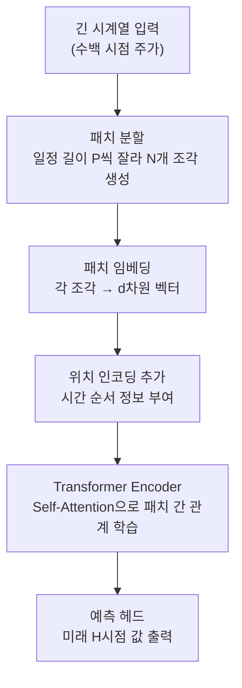
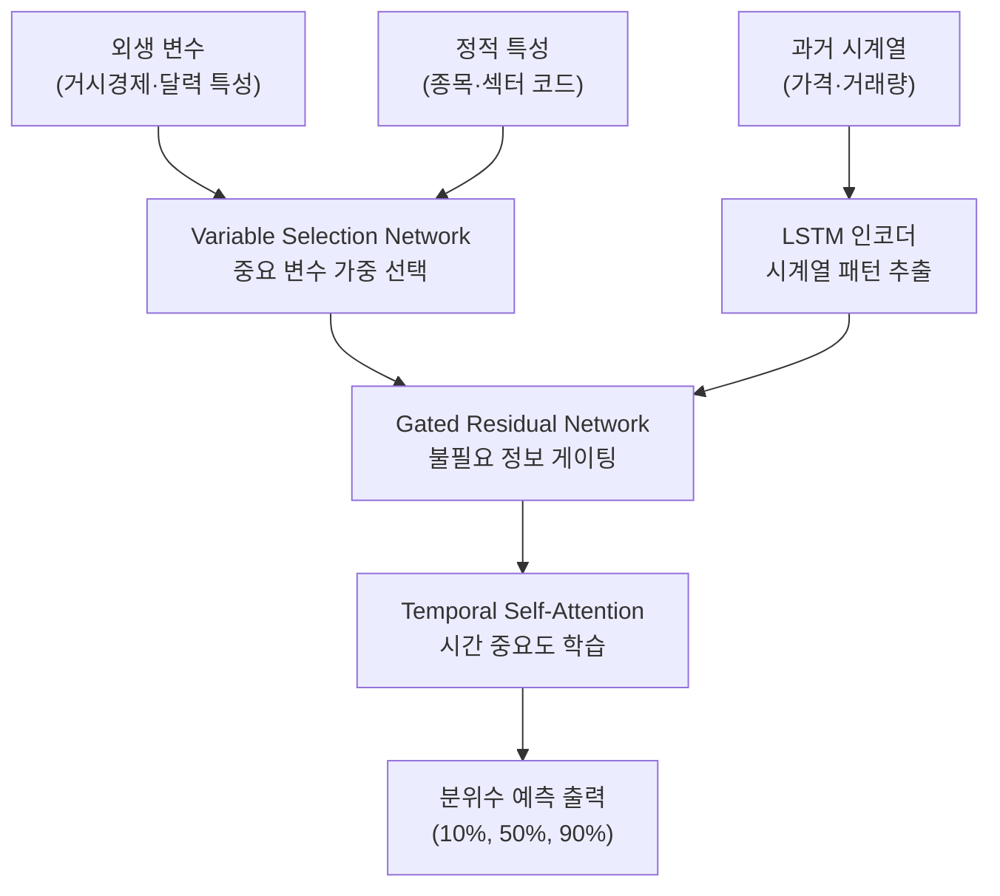
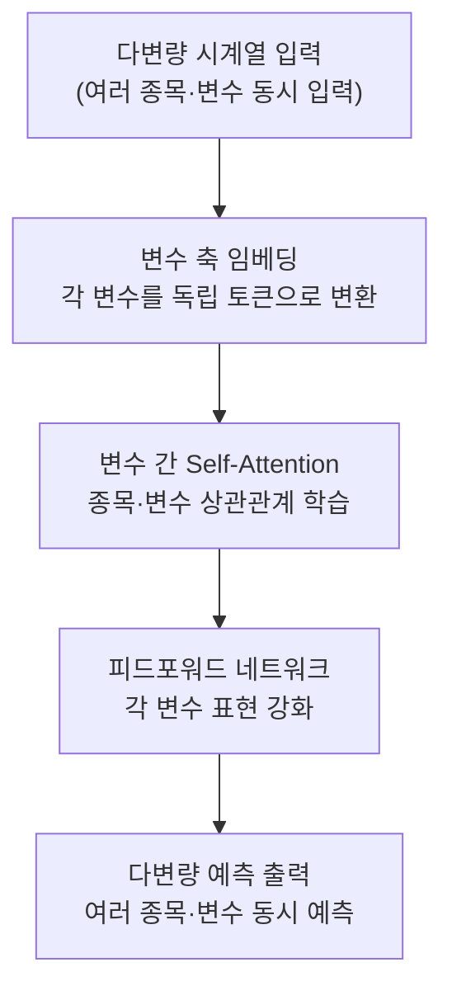

# Day 4. 최신 시계열 모델: 더 똑똑하게 차트를 읽는 법

> 오늘은 `PatchTST`, `TFT`, `iTransformer`를 아주 깊게 구현하기보다, "무엇을 더 잘 보려고 만든 모델인가?"를 이해하는 날입니다.

---

## 오늘의 목표

- 최신 시계열 모델 이름을 덜 무섭게 느끼게 합니다.
- 각 모델이 어떤 힌트에 강한지 감을 잡습니다.
- 웹앱에서 "여러 힌트를 함께 보는 문제"를 체험할 준비를 합니다.

---

## 아주 쉽게 나누면

| 모델 | 쉬운 그림 | 잘하는 일 |
|---|---|---|
| PatchTST | 긴 주가 차트를 며칠씩 잘라 읽기 | 긴 차트를 조각으로 보기 |
| TFT | 가격, 거래량, 계절을 같이 읽기 | 여러 힌트를 함께 보기 |
| iTransformer | 여러 종목 관계를 함께 보기 | 변수끼리 연결 읽기 |

---

## 오늘의 낱말 4개

| 낱말 | 한자·영어 | 쉬운 뜻 |
|---|---|---|
| patch | 패치 / *patch* | 조각. 긴 시계열을 일정 길이로 잘라낸 하나의 데이터 덩어리 |
| fusion | 融合 / *fusion* | 여러 힌트를 합치기. 融(녹을 융)+合(합할 합). 여러 입력 정보를 하나의 벡터로 섞는 과정 |
| variable | 變數 / *variable* | 바뀌는 입력값 하나. 變(바뀔 변)+數(셀 수). 모델이 입력으로 받는 각각의 특성(예: 종가, 거래량) |
| multivariate | 多變量 / *multivariate* | 여러 입력을 함께 쓰는 것. 多(많을 다)+變量(변하는 양). 단일 변수가 아닌 여러 특성을 동시에 넣어 예측하는 방식 |

---

## 왜 이런 모델이 나왔을까요?

기본 Transformer도 똑똑하지만, 시계열 문제에서는 더 보고 싶은 것이 있습니다.

- 긴 구간을 더 편하게 읽고 싶다
- 가격 말고 거래량, 계절, 이벤트도 같이 보고 싶다
- 종목 여러 개가 함께 움직이는 관계도 보고 싶다

그래서 시계열용 Transformer 가족이 생겼다고 생각하면 쉽습니다.

---

## 오늘 열 페이지

- [메인 학습 허브](/)
- [주가 예측 타겟팅 실험실](/predict)
- [호텔-주가 실험실](/hotel-stock)

---

## 오늘의 20분 코스

| 시간 | 할 일 |
|---|---|
| 8분 | 이 문서에서 세 모델 차이를 읽습니다. |
| 5분 | [메인 학습 허브](/)에서 `chapter103` 설명을 다시 봅니다. |
| 4분 | [주가 예측 타겟팅 실험실](/predict)에서 PatchTST/iTransformer 대응 예시 카드를 읽습니다. |
| 3분 | [호텔-주가 실험실](/hotel-stock)에서 TFT 대응 멀티팩터 예시를 확인합니다. |

---

## 웹앱 따라 하기

1. [메인 학습 허브](/)에서 `chapter103`을 열어 attention 개념을 다시 봅니다.
2. [주가 예측 타겟팅 실험실](/predict)로 이동해 `Transformer 계열 투자 예시 가이드`를 읽습니다.
3. PatchTST는 긴 차트, iTransformer는 여러 종목 비교에 닿아 있다는 설명을 확인합니다.
4. 이어서 [호텔-주가 실험실](/hotel-stock)로 이동해 `Transformer 계열 주식 예시 매핑`을 봅니다.
5. 계절성, 신호, 혼동 행렬 같은 탭 이름을 읽으며 TFT식 멀티팩터 입력을 연결합니다.

오늘은 결과 숫자를 다 외우지 않아도 됩니다.  
중요한 것은 **"한 가지 힌트만 보는 문제가 아니구나"**를 느끼는 것입니다.

## 현재 웹앱에 있는 Transformer 계열 예시

현재 웹앱은 PatchTST/TFT/iTransformer를 전용 모델 버튼으로 직접 학습시키지는 않습니다.  
대신 아래처럼 **투자 상황 예시**로 연결되어 있습니다.

| 모델 | 현재 웹앱 대응 화면 | 투자 예시 |
|---|---|---|
| PatchTST | [/predict](/predict) | 6~12개월 단일 종목 CSV를 올려 장기 추세, 모멘텀, 변동성 특성이 어떻게 읽히는지 비교 |
| TFT | [/hotel-stock](/hotel-stock) | 실적·레짐·가격 파생 특성을 함께 넣어 외생 변수까지 반영하는 멀티팩터 투자 판단 |
| iTransformer | [/predict](/predict), [/hotel-stock](/hotel-stock) | 여러 종목을 같은 날짜축으로 비교하거나 업종별 반응 차이를 함께 해석 |

---

## 관찰 미션

- 가격 말고 또 어떤 힌트가 필요할 것 같나요?
- 계절이나 이벤트가 주가와 함께 움직일 수 있을까요?
- 여러 힌트를 한 번에 보는 모델이 왜 필요할까요?

---

## 한 줄 숙제

`최신 시계열 모델은 긴 흐름과 ________를 함께 보기 위해 발전했다.`

---

## 최신 모델이 잘 보려고 하는 힌트 예시

### 종목 예시

반도체주는 실적 발표 전후로 갑자기 움직일 수 있습니다.  
이때 모델은 하루치 가격만 보는 것보다 **발표 전 몇 주 흐름**을 같이 보는 편이 더 좋습니다.

### 기술 지표 예시

모델이 같이 볼 수 있는 힌트:

- 가격
- 거래량
- 5일 이동평균
- 20일 이동평균
- RSI

이처럼 여러 신호를 한 번에 보면 "그냥 올랐다"보다  
"거래량까지 붙은 상승인지"를 더 잘 구분할 수 있습니다.

### 거시경제 예시

자동차주를 본다고 해봅시다.

- 환율 상승
- 유가 하락
- 금리 동결

같은 거시경제 힌트도 함께 보면  
기업 뉴스만 볼 때보다 더 넓은 그림을 읽을 수 있습니다.

---

## 알고리즘 처리 흐름 (Day 4)

### PatchTST 흐름

### TFT (Temporal Fusion Transformer) 흐름

### iTransformer 흐름

---

## 모델 상세 참고 (Day 4)

| 모델 | 수학적 의미 | 탄생 배경 | 주식투자 활용 | 만든 사람/대표 GitHub |
|---|---|---|---|---|
| PatchTST | 긴 시계열을 패치 토큰으로 분할해 Transformer attention으로 학습합니다. | 긴 입력에서 계산량을 줄이면서 정보 손실을 최소화하려고 제안되었습니다. | 장기 가격 흐름(수백 시점) 예측, 멀티호라이즌 수익률 예측에 적합합니다. | Yuqi Nie 외 · <https://github.com/yuqinie98/PatchTST> |
| TFT (Temporal Fusion Transformer) | 정적/과거/미래 공변량을 게이팅·어텐션으로 융합해 예측합니다. | 실제 산업 데이터의 다중 입력(달력/외생변수) 반영 필요에서 등장했습니다. | 가격+거래량+거시지표+달력 특성을 함께 넣는 투자 예측에 강합니다. | Bryan Lim 외 · <https://github.com/google-research/google-research/tree/master/tft> |
| iTransformer | 시점 축 대신 변수 축 중심 attention으로 다변량 상관관계를 강화합니다. | 변수 수가 많은 시계열에서 변수 간 관계를 더 잘 포착하려는 목적입니다. | 섹터·멀티자산 동시 예측처럼 변수 상호영향이 큰 문제에 유리합니다. | THUML 연구팀 · <https://github.com/thuml/iTransformer> |

## 분야별 모델 쓰임새 및 적합도 (Day 4)

| 모델 | 데이터셋 형태 | 헬스케어 | 자율주행 | 주식투자 | 로봇 | AI Ops |
|---|---|---|---|---|---|---|
| PatchTST | 장기 단변량·다변량 시계열(수백 시점 이상) | 웨어러블 장기 생체신호 예측, 환자 장기 모니터링 | 장거리 주행 패턴 예측, 장기 센서 신호 분석 | 장기 가격 흐름·멀티호라이즌 수익률 예측 | 장기 동작 계획, 환경 변화 장기 예측 | 서버 부하 장기 예측, SLA 이상 사전 감지 |
| TFT | 다변량 시계열 + 외생변수(달력·이벤트 포함) | 복약 순응도·입원 수요 예측, 외부 변수 반영 | 날씨·교통 외생변수 통합 주행 패턴 예측 | 가격·거래량·거시지표·달력 특성 통합 예측 | 다중 센서·외부 환경 융합 동작 예측 | 트래픽 + 이벤트 결합 장애 예측, 운영 계획 |
| iTransformer | 변수 수가 많은 다변량 시계열 데이터 | 다중 생체신호(ECG·SpO₂·혈압) 동시 분석 | 다중 센서 채널 간 상관관계 학습 | 섹터·멀티자산 동시 예측, 변수 간 영향 해석 | 다관절 로봇 다변량 상태 동시 분석 | 다중 메트릭 동시 이상 감지, 상관 장애 탐지 |

## 모델 혼합 & 검증 아이디어 (Day 4)

PatchTST, TFT, iTransformer는 각각 **"어디를 어떻게 보는가"**가 다릅니다.  
주식 투자 솔루션에서 세 모델을 역할별로 나눠 섞으면 강력한 파이프라인이 됩니다.

### 혼합 아이디어

| 혼합 방법 | 어떻게 섞나요? | 왜 좋을까요? |
|---|---|---|
| 역할 분담 앙상블 | PatchTST로 단일 종목 장기 가격 패턴을 읽고, TFT로 거시경제·계절성 외생변수를 함께 반영하고, iTransformer로 여러 종목 간 상관관계를 잡아 세 신호를 가중 평균 | 각 모델이 서로 다른 "창문"으로 시장을 보기 때문에 정보 손실이 줄어듦 |
| 순차 필터링 | iTransformer로 섹터 내 강세 종목 후보를 먼저 고르고, TFT로 선택된 후보의 외생변수 반응을 추가 분석 | 종목 선별과 상세 분석을 단계별로 나눠 효율이 높아짐 |
| 확률 합의 방식 | 세 모델 중 2개 이상이 "상승" 신호를 낼 때만 매수, 1개 이하면 관망 | 다수결로 거짓 신호를 걸러냄 |

### 검증 방법

- **롤링 윈도우 검증**: 고정된 크기의 학습 창(예: 180일)을 1주일씩 앞으로 밀면서 반복 검증합니다. 시계열 데이터의 분포 변화를 자연스럽게 반영합니다.
- **외생변수 민감도 분석**: 금리, VIX, 환율 같은 거시 변수를 하나씩 빼봐서 어떤 변수가 모델에 가장 큰 영향을 미치는지 확인합니다.
- **다변량 예측 오차 분해**: 전체 예측 오차 중 "단일 가격 패턴"에서 오는 오차와 "외생변수"에서 오는 오차를 분리해 각 모델의 기여를 파악합니다.
- **멀티호라이즌 검증**: 1일 후, 5일 후, 20일 후 예측을 각각 따로 평가해 모델이 어느 기간 예측에 더 강한지 비교합니다.

> 아주 쉽게 말하면: PatchTST는 차트 패턴 전문가, TFT는 경제 날씨 전문가, iTransformer는 종목 관계 전문가입니다.  
> 세 전문가의 의견을 모아 종합 판단을 내리면 혼자 판단하는 것보다 더 믿을 수 있습니다.

---

## 웹앱 안쪽 들여다보기

### 여러 힌트를 같이 보는 데이터셋 API
데이터셋 허브는 아래 주소로 움직입니다.
- `GET /api/datasets` : 어떤 CSV가 있는지 목록 보기
- `GET /api/datasets/{id}` : 열 이름, 미리보기, 차트 힌트 보기
- `GET /api/datasets/{id}/adapted/stock-lab` : 주식 AI 실험실 형식으로 자동 변환

특히 `chart_hint` 는 이 데이터를 `timeseries`, `scatter`, `bar` 중 어떤 그림으로 읽으면 좋은지 알려줍니다.

### 호텔-주가 실험실은 어떤 입력을 함께 볼까요?
`POST /api/hotel-stock/train` 은 단일 주가만 보지 않고 아래 묶음을 같이 봅니다.
- 호텔 예약률 특성 30개
- 계절성 특성 4개
- 가격 파생 특성 7개

그래서 Day 4에서 말한 “여러 힌트를 한 번에 보기”가 웹앱에서는 실제 특성 묶음으로 구현됩니다.

---

## 심화 실습 1. Transformer 파이프라인을 큰 그림으로 보기

Transformer 계열 모델은 이름은 복잡하지만 흐름은 비교적 일정합니다.

1. 가격·거래량 같은 특성을 만듭니다.
2. 각 날짜를 벡터로 바꿉니다.
3. 날짜 순서를 알려주는 `Positional Encoding`을 더합니다.
4. `Self-Attention`으로 중요한 날짜끼리 연결합니다.
5. 마지막 표현으로 상승/하락이나 미래 값을 예측합니다.

### 꼭 기억할 4개 부품

| 부품 | 역할 |
|---|---|
| Positional Encoding | 날짜 순서 정보 추가 |
| Multi-Head Attention | 여러 관점에서 중요 날짜 계산 |
| Feed-Forward | 비선형 패턴 강화 |
| Residual Connection | 깊은 네트워크 안정화 |

### LSTM 스타일과 비교하면

- LSTM 스타일: 최근 흐름을 순서대로 누적해 기억
- Transformer 스타일: 멀리 떨어진 시점도 바로 연결
- 따라서 이벤트 전후나 긴 구간 패턴에서는 Transformer 설명이 더 직관적일 수 있습니다.

---

## 심화 실습 2. PatchTST는 왜 조각으로 읽을까요?

PatchTST는 하루를 한 토큰으로 보지 않고, **며칠치 묶음 자체를 하나의 패턴**으로 봅니다.

| 개념 | 쉬운 뜻 | 실전 감각 |
|---|---|---|
| Patch | 5일, 7일 같은 짧은 구간 조각 | "3일 연속 상승" 같은 패턴 묶음 |
| Stride | 다음 조각으로 얼마나 이동할지 | 1이면 촘촘, 2면 조금 띄엄띄엄 |
| Patch Attention | 조각끼리 중요도 계산 | 어떤 구간 패턴이 지금과 닮았는지 보기 |

### 언제 유리할까요?

- 장기 차트에서 반복되는 패턴을 찾고 싶을 때
- 하루 단위 잡음보다 며칠 묶음 추세를 보고 싶을 때
- 종목별로 "패턴이 읽히는 정도"를 비교하고 싶을 때

### 추천 실험

- 삼성전자와 SK하이닉스를 같은 `patch_len`으로 비교합니다.
- `patch_len=5`, `stride=2`와 `patch_len=10`, `stride=5`를 바꿔 봅니다.
- 어느 설정에서 더 안정적인 정확도가 나오는지 기록합니다.

### 관련 실습 파일

| 챕터 | 주제 | 실행 방법 |
|---|---|---|
| [chapter104](../chapters/chapter104/practice.py) | PatchTST 기초 | `cd chapters/chapter104 && python practice.py` |

---

## 심화 실습 3. Multi-Head Attention과 종목 관계 읽기

Multi-Head Attention은 "중요 날짜를 여러 방식으로 본다"는 뜻입니다.

| 헤드가 볼 수 있는 관점 | 예시 |
|---|---|
| 단기 모멘텀 | 최근 3~5일 급등·급락 |
| 거래량 이상 | 평소보다 거래가 크게 늘어난 날 |
| 장기 추세 | 이동평균이 꺾이거나 이어지는 흐름 |
| 노이즈 분리 | 중요하지 않은 흔들림 구분 |

### 종목 간 관계 분석에 왜 좋을까요?

- 삼성전자와 SK하이닉스처럼 함께 움직이는 종목은 비슷한 attention 패턴이 나올 수 있습니다.
- 반도체와 IT 서비스처럼 성격이 다른 종목군은 헤드별 반응이 달라질 수 있습니다.
- ETF와 개별 종목을 비교하면, 어떤 쪽이 더 매끄럽고 예측하기 쉬운지도 볼 수 있습니다.

### 관련 실습 파일

| 챕터 | 주제 | 실행 방법 |
|---|---|---|
| [chapter103](../chapters/chapter103/practice.py) | Transformer 기초 | `cd chapters/chapter103 && python practice.py` |
| [chapter105](../chapters/chapter105/practice.py) | Multi-Head Attention | `cd chapters/chapter105 && python practice.py` |

### 추천 미니 과제

1. 삼성전자, SK하이닉스, 카카오, NAVER를 두 섹터로 나눠 attention 패턴 차이를 적어봅니다.
2. 헤드 수를 `2`, `4`, `8`로 바꿔 어떤 설정이 가장 해석하기 쉬운지 비교합니다.
3. "헤드가 많을수록 무조건 좋은가?"를 직접 실험 결과로 판단해 봅니다.
