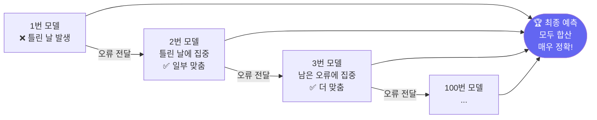

# 팀플레이 예측: XGBoost & LightGBM

> 여러 모델이 협력할수록 예측이 더 정확해집니다.

---

## 1. 앙상블이란?

앙상블은 **여러 모델이 힘을 합쳐 예측하는 방법**입니다.

- 친구 1명이 퀴즈 맞추는 것보다 친구 100명이 다수결로 결정하면 더 잘 맞습니다.
- 마찬가지로 여러 모델의 예측을 합치면 더 좋은 결과가 나옵니다.

### 종류

| 방법 | 설명 | 대표 모델 |
|------|------|---------|
| **배깅** | 여러 모델을 독립적으로 학습 → 평균 | 랜덤 포레스트 |
| **부스팅** | 이전 모델의 실수를 다음 모델이 보완 | **XGBoost, LightGBM** |
| **스태킹** | 모델들의 예측을 또 다른 모델이 학습 | - |

---

## 2. 부스팅 — 실수를 보완하며 성장하기

부스팅은 **이전 모델이 틀린 부분에 집중**해서 다음 모델을 학습합니다.



---

## 3. 주식 데이터 준비

```python
import pandas as pd
import numpy as np
from sklearn.ensemble import GradientBoostingClassifier
from sklearn.metrics import accuracy_score
from sklearn.preprocessing import StandardScaler
import matplotlib.pyplot as plt

np.random.seed(42)
days = 500

# 삼성전자 주가 시뮬레이션
prices = 60000 + np.cumsum(np.random.randn(days) * 500)
volume = np.random.randint(5000000, 20000000, days)

df = pd.DataFrame({'close': prices, 'volume': volume})

# 다양한 특성 계산
df['ret']       = df['close'].pct_change()
df['ret_5']     = df['close'].pct_change(5)           # 5일 수익률
df['ma5']       = df['close'].rolling(5).mean()
df['ma20']      = df['close'].rolling(20).mean()
df['vol_ma5']   = df['volume'].rolling(5).mean()
df['vol_ratio'] = df['volume'] / df['vol_ma5']        # 거래량 평균 대비 비율
df['cross']     = (df['ma5'] > df['ma20']).astype(int) # 골든크로스 여부

# 내일 오를지(1) 내릴지(0)
df['target'] = (df['close'].shift(-1) > df['close']).astype(int)
df = df.dropna()

features = ['ret', 'ret_5', 'ma5', 'ma20', 'vol_ratio', 'cross']
X = df[features].values
y = df['target'].values

split = int(len(X) * 0.8)
X_train, X_test = X[:split], X[split:]
y_train, y_test = y[:split], y[split:]

print(f"학습: {len(X_train)}일, 테스트: {len(X_test)}일")
```

---

## 4. XGBoost — 강력한 부스팅

XGBoost는 부스팅을 빠르고 강력하게 만든 라이브러리입니다.

```python
try:
    from xgboost import XGBClassifier
    has_xgb = True
except ImportError:
    has_xgb = False
    print("XGBoost가 없습니다. pip install xgboost 로 설치하세요.")

if has_xgb:
    xgb = XGBClassifier(
        n_estimators=200,    # 모델 200개 사용
        learning_rate=0.05,  # 학습 속도 (작을수록 꼼꼼히 배움)
        max_depth=4,         # 각 트리의 깊이
        random_state=42,
        verbosity=0,
    )
    xgb.fit(X_train, y_train)
    xgb_acc = accuracy_score(y_test, xgb.predict(X_test))
    print(f"XGBoost 정확도: {xgb_acc:.1%}")
```

---

## 5. LightGBM — 더 빠른 부스팅

LightGBM은 XGBoost보다 **더 빠르고 메모리를 적게 씁니다**.
대용량 주식 데이터를 다룰 때 특히 유리합니다.

```python
try:
    from lightgbm import LGBMClassifier
    has_lgb = True
except ImportError:
    has_lgb = False
    print("LightGBM이 없습니다. pip install lightgbm 으로 설치하세요.")

if has_lgb:
    lgb = LGBMClassifier(
        n_estimators=300,
        learning_rate=0.03,
        num_leaves=31,       # 나뭇잎(끝 노드) 개수
        min_child_samples=20,
        random_state=42,
        verbose=-1,
    )
    lgb.fit(X_train, y_train)
    lgb_acc = accuracy_score(y_test, lgb.predict(X_test))
    print(f"LightGBM 정확도: {lgb_acc:.1%}")
```

---

## 6. Gradient Boosting — 기본 부스팅 (sklearn)

XGBoost나 LightGBM이 없을 때 scikit-learn의 기본 버전을 씁니다.

```python
from sklearn.ensemble import GradientBoostingClassifier

gb = GradientBoostingClassifier(
    n_estimators=200,
    learning_rate=0.05,
    max_depth=4,
    random_state=42,
)
gb.fit(X_train, y_train)
gb_acc = accuracy_score(y_test, gb.predict(X_test))
print(f"Gradient Boosting 정확도: {gb_acc:.1%}")
```

---

## 7. 학습 속도 비교

```python
# n_estimators(모델 수)에 따른 성능 변화
estimators_list = [10, 30, 50, 100, 150, 200, 300]
gb_accs = []

for n in estimators_list:
    m = GradientBoostingClassifier(
        n_estimators=n, learning_rate=0.05,
        max_depth=4, random_state=42,
    )
    m.fit(X_train, y_train)
    acc = accuracy_score(y_test, m.predict(X_test))
    gb_accs.append(acc)

plt.figure(figsize=(8, 4))
plt.plot(estimators_list, gb_accs, 'purple', marker='o', linewidth=2)
plt.xlabel('모델 개수 (n_estimators)')
plt.ylabel('테스트 정확도')
plt.title('모델이 많아질수록 정확도가 올라갑니다')
plt.tight_layout()
plt.savefig('boosting_curve.png', dpi=120)
print("저장: boosting_curve.png")
```

---

## 8. 학습 속도 (learning_rate) 실험

```python
lr_values = [0.001, 0.01, 0.05, 0.1, 0.3, 0.5]
lr_accs   = []

for lr in lr_values:
    m = GradientBoostingClassifier(
        n_estimators=100, learning_rate=lr,
        max_depth=4, random_state=42,
    )
    m.fit(X_train, y_train)
    lr_accs.append(accuracy_score(y_test, m.predict(X_test)))

plt.figure(figsize=(8, 4))
plt.semilogx(lr_values, lr_accs, 'orange', marker='s', linewidth=2)
plt.xlabel('학습 속도 (learning_rate)')
plt.ylabel('테스트 정확도')
plt.title('학습 속도가 너무 크거나 작으면 성능이 떨어집니다')
plt.tight_layout()
plt.savefig('learning_rate.png', dpi=120)
print("저장: learning_rate.png")
```

---

## 9. 특성 중요도

```python
feature_names = ['수익률', '5일수익률', '5일평균', '20일평균', '거래량비율', '골든크로스']
importance = pd.Series(gb.feature_importances_, index=feature_names).sort_values(ascending=True)

plt.figure(figsize=(8, 4))
importance.plot.barh(color='purple')
plt.xlabel('중요도')
plt.title('Gradient Boosting 특성 중요도')
plt.tight_layout()
plt.savefig('gb_importance.png', dpi=120)
print("저장: gb_importance.png")
print("\n중요도 순위:")
print(importance.sort_values(ascending=False).round(3))
```

---

## 핵심 정리

- **부스팅**: 이전 모델의 실수를 다음 모델이 보완하며 점점 정확해지는 방법
- **학습 속도**: 너무 크면 성급히 배워 실수, 너무 작으면 너무 느림 — 보통 0.01~0.1
- **모델 수**: 많을수록 좋지만 일정 수준 이상이면 효과가 줄어듦
- **XGBoost, LightGBM**: 실무에서 가장 많이 쓰이는 강력한 예측 도구

## 실습 과제

```python
# 과제: 여러 종목에 Gradient Boosting 적용
# 1) 삼성전자, 카카오, NAVER 각각 300일치 주가 만들기
# 2) 동일한 특성(ret, ma5, ma20, vol_ratio)으로 각각 학습
# 3) 세 종목의 예측 정확도 비교 막대 그래프 그리기
# 4) 어느 종목이 가장 예측하기 쉬운지 분석

종목들 = {
    '삼성전자': (60000, 500),
    '카카오':  (40000, 300),
    'NAVER':  (150000, 1000),
}
# 나머지를 채워보세요!
```

## 관련 실습 파일

| 챕터 | 주제 | 실행 방법 |
|------|------|---------|
| [chapter09](/api/chapters/chapter09/source/raw) | 앙상블 실습 | `POST /api/chapters/chapter09/run` |
| [chapter110](/api/chapters/chapter110/source/raw) | XGBoost 실습 | `POST /api/chapters/chapter110/run` |

---

➡️ [Day 034 — 비슷한 주식끼리 묶기: 클러스터링](20.md) 에서 계속됩니다.
