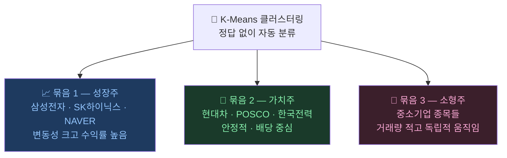
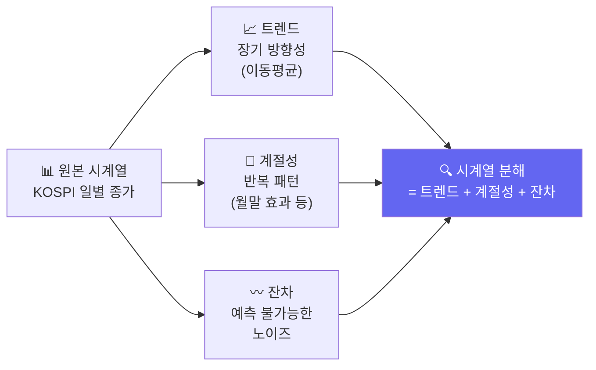

# 비슷한 주식끼리 묶기: 클러스터링

> 개발자의 질문: "삼성전자랑 LG전자는 비슷한 종목일까요?"
> 컴퓨터에게 주식 데이터를 주면 스스로 비슷한 것끼리 묶어줍니다!

---

## 왜 배우나요?

> 🌟 **초등생도 알 수 있어요!**  
> 학교 도서관에서 책을 정리할 때, 동화책은 동화책끼리, 과학책은 과학책끼리 모아두죠?  
> 클러스터링도 똑같아요. 컴퓨터가 주식 종목들을 보고 **"얘네 비슷하게 움직이네! 같은 무리!"** 하며 스스로 묶어줘요.  
> 어떤 종목이 같은 무리인지 미리 알려주지 않아도 혼자 척척 해낸답니다! 🤖

주식시장에는 수천 개의 종목이 있습니다.  
"이 종목들이 서로 얼마나 비슷하게 움직일까?"를 손으로 하나하나 비교하기엔 너무 많습니다.

클러스터링은 **컴퓨터가 스스로 비슷한 주식끼리 그룹을 만들어주는 방법**입니다.  
예를 들어, 전자 회사들끼리, 은행끼리, 바이오끼리 자동으로 묶어줍니다.

---

## 어떻게 가르치나요?

주식 데이터에서 여러 특성을 뽑아 컴퓨터에게 줍니다.
- 최근 한 달 수익률이 얼마나 됐나?
- 얼마나 자주 올랐나?
- 거래량이 많은 편인가?

컴퓨터는 이 숫자들을 보고 **비슷한 숫자를 가진 종목끼리** 자동으로 묶습니다.
정답(레이블)을 알려주지 않아도 됩니다!

---

## 어떤 결과를 기대하나요?



이런 그룹을 알면 포트폴리오를 다양하게 구성하거나, 비슷한 종목이 오를 때 다른 종목도 따라 오를지 예측할 수 있습니다.

---

## 1. 주식 데이터 준비

```python
import pandas as pd
import numpy as np
from sklearn.cluster import KMeans
from sklearn.preprocessing import StandardScaler
from sklearn.decomposition import PCA
import matplotlib.pyplot as plt

np.random.seed(42)

# 주식 10종목, 각각 60일치 데이터 만들기
n_stocks = 30
n_days   = 60

# 3가지 그룹으로 주가 시뮬레이션
# 그룹1: 성장주 (많이 오름, 변동 큼)
# 그룹2: 안정주 (조금 오름, 변동 작음)
# 그룹3: 하락주 (내려감)

stock_names = [f'종목{i+1:02d}' for i in range(n_stocks)]

returns_list = []
for i in range(n_stocks):
    if i < 10:    # 성장주
        daily = np.random.randn(n_days) * 0.02 + 0.003
    elif i < 20:  # 안정주
        daily = np.random.randn(n_days) * 0.008 + 0.001
    else:         # 하락주
        daily = np.random.randn(n_days) * 0.015 - 0.002
    returns_list.append(daily)

returns_matrix = np.array(returns_list)  # (30종목, 60일)
print(f"데이터 크기: {returns_matrix.shape}")
print(f"  - 행: {returns_matrix.shape[0]}개 종목")
print(f"  - 열: {returns_matrix.shape[1]}일치 수익률")
```

---

## 2. 종목별 특성 계산

```python
# 각 종목의 특성 요약
features = []
for i, name in enumerate(stock_names):
    ret = returns_matrix[i]
    features.append({
        '종목':     name,
        '평균수익률': ret.mean(),         # 평균적으로 얼마나 올랐나?
        '변동성':   ret.std(),           # 얼마나 들쭉날쭉한가?
        '상승일수': (ret > 0).sum(),     # 몇 번 올랐나?
        '최대상승': ret.max(),           # 가장 많이 오른 날
        '최대하락': ret.min(),           # 가장 많이 내린 날
    })

feat_df = pd.DataFrame(features)
print(feat_df.round(4))
```

---

## 3. K-Means로 그룹 나누기

K-Means는 **K개의 그룹으로 나누는 방법**입니다.

"몇 그룹으로 나눌까?" (K값)를 우리가 정해줘야 합니다.

```python
# 특성 데이터만 추출
X = feat_df[['평균수익률', '변동성', '상승일수', '최대상승', '최대하락']].values

# 숫자 크기 맞추기 (크기가 다른 숫자들을 비슷하게 맞춤)
scaler = StandardScaler()
X_sc = scaler.fit_transform(X)

# K=3으로 3그룹으로 나누기
km = KMeans(n_clusters=3, n_init=20, random_state=42)
labels = km.fit_predict(X_sc)

feat_df['그룹'] = labels
print("\n그룹별 종목:")
for g in range(3):
    stocks_in_g = feat_df[feat_df['그룹'] == g]['종목'].tolist()
    print(f"  그룹 {g}: {stocks_in_g}")
```

---

## 4. 최적 그룹 수 찾기

몇 개 그룹으로 나눠야 가장 잘 나뉠까요? **엘보우 방법**으로 찾습니다.

```python
# 그룹 수를 바꿔가며 "얼마나 잘 나뉘었는지" 점수 계산
inertias = []
k_range = range(2, 9)

for k in k_range:
    km_k = KMeans(n_clusters=k, n_init=20, random_state=42)
    km_k.fit(X_sc)
    inertias.append(km_k.inertia_)  # 낮을수록 잘 나뉜 것

plt.figure(figsize=(7, 4))
plt.plot(k_range, inertias, 'bo-', linewidth=2, markersize=8)
plt.xlabel('그룹 수 (K)')
plt.ylabel('흩어짐 정도 (낮을수록 좋음)')
plt.title('몇 개 그룹으로 나누는 게 좋을까?\n(꺾이는 지점이 최적!)')
plt.tight_layout()
plt.savefig('elbow_method.png', dpi=120)
print("저장: elbow_method.png")
```

---

## 5. 그룹 결과 시각화

```python
# 2개 주요 특성으로 그래프 그리기
group_colors  = ['#E74C3C', '#2ECC71', '#3498DB']  # 빨강, 초록, 파랑
group_labels  = ['하락주 그룹', '안정주 그룹', '성장주 그룹']

# PCA로 2차원으로 압축 (시각화용)
pca = PCA(n_components=2)
X_2d = pca.fit_transform(X_sc)

plt.figure(figsize=(8, 6))
for g in range(3):
    mask = labels == g
    plt.scatter(X_2d[mask, 0], X_2d[mask, 1],
                c=group_colors[g], s=100, label=group_labels[g], alpha=0.8)
    # 종목 이름 표시
    for idx in np.where(mask)[0]:
        plt.annotate(feat_df.iloc[idx]['종목'],
                     (X_2d[idx, 0], X_2d[idx, 1]),
                     fontsize=7, alpha=0.7)

plt.xlabel('주성분 1')
plt.ylabel('주성분 2')
plt.title('주식 종목 자동 그룹화 결과')
plt.legend()
plt.tight_layout()
plt.savefig('cluster_result.png', dpi=120)
print("저장: cluster_result.png")
```

---

## 6. 그룹별 특성 비교

```python
# 각 그룹의 평균 특성 보기
summary = feat_df.groupby('그룹')[['평균수익률', '변동성', '상승일수']].mean().round(4)
summary.index = [f'그룹 {i}' for i in summary.index]
print("\n그룹별 평균 특성:")
print(summary)

# 막대 그래프
fig, axes = plt.subplots(1, 3, figsize=(12, 4))
cols = ['평균수익률', '변동성', '상승일수']
for ax, col in zip(axes, cols):
    values = [summary.loc[f'그룹 {i}', col] for i in range(3)]
    ax.bar(group_labels, values, color=group_colors)
    ax.set_title(col)
    ax.tick_params(axis='x', rotation=20)
plt.suptitle('그룹별 특성 비교')
plt.tight_layout()
plt.savefig('cluster_comparison.png', dpi=120)
print("저장: cluster_comparison.png")
```

---

## 핵심 정리

- **클러스터링**: 정답 없이 비슷한 주식끼리 자동으로 묶어주는 방법
- **K-Means**: 몇 개 그룹으로 나눌지(K)를 정하고, 비슷한 것끼리 묶음
- **엘보우 방법**: 적당한 그룹 수를 찾는 방법 — 그래프가 꺾이는 지점!
- **활용**: 비슷한 종목 찾기, 포트폴리오 다양화

## 실습 과제

```python
# 과제: 실제처럼 더 많은 종목 그룹화
# 1) 50개 종목, 90일치 수익률 데이터 만들기
# 2) K=5로 5그룹 분류
# 3) 각 그룹에 이름 붙이기 (예: "고성장", "안정형", "하락형" 등)
# 4) 각 그룹에서 대표 종목 1개씩 골라 포트폴리오 구성

np.random.seed(99)
n_stocks_large = 50
# 나머지를 채워보세요!
```

## 관련 실습 파일

| 챕터 | 주제 | 실행 방법 |
|------|------|---------|
| [chapter09](/api/chapters/chapter09/source/raw) | 클러스터링 기초 | `POST /api/chapters/chapter09/run` |
| [chapter109](/api/chapters/chapter109/source/raw) | 주식 클러스터링 | `POST /api/chapters/chapter109/run` |

---

---

## 실전 확장: 실제 한국 주식 데이터 적용 (20.md 통합)

> 주가는 단순한 숫자 모음이 아닙니다. 시간의 흐름이 담긴 **시계열 데이터**입니다.
> KOSPI 실제 데이터로 시계열의 특성을 분석해봅니다.

---

## 왜 배우나요?

Transformer, LSTM 같은 시계열 딥러닝 모델을 이해하려면 먼저 **시계열이란 무엇인지** 알아야 합니다.

- 주가는 날짜 순서가 중요합니다 (시간 종속성)
- 계절성이 있습니다 (월말 효과, 실적 발표 시즌 등)
- 트렌드가 있습니다 (장기 상승/하락 흐름)

---

## 1. KOSPI 지수 데이터 수집

```python
import pandas as pd
import numpy as np
import matplotlib.pyplot as plt

# KOSPI 지수와 삼성전자 실제 데이터 수집
try:
    import FinanceDataReader as fdr

    kospi   = fdr.DataReader('KS11',   '2020-01-01', '2024-12-31')['Close']
    samsung = fdr.DataReader('005930', '2020-01-01', '2024-12-31')['Close']
    print(f"✅ KOSPI 데이터: {len(kospi)}일")
    print(f"✅ 삼성전자 데이터: {len(samsung)}일")

except Exception:
    np.random.seed(42)
    n = 1200
    dates = pd.date_range('2020-01-01', periods=n, freq='B')
    # KOSPI 지수 (2020년 2100 → 2024년 2700 수준)
    kospi_changes = np.random.randn(n) * 15
    kospi_prices  = 2100 + np.cumsum(kospi_changes)
    kospi_prices  = np.clip(kospi_prices, 1800, 3200)
    kospi   = pd.Series(kospi_prices.round(2), index=dates, name='KS11')

    # 삼성전자 주가
    sam_changes = np.random.randn(n) * 800
    sam_prices  = 55000 + np.cumsum(sam_changes)
    sam_prices  = np.clip(sam_prices, 40000, 90000)
    samsung = pd.Series(sam_prices.round(0), index=dates, name='005930')
    print("⚠️  오프라인 시뮬레이션 사용")

# 월별 평균 KOSPI
kospi_df = pd.DataFrame({'kospi': kospi})
kospi_df['year']  = kospi_df.index.year
kospi_df['month'] = kospi_df.index.month

monthly_avg = kospi_df.groupby(['year', 'month'])['kospi'].mean().unstack()
print("\n연도별 월 평균 KOSPI:")
print(monthly_avg.round(0).to_string())
```

---

## 2. 시계열 분해: 트렌드 + 계절성 + 잔차



```python
# KOSPI 시계열 분해
kospi_series = pd.Series(kospi.values, index=pd.to_datetime(kospi.index))

# 트렌드: 이동평균
trend_20  = kospi_series.rolling(20).mean()   # 단기 (약 1개월)
trend_60  = kospi_series.rolling(60).mean()   # 중기 (약 3개월)
trend_250 = kospi_series.rolling(250).mean()  # 장기 (약 1년)

fig, axes = plt.subplots(4, 1, figsize=(12, 14))

# 원본
axes[0].plot(kospi_series.index, kospi_series.values, 'k-', linewidth=0.8, alpha=0.7)
axes[0].set_title('① 원본 KOSPI 시계열')
axes[0].set_ylabel('지수')

# 트렌드
axes[1].plot(kospi_series.index, kospi_series.values,  'gray',   linewidth=0.5, alpha=0.5, label='원본')
axes[1].plot(kospi_series.index, trend_20.values,  'blue',   linewidth=1.5, label='20일 평균')
axes[1].plot(kospi_series.index, trend_60.values,  'orange', linewidth=1.5, label='60일 평균')
axes[1].plot(kospi_series.index, trend_250.values, 'red',    linewidth=2.0, label='250일 평균(연)')
axes[1].set_title('② 트렌드 (이동평균)')
axes[1].legend()

# 계절성: 월별 평균 수익률
monthly_ret = kospi_series.resample('ME').last().pct_change().dropna()
axes[2].bar(monthly_ret.index, monthly_ret.values * 100,
            color=['green' if r > 0 else 'red' for r in monthly_ret.values], alpha=0.7)
axes[2].axhline(y=0, color='black', linestyle='-', linewidth=0.5)
axes[2].set_title('③ 월별 수익률 (계절성 파악)')
axes[2].set_ylabel('수익률 (%)')

# 잔차: 원본 - 트렌드
residual = kospi_series - trend_60
axes[3].plot(kospi_series.index, residual.values, 'purple', linewidth=0.7, alpha=0.7)
axes[3].axhline(y=0, color='black', linestyle='--', linewidth=0.5)
axes[3].set_title('④ 잔차 (트렌드 제거 후 노이즈)')
axes[3].set_ylabel('지수 차이')

plt.suptitle('KOSPI 시계열 분해', fontsize=14, fontweight='bold')
plt.tight_layout()
plt.savefig('timeseries_decompose.png', dpi=120)
print("저장: timeseries_decompose.png")
```

---

## 3. 정상성(Stationarity) — 딥러닝 입력 준비

딥러닝 모델에 주가를 그대로 넣으면 안 됩니다!  
**정상성**이 없는 데이터(주가)는 학습이 제대로 되지 않습니다.

**해결책**: 주가 대신 **수익률(로그 수익률)**을 사용합니다.

```python
# 수익률로 변환 (정상화)
ret = kospi_series.pct_change().dropna()
log_ret = np.log(kospi_series / kospi_series.shift(1)).dropna()

fig, axes = plt.subplots(2, 2, figsize=(12, 8))

# 원본 주가 (비정상)
axes[0, 0].plot(kospi_series.index, kospi_series.values, 'b-', linewidth=0.8)
axes[0, 0].set_title('원본 KOSPI (비정상 — 딥러닝에 직접 사용 ❌)')
axes[0, 0].set_ylabel('지수')

# 수익률 (정상)
axes[0, 1].plot(ret.index, ret.values * 100, 'g-', linewidth=0.6, alpha=0.7)
axes[0, 1].axhline(y=0, color='red', linestyle='--', linewidth=0.5)
axes[0, 1].set_title('일별 수익률 (정상 — 딥러닝 입력 ✅)')
axes[0, 1].set_ylabel('수익률 (%)')

# 원본 분포
axes[1, 0].hist(kospi_series.values, bins=30, color='blue', alpha=0.7)
axes[1, 0].set_title('원본 분포 (치우침 있음)')

# 수익률 분포
axes[1, 1].hist(ret.values * 100, bins=40, color='green', alpha=0.7)
axes[1, 1].set_title('수익률 분포 (정규분포에 가까움)')
axes[1, 1].set_xlabel('수익률 (%)')

plt.suptitle('정상성: 원본 주가 vs 수익률 비교', fontsize=13, fontweight='bold')
plt.tight_layout()
plt.savefig('stationarity.png', dpi=120)
print("저장: stationarity.png")

# 기초 통계
print(f"\n수익률 기초 통계:")
print(f"  평균 일수익률: {ret.mean()*100:.3f}%")
print(f"  표준편차 (변동성): {ret.std()*100:.3f}%")
print(f"  연환산 변동성: {ret.std()*np.sqrt(252)*100:.1f}%")
print(f"  상승일 비율: {(ret > 0).mean():.1%}")
```

---

## 4. 자기상관(Autocorrelation) — "어제가 오늘에 영향을 줄까?"

주가에 **자기상관**이 있다면, 과거 데이터로 미래를 예측할 수 있습니다.

```python
# 수익률의 자기상관 계산
lags = 20
acf_values = [ret.autocorr(lag=i) for i in range(1, lags + 1)]

plt.figure(figsize=(10, 4))
plt.bar(range(1, lags + 1), acf_values,
        color=['steelblue' if abs(v) < 2/np.sqrt(len(ret)) else 'red' for v in acf_values])
plt.axhline(y=  2/np.sqrt(len(ret)), color='orange', linestyle='--', label='95% 신뢰 구간')
plt.axhline(y= -2/np.sqrt(len(ret)), color='orange', linestyle='--')
plt.axhline(y=0, color='black', linewidth=0.5)
plt.xlabel('시차 (lag일)')
plt.ylabel('자기상관 계수')
plt.title('KOSPI 수익률 자기상관 분석\n(신뢰구간 밖 = 유의미한 상관)')
plt.legend()
plt.tight_layout()
plt.savefig('autocorrelation.png', dpi=120)
print("저장: autocorrelation.png")

print(f"\n유의미한 시차:")
ci = 2 / np.sqrt(len(ret))
for i, v in enumerate(acf_values, 1):
    if abs(v) > ci:
        print(f"  {i}일 시차: 자기상관 = {v:.4f} (통계적으로 유의)")
```

---

## 5. 월별 효과 분석 (코스피의 계절성)

```python
# 요일별, 월별 평균 수익률
ret_df = pd.DataFrame({'ret': ret})
ret_df['weekday'] = ret_df.index.dayofweek  # 0=월, 4=금
ret_df['month']   = ret_df.index.month

# 요일별 평균 수익률
weekday_ret = ret_df.groupby('weekday')['ret'].mean() * 100
# 월별 평균 수익률
monthly_ret2 = ret_df.groupby('month')['ret'].mean() * 100

fig, (ax1, ax2) = plt.subplots(1, 2, figsize=(12, 4))

weekday_names = ['월', '화', '수', '목', '금']
ax1.bar(weekday_names, weekday_ret.values,
        color=['green' if v > 0 else 'red' for v in weekday_ret.values], alpha=0.8)
ax1.axhline(y=0, color='black', linewidth=0.5)
ax1.set_title('요일별 평균 수익률 (KOSPI)')
ax1.set_ylabel('평균 수익률 (%)')

month_names = ['1월','2월','3월','4월','5월','6월','7월','8월','9월','10월','11월','12월']
ax2.bar(month_names, monthly_ret2.values,
        color=['green' if v > 0 else 'red' for v in monthly_ret2.values], alpha=0.8)
ax2.axhline(y=0, color='black', linewidth=0.5)
ax2.set_title('월별 평균 수익률 (KOSPI)')
ax2.tick_params(axis='x', rotation=45)

plt.suptitle('코스피 계절성 분석', fontsize=13)
plt.tight_layout()
plt.savefig('seasonality.png', dpi=120)
print("저장: seasonality.png")

# 결과 해석
best_month  = monthly_ret2.idxmax()
worst_month = monthly_ret2.idxmin()
print(f"\n📈 역대 가장 좋았던 달: {best_month}월 (평균 {monthly_ret2[best_month]:.3f}%)")
print(f"📉 역대 가장 나빴던 달: {worst_month}월 (평균 {monthly_ret2[worst_month]:.3f}%)")
```

---

## 핵심 정리

- **시계열**: 시간 순서가 중요한 데이터 — 섞으면 의미 없음
- **트렌드**: 장기적 방향성 (이동평균으로 파악)
- **계절성**: 반복되는 패턴 (월말 효과, 명절 전후 등)
- **정상성**: 딥러닝 입력을 위해 주가 → 수익률로 변환
- **자기상관**: 과거 데이터가 미래에 영향을 주는지 측정

## 실습 과제

```python
# 과제: SK하이닉스 + NAVER 시계열 비교 분석
# 1) 두 종목의 수익률 계산
# 2) 두 종목 간 상관관계 계산 (corr)
# 3) 월별 평균 수익률 비교 그래프
# 4) "두 종목이 같이 움직이는가?" 결론 내리기

try:
    import FinanceDataReader as fdr
    skhynix = fdr.DataReader('000660', '2020-01-01', '2024-12-31')['Close']
    naver   = fdr.DataReader('035420', '2020-01-01', '2024-12-31')['Close']
except Exception:
    np.random.seed(55)
    n = 1200
    dates = pd.date_range('2020-01-01', periods=n, freq='B')
    skhynix = pd.Series(100000 + np.cumsum(np.random.randn(n) * 2500), index=dates)
    naver   = pd.Series(280000 + np.cumsum(np.random.randn(n) * 5000), index=dates)

# 나머지를 채워보세요!
```

---

➡️ [다음 문서: 컴퓨터 뇌 만들기: 신경망(MLP)](06.md) 에서 계속됩니다.
