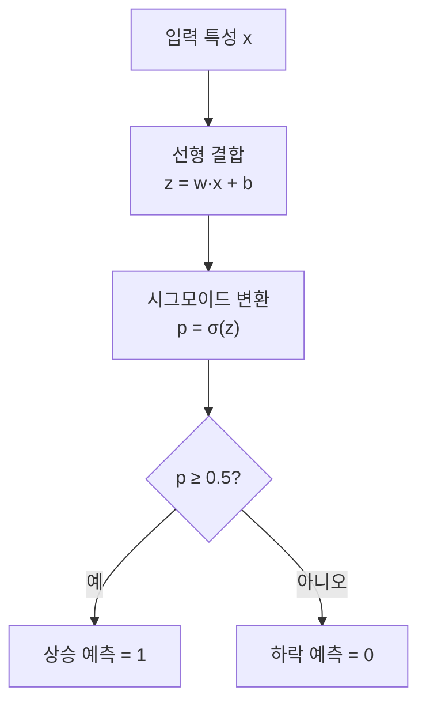
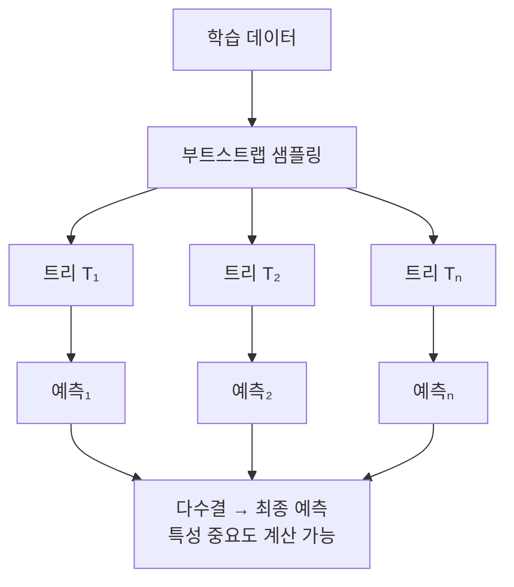
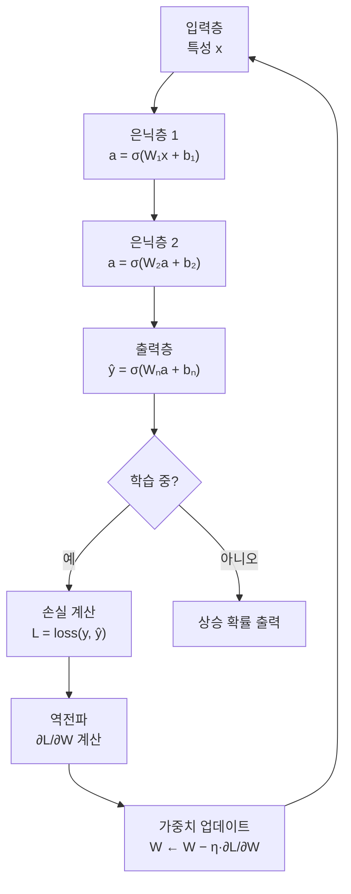

# Day 5. 학습 허브 탐험: 문서 읽고 바로 실행하기

> 오늘은 이 저장소의 메인 주식 AI 교실을 익히는 날입니다. "읽기만 하는 사람"이 아니라 "직접 주가 예측 버튼을 눌러 보는 사람"이 되는 게 목표입니다.

---

## 오늘의 목표

- [메인 학습 허브](/)의 구조를 익힙니다.
- 챕터를 고르고, 설명을 읽고, 실행 결과를 보는 흐름을 몸에 익힙니다.
- 다음 날 모델 비교 실험을 할 준비를 마칩니다.

---

## 메인 허브를 아주 쉽게 설명하면

이 화면은 주식 AI 실습의 `메인 관제판` 같고,  
여러 예측 실험실로 가는 `출발 화면` 같습니다.

여기서 할 일은 늘 비슷합니다.

1. 챕터를 고른다
2. 설명을 읽는다
3. 실행 버튼을 누른다
4. 결과를 본다

---

## 오늘의 화면 낱말

| 화면 이름 | 한자·영어 | 쉬운 뜻 |
|---|---|---|
| 챕터 | *chapter* | 한 번에 배우는 작은 수업 1개. 전체 코스의 작은 단원 |
| 설명 탭 | *description tab* | 오늘 배울 말과 개념을 적어 둔 화면 |
| 실행 버튼 | *run button* | 직접 결과를 만드는 버튼. 누르면 서버가 AI 모델을 돌려 결과를 돌려줌 |
| 결과 탭 | *result tab* | 실행 후 나온 숫자와 내용을 보여 주는 화면 |
| 웹앱 가이드 | *webapp guide* | 다음에 어디로 이동할지 알려주는 안내 |

---

## 오늘 알아두면 좋은 AI 낱말

| 낱말 | 한자·영어 | 쉬운 뜻 |
|---|---|---|
| 신경망 | 神經網 / *neural network* | 뇌 신경세포를 흉내 낸 계산 모델. 神(신 신)+經(지날 경)+網(그물 망). 입력층·은닉층·출력층이 그물처럼 연결됨 |
| 은닉층 | 隱匿層 / *hidden layer* | 입력층과 출력층 사이의 중간 계산 층. 隱(숨을 은)+匿(숨길 닉)+層(층 층). 사람이 직접 들여다보기 어렵기 때문에 '숨겨진 층'이라고 부름. 여기서 복잡한 패턴 인식이 일어남 |
| 상승 확률 | 上昇確率 / *probability of rise* | 내일 주가가 오를 가능성을 0~1 사이 숫자로 나타낸 값. 上(위 상)+昇(오를 승)+確(확실할 확)+率(비율 률). 0.72라면 "오를 가능성 72%"라는 뜻 |

---

## 오늘 열 페이지

- [메인 학습 허브](/)

추천 챕터:

- `chapter06` 로지스틱 회귀
- `chapter08` 랜덤 포레스트
- `chapter21` 신경망 기초

---

## 오늘의 20분 코스

| 시간 | 할 일 |
|---|---|
| 5분 | 메인 허브의 메뉴와 사이드바를 살펴봅니다. |
| 10분 | 챕터 2개를 골라 `설명 -> 실행 -> 결과` 흐름을 반복합니다. |
| 5분 | 어떤 챕터가 제일 읽기 쉬웠는지 메모합니다. |

---

## 웹앱 따라 하기

1. [메인 학습 허브](/)를 엽니다.
2. 왼쪽에서 `chapter06`을 클릭합니다.
3. `설명` 탭에서 분류 이야기를 읽습니다.
4. `실행` 버튼을 눌러 결과가 나오는지 봅니다.
5. 이번에는 `chapter08`을 눌러 같은 일을 다시 합니다.
6. 시간이 남으면 `chapter21`까지 열어 딥러닝 챕터 분위기도 구경합니다.

---

## 꼭 볼 포인트

- 한 챕터를 누르면 내용이 바뀌는가?
- 실행 버튼을 누르면 결과가 생기는가?
- 챕터마다 `무슨 문제를 푸는지` 한 줄로 말할 수 있는가?

---

## 관찰 미션

- 내가 제일 이해하기 쉬웠던 챕터는 무엇이었나요?
- 설명을 먼저 읽고 실행하니 덜 무서웠나요?
- 메인 허브는 왜 "학습 출발점"이라고 부를 수 있을까요?

---

## 한 줄 숙제

`메인 학습 허브는 ________ 예측 수업을 고르고 ________을(를) 바로 해보는 곳이다.`

---

## 문서를 읽을 때 붙여 보면 좋은 쉬운 예시

| 문서에서 보는 개념 | 주식으로 붙여 보는 예시 |
|---|---|
| 분류 | `NAVER가 내일 오를까?` |
| 회귀 | `코스피가 다음 주에 몇 포인트쯤일까?` |
| 특성 | 가격, 거래량, 이동평균, RSI |
| 추가 힌트 | 금리, 환율, CPI 같은 거시경제 숫자 |

예를 들어 문서에 `특성`이라는 말이 나오면,
"모델이 보는 힌트 상자"라고 생각하면 쉽습니다.

- 종목 힌트: 삼성전자 종가, 거래량
- 지표 힌트: MA5, MA20, RSI
- 거시 힌트: 미국 금리, 원/달러 환율

문서를 읽다가 어려우면 늘 이렇게 바꿔 읽어 보세요.

`이 개념은 어떤 종목을, 어떤 지표를, 어떤 시장 분위기를 설명하려는 걸까?`

---

## 내일 예고

내일은 같은 데이터로 모델 4개를 바꿔 보며 "모델 선택"이 결과를 어떻게 바꾸는지 본격적으로 비교합니다.

---

## DART 공시로 회사 성적표 읽기

이제 이 저장소에는 [DART 공시 투자 파이프라인](/dart) 화면도 있습니다.

아주 쉽게 말하면:

- `주가 차트`는 운동장 점수판
- `DART 공시`는 회사가 직접 낸 성적표

예를 들어 삼성전자 공시를 보면

- 매출: 얼마나 크게 벌었는지
- 영업이익: 장사해서 얼마나 남겼는지
- 부채비율: 빚 가방이 얼마나 무거운지
- 최근 공시: 새 소식이 무엇인지

를 같이 볼 수 있습니다.

### 초등학생 버전 예시

`매출이 커졌고 영업이익도 좋아졌고 빚 부담이 낮다`

라고 나오면

`이 회사는 몸집도 크고 체력도 꽤 괜찮아 보이는구나`

처럼 읽으면 됩니다.

반대로

`매출이 줄고 영업이익이 약하고 정정 공시가 나왔다`

면

`조금 더 천천히 살펴봐야겠구나`

라고 생각하면 됩니다.

### 따라 해보기

1. 터미널에서 `DART_API_KEY=내키 python scripts/refresh_datasets.py --use-fallback` 를 실행합니다.
2. [데이터셋 허브](/datasets?dataset=dart_invest_pipeline)에서 `dart_invest_pipeline.csv`를 엽니다.
3. [DART 공시 투자 파이프라인](/dart)에서 삼성전자와 SK하이닉스를 번갈아 눌러 봅니다.
4. `매출`, `영업이익`, `부채비율`, `최근 공시` 4가지를 한 줄로 말해 봅니다.

---

➡️ [다음 문서: Day 6. 같은 데이터로 모델 4종 비교](06.md)

---

## 알고리즘 처리 흐름 (Day 5)

### 로지스틱 회귀 흐름

### 랜덤 포레스트 흐름

### 신경망(MLP) 흐름

---

## 모델 상세 참고 (Day 5)

| 모델 | 수학적 의미 | 탄생 배경 | 주식투자 활용 | 만든 사람/대표 GitHub |
|---|---|---|---|---|
| 로지스틱 회귀 | 선형 결합을 확률로 변환해 이진 분류를 수행합니다. | 해석 가능한 분류 기준이 필요해 통계 실무에서 표준이 되었습니다. | 초보자용 기준 모델로 신호 품질 점검에 적합합니다. | David Cox(현대 통계 정립) · <https://github.com/scikit-learn/scikit-learn/blob/main/sklearn/linear_model/_logistic.py> |
| 랜덤 포레스트 | 다수 트리 투표로 분류하며 분산을 줄입니다. | 단일 트리 불안정을 줄이기 위한 앙상블 연구의 결과물입니다. | 특성 중요도와 안정적 점수를 함께 얻기 쉬워 학습 허브 실습에 적합합니다. | Leo Breiman · <https://github.com/scikit-learn/scikit-learn/blob/main/sklearn/ensemble/_forest.py> |
| 신경망(MLP) | 여러 은닉층의 비선형 변환 `a^{(l+1)}=σ(W^{(l)}a^{(l)}+b^{(l)})`을 학습합니다. | 퍼셉트론 한계를 넘기 위해 역전파 기반 다층 구조가 보편화되었습니다. | 복잡한 비선형 신호(가격×거래량×지표 상호작용) 포착에 유리합니다. | Rumelhart, Hinton, Williams(역전파 대중화) · <https://github.com/scikit-learn/scikit-learn/blob/main/sklearn/neural_network/_multilayer_perceptron.py> |

## 분야별 모델 쓰임새 및 적합도 (Day 5)

| 모델 | 데이터셋 형태 | 헬스케어 | 자율주행 | 주식투자 | 로봇 | AI Ops |
|---|---|---|---|---|---|---|
| 로지스틱 회귀 | 정형 수치·범주 데이터, 이진 레이블 | 질환 유무·재입원 위험 분류, 임상 해석 기준선 | 단순 장애물 유무 분류, 저복잡도 환경 | 초보자용 기준 모델, 신호 품질 점검 | 이상 동작 감지(OK/NG), 안전 판단 기준선 | 장애 발생 여부 분류, 알림 임계값 설정 |
| 랜덤 포레스트 | 정형 수치·범주 데이터, 중간 크기 | 진단 보조, 특성 중요도 기반 임상 지표 해석 | 도로 조건 분류, 다변량 센서 이상 감지 | 특성 중요도·안정 성능 함께 확인 가능 | 상태 분류·고장 예측, 다변량 센서 분석 | 장애 원인 분류·이슈 우선순위 판단 |
| 신경망(MLP) | 정형 수치 데이터, 중간~대용량 | 복잡한 진단 패턴 학습, 의료 영상 특성 분류 | 비선형 센서 융합, 주행 결정 신호 생성 | 다변량 특성 결합 신호 탐지, 복합 패턴 학습 | 복잡한 동작 제어, 다감각 데이터 처리 | 복합 메트릭 이상 탐지, 장애 패턴 인식 |

## 모델 혼합 & 검증 아이디어 (Day 5)

Day 5에서 배운 세 모델은 **복잡도가 다릅니다**.  
단순한 모델부터 복잡한 모델까지 순서대로 쌓으면, 각 단계에서 무엇이 좋아졌는지 눈에 보입니다.

### 혼합 아이디어

| 혼합 방법 | 어떻게 섞나요? | 왜 좋을까요? |
|---|---|---|
| 기준선 + 개선 모델 | 로지스틱 회귀를 기준선으로 먼저 실행하고, 랜덤 포레스트와 MLP를 차례로 추가해 AUC가 얼마나 올라가는지 봄 | 복잡한 모델이 정말로 더 좋은지 쉽게 비교할 수 있음 |
| 3모델 평균 앙상블 | 세 모델이 각각 내놓은 상승 확률을 동일 비중(1/3씩)으로 평균 냄 | 어떤 모델이 특정 날짜에 틀려도 평균값이 흔들림을 줄여줌 |
| 성능 기반 가중 앙상블 | 교차 검증에서 AUC가 더 높은 모델에 더 높은 가중치를 부여해 평균 냄 | 잘하는 모델의 의견을 더 많이 반영하는 합리적인 방식 |

### 검증 방법

- **기준선 비교**: 항상 로지스틱 회귀의 점수를 기준점으로 잡고, 랜덤 포레스트·MLP가 기준점보다 얼마나 좋아졌는지 퍼센트로 확인합니다.
- **특성 중요도 일치 확인**: 세 모델이 중요하다고 보는 특성이 비슷한지 비교합니다. 공통적으로 중요하게 보는 특성은 실제로 신뢰도가 높습니다.
- **챕터별 실행 점수 기록**: 메인 학습 허브에서 `chapter06`, `chapter08`, `chapter21`을 차례로 실행해 각 모델의 점수를 표에 적고 비교합니다.
- **과적합 확인**: 학습 데이터 점수와 테스트 데이터 점수 차이가 크면 해당 모델이 과적합된 것이므로 주의합니다.

> 아주 쉽게 말하면: 세 선생님이 같은 문제를 보고 답을 내면, 세 명 모두 맞다고 한 것만 믿으면 더 안전합니다.  
> 그리고 가장 많이 맞히는 선생님의 말을 조금 더 비중 있게 들으면 됩니다.

---

## 웹앱 안쪽 들여다보기

### 메인 학습 허브를 움직이는 핵심 API
| 주소 | 하는 일 |
|---|---|
| `GET /api/chapters` | 챕터 목록 읽기 |
| `GET /api/chapters/{id}` | 챕터 설명/메타 정보 읽기 |
| `POST /api/chapters/{id}/run` | 해당 챕터의 `practice.py` 실행 |
| `GET /api/chapters/{id}/source` | 소스 코드 문자열 보기 |
| `GET /api/docs` | 문서 목록 읽기 |
| `GET /api/docs/{id}` | 문서 본문 읽기 |

### 실행 버튼을 누르면 무슨 일이 일어날까요?
`POST /api/chapters/{id}/run` 이 호출되면 서버는 해당 챕터 폴더의 `practice.py` 를 읽고, 그 안의 `run()` 을 실행한 뒤 결과와 실행 시간을 정리해서 돌려줍니다.

### 데이터셋 허브와도 연결됩니다
- `GET /api/datasets`
- `GET /api/datasets/{id}`
- `GET /api/datasets/{id}/adapted/stock-lab`

즉, 메인 허브는 **문서 읽기**, **챕터 실행**, **다음 웹앱 이동**을 이어 주는 관제판입니다.
