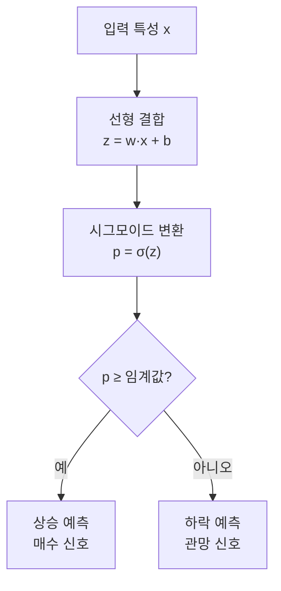
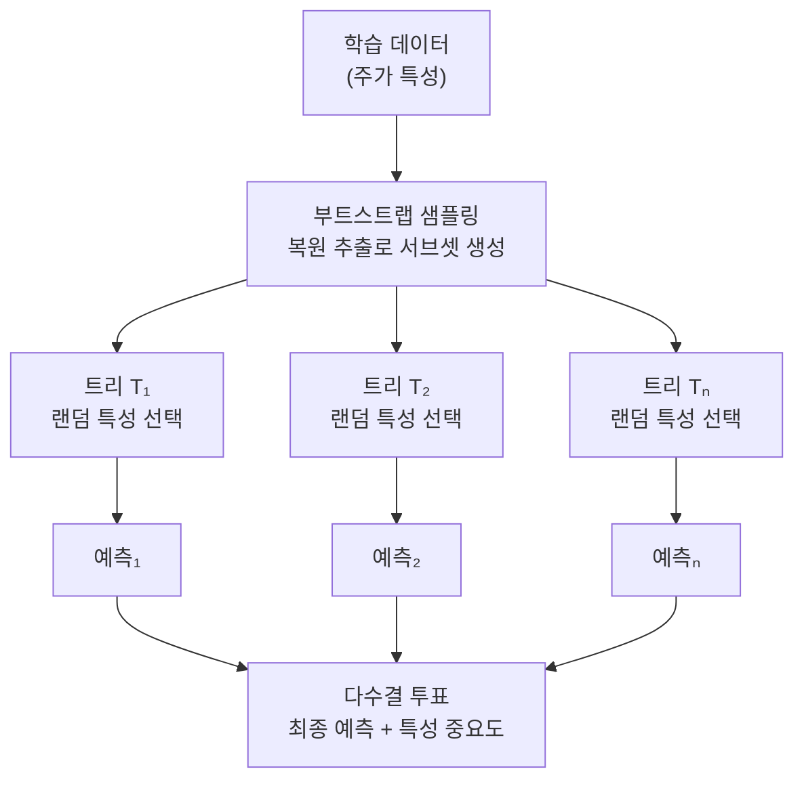
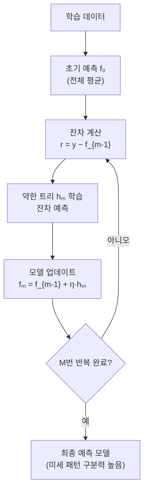
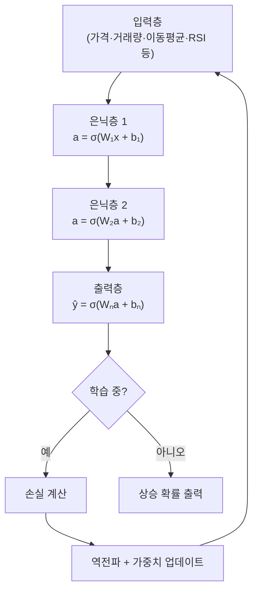
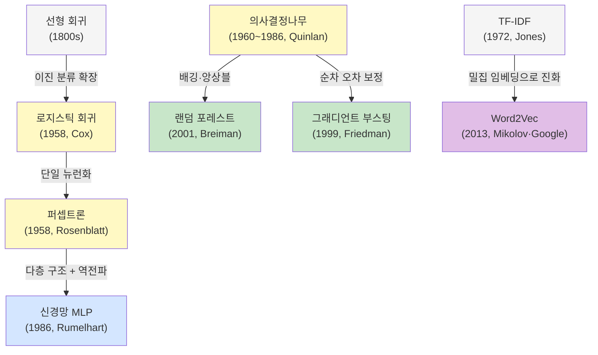
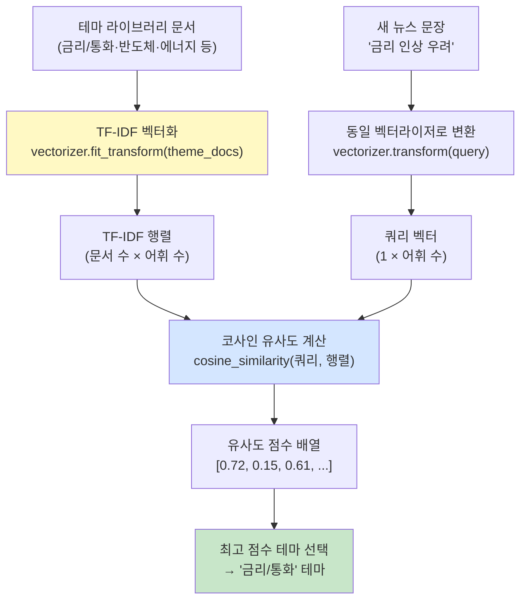

# 모델 비교 실험: 같은 데이터로 누가 더 잘할까?

> 오늘은 같은 삼성전자 샘플을 두고 모델만 바꿔 보는 날입니다. 데이터는 그대로, 생각하는 방식만 바뀌는 걸 느껴보세요.

---

## 오늘의 목표

- 같은 데이터라도 모델이 바뀌면 결과가 달라진다는 걸 확인합니다.
- `로지스틱 회귀`, `랜덤 포레스트`, `그래디언트 부스팅`, `신경망`을 비교합니다.
- 숫자와 해석 쉬움 사이의 차이를 느껴봅니다.

---

## 모델 4개를 주식 예측 역할로 보면

| 모델 | 쉬운 느낌 | 장점 |
|---|---|---|
| 로지스틱 회귀 | 기본 방향 예측 모델 | 설명이 쉽다 |
| 랜덤 포레스트 | 여러 규칙이 투표하는 모델 | 안정적이고 중요도 읽기 좋다 |
| 그래디언트 부스팅 | 틀린 예측을 조금씩 고치는 모델 | 성능이 강한 편이다 |
| 신경망 | 복잡한 가격·거래량 조합을 보는 모델 | 어려운 패턴을 배울 수 있다 |

---

## 오늘의 낱말 5개

| 낱말 | 한자·영어 | 쉬운 뜻 |
|---|---|---|
| 상승 확률 | 上昇確率 / *probability of rise* | 내일 주가가 오를 가능성을 0~1 사이 숫자로 나타낸 값. 上(위 상)+昇(오를 승)+確(확실할 확)+率(비율 률). 0.72면 "72% 확률로 오를 것 같다"는 뜻 |
| 신경망 | 神經網 / *neural network* | 뇌 신경세포를 흉내 낸 계산 모델. 神(신 신)+經(지날 경)+網(그물 망). 은닉층을 여러 겹 쌓아 복잡한 패턴을 배움 |
| 은닉층 | 隱匿層 / *hidden layer* | 입력층과 출력층 사이의 중간 계산 층. 隱(숨을 은)+匿(숨길 닉)+層(층 층). 사람이 직접 들여다보기 어렵기 때문에 붙은 이름 |
| AUC | *Area Under Curve* | 모델이 얼마나 잘 구분하는지 나타내는 점수. 0.5=찍기 수준, 1.0=완벽. 상승/하락을 얼마나 잘 가리는지 보는 지표 |
| 그래디언트 부스팅 | *gradient boosting* | 틀린 예측을 조금씩 보완하며 강해지는 앙상블 모델. 이전 모델의 실수를 다음 모델이 집중 수정함 |

---

## 오늘 열 페이지

- [주식 AI 실험실](/lab)

---

## 오늘의 25분 코스

| 시간 | 할 일 |
|---|---|
| 5분 | 샘플 데이터 불러오기 |
| 15분 | 모델 4개를 차례대로 실행하고 표 채우기 |
| 5분 | 가장 먼저 써보고 싶은 모델 1개 고르기 |

---

## 웹앱 따라 하기

1. [주식 AI 실험실](/lab)을 엽니다.
2. `삼성전자` 샘플 데이터를 불러옵니다.
3. `로지스틱 회귀`를 선택하고 실행합니다.
4. `정확도`, `AUC`, `상승 확률`, `중요 특성`을 메모합니다.
5. 같은 데이터로 `랜덤 포레스트`, `그래디언트 부스팅`, `신경망`도 똑같이 실행합니다.

---

## 오늘의 기록표

| 모델 | accuracy | AUC | 상승 확률 | 가장 눈에 띈 점 |
|---|---|---|---|---|
| 로지스틱 회귀 |  |  |  |  |
| 랜덤 포레스트 |  |  |  |  |
| 그래디언트 부스팅 |  |  |  |  |
| 신경망 |  |  |  |  |

---

## 읽는 방법 힌트

- 숫자가 조금 높아도 설명이 너무 어려우면 초반에는 불편할 수 있습니다.
- 중요 특성을 잘 보여 주는 모델은 공부하기 좋습니다.
- 가장 높은 점수와 가장 읽기 쉬운 모델이 다를 수 있습니다.

---

## 관찰 미션

- 네 모델 중 제일 안정적으로 보인 것은 무엇이었나요?
- 제일 설명하기 쉬운 모델은 무엇이었나요?
- "성능이 조금 더 높음"과 "해석이 쉬움" 중 무엇이 더 끌렸나요?

---

## 한 줄 숙제

`같은 데이터라도 모델이 바뀌면 ________도 바뀌고, ________도 바뀐다.`

---

## 같은 데이터셋을 이렇게 상상해 보세요

예를 들어 삼성전자 60일 데이터를 넣었다고 해봅시다.

모델이 같이 볼 수 있는 힌트는 이런 것들입니다.

- 종목 힌트: 종가, 거래량
- 기술 지표 힌트: 5일 수익률, 이동평균 괴리, 거래량 비율
- 시장 분위기 힌트: 금리 인상 뉴스가 많았는지, 환율이 불안했는지

그런데 모델마다 보는 방식이 다릅니다.

| 모델 | 초급자식 느낌 |
|---|---|
| 로지스틱 회귀 | "선을 하나 그어서 이쪽은 상승, 저쪽은 하락이라고 나누기" |
| 랜덤 포레스트 | "질문 여러 개를 던져 다수결하기" |
| 그래디언트 부스팅 | "틀린 문제를 조금씩 다시 고치기" |
| 신경망 | "여러 힌트를 섞어서 복잡한 규칙 만들기" |

그래서 같은 삼성전자 데이터라도

- 어떤 모델은 `이동평균 괴리`를 더 중요하게 보고
- 어떤 모델은 `거래량 비율`을 더 중요하게 보고
- 어떤 모델은 `복합 패턴`을 더 잘 잡을 수 있습니다

---

## 내일 예고

내일은 정답을 보고 배우는 방법과, 정답 없이 비슷한 것끼리 모으는 방법을 웹앱에서 구분해 봅니다.

---

## 같은 비교를 외부 데이터까지 넓히면

새 [거시경제 투자 파이프라인](/macro) 화면에서는  
`회사 재무 + 거시경제 데이터`를 같이 넣고 ML/DL 모델을 비교할 수 있습니다.

모델이 보는 힌트 예시는 이렇습니다.

- 회사 힌트: 매출, 영업이익률, 부채비율
- 시장 힌트: 미국 기준금리, CPI, VIX
- 나라 힌트: 한국 GDP 성장률, 수출 비중

즉,

- `회사 몸상태`
- `시장 날씨`

를 같이 보고

`다음 해 영업이익이 더 좋아질까?`

를 맞혀 보는 연습입니다.

### 아주 쉬운 예시

- 금리가 높고
- VIX가 높고
- 회사 부채비율도 높다면

모델은 `조심하자` 쪽 신호를 더 크게 볼 수 있습니다.

반대로

- 영업이익률이 좋고
- 부채비율이 안정적이고
- 거시환경도 너무 나쁘지 않다면

`조금 더 긍정적으로 볼 수 있겠다`

고 배울 수 있습니다.

---

➡️ [다음 문서: Day 7. 지도학습과 군집화 놀이터](07.md)

---

## 알고리즘 처리 흐름 (Day 6)

### 로지스틱 회귀 흐름



### 랜덤 포레스트 흐름



### 그래디언트 부스팅 흐름



### 신경망(MLP) 흐름



### 알고리즘 계보도 (Day 6)



---

## 모델 상세 참고 (Day 6)

| 모델 | 수학적 의미 | 탄생 배경 | 주식투자 활용 | 만든 사람/대표 GitHub |
|---|---|---|---|---|
| 로지스틱 회귀 | 확률적 선형 분류기(시그모이드+로그손실 최소화)입니다. | 해석력과 단순성을 갖춘 분류 기준선이 필요해 널리 사용되었습니다. | 상승/하락 확률 기준 매수 신호 생성에 적합합니다. | David Cox(현대 통계 정립) · <https://github.com/scikit-learn/scikit-learn/blob/main/sklearn/linear_model/_logistic.py> |
| 랜덤 포레스트 | 배깅된 다수 트리의 투표 앙상블입니다. | 과적합 완화와 안정적 일반화 성능 확보를 위해 개발되었습니다. | 노이즈가 있는 시장 데이터에서 비교적 강건한 분류 성능을 보입니다. | Leo Breiman · <https://github.com/scikit-learn/scikit-learn/blob/main/sklearn/ensemble/_forest.py> |
| 그래디언트 부스팅 | 이전 모델 잔차(손실의 음의 기울기)를 다음 약분류기가 순차 보정합니다. | "틀린 샘플을 반복 보정"하는 부스팅 아이디어가 함수최적화로 발전했습니다. | 미세 패턴 구분이 좋아 신호 분류 성능을 높이는 데 자주 쓰입니다. | Friedman(GBM 체계화) · <https://github.com/scikit-learn/scikit-learn/blob/main/sklearn/ensemble/_gb.py> |
| 신경망(MLP) | 다층 비선형 합성으로 복잡한 결정경계를 학습합니다. | 선형·트리 모델이 놓치는 복합 패턴 학습 요구에서 확산되었습니다. | 다변량 특성 결합 신호(모멘텀+변동성+거래량) 학습에 유리합니다. | Rumelhart, Hinton, Williams · <https://github.com/scikit-learn/scikit-learn/blob/main/sklearn/neural_network/_multilayer_perceptron.py> |

## 분야별 모델 쓰임새 및 적합도 (Day 6)

| 모델 | 데이터셋 형태 | 헬스케어 | 자율주행 | 주식투자 | 로봇 | AI Ops |
|---|---|---|---|---|---|---|
| 로지스틱 회귀 | 정형 수치·범주 데이터, 이진 레이블 | 질환 유무·치료 반응 이진 분류, 해석 가능 기준선 | 단순 이진 환경 판단, 설명 가능성 중시 상황 | 상승/하락 확률 임계값 기반 매수 신호 | 이상 유무 이진 판단, 안전 인터록 | 장애 발생 여부 분류, 설명 가능한 알림 |
| 랜덤 포레스트 | 정형 수치·범주 데이터, 중간 크기 | 진단 보조, 치료 효과 예측, 특성 중요도 임상 활용 | 도로 조건 분류, 다변량 센서 데이터 이상 감지 | 노이즈 있는 시장 데이터에서 강건한 분류 | 다변량 상태 분류, 고장 예측, 특성 중요도 | 장애 원인 분류, 이슈 우선순위, 이상 감지 |
| 그래디언트 부스팅 | 정형 수치·범주 데이터, 대용량 테이블 | 리스크 스코어링, 약물 부작용 예측, 고정밀 분류 | 고정밀 도로 상황 분류, XGBoost 계열 활용 | 미세 패턴 구분, 신호 분류 성능 향상 | 정밀 동작 제어 신호 분류, 이상 예측 | SLA 위반 예측, 장애 리스크 스코어링 |
| 신경망(MLP) | 정형 수치 데이터, 중간~대용량 | 복잡한 진단 패턴, 의료 영상 특성 분류 | 비선형 센서 융합, 주행 결정 신호 | 다변량 특성 결합 신호(모멘텀+변동성+거래량) | 복잡한 동작 제어, 다감각 데이터 처리 | 복합 메트릭 이상 탐지, 장애 패턴 인식 |

## 모델 혼합 & 검증 아이디어 (Day 6)

같은 데이터로 4개 모델을 비교하는 오늘이야말로 **앙상블을 직접 체험해보기 딱 좋은 날**입니다.  
4개 모델을 섞으면 단일 모델보다 더 안정적인 신호를 만들 수 있습니다.

### 혼합 아이디어

| 혼합 방법 | 어떻게 섞나요? | 왜 좋을까요? |
|---|---|---|
| 4모델 소프트 투표 | 네 모델의 상승 확률을 평균 냄. 예: 로지스틱 52%, 랜덤포레스트 61%, GBM 67%, 신경망 58% → 평균 59.5% | 한 모델이 크게 틀려도 나머지 세 모델이 균형을 잡아줌 |
| 다수결 하드 투표 | 네 모델 중 3개 이상이 "상승"이면 매수, 2개 이하면 관망 | 적어도 세 명의 전문가가 동의할 때만 행동해 거짓 신호를 줄임 |
| 계층별 분업 | 로지스틱 회귀로 명확한 케이스 처리, 나머지 애매한 케이스만 랜덤포레스트·GBM·신경망이 다시 판단 | 간단한 케이스는 빠르고 가볍게, 어려운 케이스는 강력한 모델이 집중 처리 |

### 검증 방법

- **백테스트 곡선 비교**: 단일 모델 전략 곡선과 4모델 앙상블 전략 곡선을 나란히 그려 어느 쪽이 더 안정적인지 봅니다.
- **같은 날짜 오류 비교**: 네 모델이 모두 같이 틀린 날짜를 찾습니다. 모든 모델이 틀리는 날은 특수한 시장 이벤트(대형 뉴스, 금리 결정)일 가능성이 높습니다.
- **특성 중요도 교집합**: 네 모델에서 공통으로 상위에 등장하는 특성은 어떤 모델을 써도 중요한 "진짜 힌트"입니다.
- **오늘의 기록표 활용**: Day 6 기록표에 각 모델 점수를 채운 뒤, 네 점수의 평균을 마지막 행에 적어 앙상블 기준점을 만듭니다.

> 아주 쉽게 말하면: 네 명이 각자 예측하고 다수결로 결정하면, 한 명이 실수해도 결과가 흔들리지 않습니다.  
> 웹앱에서 4개 모델을 모두 실행하고 상승 확률을 직접 더해 평균을 내보세요.

---

## 웹앱 안쪽 들여다보기

### 같은 데이터를 모델 4개에 넣을 때 실제로는
주식 AI 실험실은 같은 입력 행(`rows`)을 두고 `model` 값만 바꿔 `POST /api/stock/analyze` 를 호출합니다.

| 코드 | 모델 |
|---|---|
| `logistic` | 로지스틱 회귀 |
| `rf` | 랜덤 포레스트 |
| `gbm` | 그래디언트 부스팅 |
| `nn` | 신경망 |

### 서버가 돌려주는 대표 결과
- `model_name`
- `accuracy`, `auc`, `precision`
- `feature_importance`
- `portfolio_return`, `buyhold_return`
- `signals`
- `predicted_next_close`, `predicted_move_pct`

즉, Day 6 비교표에 적는 숫자는 모두 같은 API 응답에서 나오는 값이고, 모델 코드만 바꿔가며 비교할 수 있습니다.

---

## scikit-learn: 이 웹앱 BE의 ML 엔진

### scikit-learn이란?

**scikit-learn**(사이킷런)은 파이썬에서 가장 널리 쓰이는 오픈소스 머신러닝 라이브러리입니다.  
`sklearn`이라는 이름으로 import해 사용하며, 분류·회귀·군집화·전처리·파이프라인을 한 패키지에서 제공합니다.

| 특징 | 내용 |
|---|---|
| 통일된 API | 모든 모델에 `.fit()` · `.predict()` · `.predict_proba()` 세 가지 공통 인터페이스 제공 |
| 전처리 도구 | `StandardScaler`, `Pipeline` 등으로 모델 앞뒤 전처리를 자동화 |
| 평가 지표 | `accuracy_score`, `roc_auc_score`, `precision_score` 등 다양한 지표 내장 |
| 텍스트 처리 | `TfidfVectorizer`, `cosine_similarity`로 텍스트 유사도 계산 가능 |

> 이 웹앱에서 화면에 뜨는 **정확도 · AUC · 상승 확률**은 모두 scikit-learn이 계산한 결과입니다.

---

### 웹앱 BE에서 scikit-learn이 쓰이는 곳

| API 엔드포인트 | 사용 모델·도구 | 역할 |
|---|---|---|
| `POST /api/stock/analyze` | `LogisticRegression`, `RandomForestClassifier`, `GradientBoostingClassifier`, `MLPClassifier`, `StandardScaler` + 회귀 변형(`Ridge`, `GradientBoostingRegressor` 등) | 주가 OHLCV 7개 특성으로 다음 날 상승 여부 분류·예측 |
| `POST /api/macro/train` | `RandomForestClassifier`, `LogisticRegression`, `MLPClassifier`, `Pipeline`, `StandardScaler`, `train_test_split` | 재무지표 + 거시경제 지표 19개로 다음 해 영업이익 증가 여부 분류 |
| `POST /api/hotel-stock/train` | `DecisionTreeClassifier`, `RandomForestClassifier`, `GradientBoostingClassifier`, `SVC`, `KNeighborsClassifier`, `MLPClassifier`, `StandardScaler` | 호텔 가상 주가 데이터로 ML 6종·DL 4종 모델 비교 |
| 뉴스 테마 분류 (내부 함수) | `TfidfVectorizer`, `cosine_similarity` | 뉴스 문장과 테마 라이브러리의 유사도를 계산해 주제를 자동 분류 |

---

### 실제 코드 흐름 (`POST /api/stock/analyze` 기준)

```python
# backend/app/main.py — stock_analyze() 함수 내부
from sklearn.ensemble import GradientBoostingClassifier, RandomForestClassifier
from sklearn.linear_model import LogisticRegression
from sklearn.neural_network import MLPClassifier
from sklearn.preprocessing import StandardScaler
from sklearn.metrics import accuracy_score, roc_auc_score

# 1. 정규화: 모든 특성을 평균 0, 표준편차 1로 맞춤
scaler = StandardScaler()
X_train_sc = scaler.fit_transform(X_train)  # 학습 데이터 기준으로 스케일 계산
X_test_sc  = scaler.transform(X_test)       # 같은 기준으로 테스트 데이터 변환

# 2. 모델 선택 및 학습
model_map = {
    "logistic": LogisticRegression(random_state=42, max_iter=500),
    "rf":       RandomForestClassifier(n_estimators=100, max_depth=6, random_state=42),
    "nn":       MLPClassifier(hidden_layer_sizes=(64, 32), max_iter=500, random_state=42),
    "gbm":      GradientBoostingClassifier(n_estimators=100, max_depth=3, random_state=42),
}
m = model_map[model_key]
m.fit(X_train_sc, y_train)                    # .fit() → 학습

# 3. 예측 및 평가
y_pred = m.predict(X_test_sc)                 # .predict() → 0/1 예측
y_prob = m.predict_proba(X_test_sc)[:, 1]     # .predict_proba() → 상승 확률(0~1)

acc = accuracy_score(y_test, y_pred)
auc = roc_auc_score(y_test, y_prob)
```

---

### Pipeline으로 전처리 + 학습을 한 묶음으로 (`POST /api/macro/train` 기준)

```python
# backend/app/main.py — macro_train() 함수 내부
from sklearn.pipeline import Pipeline
from sklearn.preprocessing import StandardScaler
from sklearn.linear_model import LogisticRegression

models = {
    "logistic": Pipeline([
        ("scaler", StandardScaler()),                       # 1단계: 정규화
        ("model", LogisticRegression(max_iter=2000)),       # 2단계: 분류 모델
    ]),
    "rf": RandomForestClassifier(n_estimators=250, random_state=42, max_depth=5),
}

# Pipeline은 .fit() 한 번으로 전처리→학습을 자동 실행
models["logistic"].fit(X_train, y_train)
probs = models["logistic"].predict_proba(X_test)[:, 1]
```

> **Pipeline의 장점**: 전처리와 모델 학습 순서가 고정되어, 실수로 테스트 데이터를 먼저 보는 **데이터 누출(data leakage)** 을 방지합니다.

---

### TF-IDF로 뉴스 테마 분류 (내부 함수 기준)

뉴스 텍스트 처리에도 scikit-learn이 활용됩니다.

```python
# backend/app/main.py — _build_theme_tfidf_index(), _score_themes_by_tfidf() 함수 내부
from sklearn.feature_extraction.text import TfidfVectorizer
from sklearn.metrics.pairwise import cosine_similarity

# 테마 문서를 TF-IDF 벡터로 변환
vectorizer = TfidfVectorizer(analyzer="char_wb", ngram_range=(2, 5), sublinear_tf=True)
matrix = vectorizer.fit_transform(theme_docs)   # 테마 라이브러리 → 벡터 행렬

# 뉴스 문장과 각 테마의 유사도 계산
query = vectorizer.transform([news_message])
sims  = cosine_similarity(query, matrix)[0]     # 값이 클수록 유사한 테마
```

| sklearn 모듈 | 역할 |
|---|---|
| `TfidfVectorizer` | 텍스트를 단어/글자 빈도 기반 숫자 벡터로 변환 |
| `cosine_similarity` | 두 벡터 사이의 코사인 유사도(방향 일치도)를 계산 |

> 이 덕분에 `"금리 인상 우려"` 같은 뉴스 문장이 들어오면 서버가 자동으로 `금리/통화` 테마에 높은 유사도를 부여합니다.

### TF-IDF + 코사인 유사도 처리 흐름



