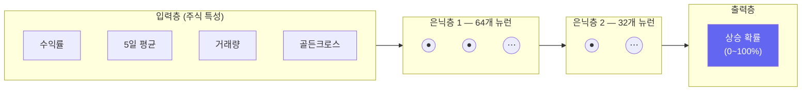
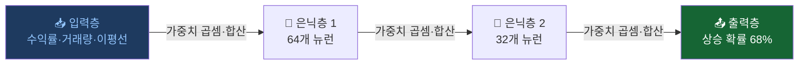
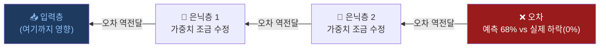
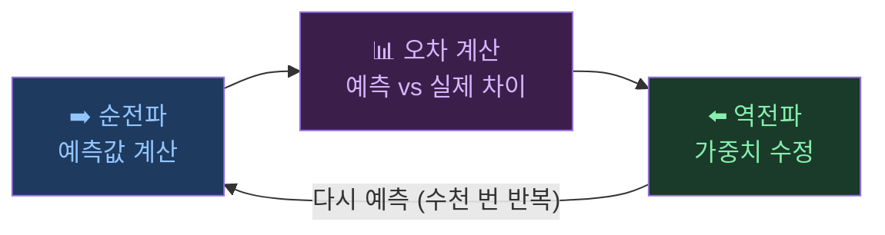
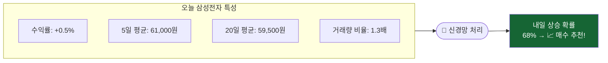
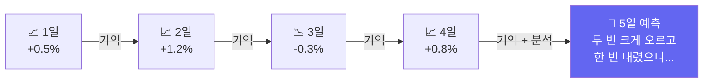
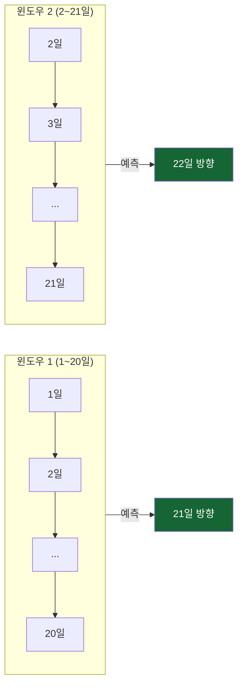

# 컴퓨터 뇌 만들기: 신경망(MLP)

> 개발자의 질문: "사람처럼 생각하는 컴퓨터를 만들 수 있나요?"
> 네! 신경망은 사람의 뇌를 본떠 만든 컴퓨터 학습 방법입니다.

---

## 왜 배우나요?

> 🌟 **초등생도 알 수 있어요!**  
> 우리 뇌에는 수천억 개의 신경세포(뉴런)가 서로 연결되어 있어요.  
> 맛있는 음식을 보면 눈 → 뇌 → "와, 먹고 싶다!" 처럼 신호가 줄줄이 전달되죠.  
> 컴퓨터 신경망도 똑같아요! 주식 숫자들이 층층이 연결된 계산 단계를 통과하면서  
> **"이 패턴이면 내일 주가가 오를 것 같아!"** 라는 답을 스스로 만들어내요. 🧠✨

지금까지 배운 방법들(결정 트리, SVM 등)은 사람이 규칙을 정해줘야 했습니다.  
예를 들어 "5일 평균이 높으면 매수" 같은 규칙을요.

**신경망(MLP)**은 규칙을 스스로 찾아냅니다.  
주식 데이터 수천 개를 보여주면 컴퓨터가 "이런 복잡한 패턴일 때 주가가 올랐어"를 혼자 발견합니다.

특히 **여러 조건이 복잡하게 엮인 패턴**을 잘 찾아냅니다.

---

## 어떻게 가르치나요?

신경망은 마치 뇌의 뉴런처럼, 여러 층의 계산을 통해 답을 찾아갑니다.



각 뉴런은 입력을 받아 계산하고, 결과를 다음 층으로 넘깁니다.
수천 번 반복 학습하면서 잘못 예측할 때마다 스스로 조정합니다.

---

## 🧠 핵심 개념 한눈에 보기

### 뇌의 신경망 vs 인공신경망

우리 뇌에는 약 **860억 개의 뉴런(신경세포)**이 있고, 이 뉴런들이 서로 연결되어 생각하고 배웁니다.
인공신경망(Artificial Neural Network)은 이 구조를 수학으로 흉내 낸 것입니다.

| | 🧠 사람의 뇌 | 🤖 인공 신경망 |
|--|--|--|
| **기본 단위** | 뉴런(신경세포) ~860억 개 | 인공 뉴런 (수학 계산 단위) |
| **연결 방식** | 뉴런↔뉴런이 시냅스로 연결 | 숫자와 가중치(weight)로 연결 |
| **학습 방법** | 반복 경험으로 시냅스가 강해짐 | 틀릴 때마다 가중치를 조금씩 조정 |
| **정보 흐름** | 자극 → 뇌 → 반응 | 입력층 → 은닉층 → 출력층 |

> 💡 **한 줄 요약**: 인공신경망은 사람의 뇌가 신호를 처리하는 방식을 수학으로 흉내 낸 것입니다!

---

### 뉴런(Neuron): 계산의 기본 단위

뇌의 신경세포처럼, 인공 뉴런도 **여러 신호를 받아서 하나의 결론을 내보냅니다**.

```
입력1(수익률)  × 가중치0.8 ─┐
입력2(거래량)  × 가중치0.3 ─┼──▶ 합산 ──▶ 활성화 함수 ──▶ 출력(다음 층으로)
입력3(이평선)  × 가중치0.5 ─┘
```

- **가중치(Weight)**: 얼마나 중요하게 볼지 나타내는 숫자. 학습하면서 자동으로 조정됩니다.
- **활성화 함수**: 합산 결과가 너무 크거나 작으면 적당한 범위로 눌러주는 역할 (ReLU, tanh 등)

> 🌟 **뉴런 = 정보를 받아서 판단하고 다음으로 전달하는 작은 계산기**

---

### 은닉층(Hidden Layer): 중간에서 숨어 일하는 층

```
입력층            은닉층 1          은닉층 2         출력층
[수익률]    →   [패턴 64개]   →   [판단 32개]  →   [상승 확률]
[거래량]         ↑ 복잡한 계산       ↑ 더 추상적
[이평선]
```

- **입력층**: 주식 데이터가 들어오는 문
- **은닉층**: 복잡한 패턴을 찾아내는 중간 계산 공간
  - 이름이 "은닉(숨을 은)"인 이유: 사람이 직접 들여다보기 어렵기 때문!
  - 층이 많을수록 더 복잡하고 미묘한 패턴을 학습할 수 있습니다
- **출력층**: 최종 답(상승/하락 확률)을 내보내는 곳

> 🌟 **은닉층이 많을수록** 더 복잡한 패턴을 배울 수 있지만, 너무 많으면 학습 데이터만 외워버리는 과적합이 발생합니다

---

### 순전파(Forward Pass): 앞으로 계산하기

**순전파**는 입력 데이터가 **입력층 → 은닉층 → 출력층** 방향으로 흘러가며 예측값을 만드는 과정입니다.



> 🌟 **순전파 = 물이 위에서 아래로 흐르듯**, 층을 따라 앞으로만 계산이 흘러갑니다

---

### 역전파(Backpropagation): 틀린 것을 거꾸로 고치기

예측이 틀렸을 때, 오차를 **출력층에서 입력층 방향으로 거꾸로** 전달하면서 각 뉴런의 가중치를 조금씩 수정합니다.



> 🌟 **역전파 = 시험 채점 후 틀린 문제를 뒤에서부터 되짚어 수정하는 것**  
> 오차가 클수록 가중치를 더 많이 수정하고, 작을수록 조금만 수정합니다

---

### 피드백(Feedback): 반복하며 점점 더 잘하기

신경망은 **순전파 → 오차 계산 → 역전파 → 가중치 수정**을 수천 번 반복합니다.  
이 반복 과정이 바로 **피드백 루프**이며, 신경망이 스스로 배우는 핵심 원리입니다.



> 🌟 **피드백 = "틀렸다 → 수정하자" 를 반복하는 것**  
> 수천 번 반복할수록 오차가 줄어들고 예측이 점점 정확해집니다

---

## 어떤 결과를 기대하나요?



---

## 1. 주식 데이터 준비

```python
import pandas as pd
import numpy as np
from sklearn.neural_network import MLPClassifier
from sklearn.preprocessing import StandardScaler
from sklearn.metrics import accuracy_score
import matplotlib.pyplot as plt

np.random.seed(42)

# 삼성전자 주가 500일치
days = 500
prices  = 60000 + np.cumsum(np.random.randn(days) * 500)
volume  = np.random.randint(5000000, 20000000, days)

df = pd.DataFrame({'close': prices, 'volume': volume})

# 특성 계산
df['ret']       = df['close'].pct_change()
df['ret_5']     = df['close'].pct_change(5)
df['ma5']       = df['close'].rolling(5).mean()
df['ma20']      = df['close'].rolling(20).mean()
df['vol_ratio'] = df['volume'] / df['volume'].rolling(10).mean()
df['high_band'] = (df['close'] > df['ma20']).astype(int)

# 내일 오를지(1) 내릴지(0)
df['target'] = (df['close'].shift(-1) > df['close']).astype(int)
df = df.dropna()

features = ['ret', 'ret_5', 'ma5', 'ma20', 'vol_ratio', 'high_band']
X = df[features].values
y = df['target'].values

# 시간 순서대로 나누기
split = int(len(X) * 0.8)
X_train, X_test = X[:split], X[split:]
y_train, y_test = y[:split], y[split:]

# 숫자 크기 맞추기 (신경망은 이게 매우 중요!)
scaler = StandardScaler()
X_train_sc = scaler.fit_transform(X_train)
X_test_sc  = scaler.transform(X_test)

print(f"학습 데이터: {len(X_train)}일")
print(f"테스트 데이터: {len(X_test)}일")
```

---

## 2. 신경망 만들고 학습하기

```python
# 신경망 만들기
# hidden_layer_sizes: 은닉층의 뉴런 수
# (64, 32) = 첫 번째 층 64개 뉴런, 두 번째 층 32개 뉴런
mlp = MLPClassifier(
    hidden_layer_sizes=(64, 32),  # 신경망 구조
    activation='relu',            # 활성화 함수 (ReLU가 주식에 적합)
    max_iter=500,                 # 최대 학습 횟수
    random_state=42,
    early_stopping=True,          # 성능이 더 이상 좋아지지 않으면 멈춤
    validation_fraction=0.1,
    verbose=False,
)

# 학습!
mlp.fit(X_train_sc, y_train)

# 결과 확인
train_acc = accuracy_score(y_train, mlp.predict(X_train_sc))
test_acc  = accuracy_score(y_test,  mlp.predict(X_test_sc))
print(f"학습 정확도: {train_acc:.1%}")
print(f"테스트 정확도: {test_acc:.1%}")
print(f"실제 학습 횟수: {mlp.n_iter_}번")
```

---

## 3. 신경망 구조 실험

뉴런이 많을수록 더 복잡한 패턴을 배울 수 있지만, 너무 많으면 오히려 헷갈립니다.

```python
# 여러 구조 비교
structures = {
    '단순 (32개)':         (32,),
    '보통 (64, 32)':       (64, 32),
    '복잡 (128, 64, 32)': (128, 64, 32),
    '매우 복잡 (256, 128, 64)': (256, 128, 64),
}

results = {}
for name, hidden in structures.items():
    m = MLPClassifier(
        hidden_layer_sizes=hidden,
        max_iter=500,
        random_state=42,
        early_stopping=True,
        validation_fraction=0.1,
    )
    m.fit(X_train_sc, y_train)
    tr_acc = accuracy_score(y_train, m.predict(X_train_sc))
    te_acc = accuracy_score(y_test,  m.predict(X_test_sc))
    results[name] = (tr_acc, te_acc)
    print(f"{name:25s}: 학습 {tr_acc:.1%} | 테스트 {te_acc:.1%}")

# 시각화
names   = list(results.keys())
tr_accs = [v[0] for v in results.values()]
te_accs = [v[1] for v in results.values()]

x = np.arange(len(names))
width = 0.35
plt.figure(figsize=(10, 5))
plt.bar(x - width/2, tr_accs, width, label='학습 정확도', color='steelblue')
plt.bar(x + width/2, te_accs, width, label='테스트 정확도', color='coral')
plt.xticks(x, [n.split(' ')[0] for n in names])
plt.ylabel('정확도')
plt.title('신경망 구조별 성능 비교')
plt.legend()
plt.tight_layout()
plt.savefig('mlp_structures.png', dpi=120)
print("저장: mlp_structures.png")
```

---

## 4. 학습 과정 보기

```python
# 학습 손실 (오차) 변화 그래프
best_mlp = MLPClassifier(
    hidden_layer_sizes=(64, 32),
    max_iter=300,
    random_state=42,
    early_stopping=True,
    validation_fraction=0.15,
)
best_mlp.fit(X_train_sc, y_train)

plt.figure(figsize=(8, 4))
plt.plot(best_mlp.loss_curve_, 'b-', linewidth=2, label='학습 오차')
if best_mlp.validation_scores_ is not None:
    # 정확도를 오차처럼 변환
    val_loss = [1 - s for s in best_mlp.validation_scores_]
    plt.plot(val_loss, 'r-', linewidth=2, label='검증 오차')
plt.xlabel('학습 횟수')
plt.ylabel('오차 (낮을수록 좋음)')
plt.title('신경망이 점점 배우는 과정\n(오차가 줄어들수록 잘 배운 것)')
plt.legend()
plt.tight_layout()
plt.savefig('mlp_learning.png', dpi=120)
print("저장: mlp_learning.png")
```

---

## 5. 실제 투자 신호 만들기

```python
# 상승 확률로 투자 신호 만들기
probs = best_mlp.predict_proba(X_test_sc)[:, 1]

# 신호 정의
def make_signal(prob):
    if prob >= 0.65:   return '강한 매수'
    elif prob >= 0.55: return '약한 매수'
    elif prob <= 0.35: return '강한 관망'
    else:              return '관망'

signals = [make_signal(p) for p in probs]

# 결과 샘플 보기
result_df = pd.DataFrame({
    '상승확률': [f'{p:.1%}' for p in probs[:20]],
    '신호':    signals[:20],
    '실제':    ['상승' if v == 1 else '하락' for v in y_test[:20]],
})
print("\n처음 20일 예측 결과:")
print(result_df.to_string())

# 신호별 적중률
df_res = pd.DataFrame({'prob': probs, 'signal': signals,
                        'actual': y_test})
print("\n신호별 실제 상승 비율:")
print(df_res.groupby('signal')['actual'].agg(['mean', 'count'])
           .rename(columns={'mean': '상승비율', 'count': '신호횟수'})
           .round(3))
```

---

## 핵심 정리

- **신경망(MLP)**: 여러 층의 뉴런이 연결되어 복잡한 패턴을 스스로 학습
- **은닉층**: 입력과 출력 사이의 층 — 많을수록 복잡한 패턴 학습 가능
- **과적합 주의**: 뉴런이 너무 많으면 학습 데이터만 외워버림 (시험 점수가 낮아짐)
- **StandardScaler 필수**: 신경망은 숫자 크기에 매우 민감함
- **early_stopping**: 성능이 더 이상 좋아지지 않으면 자동으로 멈춤

## 실습 과제

```python
# 과제: 3종목 동시 예측 신경망
# 1) 삼성전자, 카카오, NAVER 각 300일치 데이터 만들기
# 2) 3종목을 합쳐서 하나의 큰 학습 데이터 만들기
# 3) MLPClassifier로 학습
# 4) 각 종목별 예측 정확도 따로 계산해서 비교

종목_데이터 = {}
for 이름, 시작가 in [('삼성전자', 60000), ('카카오', 40000), ('NAVER', 150000)]:
    np.random.seed(hash(이름) % 100)
    prices = 시작가 + np.cumsum(np.random.randn(300) * 시작가 * 0.01)
    종목_데이터[이름] = prices
# 나머지를 채워보세요!
```

## 관련 실습 파일

| 챕터 | 주제 | 실행 방법 |
|------|------|---------|
| [chapter21](/api/chapters/chapter21/source/raw) | 신경망 기초 | `POST /api/chapters/chapter21/run` |
| [chapter27](/api/chapters/chapter27/source/raw) | 경사하강법 실험 | `POST /api/chapters/chapter27/run` |

---

---

## 실전 확장: 실제 한국 주식 데이터 적용 (21.md 통합)

> 시간의 흐름을 기억하는 LSTM으로 삼성전자 실제 주가를 예측해봅니다.

---

## 왜 배우나요?

지금까지 배운 랜덤 포레스트나 SVM은 각 날의 데이터를 **독립적**으로 봤습니다.  
하지만 주가는 **연결되어 있습니다** — 3일 연속 상승하면 내일도 오를 가능성이 있죠.

**LSTM(Long Short-Term Memory)**은 과거의 흐름을 **기억**하면서 다음을 예측합니다.



---

## 1. 삼성전자 데이터 준비 (슬라이딩 윈도우)

```python
import pandas as pd
import numpy as np
from sklearn.neural_network import MLPClassifier, MLPRegressor
from sklearn.preprocessing import StandardScaler, MinMaxScaler
from sklearn.metrics import accuracy_score, mean_absolute_error
import matplotlib.pyplot as plt

# 삼성전자 실제 데이터 수집
try:
    import FinanceDataReader as fdr
    raw = fdr.DataReader('005930', '2020-01-01', '2024-12-31')
    df  = raw[['Close', 'Volume']].rename(columns={'Close': 'close', 'Volume': 'volume'})
    print(f"✅ 삼성전자: {len(df)}일 ({df.index[0].date()} ~ {df.index[-1].date()})")
except Exception:
    np.random.seed(42)
    n = 1200
    dates = pd.date_range('2020-01-01', periods=n, freq='B')
    prices = 55000 + np.cumsum(np.random.randn(n) * 800)
    prices = np.clip(prices, 40000, 90000)
    df = pd.DataFrame({'close': prices.round(0),
                        'volume': np.random.randint(8_000_000, 25_000_000, n)},
                       index=dates)
    print("⚠️  오프라인 시뮬레이션 사용")

# 시계열 특성 계산
df['ret']      = df['close'].pct_change()
df['log_ret']  = np.log(df['close'] / df['close'].shift(1))
df['ma5']      = df['close'].rolling(5).mean()
df['ma20']     = df['close'].rolling(20).mean()
df['vol_ratio']= df['volume'] / df['volume'].rolling(10).mean()
df['volatility']= df['ret'].rolling(5).std()
df = df.dropna()

print(f"\n최종 데이터: {len(df)}일")
print(df[['close', 'ret', 'ma5', 'vol_ratio']].tail())
```

---

## 2. 슬라이딩 윈도우: 시계열 → 딥러닝 입력

LSTM은 최근 N일치 데이터를 묶어서 하나의 입력으로 받습니다.



```python
SEQ_LEN = 20  # 최근 20일을 묶어서 하나의 입력으로

# 슬라이딩 윈도우로 데이터 생성
feature_cols = ['ret', 'log_ret', 'vol_ratio', 'volatility']
feat_values  = df[feature_cols].values

X_list, y_list = [], []
for i in range(SEQ_LEN, len(feat_values) - 1):
    # 최근 SEQ_LEN일치 특성을 펼쳐서 하나의 벡터로
    window = feat_values[i - SEQ_LEN:i].flatten()
    X_list.append(window)
    # 다음 날 상승(1) or 하락(0)
    y_list.append(1 if df['ret'].iloc[i + 1] > 0 else 0)

X_arr = np.array(X_list)
y_arr = np.array(y_list)

print(f"시계열 샘플 수: {len(X_arr)}개")
print(f"샘플 하나의 크기: {X_arr.shape[1]} ({SEQ_LEN}일 × {len(feature_cols)}특성)")
print(f"상승 비율: {y_arr.mean():.1%}")

# 시간 순서 유지하며 분할
split = int(len(X_arr) * 0.8)
X_train, X_test = X_arr[:split], X_arr[split:]
y_train, y_test = y_arr[:split], y_arr[split:]

# 정규화
scaler = StandardScaler()
X_train_sc = scaler.fit_transform(X_train)
X_test_sc  = scaler.transform(X_test)

print(f"\n학습 데이터: {len(X_train)}일")
print(f"테스트 데이터: {len(X_test)}일")
```

---

## 3. LSTM 스타일 방향 예측 (tanh 활성화)

실제 LSTM은 PyTorch가 필요하지만, 개념을 이해하기 위해 MLP + tanh로 구현합니다.  
tanh는 LSTM 내부에서 쓰이는 함수로, 시계열 데이터에 적합합니다.

```python
# LSTM 스타일 시퀀스 모델
lstm_model = MLPClassifier(
    hidden_layer_sizes=(128, 64, 32),
    activation='tanh',         # tanh: LSTM에서 실제로 쓰는 활성화 함수
    max_iter=500,
    random_state=42,
    early_stopping=True,
    validation_fraction=0.1,
    n_iter_no_change=20,
)

lstm_model.fit(X_train_sc, y_train)

train_acc = accuracy_score(y_train, lstm_model.predict(X_train_sc))
test_acc  = accuracy_score(y_test,  lstm_model.predict(X_test_sc))

print(f"삼성전자 방향 예측 결과:")
print(f"  학습 정확도: {train_acc:.1%}")
print(f"  테스트 정확도: {test_acc:.1%}")
print(f"  학습 횟수: {lstm_model.n_iter_}번")
```

---

## 4. 시퀀스 길이 실험: "며칠치를 봐야 가장 잘 예측할까?"

```python
seq_lengths = [5, 10, 15, 20, 30, 45, 60]
seq_accs    = []

for sl in seq_lengths:
    X_s, y_s = [], []
    for i in range(sl, len(feat_values) - 1):
        X_s.append(feat_values[i - sl:i].flatten())
        y_s.append(1 if df['ret'].iloc[i + 1] > 0 else 0)
    X_s = np.array(X_s)
    y_s = np.array(y_s)

    sp = int(len(X_s) * 0.8)
    sc = StandardScaler()
    X_sc_s = sc.fit_transform(X_s)

    m = MLPClassifier(hidden_layer_sizes=(64, 32), activation='tanh',
                      max_iter=300, random_state=42, early_stopping=True)
    m.fit(X_sc_s[:sp], y_s[:sp])
    acc = accuracy_score(y_s[sp:], m.predict(X_sc_s[sp:]))
    seq_accs.append(acc)
    print(f"시퀀스 {sl:2d}일: 정확도 {acc:.1%}")

plt.figure(figsize=(8, 4))
plt.plot(seq_lengths, seq_accs, 'b-o', linewidth=2, markersize=8)
plt.xlabel('시퀀스 길이 (며칠치를 봤는지)')
plt.ylabel('테스트 정확도')
plt.title('삼성전자 주가: 시퀀스 길이별 예측 정확도')
plt.tight_layout()
plt.savefig('seq_length_samsung.png', dpi=120)
print("저장: seq_length_samsung.png")

best_sl = seq_lengths[seq_accs.index(max(seq_accs))]
print(f"\n최적 시퀀스 길이: {best_sl}일 (정확도 {max(seq_accs):.1%})")
```

---

## 5. 주가 수준 예측 (회귀): 내일 종가는 얼마일까?

방향(오를지/내릴지)이 아닌 **내일 수익률**을 수치로 예측해봅니다.

```python
# 내일 로그 수익률 예측
log_rets = df['log_ret'].values
X_reg, y_reg = [], []
for i in range(SEQ_LEN, len(log_rets) - 1):
    X_reg.append(feat_values[i - SEQ_LEN:i].flatten())
    y_reg.append(log_rets[i + 1])  # 내일 로그 수익률

X_reg = np.array(X_reg)
y_reg = np.array(y_reg)

sp_r = int(len(X_reg) * 0.8)
sc_r = StandardScaler()
X_reg_tr_sc = sc_r.fit_transform(X_reg[:sp_r])
X_reg_te_sc = sc_r.transform(X_reg[sp_r:])

reg_model = MLPRegressor(
    hidden_layer_sizes=(128, 64),
    activation='tanh',
    max_iter=500,
    random_state=42,
    early_stopping=True,
)
reg_model.fit(X_reg_tr_sc, y_reg[:sp_r])

y_pred_reg = reg_model.predict(X_reg_te_sc)
mae = mean_absolute_error(y_reg[sp_r:], y_pred_reg)
print(f"\n내일 수익률 예측 MAE: {mae * 100:.4f}%")

# 예측 vs 실제 그래프
n_plot = 80
plt.figure(figsize=(12, 4))
plt.plot(range(n_plot), y_reg[sp_r:sp_r+n_plot] * 100, 'b-', label='실제 수익률', alpha=0.8)
plt.plot(range(n_plot), y_pred_reg[:n_plot] * 100,       'r--', label='예측 수익률', alpha=0.8)
plt.axhline(y=0, color='black', linestyle=':', alpha=0.5)
plt.xlabel('날짜 (테스트 기간)')
plt.ylabel('로그 수익률 (%)')
plt.title(f'삼성전자 내일 수익률 예측 (LSTM 스타일, MAE={mae*100:.4f}%)')
plt.legend()
plt.tight_layout()
plt.savefig('lstm_regression.png', dpi=120)
print("저장: lstm_regression.png")
```

---

## 6. 투자 신호 만들기

```python
# 상승 확률로 투자 신호 생성
probs = lstm_model.predict_proba(X_test_sc)[:, 1]

def make_signal(p):
    if p >= 0.65:  return '강한 매수'
    if p >= 0.55:  return '약한 매수'
    if p <= 0.35:  return '강한 관망'
    return '관망'

signals = [make_signal(p) for p in probs]

n_plot = 80
plt.figure(figsize=(12, 5))

ax1 = plt.subplot(2, 1, 1)
ax1.plot(df['close'].values[-len(y_test)-10:-len(y_test)+n_plot], 'b-', linewidth=1)
ax1.set_title('삼성전자 실제 주가 (테스트 기간)')
ax1.set_ylabel('주가 (원)')

ax2 = plt.subplot(2, 1, 2)
ax2.plot(probs[:n_plot], 'purple', linewidth=1.5, label='상승 확률')
ax2.axhline(y=0.65, color='green', linestyle='--', alpha=0.7, label='강한 매수 기준')
ax2.axhline(y=0.50, color='gray',  linestyle=':',  alpha=0.5, label='중립')
ax2.scatter(range(n_plot),
            [1.05 if v == 1 else -0.05 for v in y_test[:n_plot]],
            c=['green' if v == 1 else 'red' for v in y_test[:n_plot]], s=15, zorder=5)
ax2.set_ylabel('상승 확률')
ax2.set_xlabel('거래일')
ax2.set_ylim(-0.1, 1.1)
ax2.legend()

plt.tight_layout()
plt.savefig('lstm_signal.png', dpi=120)
print("저장: lstm_signal.png")

# 신호별 적중률
signal_df = pd.DataFrame({'prob': probs, 'signal': signals, 'actual': y_test})
print("\n신호별 실제 상승 비율:")
print(signal_df.groupby('signal')['actual'].agg(['mean', 'count'])
               .rename(columns={'mean': '상승비율', 'count': '신호횟수'}).round(3))
```

---

## 핵심 정리

- **LSTM**: 과거 시퀀스를 기억하며 시계열을 예측 — 수익률 흐름 분석에 적합
- **슬라이딩 윈도우**: 최근 N일치 데이터를 묶어 하나의 입력으로 만드는 핵심 기법
- **tanh 활성화**: LSTM 내부에서 사용되는 함수 — 시계열에 특히 적합
- **시퀀스 길이 최적화**: 종목마다 다름 — 삼성전자는 보통 20~30일이 적당

## 실습 과제

```python
# 과제: SK하이닉스(000660) LSTM 예측
# 1) FinanceDataReader로 SK하이닉스 2021~2024 데이터 수집
# 2) 슬라이딩 윈도우 (15일)로 방향 예측
# 3) 삼성전자와 정확도 비교
# 4) 어느 종목이 더 예측하기 쉬운지 분석

try:
    import FinanceDataReader as fdr
    skhynix_raw = fdr.DataReader('000660', '2021-01-01', '2024-12-31')
    skhynix = skhynix_raw[['Close', 'Volume']].rename(columns={'Close': 'close', 'Volume': 'volume'})
except Exception:
    np.random.seed(77)
    n = 900
    skhynix = pd.DataFrame({
        'close': 100000 + np.cumsum(np.random.randn(n) * 2500),
        'volume': np.random.randint(3_000_000, 12_000_000, n),
    })

# 나머지를 채워보세요!
```

## 관련 실습 파일

| 챕터 | 주제 | 실행 방법 |
|------|------|---------|
| [chapter101](/api/chapters/chapter101/source/raw) | RNN 기초 | `POST /api/chapters/chapter101/run` |
| [chapter102](/api/chapters/chapter102/source/raw) | LSTM 기초 | `POST /api/chapters/chapter102/run` |

---

➡️ [다음 문서: 주가 그래프의 패턴 찾기: CNN](07.md) 에서 계속됩니다.
