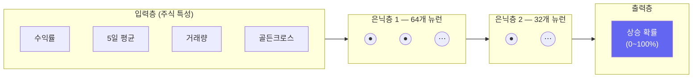

# 컴퓨터 뇌 만들기: 신경망(MLP)

> 개발자의 질문: "사람처럼 생각하는 컴퓨터를 만들 수 있나요?"
> 네! 신경망은 사람의 뇌를 본떠 만든 컴퓨터 학습 방법입니다.

---

## 왜 배우나요?

지금까지 배운 방법들(결정 트리, SVM 등)은 사람이 규칙을 정해줘야 했습니다.  
예를 들어 "5일 평균이 높으면 매수" 같은 규칙을요.

**신경망(MLP)**은 규칙을 스스로 찾아냅니다.  
주식 데이터 수천 개를 보여주면 컴퓨터가 "이런 복잡한 패턴일 때 주가가 올랐어"를 혼자 발견합니다.

특히 **여러 조건이 복잡하게 엮인 패턴**을 잘 찾아냅니다.

---

## 어떻게 가르치나요?

신경망은 마치 뇌의 뉴런처럼, 여러 층의 계산을 통해 답을 찾아갑니다.



각 뉴런은 입력을 받아 계산하고, 결과를 다음 층으로 넘깁니다.
수천 번 반복 학습하면서 잘못 예측할 때마다 스스로 조정합니다.

---

## 어떤 결과를 기대하나요?


---

## 1. 주식 데이터 준비

```python
import pandas as pd
import numpy as np
from sklearn.neural_network import MLPClassifier
from sklearn.preprocessing import StandardScaler
from sklearn.metrics import accuracy_score
import matplotlib.pyplot as plt

np.random.seed(42)

# 삼성전자 주가 500일치
days = 500
prices  = 60000 + np.cumsum(np.random.randn(days) * 500)
volume  = np.random.randint(5000000, 20000000, days)

df = pd.DataFrame({'close': prices, 'volume': volume})

# 특성 계산
df['ret']       = df['close'].pct_change()
df['ret_5']     = df['close'].pct_change(5)
df['ma5']       = df['close'].rolling(5).mean()
df['ma20']      = df['close'].rolling(20).mean()
df['vol_ratio'] = df['volume'] / df['volume'].rolling(10).mean()
df['high_band'] = (df['close'] > df['ma20']).astype(int)

# 내일 오를지(1) 내릴지(0)
df['target'] = (df['close'].shift(-1) > df['close']).astype(int)
df = df.dropna()

features = ['ret', 'ret_5', 'ma5', 'ma20', 'vol_ratio', 'high_band']
X = df[features].values
y = df['target'].values

# 시간 순서대로 나누기
split = int(len(X) * 0.8)
X_train, X_test = X[:split], X[split:]
y_train, y_test = y[:split], y[split:]

# 숫자 크기 맞추기 (신경망은 이게 매우 중요!)
scaler = StandardScaler()
X_train_sc = scaler.fit_transform(X_train)
X_test_sc  = scaler.transform(X_test)

print(f"학습 데이터: {len(X_train)}일")
print(f"테스트 데이터: {len(X_test)}일")
```

---

## 2. 신경망 만들고 학습하기

```python
# 신경망 만들기
# hidden_layer_sizes: 은닉층의 뉴런 수
# (64, 32) = 첫 번째 층 64개 뉴런, 두 번째 층 32개 뉴런
mlp = MLPClassifier(
    hidden_layer_sizes=(64, 32),  # 신경망 구조
    activation='relu',            # 활성화 함수 (ReLU가 주식에 적합)
    max_iter=500,                 # 최대 학습 횟수
    random_state=42,
    early_stopping=True,          # 성능이 더 이상 좋아지지 않으면 멈춤
    validation_fraction=0.1,
    verbose=False,
)

# 학습!
mlp.fit(X_train_sc, y_train)

# 결과 확인
train_acc = accuracy_score(y_train, mlp.predict(X_train_sc))
test_acc  = accuracy_score(y_test,  mlp.predict(X_test_sc))
print(f"학습 정확도: {train_acc:.1%}")
print(f"테스트 정확도: {test_acc:.1%}")
print(f"실제 학습 횟수: {mlp.n_iter_}번")
```

---

## 3. 신경망 구조 실험

뉴런이 많을수록 더 복잡한 패턴을 배울 수 있지만, 너무 많으면 오히려 헷갈립니다.

```python
# 여러 구조 비교
structures = {
    '단순 (32개)':         (32,),
    '보통 (64, 32)':       (64, 32),
    '복잡 (128, 64, 32)': (128, 64, 32),
    '매우 복잡 (256, 128, 64)': (256, 128, 64),
}

results = {}
for name, hidden in structures.items():
    m = MLPClassifier(
        hidden_layer_sizes=hidden,
        max_iter=500,
        random_state=42,
        early_stopping=True,
        validation_fraction=0.1,
    )
    m.fit(X_train_sc, y_train)
    tr_acc = accuracy_score(y_train, m.predict(X_train_sc))
    te_acc = accuracy_score(y_test,  m.predict(X_test_sc))
    results[name] = (tr_acc, te_acc)
    print(f"{name:25s}: 학습 {tr_acc:.1%} | 테스트 {te_acc:.1%}")

# 시각화
names   = list(results.keys())
tr_accs = [v[0] for v in results.values()]
te_accs = [v[1] for v in results.values()]

x = np.arange(len(names))
width = 0.35
plt.figure(figsize=(10, 5))
plt.bar(x - width/2, tr_accs, width, label='학습 정확도', color='steelblue')
plt.bar(x + width/2, te_accs, width, label='테스트 정확도', color='coral')
plt.xticks(x, [n.split(' ')[0] for n in names])
plt.ylabel('정확도')
plt.title('신경망 구조별 성능 비교')
plt.legend()
plt.tight_layout()
plt.savefig('mlp_structures.png', dpi=120)
print("저장: mlp_structures.png")
```

---

## 4. 학습 과정 보기

```python
# 학습 손실 (오차) 변화 그래프
best_mlp = MLPClassifier(
    hidden_layer_sizes=(64, 32),
    max_iter=300,
    random_state=42,
    early_stopping=True,
    validation_fraction=0.15,
)
best_mlp.fit(X_train_sc, y_train)

plt.figure(figsize=(8, 4))
plt.plot(best_mlp.loss_curve_, 'b-', linewidth=2, label='학습 오차')
if best_mlp.validation_scores_ is not None:
    # 정확도를 오차처럼 변환
    val_loss = [1 - s for s in best_mlp.validation_scores_]
    plt.plot(val_loss, 'r-', linewidth=2, label='검증 오차')
plt.xlabel('학습 횟수')
plt.ylabel('오차 (낮을수록 좋음)')
plt.title('신경망이 점점 배우는 과정\n(오차가 줄어들수록 잘 배운 것)')
plt.legend()
plt.tight_layout()
plt.savefig('mlp_learning.png', dpi=120)
print("저장: mlp_learning.png")
```

---

## 5. 실제 투자 신호 만들기

```python
# 상승 확률로 투자 신호 만들기
probs = best_mlp.predict_proba(X_test_sc)[:, 1]

# 신호 정의
def make_signal(prob):
    if prob >= 0.65:   return '강한 매수'
    elif prob >= 0.55: return '약한 매수'
    elif prob <= 0.35: return '강한 관망'
    else:              return '관망'

signals = [make_signal(p) for p in probs]

# 결과 샘플 보기
result_df = pd.DataFrame({
    '상승확률': [f'{p:.1%}' for p in probs[:20]],
    '신호':    signals[:20],
    '실제':    ['상승' if v == 1 else '하락' for v in y_test[:20]],
})
print("\n처음 20일 예측 결과:")
print(result_df.to_string())

# 신호별 적중률
df_res = pd.DataFrame({'prob': probs, 'signal': signals,
                        'actual': y_test})
print("\n신호별 실제 상승 비율:")
print(df_res.groupby('signal')['actual'].agg(['mean', 'count'])
           .rename(columns={'mean': '상승비율', 'count': '신호횟수'})
           .round(3))
```

---

## 핵심 정리

- **신경망(MLP)**: 여러 층의 뉴런이 연결되어 복잡한 패턴을 스스로 학습
- **은닉층**: 입력과 출력 사이의 층 — 많을수록 복잡한 패턴 학습 가능
- **과적합 주의**: 뉴런이 너무 많으면 학습 데이터만 외워버림 (시험 점수가 낮아짐)
- **StandardScaler 필수**: 신경망은 숫자 크기에 매우 민감함
- **early_stopping**: 성능이 더 이상 좋아지지 않으면 자동으로 멈춤

## 실습 과제

```python
# 과제: 3종목 동시 예측 신경망
# 1) 삼성전자, 카카오, NAVER 각 300일치 데이터 만들기
# 2) 3종목을 합쳐서 하나의 큰 학습 데이터 만들기
# 3) MLPClassifier로 학습
# 4) 각 종목별 예측 정확도 따로 계산해서 비교

종목_데이터 = {}
for 이름, 시작가 in [('삼성전자', 60000), ('카카오', 40000), ('NAVER', 150000)]:
    np.random.seed(hash(이름) % 100)
    prices = 시작가 + np.cumsum(np.random.randn(300) * 시작가 * 0.01)
    종목_데이터[이름] = prices
# 나머지를 채워보세요!
```

## 관련 실습 파일

| 챕터 | 주제 | 실행 방법 |
|------|------|---------|
| [chapter21](/api/chapters/chapter21/source/raw) | 신경망 기초 | `POST /api/chapters/chapter21/run` |
| [chapter27](/api/chapters/chapter27/source/raw) | 경사하강법 실험 | `POST /api/chapters/chapter27/run` |

---

➡️ [Day 036 — 그림 속 패턴 찾기: CNN](22.md) 에서 계속됩니다.
