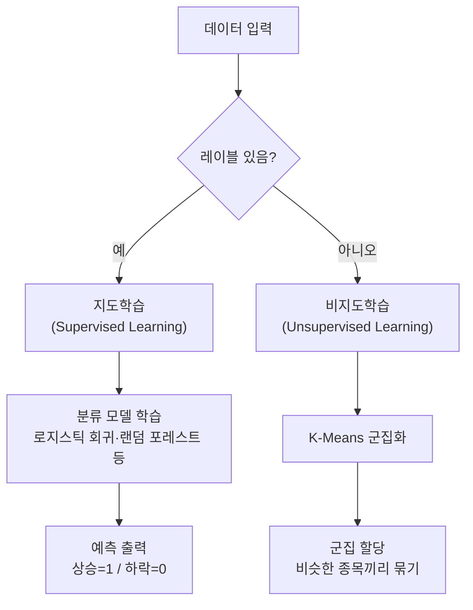
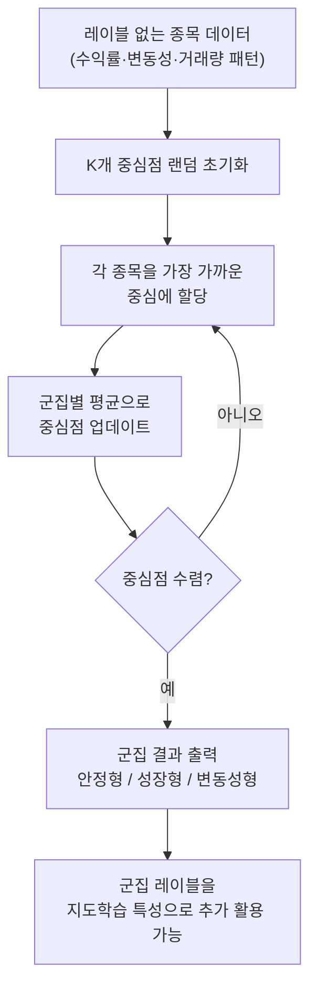

# Day 7. 개념 놀이터: 지도학습과 군집화 구분하기

> 오늘은 "정답을 보고 배우는 AI"와 "정답 없이 무리를 찾는 AI"를 구분하는 날입니다.

---

## 오늘의 목표

- `지도학습`, `비지도학습`, `레이블`, `군집화`를 쉽게 구분합니다.
- 웹앱에서 `정답이 있을 때`와 `정답이 없을 때`의 차이를 느껴봅니다.
- K-Means 같은 군집화가 왜 "정답 맞히기"와 다르게 읽혀야 하는지 배웁니다.

---

## 아주 쉬운 이야기

종목 화면을 정리한다고 생각해 봅시다.

- 종목마다 `상승`, `하락` 이름표가 붙어 있으면: 지도학습
- 이름표는 없고 비슷한 움직임끼리만 모으면: 군집화

즉,

- 지도학습은 **정답 이름표를 보며 배우기**
- 비지도학습은 **비슷한 것끼리 스스로 묶기**

입니다.

---

## 오늘의 낱말 4개

| 낱말 | 한자·영어 | 쉬운 뜻 |
|---|---|---|
| 레이블 | *label* | 정답 이름표. 데이터마다 붙이는 정답값으로, 내일 오르면 1·내리면 0처럼 AI가 배울 기준이 됨 |
| 지도학습 | 指導學習 / *supervised learning* | 정답을 보며 배우는 방법. 指(가리킬 지)+導(이끌 도). 레이블이라는 정답을 선생님처럼 가리켜 주며 학습 |
| 비지도학습 | 非指導學習 / *unsupervised learning* | 정답 없이 구조를 찾는 방법. 非(아닐 비)+指導學習. 정답 없이 데이터 안의 패턴이나 무리를 스스로 발견 |
| 군집화 | 群集化 / *clustering* | 비슷한 것끼리 모으는 방법. 群(무리 군)+集(모을 집)+化(될 화). 비슷한 주가 움직임을 보이는 종목끼리 자동으로 묶음 |

---

## 오늘 열 페이지

- [주식 AI 실험실](/lab)

---

## 오늘의 20분 코스

| 시간 | 할 일 |
|---|---|
| 7분 | 이 문서에서 지도학습과 비지도학습 차이를 읽습니다. |
| 8분 | [주식 AI 실험실](/lab)에서 관련 개념 실습 화면을 봅니다. |
| 5분 | `K` 값을 바꿀 때 그룹 느낌이 어떻게 달라지는지 적습니다. |

---

## 웹앱 따라 하기

1. [주식 AI 실험실](/lab)을 엽니다.
2. 개념 놀이터나 군집화 관련 화면이 보이면 먼저 `레이블`이 있는 경우를 봅니다.
3. 이번에는 `군집화` 모드로 바꿔 같은 점들이 어떻게 묶이는지 봅니다.
4. `K=2`, `K=3`, `K=4`처럼 값을 바꿔 그룹 개수 변화를 관찰합니다.

---

## 오늘의 비교표

| 구분 | 지도학습 | 군집화 |
|---|---|---|
| 정답 이름표 | 있다 | 없다 |
| 목표 | 맞히기 | 묶기 |
| 예시 질문 | 내일 오를까? | 비슷한 종목끼리 묶을까? |
| 읽는 방법 | 점수와 정답 비교 | 그룹 모양과 해석 보기 |

---

## 관찰 미션

- 이름표가 있을 때와 없을 때 느낌이 어떻게 달랐나요?
- `K=2`와 `K=4`는 그룹이 어떻게 달라졌나요?
- 군집화 결과를 왜 "정답"처럼 보면 안 될까요?

---

## 한 줄 숙제

`군집화는 ________을(를) 맞히는 것이 아니라, ________을(를) 찾는 방법이다.`

---

## 주식으로 보면 더 쉬운 예시

### 지도학습 예시

종목마다 이미 정답표가 있다고 해봅시다.

- 삼성전자: 다음 날 상승 = 1
- NAVER: 다음 날 하락 = 0
- 현대차: 다음 날 상승 = 1

이렇게 정답이 붙어 있으면 `맞히기` 연습을 할 수 있습니다.

### 군집화 예시

이번에는 정답표를 떼어 냅니다.

그러면 모델은 이렇게 묶을 수 있습니다.

- 같이 천천히 움직이는 안정형 종목
- 거래량이 자주 튀는 변동성 종목
- 비슷한 뉴스에 같이 반응하는 반도체 종목

### 거시경제 예시

거시경제도 군집처럼 볼 수 있습니다.

- 금리 상승 + 환율 상승 시기
- 금리 안정 + 유가 하락 시기
- CPI 급등 시기

이런 시장 구간을 비슷한 분위기끼리 묶어 보면  
"지금 시장이 어떤 무리인지"를 읽는 데 도움이 됩니다.

---

## 내일 예고

내일은 신경망의 가장 작은 계산 단위인 `뉴런`을 손으로 만지듯 배웁니다.

---

➡️ [다음 문서: Day 8. 뉴런 계산과 신경망 맛보기](08.md)

---

## 알고리즘 처리 흐름 (Day 7)

### 지도학습 vs 비지도학습 비교 흐름

### K-Means 군집화 흐름

---

## 모델 상세 참고 (Day 7)

| 모델 | 수학적 의미 | 탄생 배경 | 주식투자 활용 | 만든 사람/대표 GitHub |
|---|---|---|---|---|
| K-Means | 군집 내 제곱거리 합(WCSS)을 최소화하는 중심 기반 비지도 알고리즘입니다. | 라벨 없는 데이터를 빠르게 구조화해야 하는 요구에서 널리 정착했습니다. | 종목군(방어주/성장주/고변동주) 자동 분류, 시장 국면 묶기에 활용됩니다. | James MacQueen · <https://github.com/scikit-learn/scikit-learn/blob/main/sklearn/cluster/_kmeans.py> |

## 분야별 모델 쓰임새 및 적합도 (Day 7)

| 모델 | 데이터셋 형태 | 헬스케어 | 자율주행 | 주식투자 | 로봇 | AI Ops |
|---|---|---|---|---|---|---|
| K-Means | 레이블 없는 정형 수치 데이터(중간 크기) | 환자 증상 유형 군집, 유전자 발현 패턴 자동 분류 | 도로 환경 상황 군집화, 센서 이상 패턴 묶기 | 종목 성향 군집(방어주·성장주·고변동주), 시장 국면 분류 | 환경 상태 군집화, 태스크 유형 자동 분류 | 로그 이상 패턴 군집, 트래픽 프로파일 자동 분류 |

## 모델 혼합 & 검증 아이디어 (Day 7)

군집화는 단독으로도 유용하지만, **지도학습 모델과 연결하면 훨씬 강력한 파이프라인**이 됩니다.  
K-Means가 먼저 시장을 "읽어주면" 분류 모델이 더 쉽게 배울 수 있습니다.

### 혼합 아이디어

| 혼합 방법 | 어떻게 섞나요? | 왜 좋을까요? |
|---|---|---|
| 군집화 → 분류 파이프라인 | K-Means로 "종목 성향 그룹(안정형/성장형/변동성형)"을 먼저 나누고, 각 그룹에 맞는 분류 모델을 따로 학습 | 성격이 다른 종목을 하나의 모델로 억지로 학습하면 패턴이 뭉개지기 때문에, 먼저 묶고 나서 각자 학습하면 정확도가 높아짐 |
| 군집 레이블 특성 추가 | K-Means가 각 종목에 붙인 "군집 번호"를 특성으로 추가해 랜덤 포레스트나 GBM에 함께 넣음 | 모델이 "이 종목은 변동성형이구나"라는 맥락을 힌트로 받아서 학습 |
| 시장 국면 군집화 | 날짜별로 "상승장/하락장/횡보장"을 K-Means로 먼저 나누고, 국면에 따라 서로 다른 전략 모델 적용 | 시장 분위기가 다를 때 같은 전략을 쓰면 효과가 떨어지므로, 국면별로 다른 모델을 쓰면 더 유연하게 대응 |

### 검증 방법

- **군집 품질 확인**: K 값을 2~6으로 바꾸며 "엘보우 방법"을 씁니다. 군집 내 거리 합(WCSS)이 꺾이는 K 값이 자연스러운 그룹 개수입니다.
- **군집 유의미성 검증**: 같은 군집으로 묶인 종목이 실제로 비슷하게 움직이는지 수익률 상관계수를 비교합니다.
- **군집 전후 분류 성능 비교**: 군집 레이블 없이 학습한 분류 모델과 군집 레이블을 특성으로 추가한 모델의 AUC를 나란히 비교합니다.
- **군집 안정성 확인**: 다른 기간 데이터로 K-Means를 다시 돌렸을 때 비슷한 군집이 나오는지 확인합니다. 군집이 매번 크게 바뀌면 신뢰도가 낮습니다.

> 아주 쉽게 말하면: 학생들을 실력별로 반을 나눈 뒤 각 반에 맞는 선생님을 배치하면 교육 효과가 높아집니다.  
> K-Means로 종목을 나누고 나서 각 그룹에 맞는 모델을 따로 쓰는 것도 같은 원리입니다.

---

## 웹앱 안쪽 들여다보기

### 개념 미니 실습은 무엇을 보여주나요?
주식 AI 실험실의 개념 실습은 작은 예시 점들을 써서 아래 차이를 바로 보여줍니다.
- 지도학습: 정답 레이블이 보이는 상태
- 비지도학습: 정답을 숨기고 구조만 보는 상태
- 군집화: `K` 값을 바꾸며 그룹 수를 바꾸는 상태

### 더 큰 표를 보고 싶다면
데이터셋 허브의 `GET /api/datasets` 와 `GET /api/datasets/{id}` 로 준비된 CSV를 미리 볼 수 있습니다.
이 안에는 군집화 확장 실습에 연결할 수 있는 `stocks_features` 같은 데이터도 들어 있습니다.

즉, Day 7의 웹앱 예시는 “정답 맞히기”와 “무리 찾기”를 화면에서 바로 비교하도록 만든 작은 놀이터입니다.
