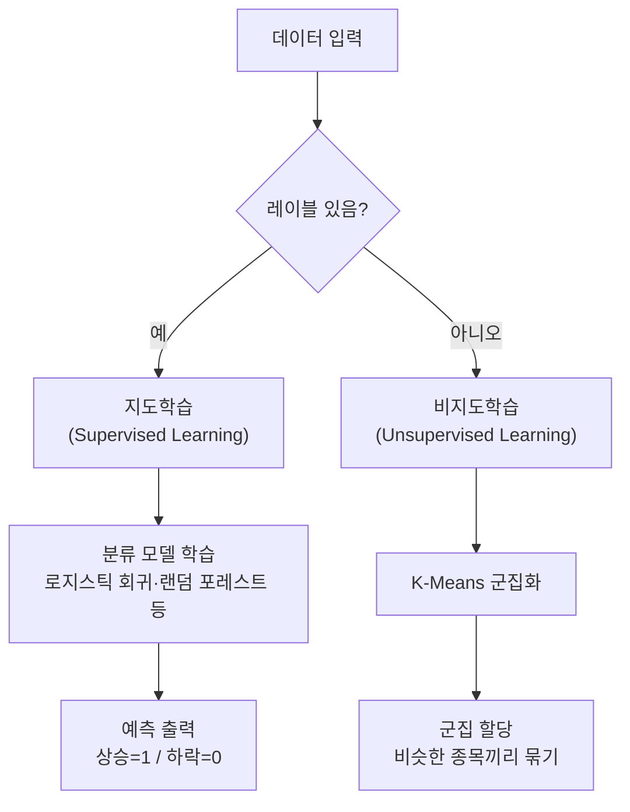
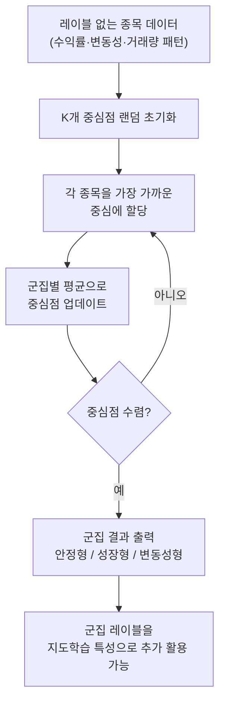
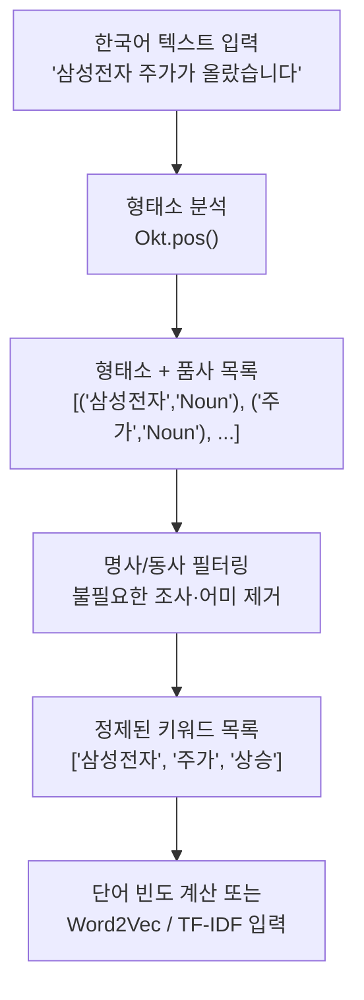
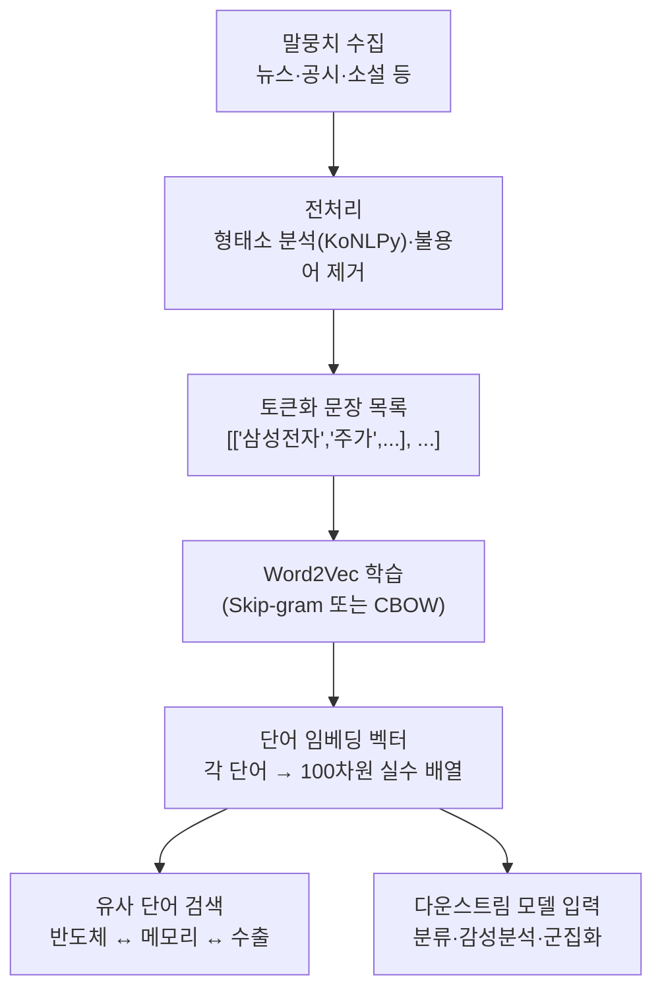

# Day 7. 개념 놀이터: 지도학습과 군집화 구분하기

> 오늘은 "정답을 보고 배우는 AI"와 "정답 없이 무리를 찾는 AI"를 구분하는 날입니다.

---

## 오늘의 목표

- `지도학습`, `비지도학습`, `레이블`, `군집화`를 쉽게 구분합니다.
- 웹앱에서 `정답이 있을 때`와 `정답이 없을 때`의 차이를 느껴봅니다.
- K-Means 같은 군집화가 왜 "정답 맞히기"와 다르게 읽혀야 하는지 배웁니다.

---

## 아주 쉬운 이야기

종목 화면을 정리한다고 생각해 봅시다.

- 종목마다 `상승`, `하락` 이름표가 붙어 있으면: 지도학습
- 이름표는 없고 비슷한 움직임끼리만 모으면: 군집화

즉,

- 지도학습은 **정답 이름표를 보며 배우기**
- 비지도학습은 **비슷한 것끼리 스스로 묶기**

입니다.

---

## 오늘의 낱말 4개

| 낱말 | 한자·영어 | 쉬운 뜻 |
|---|---|---|
| 레이블 | *label* | 정답 이름표. 데이터마다 붙이는 정답값으로, 내일 오르면 1·내리면 0처럼 AI가 배울 기준이 됨 |
| 지도학습 | 指導學習 / *supervised learning* | 정답을 보며 배우는 방법. 指(가리킬 지)+導(이끌 도). 레이블이라는 정답을 선생님처럼 가리켜 주며 학습 |
| 비지도학습 | 非指導學習 / *unsupervised learning* | 정답 없이 구조를 찾는 방법. 非(아닐 비)+指導學習. 정답 없이 데이터 안의 패턴이나 무리를 스스로 발견 |
| 군집화 | 群集化 / *clustering* | 비슷한 것끼리 모으는 방법. 群(무리 군)+集(모을 집)+化(될 화). 비슷한 주가 움직임을 보이는 종목끼리 자동으로 묶음 |

---

## 오늘 열 페이지

- [주식 AI 실험실](/lab)

---

## 오늘의 20분 코스

| 시간 | 할 일 |
|---|---|
| 7분 | 이 문서에서 지도학습과 비지도학습 차이를 읽습니다. |
| 8분 | [주식 AI 실험실](/lab)에서 관련 개념 실습 화면을 봅니다. |
| 5분 | `K` 값을 바꿀 때 그룹 느낌이 어떻게 달라지는지 적습니다. |

---

## 웹앱 따라 하기

1. [주식 AI 실험실](/lab)을 엽니다.
2. 개념 놀이터나 군집화 관련 화면이 보이면 먼저 `레이블`이 있는 경우를 봅니다.
3. 이번에는 `군집화` 모드로 바꿔 같은 점들이 어떻게 묶이는지 봅니다.
4. `K=2`, `K=3`, `K=4`처럼 값을 바꿔 그룹 개수 변화를 관찰합니다.

---

## 오늘의 비교표

| 구분 | 지도학습 | 군집화 |
|---|---|---|
| 정답 이름표 | 있다 | 없다 |
| 목표 | 맞히기 | 묶기 |
| 예시 질문 | 내일 오를까? | 비슷한 종목끼리 묶을까? |
| 읽는 방법 | 점수와 정답 비교 | 그룹 모양과 해석 보기 |

---

## 관찰 미션

- 이름표가 있을 때와 없을 때 느낌이 어떻게 달랐나요?
- `K=2`와 `K=4`는 그룹이 어떻게 달라졌나요?
- 군집화 결과를 왜 "정답"처럼 보면 안 될까요?

---

## 한 줄 숙제

`군집화는 ________을(를) 맞히는 것이 아니라, ________을(를) 찾는 방법이다.`

---

## 주식으로 보면 더 쉬운 예시

### 지도학습 예시

종목마다 이미 정답표가 있다고 해봅시다.

- 삼성전자: 다음 날 상승 = 1
- NAVER: 다음 날 하락 = 0
- 현대차: 다음 날 상승 = 1

이렇게 정답이 붙어 있으면 `맞히기` 연습을 할 수 있습니다.

### 군집화 예시

이번에는 정답표를 떼어 냅니다.

그러면 모델은 이렇게 묶을 수 있습니다.

- 같이 천천히 움직이는 안정형 종목
- 거래량이 자주 튀는 변동성 종목
- 비슷한 뉴스에 같이 반응하는 반도체 종목

### 거시경제 예시

거시경제도 군집처럼 볼 수 있습니다.

- 금리 상승 + 환율 상승 시기
- 금리 안정 + 유가 하락 시기
- CPI 급등 시기

이런 시장 구간을 비슷한 분위기끼리 묶어 보면  
"지금 시장이 어떤 무리인지"를 읽는 데 도움이 됩니다.

---


## 알고리즘 처리 흐름 (Day 7)

### 지도학습 vs 비지도학습 비교 흐름



### K-Means 군집화 흐름



---

## 모델 상세 참고 (Day 7)

| 모델 | 수학적 의미 | 탄생 배경 | 주식투자 활용 | 만든 사람/대표 GitHub |
|---|---|---|---|---|
| K-Means | 군집 내 제곱거리 합(WCSS)을 최소화하는 중심 기반 비지도 알고리즘입니다. | 라벨 없는 데이터를 빠르게 구조화해야 하는 요구에서 널리 정착했습니다. | 종목군(방어주/성장주/고변동주) 자동 분류, 시장 국면 묶기에 활용됩니다. | James MacQueen · <https://github.com/scikit-learn/scikit-learn/blob/main/sklearn/cluster/_kmeans.py> |

## 분야별 모델 쓰임새 및 적합도 (Day 7)

| 모델 | 데이터셋 형태 | 헬스케어 | 자율주행 | 주식투자 | 로봇 | AI Ops |
|---|---|---|---|---|---|---|
| K-Means | 레이블 없는 정형 수치 데이터(중간 크기) | 환자 증상 유형 군집, 유전자 발현 패턴 자동 분류 | 도로 환경 상황 군집화, 센서 이상 패턴 묶기 | 종목 성향 군집(방어주·성장주·고변동주), 시장 국면 분류 | 환경 상태 군집화, 태스크 유형 자동 분류 | 로그 이상 패턴 군집, 트래픽 프로파일 자동 분류 |

## 모델 혼합 & 검증 아이디어 (Day 7)

군집화는 단독으로도 유용하지만, **지도학습 모델과 연결하면 훨씬 강력한 파이프라인**이 됩니다.  
K-Means가 먼저 시장을 "읽어주면" 분류 모델이 더 쉽게 배울 수 있습니다.

### 혼합 아이디어

| 혼합 방법 | 어떻게 섞나요? | 왜 좋을까요? |
|---|---|---|
| 군집화 → 분류 파이프라인 | K-Means로 "종목 성향 그룹(안정형/성장형/변동성형)"을 먼저 나누고, 각 그룹에 맞는 분류 모델을 따로 학습 | 성격이 다른 종목을 하나의 모델로 억지로 학습하면 패턴이 뭉개지기 때문에, 먼저 묶고 나서 각자 학습하면 정확도가 높아짐 |
| 군집 레이블 특성 추가 | K-Means가 각 종목에 붙인 "군집 번호"를 특성으로 추가해 랜덤 포레스트나 GBM에 함께 넣음 | 모델이 "이 종목은 변동성형이구나"라는 맥락을 힌트로 받아서 학습 |
| 시장 국면 군집화 | 날짜별로 "상승장/하락장/횡보장"을 K-Means로 먼저 나누고, 국면에 따라 서로 다른 전략 모델 적용 | 시장 분위기가 다를 때 같은 전략을 쓰면 효과가 떨어지므로, 국면별로 다른 모델을 쓰면 더 유연하게 대응 |

### 검증 방법

- **군집 품질 확인**: K 값을 2~6으로 바꾸며 "엘보우 방법"을 씁니다. 군집 내 거리 합(WCSS)이 꺾이는 K 값이 자연스러운 그룹 개수입니다.
- **군집 유의미성 검증**: 같은 군집으로 묶인 종목이 실제로 비슷하게 움직이는지 수익률 상관계수를 비교합니다.
- **군집 전후 분류 성능 비교**: 군집 레이블 없이 학습한 분류 모델과 군집 레이블을 특성으로 추가한 모델의 AUC를 나란히 비교합니다.
- **군집 안정성 확인**: 다른 기간 데이터로 K-Means를 다시 돌렸을 때 비슷한 군집이 나오는지 확인합니다. 군집이 매번 크게 바뀌면 신뢰도가 낮습니다.

> 아주 쉽게 말하면: 학생들을 실력별로 반을 나눈 뒤 각 반에 맞는 선생님을 배치하면 교육 효과가 높아집니다.  
> K-Means로 종목을 나누고 나서 각 그룹에 맞는 모델을 따로 쓰는 것도 같은 원리입니다.

---

## 웹앱 안쪽 들여다보기

### 개념 미니 실습은 무엇을 보여주나요?
주식 AI 실험실의 개념 실습은 작은 예시 점들을 써서 아래 차이를 바로 보여줍니다.
- 지도학습: 정답 레이블이 보이는 상태
- 비지도학습: 정답을 숨기고 구조만 보는 상태
- 군집화: `K` 값을 바꾸며 그룹 수를 바꾸는 상태

### 더 큰 표를 보고 싶다면
데이터셋 허브의 `GET /api/datasets` 와 `GET /api/datasets/{id}` 로 준비된 CSV를 미리 볼 수 있습니다.
이 안에는 군집화 확장 실습에 연결할 수 있는 `stocks_features` 같은 데이터도 들어 있습니다.

즉, Day 7의 웹앱 예시는 “정답 맞히기”와 “무리 찾기”를 화면에서 바로 비교하도록 만든 작은 놀이터입니다.

---

## 업종 분류 예시: 로봇 관련주 vs 반도체 관련주

지도학습의 실제 활용 예로, 종목 설명 텍스트를 보고 **로봇 관련주**와 **반도체 관련주**를 자동으로 구분하는 분류 문제를 생각해볼 수 있습니다.

### 구분 기준

- **로봇 관련주**: 로봇 완성품, 감속기, 센서, 제어기 등 핵심 부품을 생산하는 기업
- **반도체 관련주**: GPU, NPU, 메모리, 전력 반도체 등 첨단 기술을 가능하게 하는 칩을 생산하는 기업

| 구분 | 로봇 관련주 | 반도체 관련주 |
|------|-------------|---------------|
| 핵심 제품 | 로봇 완성품, 감속기, 센서, 제어기 | GPU, NPU, 메모리, 전력 반도체 |
| 대표 기업 | 레인보우로보틱스, 두산로보틱스, 유진로봇, SPG | 삼성전자, SK하이닉스, 엔비디아, AMD |
| 투자 포인트 | 산업·서비스 로봇 수요 증가 | AI·클라우드·자율주행 확산 |
| 리스크 | 기술 국산화 속도, 글로벌 경쟁 | 공급망 불안, 사이클 변동성 |

### ML/DL 알고리즘으로 분류하기

종목 이름이나 사업 내용 텍스트를 입력으로 받아 로봇주·반도체주를 자동 분류할 때 쓸 수 있는 알고리즘은 다음과 같습니다.

- **로지스틱 회귀**: 단순 이진 분류에 적합
- **랜덤 포레스트**: 다양한 특징 반영 가능
- **SVM**: 고차원 텍스트 데이터 분류에 강력
- **딥러닝 기반 모델**
  - RNN/LSTM: 시퀀스 데이터 분석
  - CNN: 텍스트 패턴 자동 추출
  - Transformer (BERT, GPT): 문맥적 이해 기반 분류

웹앱 실습에서는 `chapter113`에서 **TF-IDF + 로지스틱 회귀·랜덤 포레스트·SVM**으로 업종 텍스트 분류를 직접 실행해볼 수 있습니다.

### PyTorch + BERT 예시 코드

더 강력한 문맥 이해가 필요할 때는 BERT 같은 Transformer 모델을 사용할 수 있습니다.

```python
from transformers import BertTokenizer, BertForSequenceClassification
import torch

tokenizer = BertTokenizer.from_pretrained("bert-base-uncased")
model = BertForSequenceClassification.from_pretrained("bert-base-uncased", num_labels=2)

texts = ["이 회사는 산업용 로봇과 감속기를 생산합니다.", "이 기업은 GPU와 메모리 반도체를 개발합니다."]
labels = [0, 1]  # 0=로봇, 1=반도체

inputs = tokenizer(texts, return_tensors="pt", padding=True, truncation=True)
outputs = model(**inputs)
```

> BERT는 `transformers` 라이브러리와 PyTorch가 필요합니다. 가벼운 실습은 `chapter113`의 TF-IDF 기반 코드를 먼저 사용해 보세요.

---

## KoNLPy: 한국어 형태소 분석 라이브러리

**KoNLPy**(Korean NLP in Python)는 한국어 자연어 처리를 위한 파이썬 라이브러리입니다.  
한국어는 조사·어미가 단어에 붙어 변형되는 교착어라서, 영어처럼 공백으로 단순하게 나눌 수 없습니다.  
KoNLPy는 이런 한국어 특성을 다루는 **형태소 분석기**를 한 곳에 모아 제공합니다.

### 대표 형태소 분석기

| 분석기 | 특징 | 활용 상황 |
|---|---|---|
| **Okt** (Open Korean Text) | 속도가 빠르고 SNS·비정형 텍스트에 강함 | 뉴스 댓글, 주식 커뮤니티 텍스트 분석 |
| **Kkma** (꼬꼬마) | 정밀도가 높고 학술적 텍스트 분석에 강함 | 논문, 공문서, 정밀 분류 |
| **Mecab** | 속도가 가장 빠르고 대용량 처리에 유리 | 대규모 코퍼스 전처리 |

### Okt 기본 사용 예시

```python
from konlpy.tag import Okt

okt = Okt()

sentence = "삼성전자 주가가 오늘 크게 올랐습니다."

# 형태소 분리
morphs = okt.morphs(sentence)
# → ['삼성전자', '주가', '가', '오늘', '크게', '올랐습니다', '.']

# 품사 태깅 (형태소 + 품사)
pos = okt.pos(sentence)
# → [('삼성전자', 'Noun'), ('주가', 'Noun'), ('가', 'Josa'),
#    ('오늘', 'Noun'), ('크게', 'Adverb'), ('올랐습니다', 'Verb'), ('.', 'Punctuation')]

# 명사만 추출
nouns = okt.nouns(sentence)
# → ['삼성전자', '주가', '오늘']
```

### 주식 뉴스 분석에 활용하면

```python
from konlpy.tag import Okt
from collections import Counter

okt = Okt()
news = "반도체 수출이 증가하며 삼성전자와 SK하이닉스 주가가 동반 상승했습니다."

# 명사만 추출해 키워드 분석
nouns = okt.nouns(news)
keyword_count = Counter(nouns)
# → Counter({'삼성전자': 1, '반도체': 1, '수출': 1, '주가': 1, ...})
```

> **핵심 포인트**: KoNLPy는 한국어 텍스트를 의미 단위(형태소)로 쪼개는 도구입니다.  
> 뉴스, 공시, 커뮤니티 글에서 **핵심 키워드를 추출**하거나 **BoW(단어 가방) 벡터**를 만들 때 첫 번째 전처리 단계로 사용됩니다.

### KoNLPy 처리 흐름



---

## Word2Vec과 Gensim: 단어를 숫자 벡터로 바꾸기

### 말뭉치(Corpus)란?

**말뭉치**는 AI 모델을 학습시키기 위해 수집한 **텍스트 데이터의 묶음**입니다.  
예를 들어 수십만 개의 뉴스 기사, 위키백과 문서, 소설 전집, 주식 공시 모음이 모두 말뭉치입니다.

| 구분 | 예시 | 활용 |
|---|---|---|
| 일반 말뭉치 | 위키백과, 뉴스 기사, 소설 | 범용 언어 모델 학습 |
| 도메인 말뭉치 | 금융 공시, 법률 문서, 의료 기록 | 특화 모델 파인튜닝 |
| 한국어 말뭉치 | 국립국어원 모두의말뭉치, AI Hub 한국어 데이터 | 한국어 NLP 모델 학습 |

> 말뭉치가 크고 다양할수록 모델이 더 풍부한 언어 지식을 배울 수 있습니다.

### Word2Vec: 단어를 벡터 공간에 올리기

**Word2Vec**은 단어의 의미를 실수 벡터(숫자 배열)로 표현하는 기법입니다.  
비슷한 문맥에서 자주 함께 나오는 단어들은 벡터 공간에서도 가까이 위치합니다.

| 특성 | 설명 |
|---|---|
| 입력 | 대규모 텍스트 말뭉치 |
| 출력 | 단어마다 고정 크기 벡터(예: 100차원) |
| 핵심 아이디어 | 비슷한 문맥에 나오는 단어 = 비슷한 벡터 |
| 유명한 예 | `왕 - 남자 + 여자 ≈ 여왕` (벡터 연산이 의미를 가짐) |

#### 두 가지 학습 방법

| 방법 | 설명 | 특징 |
|---|---|---|
| **Skip-gram** | 중심 단어 → 주변 단어를 예측 | 희귀 단어에 강함, 학습 느림 |
| **CBOW** (Continuous Bag of Words) | 주변 단어 → 중심 단어를 예측 | 빈번 단어에 강함, 학습 빠름 |

### Gensim: 파이썬 Word2Vec 라이브러리

**Gensim**은 Word2Vec을 포함한 다양한 토픽 모델·임베딩 학습을 제공하는 파이썬 라이브러리입니다.  
설치가 간단하고 대용량 말뭉치도 메모리 효율적으로 처리할 수 있습니다.

```python
from gensim.models import Word2Vec
from konlpy.tag import Okt

okt = Okt()

# 말뭉치 준비 (문장 목록)
corpus = [
    "삼성전자 주가가 반도체 수출 호조로 상승했습니다.",
    "SK하이닉스 메모리 반도체 수요가 늘고 있습니다.",
    "현대차 전기차 판매량이 증가하며 주가도 올랐습니다.",
]

# 형태소 분석 후 명사만 추출해 토큰화
tokenized = [okt.nouns(sentence) for sentence in corpus]
# → [['삼성전자', '주가', '반도체', '수출', '호조', '상승'],
#    ['SK하이닉스', '메모리', '반도체', '수요'],
#    ['현대차', '전기차', '판매량', '주가']]

# Word2Vec 학습
model = Word2Vec(
    sentences=tokenized,
    vector_size=100,   # 벡터 차원 수
    window=5,          # 문맥 창 크기
    min_count=1,       # 최소 등장 빈도
    workers=4,         # 병렬 처리 스레드 수
    sg=1               # 1=Skip-gram, 0=CBOW
)

# 비슷한 단어 찾기
similar = model.wv.most_similar("반도체", topn=3)
# → [('메모리', 0.85), ('수출', 0.72), ('주가', 0.68)]

# 단어 벡터 확인
vector = model.wv["삼성전자"]  # shape: (100,)
```

### Word2Vec 처리 흐름



### 주식 투자에 연결하면

- **뉴스 유사도 비교**: 두 기사의 평균 벡터 거리로 주제 유사성 측정
- **종목 연관어 발굴**: "반도체"와 가까운 종목명·이슈어 자동 추출
- **감성 분석 특성**: Word2Vec 벡터를 감성 분류 모델의 입력으로 사용

> **핵심 포인트**: Word2Vec은 텍스트를 숫자로 변환하는 가장 기본적이고 직관적인 방법입니다.  
> KoNLPy로 형태소를 분리한 뒤 Gensim으로 Word2Vec을 학습하면 한국어 뉴스·공시에서 의미 있는 패턴을 찾을 수 있습니다.

---

## Hugging Face Hub: AI 모델과 데이터셋의 집합소

**Hugging Face Hub**(<https://huggingface.co>)는 수십만 개의 사전학습 모델과 데이터셋을 무료로 공유하는 플랫폼입니다.  
PyTorch·TensorFlow·JAX 어느 프레임워크로도 사용할 수 있으며, 특히 한국어 모델도 많이 공개되어 있습니다.

### 주요 기능

| 기능 | 설명 |
|---|---|
| **Model Hub** | BERT, GPT, LLaMA, Gemma 등 사전학습 모델 다운로드 |
| **Dataset Hub** | 텍스트·이미지·음성 데이터셋 공유 및 다운로드 |
| **Spaces** | 모델을 웹 데모로 배포하는 공간 |
| **Inference API** | 코드 없이 API로 모델 사용 |

### 한국어 NLP 활용 예시

```python
from transformers import pipeline

# Hugging Face에서 한국어 감성분석 파이프라인 로드
classifier = pipeline(
    "text-classification",
    model="snunlp/KR-FinBert-SC"   # 한국어 금융 BERT 모델
)

texts = [
    "삼성전자 실적이 시장 기대치를 크게 웃돌았습니다.",
    "반도체 재고 과잉으로 하락세가 이어질 전망입니다."
]

results = classifier(texts)
# → [{'label': 'positive', 'score': 0.92}, {'label': 'negative', 'score': 0.87}]
```

### 대표 한국어 모델

| 모델 | 공개 기관 | 특징 |
|---|---|---|
| `klue/bert-base` | KLUE 팀 | 한국어 BERT 기준 모델 |
| `klue/roberta-large` | KLUE 팀 | 고성능 한국어 RoBERTa |
| `snunlp/KR-FinBert-SC` | 서울대 NLP | 한국어 금융 감성분석 특화 |
| `BAAI/bge-m3` | BAAI | 다국어 임베딩 모델 |
| `upstage/SOLAR-10.7B-Instruct-v1.0` | Upstage | 한국어·영어 지원 LLM |
| `LGAI-EXAONE/EXAONE-3.5-7.8B-Instruct` | LG AI | 한국어 특화 LLM |

**Hugging Face `datasets` 라이브러리**로 데이터셋도 한 줄로 불러올 수 있습니다.

```python
from datasets import load_dataset
ds = load_dataset("klue", "sts")   # 한국어 유사도 평가 데이터셋
```

---

## 한국 AI Hub: 국내 최대 AI 학습 데이터 플랫폼

**AI Hub**(<https://aihub.or.kr>)는 과학기술정보통신부와 한국지능정보사회진흥원(NIA)이 운영하는 **한국어 AI 학습 데이터 공개 플랫폼**입니다.  
회원가입 후 무료로 다양한 한국어 데이터셋을 신청·다운로드할 수 있습니다.

### 주요 데이터 카테고리

| 카테고리 | 대표 데이터셋 | NLP 활용 |
|---|---|---|
| **자연어** | 한국어 대화, 뉴스 기사, 도서 말뭉치 | 언어 모델 학습·파인튜닝 |
| **금융** | 금융 질의응답, 경제 뉴스 요약 | 금융 특화 모델 |
| **의료** | 의료 상담 텍스트, 임상 기록 | 의료 NLP |
| **법률** | 판례 요약, 법령 문서 | 법률 AI |
| **음성** | 한국어 음성 인식, 다화자 데이터 | STT·TTS |

### Word2Vec 학습에 AI Hub 말뭉치 활용하기

```python
# AI Hub에서 다운로드한 한국어 뉴스 말뭉치를 Word2Vec으로 학습
import json
from gensim.models import Word2Vec
from konlpy.tag import Okt

okt = Okt()

# AI Hub 뉴스 JSON 파일 읽기
with open("aihub_news.json", encoding="utf-8") as f:
    data = json.load(f)

# 형태소 분석해 명사 추출
corpus = [okt.nouns(item["content"]) for item in data]

# Word2Vec 학습
model = Word2Vec(corpus, vector_size=200, window=5, min_count=3, workers=8)
model.save("aihub_news_w2v.model")

# 모델 재사용
model = Word2Vec.load("aihub_news_w2v.model")
print(model.wv.most_similar("주가", topn=5))
```

### AI Hub vs Hugging Face 비교

| 항목 | AI Hub | Hugging Face |
|---|---|---|
| 운영 | 한국 정부(NIA) | 민간 기업 |
| 주요 언어 | **한국어** | 다국어(영어 위주) |
| 데이터 | 원천 데이터(텍스트·음성·이미지) | 벤치마크·파인튜닝 데이터셋 |
| 모델 | 일부 제공 | 수십만 개 모델 |
| 접근 | 회원가입 후 신청·승인 | 즉시 다운로드 |
| 활용 | 한국어 특화 모델 학습 말뭉치 | 사전학습 모델·파이프라인 |

> **실습 팁**: AI Hub에서 한국어 말뭉치를 받아 Gensim으로 Word2Vec을 학습하고,  
> 그 벡터를 Hugging Face 모델의 임베딩 레이어 초기값으로 활용하면 한국어 성능을 높일 수 있습니다.

---

## 마르코프체인(Markov Chain): 통계 기반 텍스트 생성

**마르코프체인**은 신경망 없이 **현재 상태만 보고 다음 상태를 확률적으로 예측**하는 통계 모델입니다.  
텍스트 생성에서는 "앞 단어(들)가 주어졌을 때, 다음 단어가 무엇일 확률이 높은가?"를 학습한 뒤 문장을 만들어냅니다.

### 직관적인 이해

| 방식 | 기억 범위 | 예시 |
|---|---|---|
| 1-gram (Unigram) | 이전 상태 0개 | 단어를 완전 무작위 선택 |
| 2-gram (Bigram) | 이전 단어 1개 | "삼성" 다음엔 "전자"가 자주 옴 |
| 3-gram (Trigram) | 이전 단어 2개 | "삼성전자 주가" 다음엔 "상승"이 자주 옴 |

```python
import random
from collections import defaultdict
from konlpy.tag import Okt

okt = Okt()

def build_markov_chain(text, n=3):
    """n-gram 마르코프체인 딕셔너리 구축"""
    tokens = okt.pos(text)            # 형태소 + 품사 분리
    chain = defaultdict(list)
    for i in range(len(tokens) - n):
        key = tuple(tokens[i:i+n])    # n개 토큰을 키로 사용
        chain[key].append(tokens[i+n])  # 다음 토큰을 값으로 저장
    return chain

def generate_text(chain, n=3, length=20):
    """마르코프체인으로 문장 생성"""
    start = random.choice(list(chain.keys()))
    result = list(start)
    for _ in range(length):
        key = tuple(result[-n:])
        if key not in chain:
            break
        next_token = random.choice(chain[key])
        result.append(next_token)
    return "".join([word for word, _ in result])
```

### 마르코프체인 vs LSTM 비교

| 비교 항목 | 마르코프체인 | LSTM |
|---|---|---|
| 학습 방식 | 통계(빈도 카운팅) | 신경망(역전파 학습) |
| 문맥 범위 | 고정 n개 이전 토큰만 | 긴 시퀀스 전체를 기억 |
| 계산 비용 | 매우 낮음 | 높음(GPU 권장) |
| 생성 품질 | 어색한 문장 빈도가 높음 | 더 자연스러운 문장 생성 |
| 해석 가능성 | 높음(빈도 테이블로 확인 가능) | 낮음(블랙박스) |
| 활용 | 빠른 프로토타입, 교육 목적 | 실제 언어모델, 챗봇 등 |

### 주식 투자에 연결하면

마르코프체인의 "이전 상태 → 다음 상태 확률" 구조는 주가 흐름에도 적용할 수 있습니다.

```
상승 → 상승 : 55%
상승 → 하락 : 45%
하락 → 상승 : 42%
하락 → 하락 : 58%
```

이렇게 만들어 두면 "오늘 상승했을 때 내일 또 상승할 확률"을 간단하게 추정할 수 있습니다.  
(단, 실제 주가는 이보다 훨씬 복잡한 요인이 작용하므로 단독 활용은 주의가 필요합니다.)

> **핵심 포인트**: 마르코프체인은 신경망 이전 방식의 텍스트·시퀀스 생성 모델입니다.  
> LSTM이나 Transformer보다 단순하지만 계산 비용이 낮고 원리가 명확해, NLP 입문 실습과 빠른 프로토타입에 자주 사용됩니다.
