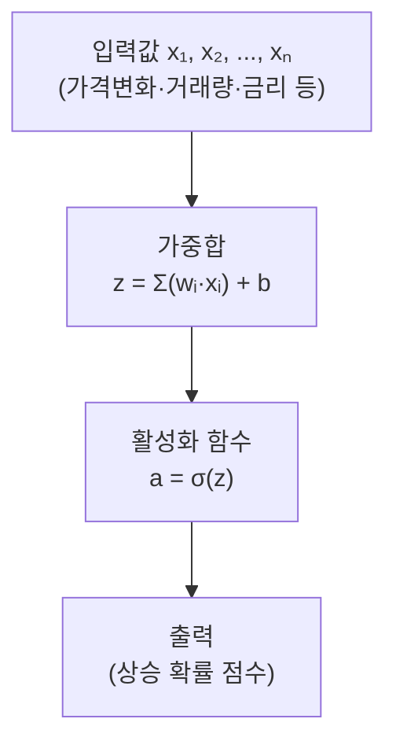
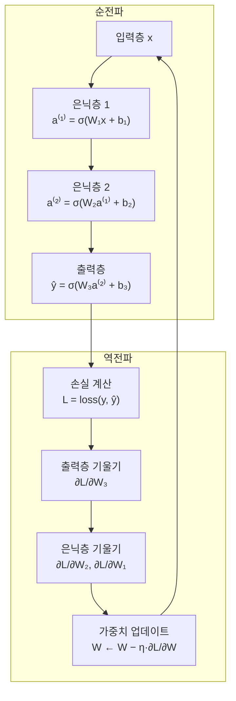

# Day 8. 뉴런 계산 맛보기: 신경망도 작은 계산의 모임

> 오늘은 신경망을 무서운 검은 상자가 아니라, 작은 계산 블록이 많이 모인 구조로 이해하는 날입니다.

---

## 오늘의 목표

- `가중합`, `편향`, `시그모이드`, `오차`, `비용`을 아주 쉽게 이해합니다.
- [주식 AI 실험실](/lab)의 뉴런 계산 미니 실습을 따라 해봅니다.
- 신경망도 결국 숫자를 곱하고 더하고 바꾸는 과정이라는 걸 느낍니다.

---

## 뉴런을 아주 쉽게 생각하면

뉴런은 여러 주가 힌트를 받아서 점수를 내는 **작은 계산 도구**입니다.

하는 일은 늘 비슷합니다.

1. 입력을 받는다
2. 중요도를 곱한다
3. 다 더한다
4. 기본 점수를 더한다
5. 결과를 읽기 쉬운 모양으로 바꾼다

---

## 오늘의 낱말 8개

| 낱말 | 한자·영어 | 쉬운 뜻 |
|---|---|---|
| 입력 | 入力 / *input* | 모델에 넣는 재료. 入(들 입)+力(힘 력). 수익률·거래량·이동평균처럼 AI에게 주는 정보 |
| 가중치 | 加重値 / *weight* | 힌트의 중요도. 加(더할 가)+重(무거울 중)+値(값 치). 값이 클수록 그 정보를 더 많이 반영함 |
| 편향 | 偏向 / *bias* | 기본 시작점. 偏(치우칠 편)+向(향할 향). 가중합에 더해 판단 기준을 위아래로 이동시키는 보정값 |
| 시그모이드 | *sigmoid* | 결과를 0~1처럼 읽기 쉽게 바꾸는 함수. S자 곡선 모양으로, 점수를 상승 확률처럼 변환 |
| 비용 | 費用 / *cost / loss* | 틀린 정도를 모은 벌점. 費(쓸 비)+用(쓸 용). 예측이 실제와 얼마나 다른지 합산한 숫자 |
| 은닉층 | 隱匿層 / *hidden layer* | 입력층과 출력층 사이의 중간 계산 층. 隱(숨을 은)+匿(숨길 닉)+層(층 층). 사람이 직접 들여다보기 어렵기 때문에 '숨겨진 층'이라고 부름. 층이 많을수록 더 복잡한 패턴을 배울 수 있음 |
| 역전파 | 逆傳播 / *backpropagation* | 오차를 출력층→은닉층→입력층 방향으로 거꾸로 전달하며 가중치를 수정하는 과정. 逆(거꾸로 역)+傳(전할 전)+播(퍼질 파). 시험 후 틀린 문제를 뒤에서부터 되짚어 수정하는 원리 |
| 상승 확률 | 上昇確率 / *probability of rise* | 내일 주가가 오를 가능성을 0~1 사이 숫자로 나타낸 값. 上(위 상)+昇(오를 승)+確(확실할 확)+率(비율 률). 시그모이드를 거쳐 나온 신경망의 최종 출력값 |

---

## 오늘 열 페이지

- [주식 AI 실험실](/lab)

---

## 오늘의 25분 코스

| 시간 | 할 일 |
|---|---|
| 8분 | 이 문서에서 뉴런 계산 말뜻 읽기 |
| 12분 | [주식 AI 실험실](/lab)에서 입력값, 가중치, 편향을 바꿔 보기 |
| 5분 | 신경망 모델까지 실행해 연결해 보기 |

---

## 웹앱 따라 하기

1. [주식 AI 실험실](/lab)을 엽니다.
2. 아래쪽 `뉴런 계산 미니 실습` 영역을 찾습니다.
3. `가중합` 모드에서 숫자를 바꿔 결과가 어떻게 커지거나 작아지는지 봅니다.
4. `편향` 모드로 바꿔 기본 점수가 움직이는 걸 봅니다.
5. `시그모이드` 모드에서 값이 0~1 사이 느낌으로 바뀌는 걸 봅니다.
6. 마지막으로 모델 버튼에서 `신경망`을 눌러 실제 예측 화면과 이어 봅니다.

---

## 아주 작은 계산 예시

입력이 2개라고 해봅시다.

- 가격 변화: `0.6`
- 거래량 변화: `0.2`

가중치가

- `0.8`
- `0.3`

이면 먼저 곱해서 더합니다.  
그다음 편향을 더하고, 시그모이드로 보기 쉽게 바꿀 수 있습니다.

즉, 신경망은 결국  
**힌트를 보고 점수를 만든 뒤 읽기 쉬운 결과로 바꾸는 계산**입니다.

---

## 관찰 미션

- 어떤 입력의 가중치를 키우면 결과가 더 크게 바뀌었나요?
- 편향은 왜 `기본 점수`라고 부를 수 있을까요?
- 시그모이드를 거치면 왜 결과를 확률처럼 읽기 쉬워질까요?

---

## 한 줄 숙제

`신경망 뉴런은 입력에 ________를 곱하고, ________을(를) 더해 점수를 만든다.`

---

## 주식 예측으로 바꾼 아주 쉬운 뉴런 예시

입력 3개가 있다고 생각해 봅시다.

- 오늘 주가 변화: `+0.7`
- 거래량 증가: `+0.5`
- 미국 금리 뉴스 영향: `-0.4`

뉴런은 이렇게 생각할 수 있습니다.

- 주가 변화는 중요하니까 크게 본다
- 거래량도 조금 본다
- 금리 악재는 점수를 깎는다

그러면 뉴런은 이 세 힌트를 섞어서  
`상승 가능성 점수` 하나를 만듭니다.

즉, 신경망도 결국은

- 종목 힌트
- 기술 지표 힌트
- 거시경제 힌트

를 숫자로 섞어 보는 계산기라고 생각하면 쉽습니다.

---

## 내일 예고

내일은 내 파일을 직접 넣는 업로드 실험으로 갑니다.  
웹앱이 내 CSV를 읽고 회사별 결과를 비교해 주는 흐름을 배웁니다.

---

➡️ [다음 문서: Day 9. CSV 업로드 실험](09.md)

---

## 알고리즘 처리 흐름 (Day 8)

### 퍼셉트론(단일 뉴런) 흐름

### 다층 신경망(MLP) + 역전파 흐름

---

## 모델 상세 참고 (Day 8)

| 모델 | 수학적 의미 | 탄생 배경 | 주식투자 활용 | 만든 사람/대표 GitHub |
|---|---|---|---|---|
| 퍼셉트론/뉴런 | `z=w^Tx+b`, `a=σ(z)` 형태의 가장 작은 분류 계산 단위입니다. | 생물학적 뉴런을 수학적으로 모사하려는 초기 AI 연구에서 출발했습니다. | 개별 특성(가격·거래량·금리)의 영향 방향과 크기를 직관적으로 설명할 수 있습니다. | Frank Rosenblatt(퍼셉트론) · <https://github.com/scikit-learn/scikit-learn/blob/main/sklearn/linear_model/_perceptron.py> |
| 다층 신경망(MLP) | 은닉층을 통해 비선형 특징 조합을 학습하고 역전파로 가중치를 갱신합니다. | XOR 문제 등 선형 분리 한계를 넘기 위해 다층 구조가 본격 발전했습니다. | 상승확률 분류, 멀티특성 결합 신호 탐지, 복합 시장 패턴 학습에 사용됩니다. | Rumelhart, Hinton, Williams · <https://github.com/scikit-learn/scikit-learn/blob/main/sklearn/neural_network/_multilayer_perceptron.py> |

## 분야별 모델 쓰임새 및 적합도 (Day 8)

| 모델 | 데이터셋 형태 | 헬스케어 | 자율주행 | 주식투자 | 로봇 | AI Ops |
|---|---|---|---|---|---|---|
| 퍼셉트론/뉴런 | 소규모 선형 분리 가능 정형 데이터 | 교육용 단순 진단 분류 데모, 임상 개념 설명 | 기초 제어 개념 설명, 저속 단순 환경 | 개별 특성 영향 방향·크기 이해용 기초 | 기초 제어 학습 시작점, 단순 반사 동작 | 단순 임계값 기반 이상 감지 개념 교육 |
| 다층 신경망(MLP) | 정형 수치 데이터, 중간~대용량 | 복잡한 진단 패턴, 의료 영상 특성·복합 신호 분류 | 비선형 센서 융합, 주행 결정 신호 생성 | 상승확률 분류, 멀티특성 결합 신호 탐지 | 복잡한 동작 제어, 다감각 데이터 처리 | 복합 메트릭 이상 탐지, 장애 패턴 인식 |

## 모델 혼합 & 검증 아이디어 (Day 8)

뉴런 구조를 이해하면 **신경망의 깊이(층 수)를 바꿔가며 어느 복잡도가 가장 적합한지** 직접 비교할 수 있습니다.  
단층 뉴런(퍼셉트론)부터 시작해 MLP까지 단계적으로 혼합하면 과적합 없이 최적 구조를 찾을 수 있습니다.

### 혼합 아이디어

| 혼합 방법 | 어떻게 섞나요? | 왜 좋을까요? |
|---|---|---|
| 복잡도 단계별 비교 | 단층(로지스틱 회귀), 1은닉층 MLP, 2은닉층 MLP, 3은닉층 MLP를 같은 데이터로 학습해 점수를 비교 | 주식 데이터에서 층이 많다고 항상 좋은 것은 아니므로, 딱 맞는 복잡도를 찾을 수 있음 |
| 신경망 + 트리 앙상블 | MLP의 출력(상승 확률)과 랜덤 포레스트의 출력을 평균 냄 | 신경망은 복합 패턴을, 랜덤 포레스트는 특성 중요도 기반 안정 신호를 보완해줌 |
| 특성별 역할 분담 | MLP는 수치 특성(가격, 거래량, 이동평균)을 처리하고, 별도의 간단한 분류기가 이벤트 신호(골든크로스 여부)를 처리해 두 출력을 결합 | 신경망이 잘 못 보는 이진 이벤트 신호를 단순 모델이 보완 |

### 검증 방법

- **학습/검증 손실 곡선**: 학습(epoch)이 진행될수록 학습 손실은 줄어들지만 검증 손실이 다시 올라가기 시작하면 과적합입니다. 검증 손실이 가장 낮은 시점에서 학습을 멈춥니다(조기 종료).
- **뉴런 수 민감도 분석**: 은닉층의 뉴런 수를 8, 16, 32, 64로 바꾸며 AUC 변화를 봅니다.
- **가중치 시각화**: 첫 번째 층의 가중치 절댓값이 큰 특성이 신경망이 중요하게 보는 힌트입니다. 이를 랜덤 포레스트의 특성 중요도와 비교합니다.
- **드롭아웃 효과 확인**: 드롭아웃(일부 뉴런을 무작위로 꺼서 과적합 방지)을 적용했을 때와 하지 않았을 때의 테스트 점수를 비교합니다.

> 아주 쉽게 말하면: 주방 인원이 많다고 항상 맛있는 게 아닙니다.  
> 메뉴에 맞는 인원이 딱 맞아야 좋은 요리가 나옵니다. 신경망의 층 수도 마찬가지입니다.

---

## 웹앱 안쪽 들여다보기

### 뉴런 계산 미니 실습과 실제 신경망 실행은 다릅니다
- **뉴런 계산 미니 실습**은 화면 안에서 숫자를 바꿔 보는 작은 계산기입니다.
- **실제 모델 실행**은 `POST /api/stock/analyze` 에 `model="nn"` 으로 요청해 서버가 MLP를 학습시키는 방식입니다.

### 신경망으로 실행하면 무엇이 오나요?
서버는 일반 지표와 함께
- `accuracy`, `auc`, `precision`
- `feature_importance`
- `nn_viz`
를 돌려줘서 화면이 신경망 흐름 그림과 결과 카드를 함께 그릴 수 있게 합니다.

### 결과를 말로 물어볼 수도 있습니다
분석 뒤에 `POST /api/chat` 으로 “왜 상승 확률이 높아?” 같은 질문을 보내면, 서버는 결과 문맥을 묶어 Ollama 설명 또는 기본 설명을 돌려줍니다.
