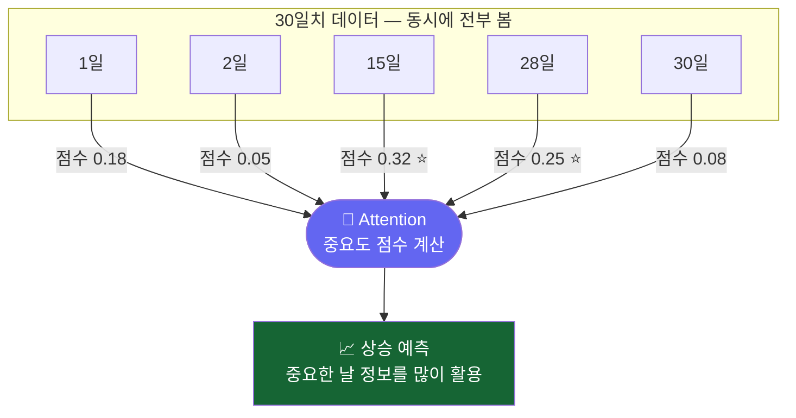
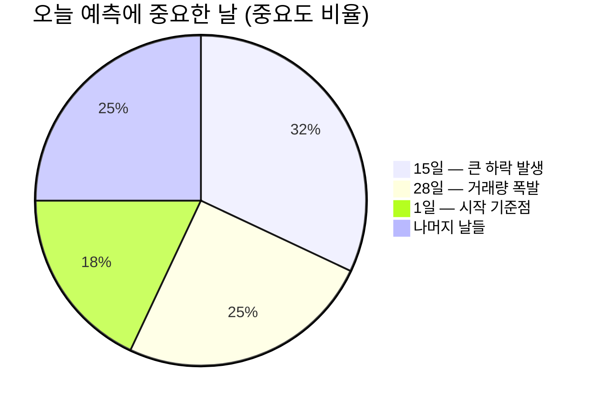

# 전체 흐름 한눈에 보기: Transformer

> 개발자의 질문: "30일 주가를 한꺼번에 다 보면서 중요한 날을 골라낼 수 있나요?"
> Transformer는 과거 전체를 동시에 보면서 "어느 날이 오늘 예측에 가장 중요한지"를 찾아냅니다.

---

## 왜 배우나요?

RNN/LSTM은 순서대로 처리합니다. 1일 → 2일 → 3일 → ...

하지만 이렇게 하면 **오래된 날짜의 정보가 점점 흐릿해집니다**.

**Transformer**는 다릅니다:
- 30일치 데이터를 **한꺼번에 봅니다**
- "오늘 예측에 어느 날이 가장 중요한지" 직접 비교합니다
- 중요한 날은 높은 점수를, 덜 중요한 날은 낮은 점수를 줍니다

이것을 **주목(Attention)**이라고 합니다.

---

## 어떻게 가르치나요?



---

## 어떤 결과를 기대하나요?



> 결론: 15일 하락 이후 회복 패턴 + 28일 거래량 증가 → 📈 상승 예측!

---

## 1. 데이터 준비

```python
import pandas as pd
import numpy as np
from sklearn.neural_network import MLPClassifier
from sklearn.preprocessing import StandardScaler
from sklearn.metrics import accuracy_score
import matplotlib.pyplot as plt

np.random.seed(42)

# 삼성전자 주가 800일치
days = 800
prices = 60000 + np.cumsum(np.random.randn(days) * 500)
volume = np.random.randint(5000000, 20000000, days)

df = pd.DataFrame({'close': prices, 'volume': volume})
df['ret']     = df['close'].pct_change()
df['vol_avg'] = df['volume'].rolling(5).mean()
df = df.dropna()

# Transformer 스타일: 30일치 여러 특성을 한꺼번에 입력
SEQ_LEN  = 30
N_FEATS  = 3  # 수익률, 정규화 가격, 거래량 비율

prices_n = (df['close'] - df['close'].mean()) / df['close'].std()
vol_n    = df['volume'] / df['vol_avg']
rets     = df['ret'].values
prices_norm = prices_n.values
vol_norm    = vol_n.values

X_list, y_list = [], []
for i in range(SEQ_LEN, len(df) - 1):
    # (30일 × 3개 특성) → 90개 숫자
    window = np.column_stack([
        rets[i-SEQ_LEN:i],
        prices_norm[i-SEQ_LEN:i],
        vol_norm[i-SEQ_LEN:i],
    ]).flatten()
    X_list.append(window)
    y_list.append(1 if df['close'].iloc[i+1] > df['close'].iloc[i] else 0)

X_arr = np.array(X_list)
y_arr = np.array(y_list)

print(f"샘플 수: {len(X_arr)}개")
print(f"샘플 크기: {X_arr.shape[1]}개 (30일 × 3특성)")
```

---

## 2. 주목(Attention) 흉내내기

실제 Transformer는 복잡하지만, 핵심 개념을 간단히 체험해봅니다.
각 날짜의 "중요도 점수"를 직접 계산해봅니다.

```python
# 간단한 주목(Attention) 점수 계산
def simple_attention(sequence):
    """각 날짜가 예측에 얼마나 중요한지 점수 계산"""
    # 큰 변화가 있었던 날일수록 중요
    changes = np.abs(sequence)
    scores  = np.exp(changes) / np.exp(changes).sum()
    return scores

# 시각화: 어느 날 데이터가 중요한가?
sample_window = rets[100:100+SEQ_LEN]
attention_scores = simple_attention(sample_window)

fig, (ax1, ax2) = plt.subplots(2, 1, figsize=(10, 6))

ax1.plot(range(SEQ_LEN), sample_window * 100, 'b-o', markersize=4)
ax1.axhline(y=0, color='gray', linestyle='--', alpha=0.5)
ax1.set_title('30일치 수익률 (입력 데이터)')
ax1.set_ylabel('수익률 (%)')
ax1.set_xlabel('날짜 (일 번호)')

ax2.bar(range(SEQ_LEN), attention_scores, color='orange', alpha=0.8)
ax2.set_title('주목(Attention) 점수: 어느 날이 예측에 중요한가?')
ax2.set_ylabel('중요도 점수')
ax2.set_xlabel('날짜 (일 번호)')

plt.tight_layout()
plt.savefig('attention_scores.png', dpi=120)
print("저장: attention_scores.png")

top3_days = np.argsort(attention_scores)[-3:][::-1]
print(f"\n가장 중요한 3일: {top3_days + 1}일째")
print(f"  수익률: {[f'{sample_window[d]*100:.2f}%' for d in top3_days]}")
```

---

## 3. Transformer 스타일 학습

```python
# 멀티 특성 시계열로 학습
split = int(len(X_arr) * 0.8)
X_train, X_test = X_arr[:split], X_arr[split:]
y_train, y_test = y_arr[:split], y_arr[split:]

scaler = StandardScaler()
X_train_sc = scaler.fit_transform(X_train)
X_test_sc  = scaler.transform(X_test)

# 여러 특성을 함께 학습 (Transformer 개념 시뮬레이션)
transformer_mlp = MLPClassifier(
    hidden_layer_sizes=(256, 128, 64),
    activation='relu',
    max_iter=500,
    random_state=42,
    early_stopping=True,
    validation_fraction=0.1,
)
transformer_mlp.fit(X_train_sc, y_train)

train_acc = accuracy_score(y_train, transformer_mlp.predict(X_train_sc))
test_acc  = accuracy_score(y_test,  transformer_mlp.predict(X_test_sc))
print(f"\n다중 특성 시계열 학습 결과:")
print(f"학습 정확도: {train_acc:.1%}")
print(f"테스트 정확도: {test_acc:.1%}")
```

---

## 4. 특성별 중요도 — "어떤 정보가 예측에 도움이 됐나?"

```python
# 특성 그룹별 중요도 분석
feature_groups = {
    '수익률 정보':  list(range(0, SEQ_LEN)),
    '주가 수준':    list(range(SEQ_LEN, 2*SEQ_LEN)),
    '거래량 정보':  list(range(2*SEQ_LEN, 3*SEQ_LEN)),
}

# 각 그룹을 0으로 만들었을 때 정확도 하락 → 중요도 측정
base_acc = test_acc
importances = {}

for group_name, indices in feature_groups.items():
    X_test_masked = X_test_sc.copy()
    X_test_masked[:, indices] = 0  # 해당 특성 지우기
    masked_acc = accuracy_score(y_test, transformer_mlp.predict(X_test_masked))
    drop = base_acc - masked_acc
    importances[group_name] = drop
    print(f"{group_name}: 지우면 정확도 {drop:.1%} 하락 (중요도: {'높음' if drop > 0.01 else '낮음'})")

plt.figure(figsize=(7, 4))
plt.bar(importances.keys(), importances.values(), color=['steelblue', 'orange', 'green'])
plt.ylabel('정확도 하락량 (높을수록 중요)')
plt.title('어떤 정보가 예측에 중요했나?')
plt.tight_layout()
plt.savefig('feature_importance_transformer.png', dpi=120)
print("저장: feature_importance_transformer.png")
```

---

## 핵심 정리

- **Transformer**: 모든 시점을 동시에 보며 중요한 날에 집중하는 방법
- **주목(Attention)**: "어느 날이 오늘 예측에 가장 중요한가?" 를 자동으로 계산
- **장점**: 오래전 데이터도 중요하면 놓치지 않음 (LSTM의 장기 기억 한계 극복)
- **활용**: 복잡한 주가 패턴, 여러 정보를 동시에 활용하는 예측

## 실습 과제

```python
# 과제: 여러 종목의 흐름이 서로 영향을 미치는지 분석
# 삼성전자가 오른 날 LG전자도 오르는 패턴이 있는지 찾아보기
# 1) 두 종목 각 200일치 만들기
# 2) 삼성전자 수익률로 LG전자 다음날 예측
# 3) 정확도가 랜덤(50%)보다 높은지 확인

np.random.seed(11)
samsung = 60000 + np.cumsum(np.random.randn(200) * 500)
# LG전자는 삼성전자와 70% 상관관계 있음
noise = np.random.randn(200) * 400
lg = 80000 + np.cumsum(0.7 * np.diff(np.r_[samsung[0], samsung]) + noise * 0.3)
# 나머지를 채워보세요!
```

## 관련 실습 파일

| 챕터 | 주제 | 실행 방법 |
|------|------|---------|
| [chapter103](/api/chapters/chapter103/source/raw) | Transformer 기초 | `POST /api/chapters/chapter103/run` |

---

➡️ [Day 039 — 더 스마트한 주가 예측 모델들](25.md) 에서 계속됩니다.
