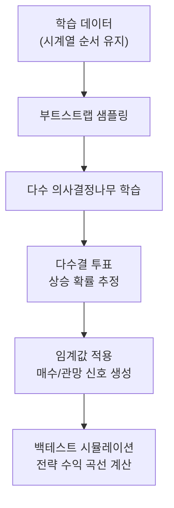
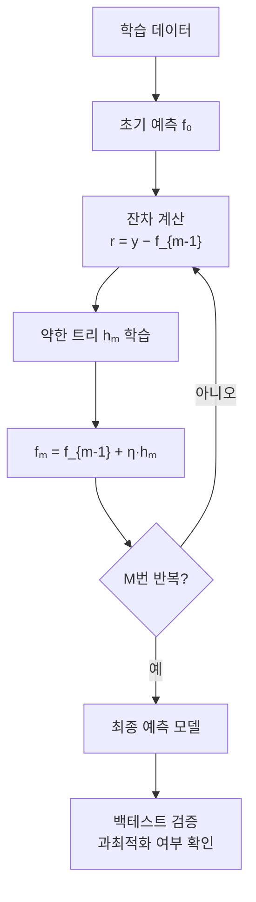
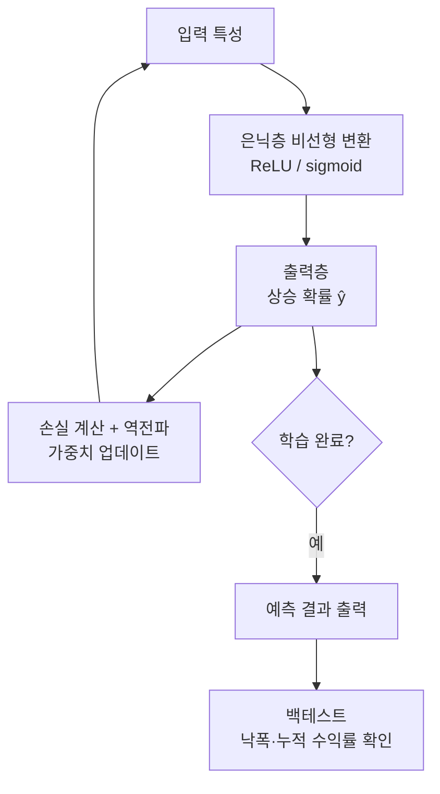
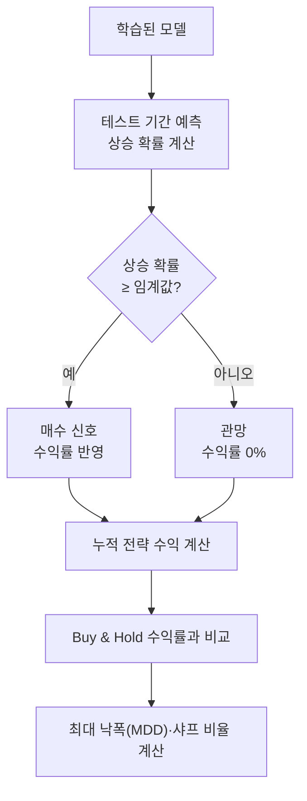

# Day 10. 평가와 백테스트 읽기: 예측 점수와 투자 결과는 다를 수 있어요

> 오늘은 정확도 숫자만 보고 기뻐하지 않는 연습을 합니다. 예측 점수와 실전 결과를 같이 읽는 날입니다.

---

## 오늘의 목표

- `accuracy`, `AUC`, `precision` 같은 평가 지표를 다시 읽습니다.
- 백테스트 곡선이 왜 중요한지 이해합니다.
- "좋은 분류기"와 "좋은 전략"이 완전히 같지 않을 수 있음을 느낍니다.

---

## 아주 쉬운 비유

상승 예측 정확도가 높은 모델이 실제 투자 곡선도 꼭 좋은 것은 아닙니다.

모델도 비슷합니다.

- 점수는 좋아도
- 실제 전략처럼 돌려 보면 흔들릴 수 있습니다

그래서 우리는

- 예측 점수
- 실전 곡선

을 같이 봅니다.

---

## 오늘의 낱말 7개

| 낱말 | 한자·영어 | 쉬운 뜻 |
|---|---|---|
| accuracy | 正確度 / *accuracy* | 전체 중 맞힌 비율. 正(바를 정)+確(확실할 확)+度(정도 도). 예측이 얼마나 많이 맞았는지 보는 지표 |
| precision | 精密度 / *precision* | 오른다고 했을 때 진짜 오른 비율. 精(정밀할 정)+密(빽빽할 밀)+度(정도 도). 헛된 매수 신호를 줄이려면 높아야 함 |
| AUC | *Area Under Curve* | 전반적으로 잘 구분하는지 보는 점수. 0.5=찍기 수준, 1.0=완벽 구분. 상승/하락을 얼마나 잘 가리는지의 종합 지표 |
| 백테스트 | *backtest* | 과거 데이터로 전략처럼 돌려보기. "이 전략을 2020년부터 썼으면 얼마나 벌었을까?"를 시뮬레이션 |
| 낙폭 | 落幅 / *drawdown* | 한 번 오른 뒤 얼마나 크게 내려왔는지. 落(떨어질 락)+幅(폭 폭). 전략이 가장 많이 손실을 봤을 때의 크기 |
| 은닉층 | 隱匿層 / *hidden layer* | 입력층과 출력층 사이의 중간 계산 층. 隱(숨을 은)+匿(숨길 닉)+層(층 층). 신경망(MLP)이 복잡한 비선형 패턴을 학습하는 핵심 영역 |
| 상승 확률 | 上昇確率 / *probability of rise* | 내일 주가가 오를 가능성을 0~1 사이 숫자로 나타낸 값. 上(위 상)+昇(오를 승)+確(확실할 확)+率(비율 률). "상승 확률 55% 이상일 때 매수"처럼 전략 신호의 기준으로 사용 |

---

## 오늘 열 페이지

- [주식 AI 실험실](/lab)
- [호텔-주가 실험실](/hotel-stock)

---

## 오늘의 25분 코스

| 시간 | 할 일 |
|---|---|
| 10분 | [주식 AI 실험실](/lab)에서 모델 하나를 실행하고 지표를 기록합니다. |
| 10분 | [호텔-주가 실험실](/hotel-stock)에서 곡선과 신호를 봅니다. |
| 5분 | 점수와 곡선 느낌이 같은지 비교합니다. |

---

## 웹앱 따라 하기

1. [주식 AI 실험실](/lab)에서 `랜덤 포레스트` 같은 모델 하나를 실행합니다.
2. `accuracy`, `AUC`, `precision`을 메모합니다.
3. [호텔-주가 실험실](/hotel-stock)로 이동합니다.
4. 상단 카드, 곡선, 신호표를 확인합니다.
5. 숫자는 괜찮은데 곡선이 너무 흔들리는지, 또는 점수는 평범한데 곡선은 괜찮은지 비교합니다.

---

## 오늘의 비교표

| 보는 것 | 의미 |
|---|---|
| 평가 지표 | 모델 예측 점수 |
| 포트폴리오 곡선 | 전략이 실제로 움직인 느낌 |
| 낙폭 | 중간에 얼마나 힘들었는지 |
| 누적 수익률 | 끝까지 갔을 때 남은 결과 |

---

## 관찰 미션

- 점수가 좋은데 곡선이 불편한 경우가 있었나요?
- 최종 수익만 같아도 중간 흔들림이 다르면 느낌이 달랐나요?
- 실전에서는 어떤 숫자를 하나만 보고 싶지 않나요?

---

## 한 줄 숙제

`좋은 주식 예측 모델을 고를 때 나는 예측 점수뿐 아니라 ________도 함께 본다.`

---

## 점수와 투자 결과가 다른 쉬운 예시

### 종목 예시

어떤 모델이 현대차 방향을 잘 맞혔다고 해도,
큰 하락장에서 한 번 크게 틀리면 투자 곡선은 많이 흔들릴 수 있습니다.

### 기술 지표 예시

`골든크로스`가 자주 잘 맞았어도,
횡보장에서 가짜 신호가 많으면 실제 수익은 별로일 수 있습니다.

### 거시경제 예시

CPI 발표, 금리 결정, 환율 급등 같은 날은  
평소에 잘 맞던 모델도 갑자기 크게 틀릴 수 있습니다.

그래서 우리는 이렇게 함께 봅니다.

- 예측 점수: 시험 점수
- 백테스트 곡선: 실제 운동 경기 결과

둘 다 봐야 "정말 쓸 만한가?"를 더 잘 알 수 있습니다.

---

## 내일 예고

내일은 호텔 예약률과 주가를 함께 보는 멀티모델 실험실로 갑니다.  
여러 힌트를 한 화면에서 읽는 법을 연습합니다.

---

➡️ [다음 문서: Day 11. 호텔-주가 멀티모델 실험실](11.md)

---

## 알고리즘 처리 흐름 (Day 10)

### 랜덤 포레스트 흐름

### 그래디언트 부스팅 흐름

### 신경망(MLP) 흐름

### 백테스트 흐름

---

## 모델 상세 참고 (Day 10)

백테스트를 읽을 때는 모델 구조 자체도 함께 이해하면 해석이 더 정확해집니다.

| 모델 | 수학적 의미 | 탄생 배경 | 주식투자 활용 | 만든 사람/대표 GitHub |
|---|---|---|---|---|
| 랜덤 포레스트 | 배깅된 트리 앙상블로 분류 확률을 추정합니다. | 과적합 완화와 안정적 일반화 목적에서 등장했습니다. | 비교적 안정적인 신호를 내는 경향이 있어 백테스트 기준 모델로 자주 사용됩니다. | Leo Breiman · <https://github.com/scikit-learn/scikit-learn/blob/main/sklearn/ensemble/_forest.py> |
| 그래디언트 부스팅 | 손실 기울기를 따라 약분류기를 순차 합성합니다. | 정교한 결정경계 학습 요구에서 성능 중심 모델로 자리잡았습니다. | 높은 적합력으로 점수 개선에 유리하지만, 과최적화 여부를 백테스트로 확인해야 합니다. | Jerome Friedman · <https://github.com/scikit-learn/scikit-learn/blob/main/sklearn/ensemble/_gb.py> |
| 신경망(MLP) | 비선형 은닉층을 통해 복합 특징을 학습합니다. | 복잡한 함수 근사가 필요한 문제에서 다층 구조가 확산되었습니다. | 점수는 높아도 변동성이 클 수 있어 낙폭/곡선 안정성 해석이 중요합니다. | Rumelhart, Hinton, Williams · <https://github.com/scikit-learn/scikit-learn/blob/main/sklearn/neural_network/_multilayer_perceptron.py> |

## 분야별 모델 쓰임새 및 적합도 (Day 10)

| 모델 | 데이터셋 형태 | 헬스케어 | 자율주행 | 주식투자 | 로봇 | AI Ops |
|---|---|---|---|---|---|---|
| 랜덤 포레스트 | 정형 수치·범주 데이터, 중간 크기 | 진단 보조, 특성 중요도 기반 임상 지표 해석 | 도로 조건 분류, 다변량 센서 이상 감지 | 안정적 신호·백테스트 기준 모델로 자주 사용 | 다변량 상태 분류·고장 예측, 특성 해석 | 장애 원인 분류, 이슈 우선순위·이상 감지 |
| 그래디언트 부스팅 | 정형 수치·범주 데이터, 대용량 테이블 | 리스크 스코어링, 약물 부작용 예측, 고정밀 분류 | 고정밀 도로 상황 분류, 차선 변경 예측 | 점수 개선 강력하나 과최적화 백테스트 확인 필요 | 정밀 동작 제어 신호 분류, 이상 예측 | SLA 위반 예측, 장애 리스크 스코어링 |
| 신경망(MLP) | 정형 수치 데이터, 중간~대용량 | 복잡한 진단 패턴, 의료 영상 특성 분류 | 비선형 센서 융합, 주행 결정 신호 생성 | 점수는 높아도 변동성 클 수 있어 낙폭 확인 필요 | 복잡한 동작 제어, 다감각 데이터 처리 | 복합 메트릭 이상 탐지, 장애 패턴 인식 |

## 모델 혼합 & 검증 아이디어 (Day 10)

평가 지표와 백테스트를 함께 보는 오늘은, **점수와 실전 결과를 모두 고려한 앙상블**을 만들기 딱 좋은 날입니다.  
"점수가 좋은 모델"과 "백테스트 곡선이 안정적인 모델"이 다를 때 어떻게 섞을지가 핵심입니다.

### 혼합 아이디어

| 혼합 방법 | 어떻게 섞나요? | 왜 좋을까요? |
|---|---|---|
| AUC 가중 앙상블 | 각 모델의 AUC 점수를 가중치로 삼아 상승 확률을 가중 평균 냄. AUC가 0.7인 모델은 0.6인 모델보다 가중치를 높게 줌 | 잘하는 모델의 의견이 더 많이 반영되어 전체 앙상블 품질이 높아짐 |
| 낙폭 최소화 앙상블 | 백테스트에서 최대 낙폭이 작은 모델에 더 높은 가중치를 부여 | 점수가 조금 낮아도 투자 손실 위험이 작은 모델을 선호하는 실전 관점 |
| 계절성 적응 앙상블 | 상승장에서는 성능이 좋았던 모델의 비중을 높이고, 하락장에서는 낙폭이 작았던 모델의 비중을 높이는 동적 가중치 방식 | 시장 국면에 따라 강한 모델을 자동으로 선택 |

### 검증 방법

- **샤프 비율 비교**: `(전략 평균 수익률) / (전략 수익률 표준편차)` 값을 모델별로 비교합니다. 샤프 비율이 높을수록 위험 대비 수익이 좋은 전략입니다.
- **최대 낙폭(MDD) 비교**: 각 모델과 앙상블 전략의 최대 낙폭을 비교합니다. 앙상블이 단일 모델보다 낙폭을 줄였는지 확인합니다.
- **바이앤드홀드 대비 초과 수익**: 모델 전략 수익률에서 "그냥 보유" 수익률을 뺀 값이 양수인지 확인합니다. 모델 쓸 가치가 있는지 보는 기본 기준입니다.
- **시기별 구간 분석**: 금리 인상기, 하락장, 횡보장 구간을 따로 나눠 각 구간에서 모델과 앙상블의 성능을 비교합니다. 어느 모델이 어느 환경에서 강한지 파악합니다.

> 아주 쉽게 말하면: 시험 점수만 높고 실제 경기를 못 하는 선수보다, 점수는 조금 낮아도 실전에서 흔들리지 않는 선수가 더 믿음직합니다.  
> 앙상블은 두 가지 장점을 모두 살리는 방법입니다.

---

## 웹앱 안쪽 들여다보기

### 점수와 백테스트는 같은 호출에서 같이 나옵니다
주식 AI 실험실의 `POST /api/stock/analyze` 는 분류 점수만 주는 것이 아니라 아래 값도 같이 돌려줍니다.
- `accuracy`, `auc`, `precision`
- `portfolio`, `buyhold`
- `portfolio_return`, `buyhold_return`
- `signals`

기본 아이디어는 **상승 확률이 55% 이상일 때만 매수**처럼 신호를 만들어 전략 곡선을 그려 보는 것입니다.

### 호텔-주가 실험실은 어디를 더 보여주나요?
`POST /api/hotel-stock/train` 은 아래를 추가로 보여줍니다.
- 혼동 행렬
- 상위 특성 10개
- 예측 신호 표
- 월별 계절성 요약

혼동 행렬을 읽을 때는 `TP`, `FP`, `TN`, `FN` 이 각각 어떤 종류의 맞힘/틀림인지 같이 보는 것이 중요합니다.
