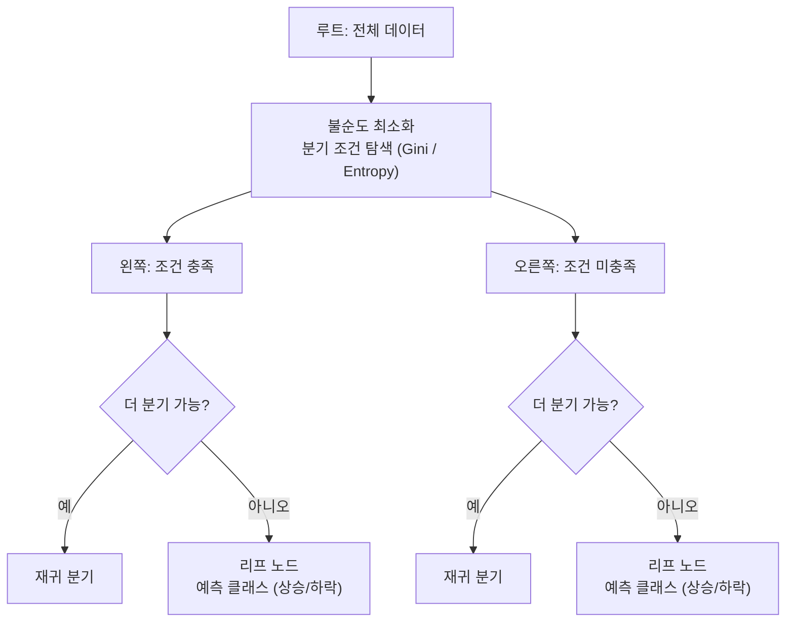
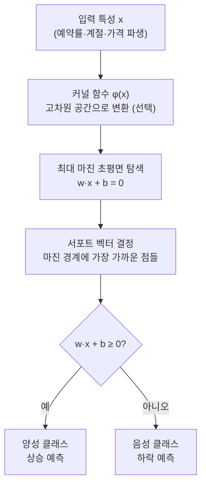
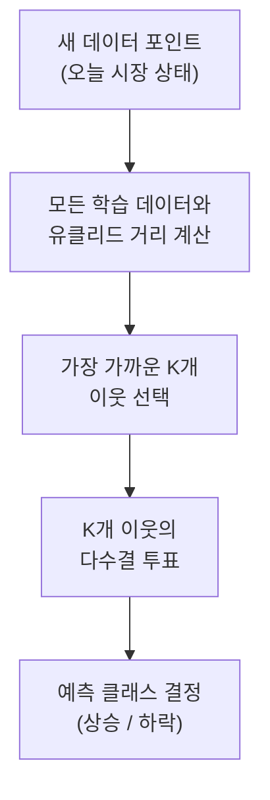
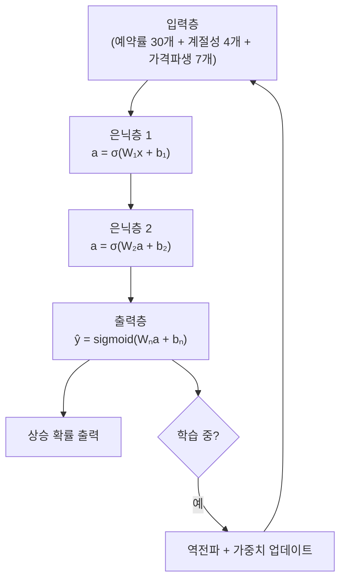
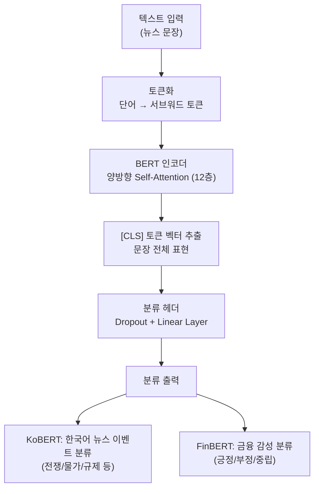

# Day 11. 호텔-주가 멀티모델 실험실: 여러 힌트를 한 번에 보기

> 오늘은 주가만 보지 않고 예약률, 계절성, 신호 같은 여러 힌트를 함께 보는 날입니다.

---

## 오늘의 목표

- [호텔-주가 실험실](/hotel-stock)의 구조를 익힙니다.
- ML 모델과 DL 모델을 한 화면에서 비교합니다.
- `특성 중요도`, `신호`, `혼동 행렬`을 차근차근 읽어봅니다.

---

## 왜 이 실험이 재미있을까요?

이 화면은 단순히 "어제보다 올랐나?"만 보는 곳이 아닙니다.

- 예약률이 올라갔는지
- 지금이 성수기인지
- 신호가 자주 틀리는지

같은 여러 단서를 함께 봅니다.

쉽게 말해  
**호텔 데이터와 주가 흐름을 같이 읽는 예측 실험실**입니다.

---

## 오늘의 낱말 6개

| 낱말 | 한자·영어 | 쉬운 뜻 |
|---|---|---|
| 계절성 | 季節性 / *seasonality* | 계절마다 반복되는 흐름. 季(계절 계)+節(마디 절)+性(성질 성). 호텔처럼 성수기·비수기가 반복되는 패턴 |
| 멀티특성 | 多特性 / *multi-feature* | 여러 힌트를 함께 쓰는 것. 多(많을 다)+特性(특성). 단일 특성이 아닌 여러 특성을 동시에 모델에 입력 |
| 신호 | 信號 / *signal* | 지금 어떻게 행동하라는 표시. 信(믿을 신)+號(부를 호). "상승 확률 55% 이상 → 매수 신호"처럼 모델 출력을 행동 지시로 변환 |
| 혼동 행렬 | 混同 行列 / *confusion matrix* | 맞고 틀린 경우를 나눠 보는 표. 混(섞을 혼)+同(같을 동)+行列(행렬). 상승 예측이 맞은 경우와 틀린 경우를 4칸으로 정리 |
| MLP | *Multi-Layer Perceptron* | 기본적인 여러 층 신경망. 여러 은닉층을 쌓아 비선형 패턴을 학습하는 가장 기본적인 딥러닝 구조 |
| 은닉층 | 隱匿層 / *hidden layer* | 입력층과 출력층 사이의 중간 계산 층. 隱(숨을 은)+匿(숨길 닉)+層(층 층). MLP에서 비선형 특징 조합이 학습되는 핵심 영역. 층이 많을수록 더 복잡한 패턴을 배울 수 있음 |

---

## 오늘 열 페이지

- [호텔-주가 실험실](/hotel-stock)

---

## 오늘의 25분 코스

| 시간 | 할 일 |
|---|---|
| 5분 | 화면 탭 구조를 훑어봅니다. |
| 10분 | ML 모델 하나를 실행합니다. |
| 10분 | DL 모델 하나를 실행하고 둘을 비교합니다. |

---

## 웹앱 따라 하기

1. [호텔-주가 실험실](/hotel-stock)을 엽니다.
2. 먼저 `랜덤 포레스트` 같은 ML 모델을 실행합니다.
3. `특성 중요도` 탭에서 어떤 힌트가 상위에 있는지 봅니다.
4. `예측 신호`와 `혼동 행렬`도 확인합니다.
5. 이번에는 `신경망` 같은 DL 모델로 바꿔 다시 실행합니다.
6. 둘 중 어느 쪽이 읽기 쉬웠는지, 어느 쪽이 더 안정적으로 보였는지 적습니다.

---

## 오늘의 비교 기록표

| 모델 | accuracy | AUC | 상위 특성 1개 | 한 줄 느낌 |
|---|---|---|---|---|
| ML 모델 |  |  |  |  |
| DL 모델 |  |  |  |  |

---

## 관찰 미션

- 계절 관련 특성이 중요하게 보였나요?
- 예약률 관련 특성이 눈에 띄었나요?
- ML 모델과 DL 모델 중 어느 쪽이 더 설명하기 쉬웠나요?
- `FP`와 `FN` 중 어느 쪽이 더 많아 보였나요?

---

## 한 줄 숙제

`호텔-주가 실험실에서는 주가만이 아니라 ________와(과) ________도 함께 본다.`

---

## 여러 힌트를 같이 본다는 뜻을 쉬운 예시로 보면

예를 들어 여행 관련 종목을 본다고 해봅시다.

- 호텔 예약률 증가
- 방학 시즌 시작
- 환율 안정
- 유가 하락

이런 정보가 함께 오면 여행주 분위기가 좋아질 수 있습니다.

반대로

- 예약률 둔화
- 비수기
- 환율 급등
- 경기 둔화 뉴스

가 겹치면 조심해야 할 수 있습니다.

즉, 이 실험실은

- 종목 가격만 보는 것이 아니라
- 기술 지표와 업황 힌트도 보고
- 거시경제 날씨도 같이 보는 연습

이라고 생각하면 쉽습니다.

---

## 뉴스 테마 감지 AI는 어떻게 읽을까요?

새로 추가된 [이벤트 투자 컨설팅](/advisor) 화면은  
뉴스 문장을 보고 "이게 전쟁 이야기인지, 가뭄 이야기인지, 물가 이야기인지"를 먼저 짐작합니다.

이때 기본 방식은 **임베딩 + 유사도 검색**입니다.

아주 쉽게 말하면:

1. 뉴스 문장을 숫자 벡터로 바꿉니다.
2. 미리 준비한 대표 사건 문장도 숫자 벡터로 바꿉니다.
3. 서로 얼마나 닮았는지 점수로 비교합니다.

예를 들면

- `중동 전쟁 확대로 유가 급등`
- `가뭄으로 농산물 가격 상승`
- `미국 CPI 급등으로 긴축 우려`

같은 대표 문장들과 비교해서  
지금 입력한 뉴스가 어느 테마와 가장 비슷한지 찾습니다.

### KoBERT/FinBERT는 어디에 쓰일 수 있나요?

- `KoBERT`: 한국어 뉴스 분류에 잘 맞는 한국어 언어모델
- `FinBERT`: 금융 뉴스의 긍정/부정/중립 판단에 자주 쓰이는 금융 특화 언어모델

지금 저장소에서는 먼저 **가벼운 임베딩 유사도 방식**을 넣었고,  
나중에는 KoBERT나 FinBERT 같은 분류 모델로 바꿔 꽂을 수 있게 구조를 열어 두었습니다.

---

## DART 공시 데이터도 같이 보면 더 실전 같아요

이제 [DART 공시 투자 파이프라인](/dart) 화면에서는  
뉴스만이 아니라 **회사가 직접 낸 공시 숫자**도 같이 읽을 수 있습니다.

쉽게 말하면:

- 뉴스는 `밖에서 들은 소식`
- DART는 `회사가 직접 제출한 공식 성적표`

입니다.

### 어떤 CSV가 생기나요?

- `dart_fundamentals.csv`
  - 매출, 영업이익, 순이익, 부채비율 같은 재무 숫자
- `dart_disclosures.csv`
  - 최근 사업보고서, 임원 지분 변동, 정정 공시 같은 제목 모음
- `dart_invest_pipeline.csv`
  - 공시 숫자 + 최근 공시 + 가격 팩터를 합친 투자용 표

### 왜 투자자에게 좋을까요?

예를 들어 어떤 종목의 주가가 오르고 있어도

- 매출이 줄고
- 영업이익이 약하고
- 빚이 너무 많고
- 최근 공시가 복잡하다면

조금 더 조심해서 봐야 합니다.

반대로

- 매출이 늘고
- 영업이익이 좋아지고
- 부채비율이 안정적이고
- 최근 공시도 특별한 문제 없이 이어진다면

`차트만 좋아 보이는 종목`이 아니라  
`회사 체력도 같이 괜찮아 보이는 종목`으로 볼 수 있습니다.

### 아주 쉬운 예시

`삼성전자 매출이 커졌고 영업이익도 좋아졌어요.`

이 말은

`물건을 더 팔았고, 남긴 돈도 더 많아졌어요.`

라는 뜻입니다.

`부채비율이 낮아요.`

이 말은

`빚 가방이 너무 무겁지 않아요.`

라는 뜻입니다.

이렇게 읽으면 숫자가 훨씬 덜 무섭습니다.

---

## 알고리즘 처리 흐름 (Day 11)

### 의사결정나무(Decision Tree) 흐름

### SVM 흐름

### KNN 흐름

### MLP (딥러닝) 흐름

### KoBERT / FinBERT 텍스트 분류 흐름

---

## 모델 상세 참고 (Day 11)

| 모델 | 수학적 의미 | 탄생 배경 | 주식투자 활용 | 만든 사람/대표 GitHub |
|---|---|---|---|---|
| 의사결정나무(DT) | 조건 분기(`if-then`)를 반복해 불순도(Gini/Entropy)를 줄입니다. | 사람이 이해 가능한 규칙 기반 분류 요구에서 발전했습니다. | "예약률이 높고 성수기면 상승" 같은 규칙 해석이 쉽습니다. | Breiman, Friedman, Olshen, Stone(CART) · <https://github.com/scikit-learn/scikit-learn/blob/main/sklearn/tree/_classes.py> |
| SVM | 최대 마진 초평면 `w^Tx+b=0`을 찾고 커널로 비선형 분류를 확장합니다. | 소표본·고차원 데이터의 일반화 성능을 높이기 위해 개발되었습니다. | 특성 수가 많고 경계가 애매한 구간에서 강한 분류 성능을 기대할 수 있습니다. | Vladimir Vapnik, Corinna Cortes · <https://github.com/scikit-learn/scikit-learn/blob/main/sklearn/svm/_classes.py> |
| KNN | 가장 가까운 이웃 `k`개의 다수결/평균으로 예측합니다. | 모형 가정이 약한 "메모리 기반 학습" 필요에서 오래 사용되었습니다. | 비슷한 시장 상태의 과거 사례를 바로 참조하는 직관적 비교에 적합합니다. | Cover & Hart(이론 정립) · <https://github.com/scikit-learn/scikit-learn/blob/main/sklearn/neighbors/_classification.py> |
| MLP 계열(DL) | 다층 은닉층으로 비선형 함수를 근사합니다. | 복합 패턴 학습을 위해 심층 구조가 실무로 확장되었습니다. | 예약률+계절성+가격 파생 특성의 결합 신호 포착에 유리합니다. | Rumelhart, Hinton, Williams · <https://github.com/scikit-learn/scikit-learn/blob/main/sklearn/neural_network/_multilayer_perceptron.py> |
| KoBERT | BERT 기반 한국어 문맥 임베딩/분류 모델입니다. | 한국어 형태소·문맥 처리 성능 개선 요구로 개발되었습니다. | 한국어 뉴스 이벤트 분류(전쟁/물가/규제) 고도화에 적합합니다. | SKTBrain · <https://github.com/SKTBrain/KoBERT> |
| FinBERT | 금융 텍스트 도메인에 맞춘 BERT 계열 감성/분류 모델입니다. | 일반 BERT의 금융 문맥 한계를 보완하려고 제안되었습니다. | 뉴스 감성(긍정/부정/중립) 기반 종목 리스크 신호 생성에 활용됩니다. | ProsusAI/커뮤니티 구현 다수 · <https://github.com/yya518/FinBERT> |

## 분야별 모델 쓰임새 및 적합도 (Day 11)

| 모델 | 데이터셋 형태 | 헬스케어 | 자율주행 | 주식투자 | 로봇 | AI Ops |
|---|---|---|---|---|---|---|
| 의사결정나무(DT) | 정형 수치·범주 데이터, 소~중간 크기 | 진단 규칙 시각화, 임상 의사결정 지원(해석 용이) | 저속 단순 환경 주행 규칙 학습 | 매수/매도 조건 규칙 이해, 전략 해석 | 단순 상황 기반 행동 결정, 규칙 기반 제어 | 운영 규칙 시각화, 알림 트리거 조건 설정 |
| SVM | 중간 크기 고차원 정형 데이터 | 의료 영상 특성 분류, 생체 신호 이상 감지 | 소규모 고차원 도로 상황 분류 | 경계가 애매한 구간 강한 분류 성능 | 비선형 상태 분류, 이상 감지 | 소규모 이상 탐지, 네트워크 침입 감지 |
| KNN | 소~중간 크기 정형 데이터 | 유사 환자 기반 진단 추천, 희귀 질환 탐색 | 유사 주행 상황 검색(소규모·저지연 불리) | 유사 과거 시장 상태 참조, 직관적 비교 | 유사 동작 패턴 검색·재사용 | 유사 장애 패턴 과거 사례 검색 |
| MLP 계열(DL) | 정형 수치 데이터, 중간~대용량 | 복잡한 진단 패턴, 예약률+계절성 결합 신호 | 비선형 다중 센서 융합, 주행 결정 신호 | 예약률+계절성+가격 파생 특성 결합 신호 | 복잡한 동작 제어, 다감각 데이터 처리 | 복합 메트릭 이상 탐지, 장애 패턴 인식 |
| KoBERT | 한국어 텍스트(뉴스·의료 기록·문서) | 한국어 의료 기록·보고서 분류 및 요약 | 한국어 교통 뉴스 감성 분석(간접) | 한국어 뉴스 이벤트 분류(전쟁·규제·금리) | 한국어 음성·명령 처리 | 한국어 장애 로그·인시던트 보고서 분류 |
| FinBERT | 영문 금융 텍스트(뉴스·보고서·공시) | 의료 연구 문서 감성 분석(제한적 활용) | 모빌리티 산업 뉴스 감성 분석(간접) | 뉴스 감성(긍정/부정/중립) 기반 종목 신호 | 산업 뉴스 감성·리스크 분석(간접) | 인시던트 보고서 감성 분류, 이슈 우선순위 |

## 모델 혼합 & 검증 아이디어 (Day 11)

호텔-주가 실험실의 모델들은 ML(의사결정나무·SVM·KNN)과 DL(MLP)이 함께 있습니다.  
여기에 텍스트 모델(KoBERT·FinBERT)까지 더하면 **가격·데이터·뉴스를 모두 보는 종합 파이프라인**이 됩니다.

### 혼합 아이디어

| 혼합 방법 | 어떻게 섞나요? | 왜 좋을까요? |
|---|---|---|
| ML + DL 스태킹 | ML 모델(랜덤 포레스트·GBM·SVM)의 예측 확률을 새로운 특성으로 만들어, MLP에 다시 넣어 최종 판단 | ML 모델이 1차 특징을 추출하고, MLP가 그 특징을 바탕으로 더 정교한 결정을 내림 |
| 텍스트 + 정형 데이터 결합 | FinBERT로 오늘 금융 뉴스 감성(긍정/부정)을 수치화하고, 기존 ML/DL 모델의 특성에 추가해 학습 | 차트 숫자만 보는 모델에 뉴스 감성이라는 추가 힌트를 주어 이벤트 발생일 예측 품질을 높임 |
| KNN 유사 사례 검증 | KNN으로 "지금 시장 상태와 가장 비슷했던 과거 날짜"를 찾고, 그 날 이후 주가가 어떻게 됐는지 확인해 다른 모델 결과를 검증하는 참고 자료로 활용 | 복잡한 모델 결과를 직관적인 과거 사례로 교차 검증 |

### 검증 방법

- **혼동 행렬 상호보완 확인**: 모델 A가 틀리는 케이스(FP·FN)와 모델 B가 틀리는 케이스가 다른지 비교합니다. 서로 다른 케이스를 틀리는 모델끼리 섞으면 앙상블 효과가 큽니다.
- **계절성 구간별 성능 분해**: 성수기와 비수기 구간으로 나눠 ML과 DL 모델 중 어느 쪽이 계절 패턴을 더 잘 잡는지 비교합니다.
- **감성 신호 기여도 분석**: FinBERT 감성 점수를 특성으로 추가했을 때와 하지 않았을 때의 AUC 차이를 봅니다. 차이가 크면 뉴스 감성이 중요한 힌트입니다.
- **앙상블 혼동 행렬 비교**: 단일 모델의 혼동 행렬과 ML+DL 스태킹 앙상블의 혼동 행렬을 나란히 놓고 FP·FN이 얼마나 줄었는지 확인합니다.

> 아주 쉽게 말하면: 의사(ML), 전문의(DL), 심리 상담사(텍스트 모델)가 모두 같은 환자를 보고 종합 의견을 내면, 한 명이 진단하는 것보다 훨씬 정확합니다.  
> 가격 데이터, 계절성, 뉴스 감성을 함께 보는 것도 같은 원리입니다.

---

## 웹앱 안쪽 들여다보기

### 호텔-주가 실험실 API
`POST /api/hotel-stock/train` 은 아래 모델을 받을 수 있습니다.
- ML: `logistic`, `dt`, `rf`, `gbm`, `svm`, `knn`
- DL: `mlp_1`, `mlp_2`, `mlp_3`, `mlp_deep`

서버는 호텔 예약률, 계절성, 가격 특성을 합쳐
- `accuracy`, `AUC`
- 혼동 행렬
- 상위 특성
- 예측 신호
를 돌려줍니다.

### DART 공시 파이프라인은 어떤 주소를 쓸까요?
- `GET /api/dart/overview`
- `GET /api/dart/companies`
- `GET /api/dart/companies/{stock_code}`

이 기능을 쓰려면 먼저 `DART_API_KEY` 를 넣고 `scripts/refresh_datasets.py` 를 실행해 CSV를 준비해야 합니다.

즉, Day 11은 **멀티특성 모델 결과**와 **회사 공식 성적표**를 연결해서 읽는 연습으로 넓혀갈 수 있습니다.
