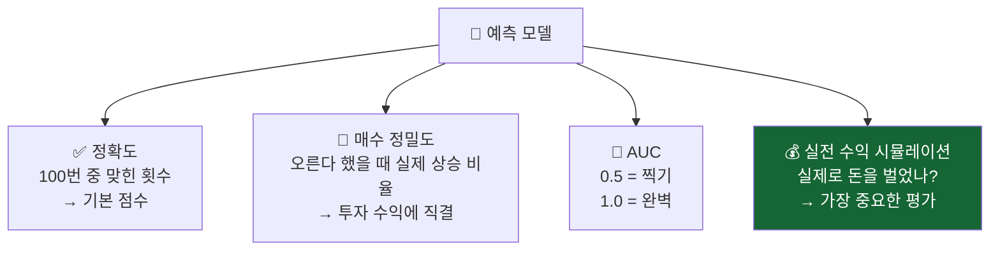
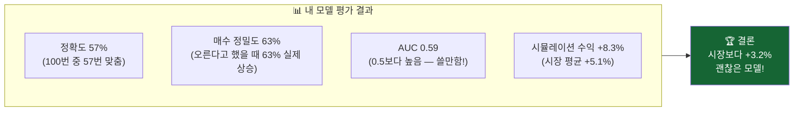

# 내 예측, 얼마나 정확한가? 모델 평가

> 개발자의 질문: "내가 만든 예측 모델이 정말 좋은 건지 어떻게 알 수 있나요?"
> 좋은 모델을 만드는 것만큼 중요한 것이 "얼마나 좋은지" 정확히 측정하는 것입니다.

---

## 왜 배우나요?

열심히 만든 모델의 정확도가 60%라면...
- 정말 좋은 건가요?
- 그냥 매일 "오른다"고 예측해도 50%는 맞는데?
- 틀렸을 때 얼마나 손해가 났나요?

**모델 평가**는 이런 질문들에 제대로 답하는 방법입니다.

---

## 어떻게 평가하나요?

단순히 "몇 번 맞혔냐" 외에도 여러 방법으로 평가합니다.



---

## 어떤 결과를 기대하나요?



---

## 1. 주식 예측 모델 만들기

```python
import pandas as pd
import numpy as np
from sklearn.ensemble import RandomForestClassifier, GradientBoostingClassifier
from sklearn.linear_model import LogisticRegression
from sklearn.preprocessing import StandardScaler
from sklearn.metrics import (accuracy_score, roc_auc_score,
                              precision_score, recall_score, confusion_matrix)
import matplotlib.pyplot as plt
import seaborn as sns

np.random.seed(42)

# 삼성전자 주가 600일치
days = 600
prices = 60000 + np.cumsum(np.random.randn(days) * 500)
volume = np.random.randint(5000000, 20000000, days)

df = pd.DataFrame({'close': prices, 'volume': volume})
df['ret']       = df['close'].pct_change()
df['ret_5']     = df['close'].pct_change(5)
df['ma5']       = df['close'].rolling(5).mean()
df['ma20']      = df['close'].rolling(20).mean()
df['vol_ratio'] = df['volume'] / df['volume'].rolling(10).mean()
df['target']    = (df['close'].shift(-1) > df['close']).astype(int)
df = df.dropna()

features = ['ret', 'ret_5', 'ma5', 'ma20', 'vol_ratio']
X = df[features].values
y = df['target'].values

split = int(len(X) * 0.8)
X_train, X_test = X[:split], X[split:]
y_train, y_test = y[:split], y[split:]

scaler = StandardScaler()
X_train_sc = scaler.fit_transform(X_train)
X_test_sc  = scaler.transform(X_test)

# 3가지 모델 학습
models = {
    '로지스틱 회귀':    LogisticRegression(random_state=42),
    '랜덤 포레스트':   RandomForestClassifier(n_estimators=100, max_depth=5, random_state=42),
    '그래디언트 부스팅': GradientBoostingClassifier(n_estimators=100, max_depth=3, random_state=42),
}

for name, m in models.items():
    m.fit(X_train_sc, y_train)

print("모든 모델 학습 완료!")
```

---

## 2. 핵심 평가 지표들

```python
print("=" * 60)
print(f"{'모델':<16} {'정확도':^8} {'AUC':^8} {'매수정밀도':^10} {'매수재현율':^10}")
print("-" * 60)

eval_results = {}
for name, m in models.items():
    y_pred = m.predict(X_test_sc)
    y_prob = m.predict_proba(X_test_sc)[:, 1]

    acc   = accuracy_score(y_test, y_pred)
    auc   = roc_auc_score(y_test, y_prob)
    prec  = precision_score(y_test, y_pred, zero_division=0)  # 매수 정밀도
    rec   = recall_score(y_test, y_pred, zero_division=0)     # 매수 재현율

    eval_results[name] = {'acc': acc, 'auc': auc, 'prec': prec, 'rec': rec, 'prob': y_prob}
    print(f"{name:<16} {acc:^8.1%} {auc:^8.3f} {prec:^10.1%} {rec:^10.1%}")

print("=" * 60)
print("\n용어 설명:")
print("  정확도:    100번 예측 중 맞춘 비율")
print("  AUC:       0.5=찍기, 0.7+=꽤 좋음, 0.9+=매우 좋음")
print("  매수 정밀도: '오른다'고 했는데 실제로 오른 비율")
print("  매수 재현율: 실제로 오른 날 중 맞춘 비율")
```

---

## 3. 혼동 행렬 — 실수 패턴 분석

```python
best_model_name = max(eval_results, key=lambda k: eval_results[k]['auc'])
best_model = models[best_model_name]
y_best_pred = best_model.predict(X_test_sc)
cm = confusion_matrix(y_test, y_best_pred)

fig, axes = plt.subplots(1, 2, figsize=(12, 4))

# 혼동 행렬
sns.heatmap(cm, annot=True, fmt='d', cmap='Blues', ax=axes[0],
            xticklabels=['하락 예측', '상승 예측'],
            yticklabels=['실제 하락', '실제 상승'])
axes[0].set_title(f'예측 결과 확인판\n({best_model_name})')

# 결과 해석
tn, fp, fn, tp = cm.ravel()
labels = ['올바른\n하락 예측', '잘못된\n상승 예측\n(손실 위험!)', '놓친\n상승 기회', '올바른\n상승 예측']
values = [tn, fp, fn, tp]
colors_bar = ['green', 'red', 'orange', 'green']
axes[1].bar(labels, values, color=colors_bar, alpha=0.8)
axes[1].set_title('예측 결과 분석')
axes[1].set_ylabel('횟수')

plt.tight_layout()
plt.savefig('confusion_analysis.png', dpi=120)
print(f"저장: confusion_analysis.png")
print(f"\n가장 좋은 모델: {best_model_name}")
print(f"  올바른 상승 예측: {tp}번")
print(f"  잘못된 상승 예측: {fp}번 (이때 투자하면 손해!)")
print(f"  놓친 상승 기회: {fn}번")
```

---

## 4. 투자 시뮬레이션 — 실제로 돈을 벌었나?

```python
def simulate_trading(y_pred_prob, actual_returns, threshold=0.55):
    """예측 신호로 투자했을 때 수익 시뮬레이션"""
    portfolio = [1.0]  # 시작 자산 1배
    buyhold   = [1.0]  # 그냥 보유했을 때

    for i in range(len(y_pred_prob)):
        ret = actual_returns[i]

        # 상승 확률이 threshold 이상이면 매수
        if y_pred_prob[i] >= threshold:
            portfolio.append(portfolio[-1] * (1 + ret))
        else:
            portfolio.append(portfolio[-1])  # 현금 보유

        buyhold.append(buyhold[-1] * (1 + ret))

    return np.array(portfolio), np.array(buyhold)

# 실제 수익률 (테스트 기간)
test_rets = df['ret'].values[split:split+len(y_test)]
test_rets = test_rets[:len(y_test)]

plt.figure(figsize=(12, 5))
for name, res in eval_results.items():
    port, bh = simulate_trading(res['prob'], test_rets)
    final_return = (port[-1] - 1) * 100
    plt.plot(port, linewidth=1.5, label=f"{name} (+{final_return:.1f}%)")

port_bh, _ = simulate_trading(np.ones(len(y_test)) * 0.6, test_rets)
_, bh = simulate_trading(np.ones(len(y_test)) * 0.6, test_rets)
buyhold_return = (bh[-1] - 1) * 100
plt.plot(bh, 'k--', linewidth=2, label=f"전량 보유 (+{buyhold_return:.1f}%)")

plt.axhline(y=1.0, color='gray', linestyle=':', alpha=0.5)
plt.xlabel('거래일')
plt.ylabel('자산 배율')
plt.title('예측 모델 투자 시뮬레이션\n(시작 자산 = 1.0)')
plt.legend()
plt.tight_layout()
plt.savefig('trading_simulation.png', dpi=120)
print("저장: trading_simulation.png")
```

---

## 5. 하이퍼파라미터 튜닝 — 더 좋은 모델 찾기

```python
from sklearn.model_selection import TimeSeriesSplit, cross_val_score

# 랜덤 포레스트의 트리 수와 깊이 조합 실험
n_trees_options = [50, 100, 200]
depth_options   = [3, 5, 7]

print("\n랜덤 포레스트 설정 실험:")
print(f"{'트리 수':^8} {'깊이':^6} {'CV 정확도':^12}")
print("-" * 30)

tscv = TimeSeriesSplit(n_splits=4)
best_acc, best_params = 0, {}

for n in n_trees_options:
    for d in depth_options:
        m = RandomForestClassifier(n_estimators=n, max_depth=d, random_state=42)
        scores = cross_val_score(m, X_train_sc, y_train, cv=tscv, scoring='accuracy')
        mean_acc = scores.mean()
        print(f"{n:^8} {d:^6} {mean_acc:^12.1%}")
        if mean_acc > best_acc:
            best_acc = mean_acc
            best_params = {'n_estimators': n, 'max_depth': d}

print(f"\n최적 설정: 트리 {best_params['n_estimators']}개, 깊이 {best_params['max_depth']}")
print(f"최고 CV 정확도: {best_acc:.1%}")
```

---

## 6. 최종 모델 성능 리포트

```python
# 최적 모델로 최종 평가
final_model = RandomForestClassifier(**best_params, random_state=42)
final_model.fit(X_train_sc, y_train)
y_final = final_model.predict(X_test_sc)
y_final_prob = final_model.predict_proba(X_test_sc)[:, 1]

final_port, final_bh = simulate_trading(y_final_prob, test_rets, threshold=0.57)

print("\n" + "=" * 45)
print("   최종 모델 성능 리포트 (삼성전자 예측)")
print("=" * 45)
print(f"  정확도:            {accuracy_score(y_test, y_final):.1%}")
print(f"  AUC:               {roc_auc_score(y_test, y_final_prob):.3f}")
print(f"  매수 신호 정밀도:   {precision_score(y_test, y_final):.1%}")
print(f"  투자 수익률:        {(final_port[-1]-1)*100:+.2f}%")
print(f"  전량 보유 수익률:   {(final_bh[-1]-1)*100:+.2f}%")
print(f"  초과 수익:          {(final_port[-1]-final_bh[-1])*100:+.2f}%")
print("=" * 45)

verdict = "좋은 모델" if final_port[-1] > final_bh[-1] else "개선 필요"
print(f"\n  결론: {verdict}!")
```

---

## 핵심 정리

- **정확도**: 기본 지표지만 주식에서는 충분하지 않음
- **AUC**: 0.55 이상이면 실전에서 참고 가능
- **매수 정밀도**: 실제 투자 수익에 가장 직결되는 지표
- **투자 시뮬레이션**: 모델의 실제 가치를 확인하는 최종 테스트
- **교차 검증**: 시간 순서를 지켜서 검증해야 함 (TimeSeriesSplit)

## 실습 과제

```python
# 과제: 나만의 주식 투자 시스템 완성하기
# 1) 5개 종목 각 300일치 데이터 만들기
# 2) 각 종목에 랜덤 포레스트 적용 후 평가 지표 계산
# 3) 가장 예측하기 쉬운 종목은?
# 4) 5종목 포트폴리오 시뮬레이션 (각 20%씩 배분)
# 5) 포트폴리오 최종 수익률 vs 전량 보유 비교

종목 = {
    '삼성전자': (60000, 500),
    'LG전자':   (80000, 700),
    'SK하이닉스': (120000, 1500),
    '현대차':   (200000, 2000),
    '카카오':   (40000, 400),
}
# 나머지를 채워보세요!
```

## 관련 실습 파일

| 챕터 | 주제 | 실행 방법 |
|------|------|---------|
| [chapter10](/api/chapters/chapter10/source/raw) | 모델 평가 지표 | `POST /api/chapters/chapter10/run` |
| [chapter107](/api/chapters/chapter107/source/raw) | 백테스트 성과 | `POST /api/chapters/chapter107/run` |
| [chapter112](/api/chapters/chapter112/source/raw) | 주가 예측 프로젝트 | `POST /api/chapters/chapter112/run` |

---

**모듈 6 완료! 개발자도 주식 예측 AI를 만들 수 있습니다!**
