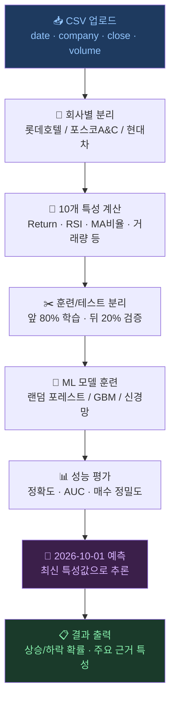

# 주식 ML/DL 종합 프로젝트 — 실전 예측과 해석

이 문서는 기존 `27.md` 내용을 12번째 학습 문서로 재구성한 종합 실습입니다.

> 초등학생의 질문: "컴퓨터가 미래 주가를 맞출 수 있나요?"
> 완벽히 맞추긴 어렵지만, 과거 패턴을 배워서 "오를 것 같다 / 내릴 것 같다"를 예측할 수 있습니다!

---

## 1. 왜 이 세 회사인가요?

| 회사 | 업종 | 특징 | 주가 범위(참고) |
|------|------|------|----------------|
| **롯데호텔** | 호텔·관광 | 여행 수요와 함께 움직임. 계절성 강함 | 약 10,000~18,000원 |
| **포스코A&C** | 건설·부동산 | 철강·건설 경기에 민감. 장기 추세 중요 | 약 12,000~30,000원 |
| **현대자동차** | 자동차 제조 | 대형 우량주. 환율·수출 영향이 큼 | 약 170,000~300,000원 |

> 업종이 다른 세 회사를 골랐기 때문에 같은 특성이라도 회사마다 중요도가 다르게 나타납니다.  
> 이 차이를 비교하는 것이 이번 실습의 핵심입니다!

---

## 2. 10개 특성 — AI가 주가를 볼 때 사용하는 눈

> 쉬운 비유: AI는 매일 주가를 보면서 아래 10가지 "체크리스트"를 작성합니다.  
> 이 10개 숫자의 조합으로 "내일 오를지 내릴지"를 판단합니다.

### 📋 10개 특성 한눈에 보기

| # | 특성 이름 | 영어 | 계산 방법 | 초등학생 비유 |
|---|-----------|------|---------|-------------|
| 1 | **일간 수익률** | Daily Return | (오늘종가 − 어제종가) ÷ 어제종가 × 100 | 어제 1,000원이었는데 오늘 1,010원 → +1% |
| 2 | **5일 수익률** | 5-day Return | (오늘종가 − 5일전종가) ÷ 5일전종가 × 100 | 지난 주 대비 얼마나 올랐나 |
| 3 | **MA5 비율** | Price/MA5 | 오늘종가 ÷ 5일이동평균 × 100 | 이번 주 평균보다 오늘 주가가 높은가 낮은가 |
| 4 | **MA20 비율** | Price/MA20 | 오늘종가 ÷ 20일이동평균 × 100 | 이번 달 평균보다 오늘 주가가 높은가 낮은가 |
| 5 | **거래량 비율** | Volume Ratio | 오늘거래량 ÷ 10일평균거래량 | 오늘 평소보다 주식을 몇 배 많이 사고팔았나 |
| 6 | **RSI (14일)** | Relative Strength | 14일 동안 오른 폭 ÷ (오른폭+내린폭) × 100 | 0=완전 지침, 100=너무 뜨거움. 70 이상=과매수 |
| 7 | **변동성** | Volatility | 최근 20일 수익률의 표준편차 | 주가가 얼마나 들쑥날쑥한지 |
| 8 | **골든크로스** | Golden Cross | MA5 > MA20이면 1, 아니면 0 | 단기 평균이 장기 평균을 넘으면 상승 신호! |
| 9 | **20일 모멘텀** | Momentum | (오늘종가 − 20일전종가) ÷ 20일전종가 × 100 | 한 달 전보다 얼마나 많이 올랐나 |
| 10 | **거래량 변화율** | Volume Change | (오늘거래량 − 어제거래량) ÷ 어제거래량 × 100 | 오늘 사람들이 갑자기 많이 사고팔기 시작했나 |

---

### 특성 1: 일간 수익률 (Daily Return)

어제 종가 대비 오늘 종가가 얼마나 변했는지 **퍼센트**로 나타냅니다.

```
일간 수익률 = (오늘 종가 - 어제 종가) / 어제 종가 × 100

예: 어제 현대차 240,000원 → 오늘 243,600원
    일간 수익률 = (243,600 - 240,000) / 240,000 × 100 = +1.5%
```

---

### 특성 2: 5일 수익률 (5-day Return)

5거래일(약 1주일) 동안의 누적 변화율입니다.  
단기 추세의 방향과 강도를 보여줍니다.

---

### 특성 3 & 4: MA5 비율, MA20 비율

이동평균(Moving Average) 대비 현재 주가의 위치입니다.

```
MA5 비율 = 오늘 종가 / 5일 이동평균 × 100

100 초과 → 현재 주가가 단기 평균보다 높음 (강세)
100 미만 → 현재 주가가 단기 평균보다 낮음 (약세)
```

> 비유: 우리 반 5일치 수학 점수 평균이 80점인데 오늘 내가 90점이면 평균보다 위(MA5 비율 = 112.5%)

---

### 특성 5: 거래량 비율 (Volume Ratio)

오늘 거래량이 최근 10일 평균의 몇 배인지 나타냅니다.

```
거래량 비율 = 오늘 거래량 / 10일 평균 거래량

2.0 이상 → 평소보다 2배 이상 활발하게 거래됨 → 큰 움직임이 예상됨
0.5 이하 → 평소보다 절반 수준 → 관심이 줄어드는 신호
```

---

### 특성 6: RSI — 상대강도지수 (Relative Strength Index)

0~100 사이의 숫자로, 주가가 "과열"인지 "냉각"인지 알려줍니다.

```
RSI = 100 - (100 / (1 + RS))
RS = 14일 평균 상승폭 / 14일 평균 하락폭

RSI 70 이상 → 과매수 (너무 많이 올라서 내릴 가능성)
RSI 30 이하 → 과매도 (너무 많이 내려서 오를 가능성)
RSI 50 전후 → 중립
```

> 비유: 체온계처럼, 너무 뜨거우면(RSI 70↑) 쉬어야 하고, 너무 차가우면(RSI 30↓) 회복이 올 수 있어요.

---

### 특성 7: 변동성 (Volatility)

최근 20일 일간 수익률의 표준편차입니다. 주가가 얼마나 **불안정한지** 측정합니다.

```
변동성이 크다 → 하루에 ±3% 이상 움직임. 예측이 어려움
변동성이 작다 → 하루에 ±0.5% 내외. 안정적인 흐름
```

---

### 특성 8: 골든크로스 신호 (Golden Cross Signal)

```
MA5 > MA20이면 → 1 (상승 신호)
MA5 < MA20이면 → 0 (하락 신호)
```

> 단기 평균(5일)이 중기 평균(20일)을 넘어서면 → "골든크로스" → 상승 신호!  
> 반대로 단기 평균이 장기 평균 아래로 내려가면 → "데드크로스" → 하락 신호

---

### 특성 9: 20일 모멘텀 (Momentum)

한 달(약 20거래일) 동안의 추세가 위를 향하는지 아래를 향하는지 보여줍니다.

```
20일 모멘텀 = (오늘 종가 - 20일 전 종가) / 20일 전 종가 × 100
```

---

### 특성 10: 거래량 변화율 (Volume Change Rate)

어제 대비 오늘의 거래량 변화를 %로 나타냅니다.

```
거래량 변화율 = (오늘 거래량 - 어제 거래량) / 어제 거래량 × 100
```

> 갑자기 거래량이 폭발하는 날은 뉴스나 큰 사건이 있는 경우가 많습니다!

---

## 3. CSV 데이터 형식

### 파일 구조

웹앱에 업로드할 CSV 파일의 형식은 다음과 같습니다:

```csv
date,company,close,volume
2024-01-02,롯데호텔,12500,850000
2024-01-02,포스코A&C,15200,230000
2024-01-02,현대자동차,215000,1250000
2024-01-03,롯데호텔,12700,920000
2024-01-03,포스코A&C,15000,180000
2024-01-03,현대자동차,217500,1380000
```

### 열(Column) 설명

| 열 이름 | 타입 | 설명 | 예시 |
|--------|------|------|------|
| `date` | 날짜 | 거래일 (YYYY-MM-DD 형식) | `2024-01-02` |
| `company` | 텍스트 | 회사명 (롯데호텔 / 포스코A&C / 현대자동차) | `현대자동차` |
| `close` | 숫자 | 당일 종가 (원) | `215000` |
| `volume` | 숫자 | 당일 거래량 (주) | `1250000` |

### 최소 데이터 요건

```
최소 행 수: 회사당 최소 60일치 (RSI·MA20 계산에 필요)
권장 행 수: 회사당 200일치 이상 (약 1년 = 예측 정확도 향상)
```

---

## 4. Python으로 10개 특성 계산하기

```python
import pandas as pd
import numpy as np

def compute_10_features(df: pd.DataFrame) -> pd.DataFrame:
    """
    입력: date, close, volume 열이 있는 DataFrame (한 회사 데이터)
    출력: 10개 특성이 추가된 DataFrame
    """
    df = df.copy().sort_values('date').reset_index(drop=True)
    df['close']  = pd.to_numeric(df['close'],  errors='coerce')
    df['volume'] = pd.to_numeric(df['volume'], errors='coerce')

    # ── 특성 1: 일간 수익률 ──────────────────────────────
    df['f1_daily_return'] = df['close'].pct_change() * 100

    # ── 특성 2: 5일 수익률 ──────────────────────────────
    df['f2_return_5d'] = df['close'].pct_change(5) * 100

    # ── 특성 3: MA5 비율 (종가 / 5일 이동평균 × 100) ─────
    ma5 = df['close'].rolling(5).mean()
    df['f3_ma5_ratio'] = df['close'] / ma5 * 100

    # ── 특성 4: MA20 비율 (종가 / 20일 이동평균 × 100) ───
    ma20 = df['close'].rolling(20).mean()
    df['f4_ma20_ratio'] = df['close'] / ma20 * 100

    # ── 특성 5: 거래량 비율 (오늘 / 10일 평균) ────────────
    df['f5_vol_ratio'] = df['volume'] / df['volume'].rolling(10).mean()

    # ── 특성 6: RSI (14일) ───────────────────────────────
    delta = df['close'].diff()
    gain  = delta.clip(lower=0).rolling(14).mean()
    loss  = (-delta.clip(upper=0)).rolling(14).mean()
    rs    = gain / loss.replace(0, np.nan)
    df['f6_rsi'] = 100 - (100 / (1 + rs))

    # ── 특성 7: 변동성 (20일 수익률 표준편차) ────────────
    df['f7_volatility'] = df['f1_daily_return'].rolling(20).std()

    # ── 특성 8: 골든크로스 신호 ──────────────────────────
    df['f8_golden_cross'] = (ma5 > ma20).astype(int)

    # ── 특성 9: 20일 모멘텀 ──────────────────────────────
    df['f9_momentum_20d'] = df['close'].pct_change(20) * 100

    # ── 특성 10: 거래량 변화율 ───────────────────────────
    df['f10_vol_change'] = df['volume'].pct_change() * 100

    # 레이블: 다음 날 오르면 1, 내리면 0 (훈련용)
    df['target'] = (df['close'].shift(-1) > df['close']).astype(int)

    return df.dropna().reset_index(drop=True)


# 사용 예시
df_raw = pd.read_csv('stock_data.csv', parse_dates=['date'])
df_hyundai = df_raw[df_raw['company'] == '현대자동차'].copy()
df_features = compute_10_features(df_hyundai)
print(df_features[['date', 'close'] + [f'f{i}' for i in range(1, 11)]].tail())
```

---

## 5. ML 학습 및 2026-10-01 예측 흐름



### 예측 해석 방법

| 예측 결과 | 의미 | 행동 기준(참고) |
|----------|------|---------------|
| 상승 확률 **70% 이상** | 강한 상승 신호 | 매수 고려 |
| 상승 확률 **55~70%** | 약한 상승 신호 | 소량 매수 또는 관망 |
| 상승 확률 **45~55%** | 중립 | 관망 |
| 상승 확률 **45% 미만** | 하락 신호 | 매도 또는 관망 |

> ⚠️ 주의: 이 예측은 학습 목적입니다. 실제 투자 결정은 전문가와 상담하세요!

---

## 6. 특성별 중요도 해석

랜덤 포레스트 모델은 10개 특성 중 어떤 것이 예측에 더 중요한지 알려줍니다.

```python
import matplotlib.pyplot as plt
from sklearn.ensemble import RandomForestClassifier

FEATURE_NAMES = [
    'f1_일간수익률', 'f2_5일수익률', 'f3_MA5비율', 'f4_MA20비율',
    'f5_거래량비율', 'f6_RSI', 'f7_변동성', 'f8_골든크로스',
    'f9_20일모멘텀', 'f10_거래량변화율'
]

# 훈련 후 중요도 시각화
importances = rf_model.feature_importances_
sorted_idx  = importances.argsort()[::-1]

plt.figure(figsize=(10, 4))
plt.bar(range(10), importances[sorted_idx], color='steelblue')
plt.xticks(range(10), [FEATURE_NAMES[i] for i in sorted_idx], rotation=45, ha='right')
plt.title('특성 중요도 — 어떤 정보가 예측에 가장 중요했나?')
plt.tight_layout()
plt.savefig('feature_importance.png', dpi=120)
```

---

## 7. 웹앱으로 예측하기

웹 브라우저에서 바로 실험할 수 있습니다:

1. [http://localhost:8000/predict](http://localhost:8000/predict) 접속
2. **샘플 CSV 다운로드** 버튼으로 데이터 형식 확인
3. CSV 파일 업로드 (drag & drop 지원)
4. ML 모델 선택 (랜덤 포레스트 / GBM / 신경망 / 로지스틱)
5. **예측 실행** 클릭
6. 3개 회사 각각의 예측 결과 및 특성 중요도 확인

---

## 핵심 정리

| 개념 | 설명 |
|------|------|
| **10개 특성** | 수익률·이동평균·거래량·RSI·변동성 등 다양한 각도에서 주가를 봄 |
| **회사별 학습** | 같은 특성이라도 업종에 따라 중요도가 다름 |
| **추론(Inference)** | 훈련된 모델에 최신 특성값을 입력해 2026-10-01 방향 예측 |
| **신뢰도** | 확률 55% 이상이면 약한 신호, 70% 이상이면 강한 신호 |
