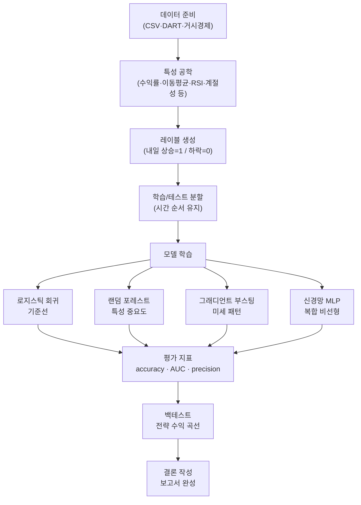
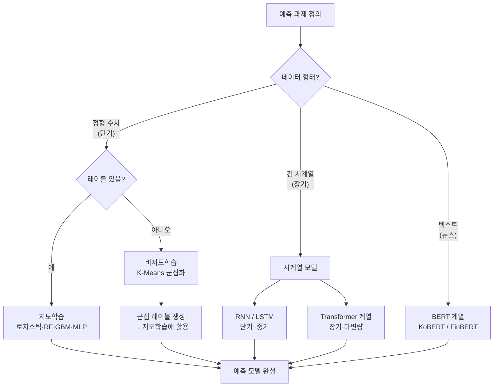

# Day 12. 종합 미니 프로젝트: 작은 AI 탐정 보고서 만들기

> 오늘은 12일 수업의 마지막 날입니다. 이제는 문서를 읽고, 웹앱에서 실험하고, 결과를 한 문장으로 설명하는 작은 프로젝트를 완성합니다.

---

## 오늘의 목표

- 지금까지 배운 흐름을 한 번에 묶습니다.
- 모델 선택, 데이터 확인, 성능 비교, 결과 해석, 결론 쓰기를 직접 해봅니다.
- "숫자를 보기만 하는 사람"에서 "숫자를 설명하는 사람"으로 한 걸음 나아갑니다.

---

## 오늘 프로젝트의 큰 흐름

| 단계 | 하는 일 | 여는 페이지 |
|---|---|---|
| 1 | 개념 다시 보기 | [메인 학습 허브](/) |
| 2 | 모델 비교하기 | [주식 AI 실험실](/lab) |
| 3 | 파일 올려 보기 | [예측 실험실](/predict) |
| 4 | 멀티특성 읽기 | [호텔-주가 실험실](/hotel-stock) |
| 5 | 결론 적기 | 이 문서 |

---

## 12일 핵심 낱말 총정리

| 낱말 | 한자·영어 | 쉬운 뜻 |
|---|---|---|
| 모델 | 模型 / *model* | 현실을 흉내 내는 계산 틀. 模(본뜰 모)+型(모형 형). 로지스틱 회귀·랜덤 포레스트·신경망 등이 모두 모델 |
| 특성 | 特性 / *feature* | 모델이 입력으로 받는 힌트. 特(특별할 특)+性(성질 성). 수익률·이동평균·거래량 비율 등 |
| 상승 확률 | 上昇確率 / *probability of rise* | 내일 주가가 오를 가능성을 0~1 사이 숫자로 나타낸 값. 上(위 상)+昇(오를 승)+確(확실할 확)+率(비율 률) |
| 은닉층 | 隱匿層 / *hidden layer* | 입력층과 출력층 사이의 중간 계산 층. 隱(숨을 은)+匿(숨길 닉)+層(층 층). 신경망이 복잡한 패턴을 학습하는 핵심 공간 |
| 역전파 | 逆傳播 / *backpropagation* | 오차를 출력층→입력층 방향으로 거꾸로 전달하며 가중치를 수정하는 과정. 逆(거꾸로 역)+傳(전할 전)+播(퍼질 파) |
| AUC | *Area Under Curve* | 모델이 상승/하락을 얼마나 잘 구분하는지 나타내는 종합 점수. 0.5=찍기, 1.0=완벽 |
| 백테스트 | *backtest* | 과거 데이터로 투자 전략을 시뮬레이션하는 것. "이 전략을 2020년부터 썼다면?" |
| 앙상블 | *ensemble* | 여러 모델을 합쳐 예측하는 방법. 다수결처럼 여러 모델이 함께 판단해 더 안정적인 결과를 냄 |

---

## 오늘의 프로젝트 질문

아래 세 가지 중 하나를 골라 시작하면 좋습니다.

1. 같은 데이터에서 어떤 모델이 가장 안정적이었을까?
2. 어떤 특성이 가장 자주 중요하게 나왔을까?
3. 점수가 좋아도 실전 곡선이 불편한 모델이 있었을까?

---

## 오늘 열 페이지

- [메인 학습 허브](/)
- [주식 AI 실험실](/lab)
- [예측 실험실](/predict)
- [호텔-주가 실험실](/hotel-stock)

---

## KRX 데이터셋 준비 (yfinance)

Yahoo Finance에서는 한국 종목도 조회할 수 있고, 티커 접미사를 붙이면 됩니다.

- 코스피(KOSPI): `종목코드.KS` (예: `005930.KS`)
- 코스닥(KOSDAQ): `종목코드.KQ` (예: `086520.KQ`)

아래 예시처럼 CSV를 만들면 웹앱 실습에 바로 쓸 수 있습니다.

```python
import yfinance as yf

ticker = "005930.KS"  # 코스피 종목 예시, 코스닥은 086520.KQ 형태
df = yf.download(ticker, start="2024-01-01", end="2025-01-01", auto_adjust=True)
out = df.reset_index()[["Date", "Close", "Volume"]]
out.columns = ["date", "close", "volume"]
out.to_csv("krx_005930.csv", index=False)
```

---

## 오늘의 40분 코스

| 시간 | 할 일 |
|---|---|
| 10분 | [메인 학습 허브](/)에서 관련 챕터 하나를 다시 읽습니다. |
| 10분 | [주식 AI 실험실](/lab)에서 모델 2개 이상 비교합니다. |
| 10분 | [예측 실험실](/predict)에서 CSV 업로드 결과를 확인합니다. |
| 10분 | [호텔-주가 실험실](/hotel-stock)에서 멀티특성 결과를 읽고 결론을 적습니다. |

---

## 프로젝트 따라 하기

1. [메인 학습 허브](/)에서 오늘 쓸 개념 챕터(예: chapter112)를 고릅니다.
2. 위 yfinance 예시로 KRX CSV를 만들고(`.KS`/`.KQ` 규칙 확인), 파일이 `date,close,volume` 헤더인지 점검합니다.
3. [주식 AI 실험실](/lab)에서 `📂 CSV`로 KRX 파일을 올려 모델 2개 이상 실행합니다.
4. [예측 실험실](/predict)에서는 `date,company,close,volume` 형식으로 확장한 CSV를 올려 회사별 결과를 확인합니다.
5. [호텔-주가 실험실](/hotel-stock)에서 ML 모델 1개와 DL 모델 1개를 비교합니다.
6. 아래 보고서 표를 채웁니다.

---

## 나의 미니 보고서

| 항목 | 내가 적을 내용 |
|---|---|
| 오늘 본 데이터 |  |
| 비교한 모델 |  |
| 가장 마음에 든 모델 |  |
| 근거가 된 숫자 |  |
| 가장 중요했던 특성 |  |
| 한 줄 해석 |  |
| 다음에 더 해볼 실험 |  |

---

## 한 줄 해석 예시

- `랜덤 포레스트는 중요 특성을 잘 보여 줘서 공부하기 좋았다.`
- `신경망은 숫자는 괜찮았지만 처음 읽기에는 조금 어려웠다.`
- `거래량 관련 특성이 여러 화면에서 자주 중요하게 보였다.`
- `점수는 높았지만 곡선 흔들림이 커서 실전 느낌은 불편했다.`

---

## 바로 써먹을 수 있는 보고서 주제 예시

### 1. 종목 중심

`삼성전자와 NAVER 중 어느 쪽이 다음 날 방향 예측이 더 안정적인가?`

볼 것:

- accuracy
- AUC
- 전략 수익률

### 2. 기술 지표 중심

`MA5, MA20, 거래량 비율 중 어떤 힌트가 가장 자주 중요하게 나왔는가?`

볼 것:

- 특성 중요도
- 모델별 상위 특성

### 3. 거시경제 중심

`금리, 환율, CPI 같은 시장 분위기를 같이 생각했을 때 어떤 종목이 더 민감해 보였는가?`

볼 것:

- 특정 기간의 흔들림
- 백테스트 곡선
- 뉴스가 많던 구간의 예측 변화

이렇게 적으면 초등학생도
"무슨 질문을 던졌고, 어떤 숫자를 봤고, 무슨 결론을 냈는지"
쉽게 따라갈 수 있습니다.

---

## 뉴스 기반 프로젝트 예시도 해볼 수 있어요

새로 추가된 [이벤트 투자 컨설팅](/advisor) 화면에서는  
전쟁, 가뭄, 물가, 금리, 규제 같은 뉴스를 넣고 주식 관점 해석을 받아볼 수 있습니다.

### 추천 질문 예시

1. `중동 전쟁 확대로 유가가 오르면 한국 증시에서는 어떤 업종을 먼저 조심해야 할까?`
2. `가뭄이 심해져 농산물 가격이 오르면 식품주와 비료주는 어떻게 다를까?`
3. `미국 CPI가 높게 나오면 NAVER 같은 성장주는 왜 흔들릴까?`

### 이 화면 안의 AI는 어떻게 작동하나요?

- 기본: **임베딩 + 유사도 검색**
- 확장 가능: **KoBERT / FinBERT 같은 분류 모델**

쉽게 말해,  
입력한 뉴스 문장을 대표 사건 문장들과 비교해서  
"이 뉴스는 전쟁 쪽과 더 닮았나, 물가 쪽과 더 닮았나?"를 먼저 판단합니다.

그다음 그 테마에 맞는 업종 영향과 체크리스트를 보여줍니다.

원하면 [Qdrant 벡터 뷰어](/qdrant)에서 벡터 DB 내부도 직접 볼 수 있습니다.

- `GET /api/qdrant/collections` 로 컬렉션 목록 확인
- `GET /api/qdrant/collections/{collection_name}/points?limit=30` 로 벡터/메타데이터 샘플 확인

이 흐름을 익히면 "뉴스 문장 임베딩이 실제로 어떻게 저장되고 검색되는지"까지 연결해서 이해할 수 있습니다.

---

## DART 공시 기반 프로젝트 예시도 해볼 수 있어요

이 저장소에는 [DART 공시 투자 파이프라인](/dart) 화면도 추가되었습니다.

이 화면은

1. DART 재무제표를 읽고
2. 최근 공시 제목을 모으고
3. 가격 팩터와 합쳐서
4. 종목별 투자 관찰 점수를 보여줍니다.

### 추천 프로젝트 질문

1. `삼성전자와 SK하이닉스 중 최근 공시와 재무 체력을 같이 보면 어느 쪽이 더 좋아 보일까?`
2. `카카오와 NAVER 중 부채비율과 영업이익 흐름은 어떻게 다를까?`
3. `은행주인 KB금융은 금리 뉴스와 DART 숫자를 같이 보면 어떤 장점이 보일까?`

### 아주 쉬운 해석 예시

`매출 증가 + 영업이익 증가 + 부채비율 안정`

이면

`회사 체력이 좋아지는 중일 수 있어요`

라고 적어볼 수 있습니다.

`매출 둔화 + 이익 약화 + 정정 공시`

이면

`조금 더 조심해서 지켜볼 필요가 있어요`

라고 적을 수 있습니다.

### 직접 해보기

1. `DART_API_KEY=내키 python scripts/refresh_datasets.py --use-fallback` 를 실행합니다.
2. [데이터셋 허브](/datasets?dataset=dart_fundamentals)에서 DART CSV를 미리 봅니다.
3. [DART 공시 투자 파이프라인](/dart)에서 회사 2개를 골라 비교합니다.
4. 아래 4가지를 표로 정리합니다.

| 항목 | 적어 볼 내용 |
|---|---|
| 회사 이름 |  |
| 매출 흐름 |  |
| 영업이익 흐름 |  |
| 최근 공시 메모 |  |
| 내 투자 생각 |  |

이렇게 하면

- `가격만 보는 투자`
- `회사 체력까지 보는 투자`

의 차이를 자연스럽게 느낄 수 있습니다.

---

## 추천 외부 API 프로젝트도 해볼 수 있어요

지금 저장소에는 이미

- [DART 공시 투자 파이프라인](/dart)
- [거시경제 투자 파이프라인](/macro)

이 들어 있습니다.

### 추천 프로젝트 1. FRED + DART

질문:

`금리와 VIX가 높을 때 반도체주 실적 개선 가능성은 어떻게 달라질까?`

볼 것:

- 미국 기준금리
- VIX
- 회사 영업이익률
- 다음 해 영업이익 증가 여부

### 추천 프로젝트 2. World Bank + DART

질문:

`한국 GDP 성장률과 수출 비중이 좋을 때 어떤 수출주가 더 좋아 보일까?`

볼 것:

- 한국 GDP 성장률
- 수출 비중
- 회사 매출 성장률
- 부채비율

### 추천 프로젝트 3. 다음에 확장하면 좋은 소스

- `KOSIS`: 한국 산업생산, 고용, 물가를 더 자세히 붙이기
- `Alpha Vantage`: 해외 종목 가격, 경제지표, 뉴스 감성, 기술지표 붙이기

이렇게 확장하면

`회사 숫자`
`시장 날씨`
`국가 구조`
`뉴스 분위기`

를 한 번에 보는 투자 연습으로 커질 수 있습니다.

---

## 마지막 관찰 미션

- 나는 이제 `회귀`, `분류`, `군집화`, `시계열`을 구분할 수 있나요?
- 모델 결과를 보고 "왜 그런지" 한 줄로 말할 수 있나요?
- 다음에 혼자 실험할 때 어디부터 열어야 할지 감이 오나요?

---

## 마지막 한 줄 숙제

`이번 12일 수업에서 내가 가장 기억에 남는 것은 ________이고, 앞으로 더 해보고 싶은 것은 ________이다.`

---

## 코스 완주 체크

- 문서를 12개 모두 읽었다
- 웹앱 버튼을 직접 눌러 봤다
- 같은 데이터를 두고 모델을 비교해 봤다
- 결과 숫자를 한 줄로 설명해 봤다
- 나만의 작은 결론을 적어 봤다

이 다섯 가지를 했다면, 이 저장소를 단순 구경이 아니라 **직접 실험하는 학습 도구**로 잘 쓰기 시작한 것입니다.

---

➡️ 다시 처음 흐름을 보고 싶다면 [Day 1 문서](01.md)로 돌아가세요.

---

## 알고리즘 처리 흐름 (Day 12)

### 12일 전체 학습 파이프라인



### 모델 유형별 선택 기준 흐름



---

## 모델 상세 참고 (Day 12)

최종 프로젝트에서 자주 비교하는 모델을 한 번에 정리하면 보고서 품질이 좋아집니다.

| 모델 | 수학적 의미 | 탄생 배경 | 주식투자 활용 | 만든 사람/대표 GitHub |
|---|---|---|---|---|
| 로지스틱 회귀 | 확률적 선형 분류기입니다. | 해석 가능한 기준선 모델 필요에서 확산되었습니다. | 프로젝트의 "최소 기준선"으로 다른 모델 개선 폭을 판단합니다. | David Cox(현대 통계 정립) · <https://github.com/scikit-learn/scikit-learn/blob/main/sklearn/linear_model/_logistic.py> |
| 랜덤 포레스트 | 다수 트리 앙상블 분류기입니다. | 단일 트리 과적합을 줄이려는 목적에서 개발되었습니다. | 특성 중요도와 안정 성능을 함께 제공해 보고서 근거 쓰기에 좋습니다. | Leo Breiman · <https://github.com/scikit-learn/scikit-learn/blob/main/sklearn/ensemble/_forest.py> |
| 그래디언트 부스팅 | 오차를 순차 보정하는 부스팅 계열입니다. | 고성능 분류/회귀 요구에서 발전했습니다. | 성능 상위 후보로 자주 등장해 비교 실험의 핵심 축이 됩니다. | Jerome Friedman · <https://github.com/scikit-learn/scikit-learn/blob/main/sklearn/ensemble/_gb.py> |
| 신경망(MLP) | 다층 비선형 함수 근사기입니다. | 복잡한 신호 조합 학습 필요에서 실무에 정착했습니다. | 멀티특성 프로젝트(호텔·거시 포함)에서 복합 상호작용 포착에 유리합니다. | Rumelhart, Hinton, Williams · <https://github.com/scikit-learn/scikit-learn/blob/main/sklearn/neural_network/_multilayer_perceptron.py> |
| Transformer 계열(PatchTST/TFT/iTransformer) | 어텐션으로 시점·변수 간 중요도를 학습하는 시계열 모델군입니다. | 장기 의존·다변량 시계열 한계를 해결하려고 등장했습니다. | 장기 예측·다중 공변량 예측 프로젝트 확장 시 핵심 후보입니다. | Vaswani 외/후속 연구팀 · PatchTST: <https://github.com/yuqinie98/PatchTST>, TFT: <https://github.com/google-research/google-research/tree/master/tft>, iTransformer: <https://github.com/thuml/iTransformer> |

## 분야별 모델 쓰임새 및 적합도 (Day 12)

| 모델 | 데이터셋 형태 | 헬스케어 | 자율주행 | 주식투자 | 로봇 | AI Ops |
|---|---|---|---|---|---|---|
| 로지스틱 회귀 | 정형 수치·범주 데이터, 이진 레이블 | 질환 유무·재입원 위험 분류, 임상 해석 기준선 | 단순 이진 환경 판단, 설명 가능성 중시 상황 | 프로젝트 최소 기준선, 다른 모델 개선 폭 판단 | 이상 유무 이진 판단, 안전 인터록 기준선 | 장애 발생 여부 분류, 설명 가능한 알림 규칙 |
| 랜덤 포레스트 | 정형 수치·범주 데이터, 중간 크기 | 진단 보조·치료 효과 예측, 특성 중요도 임상 해석 | 도로 조건 분류, 다변량 센서 이상 감지 | 특성 중요도·안정 성능 함께 제공, 보고서 근거 | 다변량 상태 분류·고장 예측, 특성 해석 용이 | 장애 원인 분류, 이슈 우선순위·이상 감지 |
| 그래디언트 부스팅 | 정형 수치·범주 데이터, 대용량 테이블 | 리스크 스코어링, 약물 부작용 예측, 고정밀 분류 | 고정밀 도로 상황 분류, XGBoost 계열 | 성능 상위 후보, 비교 실험 핵심 축 | 정밀 동작 제어 신호 분류, 이상 예측 | SLA 위반 예측, 장애 리스크 스코어링 |
| 신경망(MLP) | 정형 수치 데이터, 중간~대용량 | 복잡한 진단 패턴, 의료 영상 특성 분류 | 비선형 센서 융합, 주행 결정 신호 생성 | 멀티특성(호텔·거시 포함) 복합 상호작용 포착 | 복잡한 동작 제어, 다감각 데이터 처리 | 복합 메트릭 이상 탐지, 장애 패턴 인식 |
| Transformer 계열(PatchTST/TFT/iTransformer) | 장기·다변량 시계열, 외생변수 포함 데이터 | 웨어러블 장기 생체신호·다중 신호 동시 예측 | 다중 센서 융합·장거리 주행 패턴 장기 예측 | 장기 예측·다중 공변량 예측 프로젝트 확장 | 다관절 다변량 상태 분석·장기 동작 계획 | 다중 메트릭 동시 이상 감지·SLA 장기 예측 |

## 모델 혼합 & 검증 아이디어 (Day 12)

12일 수업의 마지막 날은 **지금까지 배운 모든 모델을 하나의 투자 파이프라인으로 연결**하는 날입니다.  
각 모델이 서로를 보완하는 구조를 설계하면, 실전 투자 솔루션에 가까워집니다.

### 풀 앙상블 파이프라인 아이디어

```
[데이터 준비]
  ↓
[K-Means 군집화] → 종목 성향 분류 (안정형/성장형/변동성형)
  ↓
[ML 기준 모델] → 로지스틱 회귀(기준선), 랜덤 포레스트, GBM 실행
  ↓
[DL 모델] → MLP 또는 시계열 모델(LSTM/Transformer) 추가 실행
  ↓
[텍스트 신호] → FinBERT/KoBERT로 뉴스 감성 점수화
  ↓
[앙상블] → 각 모델 상승 확률을 AUC 가중 평균으로 합산
  ↓
[백테스트 검증] → 전략 곡선, 낙폭, 샤프 비율 확인
  ↓
[최종 보고서] → 모델별 점수 + 앙상블 점수 + 결론
```

### 혼합 아이디어 요약

| 혼합 방법 | 어떻게 섞나요? | 왜 좋을까요? |
|---|---|---|
| 군집화 선행 + 맞춤 앙상블 | 종목 군집별로 가장 잘 맞는 모델 조합을 다르게 선택 | 성격이 다른 종목을 각자에게 맞는 방식으로 처리 |
| 거시경제 조건부 가중치 | VIX가 높은(불안장) 기간에는 낙폭이 작은 모델 비중을 높이고, 안정장에서는 AUC 기준 최고 모델 비중을 높임 | 시장 상황에 따라 유연하게 가중치를 바꾸는 동적 앙상블 |
| 멀티소스 신호 결합 | 가격 기반 모델(ML/DL) + 공시 기반 신호(DART) + 뉴스 감성(FinBERT) + 거시경제 신호(FRED)를 모두 특성으로 합산 | "회사 체력 + 시장 날씨 + 뉴스 분위기 + 차트 패턴"을 한 번에 보는 진정한 종합 판단 |

### 검증 방법 총정리

| 검증 항목 | 보는 이유 | 판단 기준 |
|---|---|---|
| AUC (분류 점수) | 상승/하락을 잘 구분하는지 | 0.6 이상이면 찍기보다 나음, 0.7 이상이면 꽤 쓸만함 |
| 백테스트 수익률 | 실제 전략처럼 돌렸을 때 수익 | 바이앤드홀드(그냥 보유)보다 높은지 비교 |
| 최대 낙폭(MDD) | 가장 힘들었던 순간의 손실 크기 | 낙폭이 작을수록 실전에서 버티기 쉬움 |
| 샤프 비율 | 위험 대비 수익의 효율성 | 1.0 이상이면 위험 대비 수익이 충분함 |
| 교차 검증 표준편차 | 기간이 바뀌어도 안정적인지 | 표준편차가 작을수록 여러 시기에 고르게 잘함 |
| 혼동 행렬 FP·FN 비율 | 어떤 종류의 오류가 많은지 | 매수 신호 오류(FP)를 줄이는 것이 실전에서 중요 |
| 앙상블 vs 단일 모델 비교 | 섞는 것이 실제로 도움이 됐는지 | 앙상블이 단일 최고 모델보다 모든 지표에서 조금씩 좋으면 성공 |

> 아주 쉽게 말하면: 투자는 한 가지 관점만 보면 위험합니다.  
> 차트(모델), 성적표(DART), 날씨(거시경제), 뉴스(감성)를 모두 보고 여러 전문가의 의견을 종합하면  
> 더 안전하고 근거 있는 투자 판단을 내릴 수 있습니다.

---

## 주식 투자 솔루션: 여러 모델 혼합·테스트·검증 실전 가이드

> 이 섹션은 "학습용 실험"을 넘어 **실제 투자 솔루션 파이프라인을 만드는 관점**에서 여러 모델을 섞고 검증하는 방법을 단계별 코드와 함께 설명합니다.

---

### 1단계: 특성(Feature) 준비

모든 모델이 같은 특성을 받도록 먼저 준비합니다.

```python
import pandas as pd
import numpy as np

def build_features(df: pd.DataFrame) -> pd.DataFrame:
    """
    df: date, close, volume 컬럼을 가진 DataFrame
    반환: 모델 입력으로 쓸 특성 DataFrame
    """
    df = df.copy().sort_values("date").reset_index(drop=True)

    df["return_1d"] = df["close"].pct_change(1)         # 1일 수익률
    df["return_5d"] = df["close"].pct_change(5)         # 5일 수익률
    df["ma5"]       = df["close"].rolling(5).mean()     # 5일 이동평균
    df["ma20"]      = df["close"].rolling(20).mean()    # 20일 이동평균
    df["ma_ratio"]  = df["ma5"] / df["ma20"]            # 단기/장기 비율
    df["vol_ratio"] = df["volume"] / df["volume"].rolling(20).mean()  # 거래량 비율

    # 레이블: 다음날 종가가 오르면 1, 내리면 0
    df["label"] = (df["close"].shift(-1) > df["close"]).astype(int)

    return df.dropna().reset_index(drop=True)

FEATURE_COLS = ["return_1d", "return_5d", "ma5", "ma20", "ma_ratio", "vol_ratio"]
```

---

### 2단계: 모델 풀(pool) 구성

여러 모델을 딕셔너리 하나로 묶어 관리하면 나중에 섞기가 쉽습니다.

```python
from sklearn.linear_model import LogisticRegression
from sklearn.ensemble import RandomForestClassifier, GradientBoostingClassifier
from sklearn.neural_network import MLPClassifier
from sklearn.preprocessing import StandardScaler
from sklearn.pipeline import Pipeline

def build_model_pool() -> dict:
    """
    반환: {모델 이름: Pipeline} 딕셔너리
    Pipeline = 표준화(StandardScaler) + 분류기
    """
    return {
        "로지스틱 회귀": Pipeline([
            ("scaler", StandardScaler()),
            ("clf", LogisticRegression(max_iter=1000, random_state=42)),
        ]),
        "랜덤 포레스트": Pipeline([
            ("scaler", StandardScaler()),
            ("clf", RandomForestClassifier(n_estimators=200, random_state=42)),
        ]),
        "그래디언트 부스팅": Pipeline([
            ("scaler", StandardScaler()),
            ("clf", GradientBoostingClassifier(n_estimators=200, random_state=42)),
        ]),
        "신경망(MLP)": Pipeline([
            ("scaler", StandardScaler()),
            ("clf", MLPClassifier(hidden_layer_sizes=(64, 32), max_iter=500, random_state=42)),
        ]),
    }
```

---

### 3단계: 워크포워드(Walk-Forward) 검증

주식 데이터는 미래를 과거로 섞으면 안 됩니다.  
**워크포워드 검증**은 시간 순서를 지키면서 훈련 창을 앞으로 밀며 반복합니다.

```
시간축 →
[훈련 240일][테스트 60일]
             [훈련 240일][테스트 60일]
                          [훈련 240일][테스트 60일]
```

```python
from sklearn.metrics import roc_auc_score, accuracy_score

def walk_forward_evaluate(
    df: pd.DataFrame,
    model_pool: dict,
    feature_cols: list,
    train_days: int = 240,
    test_days: int = 60,
) -> pd.DataFrame:
    """
    워크포워드 방식으로 각 모델의 AUC·정확도를 창(window)별로 수집합니다.

    반환: [window, model, auc, accuracy] 행을 가진 DataFrame
    """
    records = []
    n = len(df)
    start = 0
    window_id = 0  # 창 번호를 별도 카운터로 관리

    while start + train_days + test_days <= n:
        tr = df.iloc[start : start + train_days]
        te = df.iloc[start + train_days : start + train_days + test_days]

        X_tr, y_tr = tr[feature_cols], tr["label"]
        X_te, y_te = te[feature_cols], te["label"]

        for name, model in model_pool.items():
            # 매 창마다 새로 학습 (과거 창 결과는 이미 records에 저장)
            model.fit(X_tr, y_tr)
            prob = model.predict_proba(X_te)[:, 1]
            pred = model.predict(X_te)

            records.append({
                "window":   window_id,
                "model":    name,
                "auc":      roc_auc_score(y_te, prob),
                "accuracy": accuracy_score(y_te, pred),
            })

        start += test_days  # 창을 test_days만큼 앞으로 이동
        window_id += 1

    return pd.DataFrame(records)
```

---

### 4단계: 앙상블 — 모델 예측 섞기

워크포워드로 모은 AUC를 가중치로 삼아 각 모델의 상승 확률을 합산합니다.

#### 방법 A: 단순 평균(Soft Voting)

```python
def soft_voting(prob_dict: dict) -> np.ndarray:
    """
    prob_dict: {모델 이름: 상승 확률 배열} 딕셔너리
    반환: 모델 평균 상승 확률
    """
    probs = np.stack(list(prob_dict.values()), axis=1)  # (샘플 수, 모델 수)
    return probs.mean(axis=1)
```

#### 방법 B: AUC 가중 평균

```python
def auc_weighted_ensemble(prob_dict: dict, auc_dict: dict) -> np.ndarray:
    """
    prob_dict: {모델 이름: 상승 확률 배열}
    auc_dict : {모델 이름: 해당 모델의 검증 AUC}
    반환: AUC를 가중치로 삼은 가중 평균 상승 확률
    """
    total_auc = sum(auc_dict.values())
    ensemble_prob = np.zeros(len(next(iter(prob_dict.values()))))

    for name, prob in prob_dict.items():
        weight = auc_dict[name] / total_auc
        ensemble_prob += weight * prob

    return ensemble_prob
```

#### 방법 C: 스태킹(Stacking) — 메타 모델 활용

```python
from sklearn.linear_model import LogisticRegression as MetaModel

def train_stacking(
    base_models: dict,
    X_train: pd.DataFrame,
    y_train: pd.Series,
    X_val: pd.DataFrame,
    y_val: pd.Series,
) -> MetaModel:
    """
    1) 각 기본 모델을 훈련 데이터로 학습
    2) 검증 데이터에 대한 예측 확률을 메타 특성으로 사용
    3) 메타 모델(로지스틱 회귀)이 메타 특성을 학습해 최종 판단
    """
    # 기본 모델 학습
    meta_features = []
    for name, model in base_models.items():
        model.fit(X_train, y_train)
        prob = model.predict_proba(X_val)[:, 1].reshape(-1, 1)
        meta_features.append(prob)

    X_meta = np.hstack(meta_features)  # (검증 샘플 수, 기본 모델 수)

    meta = MetaModel(max_iter=500)
    meta.fit(X_meta, y_val)
    return meta
```

---

### 5단계: 백테스트로 결과 검증

분류 점수(AUC)만 좋아도 실제 수익은 다를 수 있습니다.  
**백테스트**는 모델 신호를 실제 거래처럼 돌려봐 수익 곡선을 만듭니다.

```python
def backtest(
    df: pd.DataFrame,
    ensemble_prob: np.ndarray,
    threshold: float = 0.55,
) -> pd.Series:
    """
    ensemble_prob : 앙상블 상승 확률 배열 (df와 같은 길이)
    threshold     : 이 값 이상이면 다음날 매수, 미만이면 현금 보유
    반환: 누적 전략 수익률 시리즈
    """
    df = df.copy().reset_index(drop=True)
    df["ensemble_prob"] = ensemble_prob
    df["signal"]  = (df["ensemble_prob"] >= threshold).astype(int)
    df["return1d"] = df["close"].pct_change(1).shift(-1)  # 다음날 수익률

    # 신호가 1인 날에만 다음날 수익률 획득
    df["strategy_return"] = df["signal"] * df["return1d"]

    # 누적 수익률 (1.0 = 원금 유지)
    df["cumulative"] = (1 + df["strategy_return"]).cumprod()
    return df["cumulative"]


def calc_metrics(cumulative: pd.Series, strategy_returns: pd.Series) -> dict:
    """
    cumulative       : backtest() 반환값
    strategy_returns : 일별 전략 수익률 시리즈
    반환: {mdd, sharpe, total_return} 딕셔너리
    """
    # 최대 낙폭(MDD)
    peak = cumulative.cummax()
    drawdown = (cumulative - peak) / peak
    mdd = drawdown.min()

    # 샤프 비율 (연율화, 거래일 252일 기준)
    mean_r = strategy_returns.mean()
    std_r  = strategy_returns.std()
    sharpe = (mean_r / std_r * np.sqrt(252)) if std_r > 0 else 0.0

    return {
        "total_return": cumulative.iloc[-1] - 1,
        "mdd":          mdd,
        "sharpe":       sharpe,
    }
```

---

### 6단계: 모델 비교 리포트 출력

```python
def print_comparison_report(
    wf_results: pd.DataFrame,
    backtest_metrics: dict,
) -> None:
    """
    wf_results     : walk_forward_evaluate() 반환 DataFrame
    backtest_metrics: {모델 이름: calc_metrics() 반환값} 딕셔너리
    """
    # 창별 평균 AUC·정확도
    summary = (
        wf_results.groupby("model")[["auc", "accuracy"]]
        .agg(["mean", "std"])
        .round(4)
    )
    summary.columns = ["AUC 평균", "AUC 표준편차", "정확도 평균", "정확도 표준편차"]

    print("=" * 60)
    print("[ 워크포워드 검증 결과 ]")
    print(summary.to_string())
    print()

    print("[ 백테스트 결과 ]")
    print(f"{'모델':<20} {'총수익률':>10} {'MDD':>10} {'샤프비율':>10}")
    print("-" * 55)
    for name, m in backtest_metrics.items():
        print(
            f"{name:<20}"
            f"  {m['total_return']:>+8.2%}"
            f"  {m['mdd']:>+8.2%}"
            f"  {m['sharpe']:>8.2f}"
        )
    print("=" * 60)
```

---

### 7단계: 전체 파이프라인 한 번에 실행

```python
import yfinance as yf

# ── 데이터 준비 ──────────────────────────────────────────────
raw = yf.download("005930.KS", start="2021-01-01", end="2025-01-01", auto_adjust=True)
raw = raw.reset_index()[["Date", "Close", "Volume"]]
raw.columns = ["date", "close", "volume"]

df = build_features(raw)

# ── 모델 풀 ─────────────────────────────────────────────────
pool = build_model_pool()

# ── 워크포워드 검증 (AUC 기준 가중치 계산용) ─────────────────
wf_results = walk_forward_evaluate(df, pool, FEATURE_COLS,
                                   train_days=240, test_days=60)
auc_by_model = wf_results.groupby("model")["auc"].mean().to_dict()

# ── 마지막 창으로 앙상블 생성 ────────────────────────────────
split = int(len(df) * 0.8)
X_tr, y_tr = df.iloc[:split][FEATURE_COLS], df.iloc[:split]["label"]
X_te        = df.iloc[split:][FEATURE_COLS]
df_test     = df.iloc[split:].copy().reset_index(drop=True)

prob_dict = {}
for name, model in pool.items():
    model.fit(X_tr, y_tr)
    prob_dict[name] = model.predict_proba(X_te)[:, 1]

ensemble_prob = auc_weighted_ensemble(prob_dict, auc_by_model)

# ── 백테스트 ─────────────────────────────────────────────────
def _strategy_returns(df_ref: pd.DataFrame, prob: np.ndarray, threshold: float = 0.55):
    """prob 배열과 threshold로 다음날 전략 수익률 시리즈를 반환하는 헬퍼"""
    daily_ret = df_ref["close"].pct_change(1).shift(-1).fillna(0)
    return daily_ret * (prob >= threshold)

bt_metrics = {}
for name, prob in prob_dict.items():
    cum = backtest(df_test, prob)
    ret = _strategy_returns(df_test, prob)
    bt_metrics[name] = calc_metrics(cum, ret)

# 앙상블 백테스트
cum_ens = backtest(df_test, ensemble_prob)
ret_ens = _strategy_returns(df_test, ensemble_prob)
bt_metrics["앙상블(AUC가중)"] = calc_metrics(cum_ens, ret_ens)

# ── 결과 출력 ────────────────────────────────────────────────
print_comparison_report(wf_results, bt_metrics)
```

---

### 결과 해석 체크리스트

| 확인 항목 | 좋은 신호 | 주의 신호 |
|---|---|---|
| 워크포워드 AUC | 0.60 이상이면서 표준편차 < 0.05 | 평균은 높지만 표준편차가 크면 불안정 |
| 총 수익률 | 바이앤드홀드(단순 보유)보다 높음 | 단순 보유보다 낮으면 모델이 손해를 키우는 것 |
| MDD (최대 낙폭) | −20% 이내 | −30% 초과면 실전에서 버티기 어려움 |
| 샤프 비율 | 1.0 이상 | 0.5 미만이면 위험 대비 수익이 부족함 |
| 앙상블 vs 단일 최고 모델 | 앙상블이 MDD·샤프 모두 개선 | 단일 모델이 계속 앙상블보다 낫다면 다른 모델로 교체 필요 |

> **실전 팁**: AUC와 수익률이 동시에 좋은 모델이 없을 때는  
> AUC 대신 **샤프 비율을 앙상블 가중치**로 써 보세요.  
> 수익성이 더 높은 모델에 더 많은 비중을 주기 때문에  
> 실전 성과와 가중치 기준이 일치하게 됩니다.

---

## 웹앱 안쪽 들여다보기

### 프로젝트를 넓혀 주는 확장 API
| 주소 | 하는 일 |
|---|---|
| `POST /api/stock/news-consult` | 뉴스 문장을 테마와 업종 영향으로 해석 |
| `GET /api/macro/overview` | 최신 금리·물가·VIX·GDP 흐름 요약 |
| `POST /api/macro/train` | DART + FRED + World Bank 특성으로 ML 학습 |
| `POST /api/assistant/route` | 자연어 질문을 맞는 화면으로 안내 |
| `POST /api/chat` | 결과를 쉬운 말로 다시 설명 |

### 거시경제 학습에는 어떤 힌트가 들어가나요?
`/api/macro/train` 은 회사 재무, FRED 거시 신호, World Bank 지표를 합쳐 약 19개 특성으로 “다음 해 영업이익이 좋아질까?”를 분류합니다.

### 이 저장소를 움직이는 대표 Python 도구
- `FastAPI`: 웹 서버 틀
- `pandas`, `numpy`: 표와 숫자 계산
- `scikit-learn`: ML/DL 모델 실행
- `httpx`: 외부 AI/Ollama 호출
- `uvicorn`: 서버 실행기

### 직접 실행하려면
```bash
python -m venv .venv
source .venv/bin/activate
pip install -r requirements.txt
uvicorn backend.app.main:app --reload --host 0.0.0.0 --port 8888
```

즉, 마지막 프로젝트는 버튼 몇 개를 누르는 활동이 아니라 **문서, 데이터, 모델, 뉴스, 거시경제, AI 설명기**를 한 흐름으로 묶는 연습입니다.

---

## 나만의 모델 알고리즘 만들기: 가능한가요? 어떻게 연구할까요?

> "이 저장소에 있는 모델만 쓰는 게 아니라, 내가 직접 설계한 알고리즘으로 주식 예측을 해볼 수 있을까?"  
> **결론부터 말하면: 가능합니다.** 그리고 그게 진짜 투자 솔루션을 만드는 출발점입니다.

---

### 왜 '나만의 모델'이 필요할까요?

기성 모델(RandomForest, LSTM 등)은 어디서나 쓸 수 있다는 뜻이기도 합니다.  
내가 발견한 **시장 고유의 패턴**을 코드로 담으려면 결국 직접 설계해야 합니다.

| 기성 모델만 쓸 때의 한계 | 나만의 알고리즘이 필요한 이유 |
|---|---|
| 모두가 같은 모델을 씀 → 초과 수익 기회 감소 | 남들이 못 보는 특성·로직으로 엣지(edge)를 만들 수 있음 |
| 하이퍼파라미터 튜닝이 한계 | 구조 자체를 바꿔 데이터에 맞출 수 있음 |
| 도메인 지식을 모델 내부에 녹이기 어려움 | 업종별 계절성, 공시 사이클 등을 직접 설계에 반영 가능 |

---

### 나만의 알고리즘, 어떤 방식으로 만들 수 있나요?

크게 세 가지 방향이 있습니다.

#### 방향 1. 규칙 기반(Rule-Based) 알고리즘

가장 먼저 해볼 수 있는 방식입니다.  
"이동평균이 골든크로스면 매수, 데드크로스면 매도" 같은 명확한 조건을 코드로 쓰는 것입니다.

```python
def my_signal(df: pd.DataFrame) -> pd.Series:
    """5일·20일 이동평균 골든크로스 신호"""
    ma5  = df["close"].rolling(5).mean()
    ma20 = df["close"].rolling(20).mean()
    # 1 = 매수 신호, 0 = 중립, -1 = 매도 신호
    signal = pd.Series(0, index=df.index)
    signal[ma5 > ma20] =  1
    signal[ma5 < ma20] = -1
    return signal
```

- **장점**: 결과가 투명하고 설명하기 쉽습니다.
- **단점**: 복잡한 시장 상황에는 단순 규칙이 부족합니다.
- **연구 방향**: 조건을 계속 백테스트로 검증하면서 규칙을 정교하게 다듬습니다.

---

#### 방향 2. 특성 공학(Feature Engineering) + 기존 ML 모델

기성 ML 모델의 **입력 특성을 내가 직접 설계**하는 방법입니다.  
모델 구조는 그대로지만, "어떤 힌트를 주느냐"가 완전히 내 아이디어가 됩니다.

```python
def build_my_features(df: pd.DataFrame) -> pd.DataFrame:
    """나만의 특성 조합 예시"""
    out = df.copy()

    # 1. 변동성 비율 (단기/장기)
    out["vol_ratio"] = df["close"].rolling(5).std() / df["close"].rolling(20).std()

    # 2. 거래량 급등 신호 (오늘 거래량 / 20일 평균)
    out["vol_spike"] = df["volume"] / df["volume"].rolling(20).mean()

    # 3. 전일 대비 갭(Gap) 비율
    out["gap"] = (df["close"] - df["close"].shift(1)) / df["close"].shift(1)

    # 4. 도메인 지식: 실적 발표 후 3거래일 더미 (공시 캘린더 필요)
    # out["post_earnings"] = ...  # DART 공시 날짜와 연결 시 활용

    return out.dropna()
```

- **장점**: 내 도메인 지식을 데이터로 직접 표현할 수 있습니다.
- **핵심 연구 과제**: 어떤 특성이 미래 수익과 진짜로 연관이 있는지 **인과 분석** 또는 **SHAP 중요도** 분석으로 검증합니다.

---

#### 방향 3. 신경망 구조 직접 설계 (커스텀 딥러닝)

PyTorch 또는 TensorFlow로 레이어 구조 자체를 설계하는 방법입니다.  
어렵지만 가장 자유도가 높고, 논문 아이디어를 직접 구현할 수 있습니다.

```python
import torch
import torch.nn as nn

class MyStockNet(nn.Module):
    """
    시계열 + 거시 특성을 동시에 처리하는 나만의 신경망 예시
    - 시계열 경로: LSTM → FC
    - 정적 특성 경로: FC
    - 두 경로를 합쳐(Concat) 최종 분류
    """
    def __init__(self, seq_len: int, static_dim: int, hidden: int = 64):
        super().__init__()
        self.lstm   = nn.LSTM(input_size=1, hidden_size=hidden, batch_first=True)
        self.static = nn.Linear(static_dim, hidden)
        self.head   = nn.Sequential(
            nn.Linear(hidden * 2, 32),
            nn.ReLU(),
            nn.Linear(32, 1),
            nn.Sigmoid(),
        )

    def forward(self, x_seq: torch.Tensor, x_static: torch.Tensor) -> torch.Tensor:
        _, (h, _) = self.lstm(x_seq)          # (1, batch, hidden)
        h = h.squeeze(0)                       # (batch, hidden)
        s = torch.relu(self.static(x_static)) # (batch, hidden)
        return self.head(torch.cat([h, s], dim=1)).squeeze(1)
```

- **장점**: 시계열 + 거시 신호를 한 번에 처리하는 등 아무도 쓰지 않는 구조를 만들 수 있습니다.
- **연구 방향**: 기존 논문(arXiv)에서 아이디어를 빌려 구조를 조금씩 변형해 봅니다.

---

### 연구 로드맵: 단계별로 어떻게 진행하면 될까요?

| 단계 | 하는 일 | 핵심 도구·개념 |
|---|---|---|
| **1. 가설 세우기** | "이 패턴이 수익과 관련 있다"는 아이디어를 글로 씁니다 | 직관, 뉴스, 논문 |
| **2. 데이터 수집** | yfinance·DART·FRED로 관련 데이터를 모읍니다 | `yfinance`, `OpenDartReader` |
| **3. 탐색적 분석(EDA)** | 히스토그램·산점도·상관관계로 가설을 눈으로 확인합니다 | `pandas`, `matplotlib` |
| **4. 특성 설계** | 가설을 수치 특성으로 바꿉니다 | 이동평균, 변동성, 공시 더미 등 |
| **5. 모델 학습** | 기성 또는 커스텀 모델에 특성을 넣어 학습합니다 | `scikit-learn`, `PyTorch` |
| **6. 워크포워드 검증** | 과거→미래 방향으로만 데이터를 쪼개 AUC를 측정합니다 | Walk-Forward CV |
| **7. 백테스트** | 실제 투자 시뮬레이션으로 수익률·MDD·샤프 비율을 확인합니다 | `vectorbt`, `backtrader` |
| **8. 반복 개선** | 결과가 나쁜 원인을 분석하고 1단계로 돌아갑니다 | SHAP, 오류 분석 |

> **핵심 원칙**: 단계를 건너뛰지 마세요.  
> 특히 **워크포워드 없이 백테스트만 하면** 미래 데이터가 학습에 스며드는 **데이터 누수(data leakage)** 가 생겨 실전에서 전혀 다른 결과가 나옵니다.

---

### 연구할 때 자주 빠지는 함정과 대처법

| 함정 | 왜 위험한가 | 대처법 |
|---|---|---|
| **과적합(Overfitting)** | 과거 데이터에만 맞는 모델이 됨 | 워크포워드 AUC 표준편차를 항상 확인 |
| **데이터 누수(Leakage)** | 미래 정보가 특성에 섞임 | 특성 계산에 `.shift(1)` 필수 적용 |
| **생존자 편향** | 지금 상장된 종목만 쓰면 과거 상폐 종목이 빠짐 | 전체 이력 데이터 사용 또는 기간 한정 |
| **수수료 무시** | 실제 거래에는 세금·슬리피지가 붙음 | 백테스트에 0.3~0.5% 왕복 비용 반영 |
| **너무 많은 특성** | 과적합 가능성 증가 | SHAP으로 중요 특성만 추려 10개 내외 유지 |

---

### 추천 공부 순서와 참고 자료

#### 입문 (이 저장소를 마친 직후)

| 자료 | 내용 |
|---|---|
| [scikit-learn 공식 튜토리얼](https://scikit-learn.org/stable/tutorial/) | ML 파이프라인·교차검증 기초 |
| [vectorbt 문서](https://vectorbt.dev/) | 빠른 파이썬 백테스트 라이브러리 |
| [Quantopian Lecture Series (archived)](https://github.com/quantopian/research_public) | 퀀트 투자 기초 강의 모음 |

#### 중급 (특성·모델 설계를 직접 해보고 싶을 때)

| 자료 | 내용 |
|---|---|
| [SHAP 문서](https://shap.readthedocs.io/) | 모델 예측에 어떤 특성이 얼마나 기여했는지 시각화 |
| [Advances in Financial Machine Learning (M. López de Prado)](https://www.amazon.com/dp/1119482089) | 금융 ML 전문서. 데이터 누수·워크포워드 개념 심화 |
| [arXiv Quantitative Finance](https://arxiv.org/list/q-fin.CP/recent) | 최신 퀀트·AI 논문 목록 |

#### 딥러닝 구조 직접 설계 (방향 3을 선택할 때)

| 자료 | 내용 |
|---|---|
| [PyTorch 공식 튜토리얼](https://pytorch.org/tutorials/) | 신경망 구조 직접 작성 기초 |
| [Temporal Fusion Transformer 논문](https://arxiv.org/abs/1912.09363) | 시계열 예측에 특화된 최신 딥러닝 구조 |
| [TimeGPT / Nixtla](https://github.com/Nixtla/nixtla) | 사전 학습된 시계열 파운데이션 모델 활용 방법 |

---

### 이 저장소 안에서 바로 시작해 볼 수 있는 실험

1. **특성 추가 실험**: `backend/app/chapters/` 안의 practice.py에 새 특성을 추가하고 AUC 변화를 확인합니다.
2. **나만의 규칙 신호 백테스트**: 위 `my_signal()` 함수를 `krx_005930.csv`에 적용해 수익 곡선을 그립니다.
3. **SHAP 분석**: 기존 RandomForest 학습 결과에 `shap` 라이브러리를 붙여 중요 특성 순위를 뽑습니다.
4. **커스텀 레이어 추가**: `MyStockNet`에 Attention 레이어를 붙여 보고 성능이 달라지는지 관찰합니다.

```python
# 빠른 시작: SHAP으로 기존 모델 특성 중요도 확인
import shap, joblib, pandas as pd

model = joblib.load("my_rf_model.pkl")   # 저장해 둔 RandomForest
X_test = pd.read_csv("test_features.csv")

explainer = shap.TreeExplainer(model)
shap_values = explainer.shap_values(X_test)
shap.summary_plot(shap_values[1], X_test)  # 상승 예측에 기여한 특성 순위
```

---

> **마무리 한 줄**  
> 나만의 모델 알고리즘은 "특별한 능력"이 필요한 게 아닙니다.  
> **가설 → 데이터 → 특성 → 모델 → 검증 → 반복**, 이 사이클을 꾸준히 돌리는 것이 전부입니다.  
> 이 저장소에서 익힌 흐름이 그 사이클의 첫 번째 바퀴입니다.

---

## 마이너스 통장으로 주식 투자하면 이익인가? — 의사결정 모듈

> 💡 이 섹션은 **현실적인 투자 의사결정 문제**를 AI·통계 관점에서 분석합니다.  
> 웹앱 [마이너스 통장 투자 분석](/loan-invest)에서 직접 시뮬레이션할 수 있습니다.

---

### 문제 정의

"현재 금리 기준으로 **2,000만 원 마이너스 통장** 자금을 주식에 투자하면 이익인가?"

이 질문에 답하려면 단순히 `주가 상승률 > 대출 금리` 여부만 볼 것이 아니라,  
훨씬 더 많은 변수를 함께 고려해야 합니다.

---

### 고려해야 할 변수 전체 목록

| 분류 | 변수명 | 설명 |
|---|---|---|
| **기본** | 종목 (ticker) | 투자 대상 주식. 변동성·배당·업종이 수익성에 직접 영향 |
| **기본** | 대출 금리 (interest_rate) | 마이너스 통장 연이율. 통상 3~7% 수준. 이 이상 수익 내야 본전 |
| **기본** | 투자 기간 (period_months) | 대출 유지 기간(월). 길수록 이자 비용 누적 |
| **비용** | 거래 비용 (transaction_cost_pct) | 증권사 수수료 + 증권거래세(0.2% 내외). 매수·매도 합산 |
| **비용** | 금융투자소득세 / 양도세 (tax_rate) | 수익의 일정 비율 과세. 비과세 한도, 손익통산 여부 포함 |
| **리스크** | 기대 수익률 (expected_return_pct) | 해당 종목의 연간 예상 수익률. 과거 데이터·애널리스트 전망 기반 |
| **리스크** | 변동성 / 표준편차 (volatility_pct) | 주가 움직임 크기. 클수록 손실 가능성도 커짐 |
| **리스크** | 최대낙폭 (max_drawdown_pct) | 역사적 최대 하락 폭. 담보 부족 / 반대매매 위험 기준 |
| **리스크** | 심리적 손절선 (stop_loss_pct) | 투자자가 실제로 버틸 수 있는 하락 한도. 감정적 손절 유발 지점 |
| **시장** | 시장 국면 (market_regime) | Bull / Bear / Sideways. 국면별 기대 수익률이 크게 다름 |
| **시장** | 금리 추세 (rate_trend) | 금리 인상 국면이면 성장주 밸류에이션 하락 압력 증가 |
| **시장** | 인플레이션 (inflation_rate) | 실질 수익률 = 명목 수익률 − 인플레이션 |
| **외부** | 환율 (fx_rate) | 해외 주식·ETF 투자 시 환차익/환차손 추가 |
| **외부** | 배당 수익률 (dividend_yield_pct) | 배당이 있으면 이자 비용을 일부 상쇄 가능 |
| **구조** | 레버리지 비율 (leverage_ratio) | 대출금 / 총 투자금. 1 이상이면 손익 확대 |
| **구조** | 담보 요구율 (margin_call_threshold) | 마이너스 통장의 담보비율 하한. 이 아래면 추가 입금 or 강제 청산 |
| **기회비용** | 무위험 수익률 대안 (risk_free_alternative) | 예·적금, CMA, 국채 금리. 안전 자산 대비 얼마나 더 벌어야 하는가 |

---

### 손익분기 계산 공식

```
실질 손익 = (투자 원금 × 기대 수익률 × 기간비율)
           + (투자 원금 × 배당 수익률 × 기간비율)
           − (투자 원금 × 대출 금리 × 기간비율)
           − (투자 원금 × 거래 비용)
           − (수익 × 세율)

손익분기 수익률 = 대출 금리 + 거래 비용 + (세금 효과) − 배당 수익률
```

예시 (연 금리 4.5%, 12개월, 거래 비용 0.4%, 세율 22%, 배당 0%):

```
손익분기 최소 수익률 ≈ 4.5% + 0.4% = 4.9%   (세전 기준)
세후 손익분기 ≈ 4.9% / (1 − 0.22) ≈ 6.3%
```

→ 해당 종목이 연 **6.3% 이상** 상승해야 세후 기준으로 이익

---

### 사용하는 AI 알고리즘과 근거

#### 1. 몬테카를로 시뮬레이션 (Monte Carlo Simulation)

**알고리즘**:  
- 주가 수익률을 정규분포 `N(μ, σ²)` 또는 Student-t 분포로 모델링
- 수천 번의 경로(path)를 시뮬레이션하여 최종 수익률 분포 추정
- 손익분기 초과 경로의 비율 = **투자 성공 확률**

```
매 시뮬레이션 경로:
    r_t ~ N(μ_daily, σ_daily²)
    가격_t = 가격_{t-1} × exp(r_t)
```

**근거**:  
주가는 미래를 정확히 예측할 수 없으므로, 가능한 시나리오의 **분포 전체**를 보는 것이 올바른 접근입니다.  
몬테카를로는 레버리지 투자의 **경로 의존성(path dependency)** — 도중에 크게 빠지면 회복해도 실제 손실 — 을 자연스럽게 포착합니다.

---

#### 2. 샤프 비율 (Sharpe Ratio) — 레버리지 조정

```
Sharpe = (E[R_port] − R_f) / σ_port

R_port = 주식 수익률
R_f    = 대출 금리 (무위험 대안 비용)
σ_port = 주식 수익률 표준편차
```

**근거**:  
단순히 "수익률이 금리보다 높은가"가 아니라,  
**단위 위험당 초과 수익**이 충분한지 판단합니다.  
Sharpe < 0이면 대출 투자는 위험 대비 손해, 0~1이면 애매, 1 이상이면 합리적입니다.

---

#### 3. 규칙 기반 의사결정 트리 (Rule-based Decision Tree)

복잡한 ML 모델 없이도, 아래 체크리스트 형태로 **투자 가능 / 불가 / 주의** 를 판단합니다.

```
IF 손익분기 수익률 > 역사적 평균 수익률:
    → 기대값 음수, 투자 비추천

IF 최대낙폭 > 심리적 손절선:
    → 감정적 손절 위험 높음, 주의

IF 레버리지 × 변동성 > 30%:
    → 담보부족(마진콜) 위험 높음, 주의

IF Sharpe > 1.0 AND 손익분기 수익률 < 역사적 P25 수익률:
    → 투자 유리한 환경
```

**근거**:  
대출 투자는 자산 관리 문제이기도 하므로, 해석 가능성(interpretability)이 중요합니다.  
블랙박스 딥러닝보다 규칙 기반 결정이 실제 투자 판단에서 더 신뢰받습니다.

---

### 웹앱 모듈 사용 방법

1. [마이너스 통장 투자 분석](/loan-invest) 화면으로 이동합니다.
2. 원금(기본 2,000만 원), 금리, 기간, 종목 기대 수익률·변동성을 입력합니다.
3. 추가 변수(세율, 거래 비용, 배당, 심리적 손절선 등)를 조정합니다.
4. **분석 실행** 버튼을 누르면:
   - 손익분기 수익률 계산
   - 몬테카를로 1,000회 시뮬레이션 결과 (성공 확률)
   - Sharpe 비율
   - 규칙 기반 종합 판정 (투자 추천 / 주의 / 비추천)
   - 알고리즘 근거 설명

---

### 결론 정리

| 상황 | 판단 |
|---|---|
| 기대 수익률 > 손익분기 + 충분한 마진 | 투자 유리할 수 있음 |
| 기대 수익률 ≈ 손익분기 | 변동성에 따라 손실 위험. 주의 |
| 기대 수익률 < 손익분기 | 기댓값 음수. 투자 비추천 |
| 변동성이 매우 높음 (30%+) | 레버리지 사용 자체가 위험 |
| 심리적 손절선이 작음 | 중간에 강제 손절될 가능성 높음 |

> ⚠️ 이 모듈은 **교육 목적**의 시뮬레이션입니다. 실제 투자 결정은 금융 전문가와 상담하세요.
