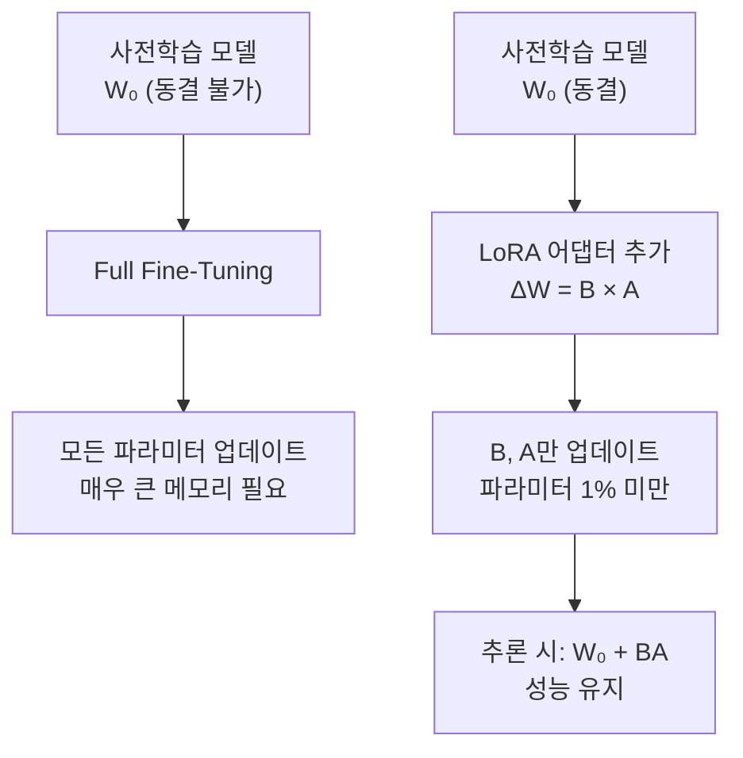
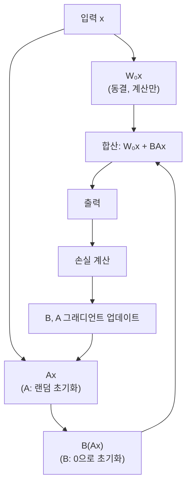

# Day 13. LLM 파인튜닝 실험실: 거대 모델을 내 입맛에 맞게 바꾸기

> 오늘은 이미 잘 배운 AI를 나만의 용도로 다시 가르치는 방법을 살펴봅니다.

---

## 오늘의 목표

- LLM(대형 언어 모델) 파인튜닝이 무엇인지 이해합니다.
- `Full Fine-Tuning`, `LoRA`, `QLoRA`, `Instruction Tuning`의 차이를 비교합니다.
- [LLM 파인튜닝 실험실](/fine-tune)에서 직접 개념을 체험합니다.

---

## 왜 파인튜닝이 필요할까요?

GPT, LLaMA, Gemma 같은 대형 언어 모델은 인터넷의 방대한 텍스트로 미리 학습되어 있습니다.  
그런데 이 모델들은 "일반 목적"으로 만들어졌기 때문에, 특정 업무에 바로 쓰기에는 아래와 같은 문제가 있습니다.

- 금융 보고서 요약 같은 도메인 지식이 부족합니다.
- 원하는 말투나 형식으로 답하지 않을 수 있습니다.
- 회사 내부 데이터를 모릅니다.

파인튜닝은 이 문제를 해결하는 방법입니다.  
**기존 지식은 유지하면서, 내가 원하는 방향으로 조금 더 가르치는 것**이 파인튜닝입니다.

---

## 오늘의 낱말 8개

| 낱말 | 한자·영어 | 쉬운 뜻 |
|---|---|---|
| 파인튜닝 | *Fine-Tuning* | 이미 학습된 모델을 특정 목적에 맞게 추가로 학습하는 것 |
| 사전학습 | 事前學習 / *Pre-Training* | 대규모 데이터로 모델을 처음 학습시키는 과정. 事(일 사)+前(앞 전)+學習(학습) |
| LoRA | *Low-Rank Adaptation* | 행렬을 작은 두 행렬의 곱으로 근사해 파라미터를 대폭 줄이는 파인튜닝 방법 |
| QLoRA | *Quantized LoRA* | LoRA에 양자화(4비트)를 결합해 메모리를 더욱 줄인 방법 |
| PEFT | *Parameter-Efficient Fine-Tuning* | 전체 파라미터 대신 일부만 업데이트하는 파인튜닝 방법들의 총칭 |
| 어댑터 | *Adapter* | 기존 모델 레이어 사이에 삽입해 학습하는 작은 추가 레이어 |
| 인스트럭션 튜닝 | *Instruction Tuning* | 질문-답변 쌍으로 모델이 지시를 따르도록 학습시키는 방법 |
| 랭크 | *Rank* (r) | LoRA에서 어댑터 행렬의 차원. 작을수록 파라미터 수가 적음 |

---

## 오늘 열 페이지

- [LLM 파인튜닝 실험실](/fine-tune)

---

## 파인튜닝 방법 비교

| 방법 | 업데이트 파라미터 | 메모리 | 속도 | 특징 |
|---|---|---|---|---|
| Full Fine-Tuning | 전체 | 매우 큼 | 느림 | 성능 최대, 비용 최대 |
| Adapter Tuning | 어댑터만 | 중간 | 중간 | 레이어 사이에 삽입 |
| LoRA | B, A 행렬만 | 작음 | 빠름 | 원본 가중치 동결, 저랭크 행렬 추가 |
| QLoRA | B, A + 양자화 | 매우 작음 | 빠름 | 4비트 양자화로 메모리 절감 |
| Instruction Tuning | 선택 가능 | 가변 | 가변 | 지시 따르기 특화 데이터 사용 |
| Prompt Tuning | 프롬프트 토큰만 | 매우 작음 | 매우 빠름 | 소프트 프롬프트 학습 |

---

## LoRA: 핵심 아이디어

### 직관적인 비유

모델의 가중치 행렬 W (예: 1000×1000 = 100만 파라미터)를  
두 개의 작은 행렬 B(1000×4)와 A(4×1000)의 곱으로 표현합니다.

- W의 "변화량" ΔW = B × A
- 파라미터 수: 1000×4 + 4×1000 = 8,000개 (원래의 0.8%!)

### 수식

```
출력 = W₀x + ΔWx = W₀x + BAx
```

- `W₀`: 원본 사전학습 가중치 (동결, 업데이트 안 함)
- `B`: d × r 행렬 (처음에는 0으로 초기화)
- `A`: r × k 행렬 (랜덤 초기화)
- `r`: 랭크 (보통 4, 8, 16, 32 중 선택)

### 랭크(r)에 따른 파라미터 변화

| 원본 차원 | 랭크 r | LoRA 파라미터 수 | 압축률 |
|---|---|---|---|
| 768×768 = 590,112 | 4 | 768×4 + 4×768 = 6,144 | 96.0% 절감 |
| 768×768 = 590,112 | 8 | 768×8 + 8×768 = 12,288 | 97.9% 절감 |
| 1024×1024 = 1,048,576 | 4 | 1024×4 + 4×1024 = 8,192 | 99.2% 절감 |
| 1024×1024 = 1,048,576 | 16 | 1024×16 + 16×1024 = 32,768 | 96.9% 절감 |

---

## QLoRA: LoRA + 양자화

QLoRA는 두 가지를 결합합니다.

1. **4비트 양자화(NF4)**: 사전학습 가중치를 4비트로 압축 저장
2. **LoRA**: 양자화된 가중치 위에 LoRA 어댑터 추가 학습

### 메모리 절감 효과 (LLaMA 7B 기준)

| 방법 | GPU 메모리 |
|---|---|
| Full Fine-Tuning (bf16) | ~112 GB |
| LoRA (bf16) | ~14 GB |
| QLoRA (4bit + LoRA) | ~6 GB |

---

## Instruction Tuning: 지시를 잘 따르게 만들기

Instruction Tuning은 모델이 사람의 지시를 잘 따르도록 학습하는 방법입니다.

### 데이터 형식 예시

```json
{
  "instruction": "다음 주식의 상승 가능성을 분석하세요.",
  "input": "삼성전자, 거래량 급증, 외국인 순매수",
  "output": "외국인 순매수와 거래량 증가는 긍정 시그널입니다. 단기 상승 가능성이 높아 보입니다."
}
```

### 대표 데이터셋

| 데이터셋 | 규모 | 특징 |
|---|---|---|
| Alpaca | 52K | Self-Instruct로 생성된 영어 지시 데이터 |
| Dolly | 15K | Databricks 직원이 직접 작성한 고품질 데이터 |
| ko-alpaca | 52K | Alpaca를 한국어로 번역한 데이터 |
| LIMA | 1K | 1,000개의 고품질 예시만으로 학습 가능함을 증명 |

---

## 한국어 파인튜닝 데이터 자원

### Hugging Face Hub에서 한국어 데이터셋 찾기

**Hugging Face Hub**(<https://huggingface.co/datasets>)에는 한국어 파인튜닝에 바로 쓸 수 있는 데이터셋이 다수 공개되어 있습니다.

```python
from datasets import load_dataset

# 한국어 지시 데이터셋 로드
ds = load_dataset("beomi/KoAlpaca-v1.1a")

# 데이터 형식 확인
print(ds["train"][0])
# → {'instruction': '...',  'output': '...'}
```

| 데이터셋 | 규모 | 특징 |
|---|---|---|
| `beomi/KoAlpaca-v1.1a` | 21K | 한국어 지시-응답 쌍 |
| `HAERAE-HUB/KMMLU` | 35K | 한국어 멀티태스크 언어 이해 벤치마크 |
| `klue/klue` | 다수 | KLUE 8개 태스크 (NLI·MRC·NER 등) |
| `snunlp/KR-FinBert` | — | 한국어 금융 텍스트 감성 레이블 |

### AI Hub: 한국 정부 공개 AI 학습 데이터

**AI Hub**(<https://aihub.or.kr>)는 과학기술정보통신부와 한국지능정보사회진흥원(NIA)이 운영하는 **한국어 AI 학습 데이터 공개 플랫폼**입니다.  
회원가입 후 무료로 다양한 원천 데이터를 신청·다운로드할 수 있습니다.

| 카테고리 | 대표 데이터셋 | 파인튜닝 활용 |
|---|---|---|
| **금융** | 금융 질의응답 데이터 | 금융 비서 Instruction Tuning |
| **법률** | 판례·법령 요약 데이터 | 법률 Q&A 모델 |
| **의료** | 의료 상담 텍스트 | 의료 특화 LLM 파인튜닝 |
| **대화** | 한국어 대화 말뭉치 | 한국어 챗봇 |
| **뉴스** | 뉴스 기사 요약 쌍 | 요약 모델 |

#### AI Hub 데이터로 Instruction 데이터 만들기

```python
import json

# AI Hub 금융 QA 데이터 → Instruction Tuning 형식 변환
with open("aihub_finance_qa.json", encoding="utf-8") as f:
    raw = json.load(f)

instruction_data = [
    {
        "instruction": item["question"],
        "input": "",
        "output": item["answer"]
    }
    for item in raw["data"]
]

with open("finance_instruct.json", "w", encoding="utf-8") as f:
    json.dump(instruction_data, f, ensure_ascii=False, indent=2)
```

> **실용 팁**: AI Hub 데이터를 Instruction 형식으로 변환한 뒤 Hugging Face PEFT 라이브러리로 QLoRA 파인튜닝을 적용하면, 소비자 GPU에서도 한국어 금융 특화 LLM을 만들 수 있습니다.

---

## 오늘의 25분 코스

| 시간 | 할 일 |
|---|---|
| 5분 | 파인튜닝 방법 비교표를 읽습니다. |
| 10분 | [LLM 파인튜닝 실험실](/fine-tune)에서 LoRA 시뮬레이터를 실행합니다. |
| 10분 | Instruction Tuning 탭에서 지시-응답 패턴을 확인합니다. |

---

## 웹앱 따라 하기

1. [LLM 파인튜닝 실험실](/fine-tune)을 엽니다.
2. `LoRA 시뮬레이터` 탭에서 랭크(r)를 바꿔가며 파라미터 수 변화를 봅니다.
3. `Instruction Tuning` 탭에서 지시 분류 결과를 확인합니다.
4. `파인튜닝 로드맵` 탭에서 실제 적용 순서를 읽습니다.

---

## 관찰 미션

- 랭크 r=4와 r=16에서 파라미터 수가 얼마나 다른가요?
- QLoRA가 LoRA보다 메모리를 얼마나 더 절감하나요?
- Instruction Tuning 데이터가 1,000개만 있어도 충분한 이유가 무엇일까요?

---

## 한 줄 숙제

`LoRA는 원본 가중치를 동결하고 ________와(과) ________라는 두 개의 작은 행렬만 학습한다.`

---

## 알고리즘 처리 흐름 (Day 13)

### Full Fine-Tuning vs LoRA 비교 흐름



### LoRA 학습 흐름



---

## 모델 상세 참고 (Day 13)

| 방법 | 수학적 의미 | 탄생 배경 | 주식·금융 활용 | 만든 사람/대표 GitHub |
|---|---|---|---|---|
| LoRA | W₀ + ΔW = W₀ + BA로 업데이트를 저랭크 행렬 쌍으로 분해합니다. | GPT-3처럼 파라미터가 너무 많아 전체 파인튜닝이 불가능해진 배경에서 Microsoft Research가 제안했습니다. | 금융 보고서 요약, 종목 분석 텍스트 생성, 실적 공시 해석에 활용됩니다. | Edward Hu et al. · <https://github.com/microsoft/LoRA> |
| QLoRA | 4비트 양자화(NF4)된 기저 모델 위에 LoRA 어댑터를 추가합니다. | 소비자 GPU(RTX 3090 등)에서도 7B+ 모델 파인튜닝이 가능하도록 UW 팀이 설계했습니다. | 소형 서버에서 한국어 금융 특화 모델을 파인튜닝할 때 활용됩니다. | Tim Dettmers et al. · <https://github.com/artidoro/qlora> |
| Instruction Tuning | 지시-입력-출력 3쌍 데이터로 교차 엔트로피 손실을 최소화합니다. | 모델이 사람 지시를 따르게 하려는 InstructGPT 연구에서 비롯되었습니다. | "이 종목을 분석해줘" 같은 자연어 질문에 구조화된 답변을 생성하는 금융 비서에 활용됩니다. | Stanford Alpaca 팀 · <https://github.com/tatsu-lab/stanford_alpaca> |

## 분야별 파인튜닝 쓰임새 (Day 13)

| 방법 | 헬스케어 | 금융·투자 | 법률 | 교육 | AI Ops |
|---|---|---|---|---|---|
| LoRA | 의료 기록 요약, 진단 보조 | 실적 공시 분류, 리포트 요약 | 판례 분석, 계약서 검토 | 학습 피드백 생성 | 로그 이상 설명 생성 |
| QLoRA | 소형 GPU에서 임상 노트 파인튜닝 | 로컬 서버에서 한국어 금융 모델 구축 | 사내 서버에서 기밀 문서 학습 | 학교 서버 AI 튜터 구축 | 엣지 서버 이상 탐지 |
| Instruction Tuning | 증상 질문 응답 | 투자 상담 챗봇 | 법률 Q&A 서비스 | 개인 맞춤 설명 | 운영 이슈 Q&A 봇 |

---

## 실제 적용 로드맵

### 한국어 금융 LLM 만들기 (예시)

| 단계 | 작업 | 도구 |
|---|---|---|
| 1 | 기반 모델 선택 | EEVE-Korean, EXAONE, Gemma-Ko |
| 2 | 도메인 데이터 수집 | DART 공시, 증권사 리포트, 뉴스 |
| 3 | Instruction 데이터 변환 | 질문-답변 형식으로 가공 |
| 4 | QLoRA 파인튜닝 | Hugging Face PEFT + bitsandbytes |
| 5 | 평가 | BLEU, ROUGE, 도메인 전문가 검토 |
| 6 | 서빙 | Ollama, vLLM, TGI |

### 최소 하드웨어 요구사항 (QLoRA 기준)

| 모델 크기 | 최소 VRAM | 권장 GPU |
|---|---|---|
| 1B | 2 GB | RTX 3060 |
| 3B | 4 GB | RTX 3060 Ti |
| 7B | 6 GB | RTX 3080 |
| 13B | 10 GB | RTX 3090 |
| 70B | 48 GB | A100 40G × 2 |

---

## 다음 단계 연결

이 개념을 실제로 경험해보려면:

1. **[chapter114](/lab)**: LoRA 저랭크 행렬 numpy 시뮬레이션
2. **[chapter115](/lab)**: Instruction Tuning 분류 실습 (sklearn)
3. **[LLM 파인튜닝 실험실](/fine-tune)**: 웹앱에서 대화형 탐색
