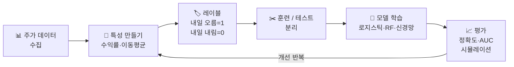

# Day 029–030 — 머신러닝이란 무엇일까? (feat. 국내 증시 데이터)

> 컴퓨터가 **실제 코스피 데이터**를 보고 스스로 배우는 방법을 알아봅니다.

---

## 1. 머신러닝이란?

머신러닝은 **컴퓨터가 데이터를 보고 스스로 규칙을 배우는 것**입니다.

예를 들어, 삼성전자 주가 데이터 1년치를 컴퓨터에 보여주면, 컴퓨터가 "이런 패턴일 때 주가가 올랐구나"를 스스로 배웁니다.

### 머신러닝의 3가지 종류

| 종류 | 설명 | 주식 예시 |
|------|------|---------|
| **지도학습** | 정답을 알려주며 가르침 | "이날 주가가 올랐어" 라고 알려주고 학습 |
| **비지도학습** | 정답 없이 혼자 패턴 찾기 | 비슷한 주식끼리 스스로 묶기 |
| **강화학습** | 보상을 받으며 배움 | 게임처럼 수익 나면 칭찬, 손해 나면 벌점 |

### 주식 AI 개발 흐름



---

## 2. 국내 증시 데이터 수집하기 (FinanceDataReader)

실제 삼성전자(005930) 주가 데이터를 불러와 머신러닝에 활용합니다.

```python
import pandas as pd
import numpy as np
import matplotlib.pyplot as plt

# FinanceDataReader로 실제 국내 주가 데이터 수집
try:
    import FinanceDataReader as fdr

    # 삼성전자 2022~2024 주가
    df = fdr.DataReader('005930', '2022-01-01', '2024-12-31')
    df = df[['Close', 'Volume']].rename(columns={'Close': 'close', 'Volume': 'volume'})
    df.index = pd.to_datetime(df.index)
    print("✅ 실제 삼성전자 데이터 로드 완료")

except Exception:
    # 오프라인 환경 대체 데이터
    np.random.seed(42)
    days = 500
    dates = pd.date_range('2022-01-01', periods=days, freq='B')
    prices = 60000 + np.cumsum(np.random.randn(days) * 800)
    prices = np.clip(prices, 40000, 90000)
    df = pd.DataFrame({
        'close': prices.round(0),
        'volume': np.random.randint(8_000_000, 25_000_000, days),
    }, index=dates)
    print("⚠️  오프라인 모드: 시뮬레이션 데이터 사용")

days = len(df)
print(f"\n데이터 기간: {df.index[0].date()} ~ {df.index[-1].date()}")
print(f"총 거래일: {days}일")
print(f"평균 주가: {df['close'].mean():,.0f}원")
print(f"최고 주가: {df['close'].max():,.0f}원")
print(f"최저 주가: {df['close'].min():,.0f}원")
print(df.tail())
```

---

### 주요 코스피 종목 티커 코드

| 종목 | 티커 | fdr 코드 |
|------|------|---------|
| 삼성전자 | 005930 | `fdr.DataReader('005930', ...)` |
| SK하이닉스 | 000660 | `fdr.DataReader('000660', ...)` |
| 카카오 | 035720 | `fdr.DataReader('035720', ...)` |
| NAVER | 035420 | `fdr.DataReader('035420', ...)` |
| 현대차 | 005380 | `fdr.DataReader('005380', ...)` |
| KOSPI 지수 | KS11 | `fdr.DataReader('KS11', ...)` |

---

## 3. 데이터 나누기 (훈련 / 테스트)

주식 데이터는 시간 순서가 중요하므로, 앞부분으로 학습하고 뒷부분으로 테스트합니다.

```python
# 앞 80%는 공부, 뒤 20%는 시험
split = int(days * 0.8)
train_df = df.iloc[:split]
test_df  = df.iloc[split:]

print(f"공부용 데이터: {len(train_df)}일 ({train_df.index[0].date()} ~ {train_df.index[-1].date()})")
print(f"시험용 데이터: {len(test_df)}일  ({test_df.index[0].date()} ~ {test_df.index[-1].date()})")

# 시각화
plt.figure(figsize=(10, 4))
plt.plot(train_df.index, train_df['close'], label='공부용 (훈련)', color='blue')
plt.plot(test_df.index,  test_df['close'],  label='시험용 (테스트)', color='orange')
plt.axvline(x=train_df.index[-1], color='red', linestyle='--', label='나누는 선')
plt.title('삼성전자 주가 데이터 나누기 (국내 실제 데이터)')
plt.xlabel('날짜')
plt.ylabel('주가 (원)')
plt.legend()
plt.tight_layout()
plt.savefig('stock_split.png', dpi=120)
print("저장: stock_split.png")
```

---

## 4. 선형 회귀 — 직선으로 주가 예측하기

선형 회귀는 데이터에 **가장 잘 맞는 직선**을 그어서 예측합니다.

```python
from sklearn.linear_model import LinearRegression
from sklearn.metrics import mean_absolute_error
import numpy as np

# 특성(X): 며칠째 날인지
# 정답(y): 그날 주가
X_train = np.array(range(split)).reshape(-1, 1)
y_train = train_df['close'].values

X_test  = np.array(range(split, days)).reshape(-1, 1)
y_test  = test_df['close'].values

# 직선 학습
model = LinearRegression()
model.fit(X_train, y_train)

# 예측
y_pred = model.predict(X_test)

# 오차 계산 (예측이 실제와 평균 얼마나 다른지)
mae = mean_absolute_error(y_test, y_pred)
print(f"평균 오차: {mae:,.0f}원")

# 결과 시각화
plt.figure(figsize=(10, 4))
plt.plot(range(split), y_train, label='학습 주가', color='blue', alpha=0.5)
plt.plot(range(split, days), y_test, label='실제 주가', color='green')
plt.plot(range(split, days), y_pred, label='예측 주가', color='red', linestyle='--')
plt.title(f'삼성전자 선형 회귀 예측 (평균 오차: {mae:,.0f}원)')
plt.xlabel('날짜 (일 번호)')
plt.ylabel('주가 (원)')
plt.legend()
plt.tight_layout()
plt.savefig('linear_regression.png', dpi=120)
print("저장: linear_regression.png")
```

---

## 5. 오를까? 내릴까? — 분류 문제

주가가 "내일 오를지 내릴지"를 맞추는 것은 **분류** 문제입니다.

```python
from sklearn.linear_model import LogisticRegression
from sklearn.preprocessing import StandardScaler
from sklearn.metrics import accuracy_score

# 특성 만들기: 5일 평균, 거래량 변화
df['ma5']     = df['close'].rolling(5).mean()        # 5일 평균 주가
df['vol_chg'] = df['volume'].pct_change()             # 거래량 변화율
df['ret']     = df['close'].pct_change()              # 하루 수익률
df['ret_5']   = df['close'].pct_change(5)             # 5일 수익률

# 내일 오를지(1) 내릴지(0) 레이블
df['target'] = (df['close'].shift(-1) > df['close']).astype(int)

# 결측값 제거
df_clean = df.dropna()

features = ['ma5', 'vol_chg', 'ret', 'ret_5']
X = df_clean[features].values
y = df_clean['target'].values

split2 = int(len(df_clean) * 0.8)
X_train, X_test = X[:split2], X[split2:]
y_train, y_test = y[:split2], y[split2:]

# 데이터 정규화
scaler = StandardScaler()
X_train_sc = scaler.fit_transform(X_train)
X_test_sc  = scaler.transform(X_test)

# 로지스틱 회귀 학습
clf = LogisticRegression(random_state=42)
clf.fit(X_train_sc, y_train)

# 테스트
y_pred = clf.predict(X_test_sc)
acc = accuracy_score(y_test, y_pred)
print(f"삼성전자 방향 예측 정확도: {acc:.1%}")

# 상승/하락 확률
probs = clf.predict_proba(X_test_sc)
print(f"\n처음 5개 예측:")
for i in range(5):
    print(f"  {i+1}번: 하락 확률 {probs[i,0]:.1%}, 상승 확률 {probs[i,1]:.1%} → {'상승' if y_pred[i]==1 else '하락'}")
```

---

## 6. 예측 성능 보기

```python
from sklearn.metrics import confusion_matrix
import seaborn as sns

# 혼동 행렬: 맞춘 것과 틀린 것 한눈에 보기
cm = confusion_matrix(y_test, y_pred)

plt.figure(figsize=(5, 4))
sns.heatmap(cm, annot=True, fmt='d', cmap='Blues',
            xticklabels=['하락 예측', '상승 예측'],
            yticklabels=['실제 하락', '실제 상승'])
plt.title('예측 결과 확인판')
plt.tight_layout()
plt.savefig('confusion_matrix.png', dpi=120)
print("저장: confusion_matrix.png")

# 결과 해석
tn, fp, fn, tp = cm.ravel()
print(f"\n올바르게 상승 예측: {tp}번")
print(f"올바르게 하락 예측: {tn}번")
print(f"상승인데 하락 예측: {fn}번 (놓친 기회)")
print(f"하락인데 상승 예측: {fp}번 (잘못된 매수)")
```

---

## 핵심 정리

- **머신러닝**: 컴퓨터가 데이터를 보고 스스로 배우는 것
- **훈련/테스트 나누기**: 주식은 시간 순서대로 앞부분 학습, 뒷부분 시험
- **선형 회귀**: 숫자 예측 (주가가 얼마일지)
- **로지스틱 회귀**: 종류 예측 (오를지 내릴지)
- **정확도**: 100번 예측 중 몇 번 맞혔는지

## 실습 과제

```python
# 과제: SK하이닉스(000660) 주가로 방향 예측
# 1) FinanceDataReader로 SK하이닉스 2023~2024 데이터 수집
# 2) 5일 평균(ma5), 수익률(ret), 거래량 변화(vol_chg) 계산
# 3) 내일 오를지 내릴지 로지스틱 회귀로 예측
# 4) 삼성전자 정확도와 비교하기

try:
    import FinanceDataReader as fdr
    skhynix = fdr.DataReader('000660', '2023-01-01', '2024-12-31')
    skhynix = skhynix[['Close', 'Volume']].rename(columns={'Close': 'close', 'Volume': 'volume'})
except Exception:
    np.random.seed(123)
    skhynix_prices = 100000 + np.cumsum(np.random.randn(400) * 2000)
    skhynix = pd.DataFrame({
        'close': skhynix_prices.round(0),
        'volume': np.random.randint(3_000_000, 12_000_000, 400),
    })

# 나머지를 채워보세요!
```

---

➡️ [Day 031 — SVM: 구분선 긋기](17.md) 에서 계속됩니다.
