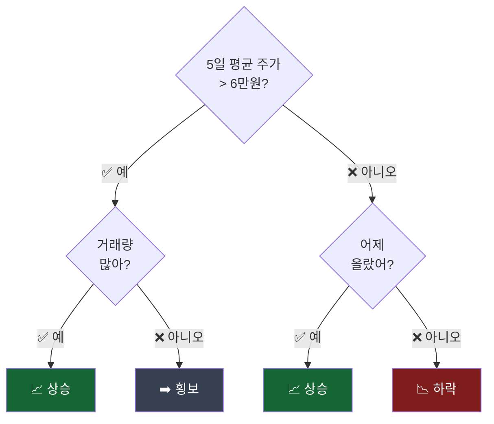

# Day 032 — 스무고개로 코스피 주가 맞추기: 결정 트리 & 랜덤 포레스트

> "주가가 높아?" "거래량이 많아?" 질문을 반복해서 국내 주식을 분류합니다.

---

## 1. 결정 트리란?

결정 트리는 **스무고개 게임**처럼 질문을 반복해서 답을 찾는 방법입니다.



가지를 타고 내려가다 보면 결국 답이 나옵니다.

---

## 2. 국내 주가 데이터 준비 (FinanceDataReader)

```python
import pandas as pd
import numpy as np
from sklearn.tree import DecisionTreeClassifier, export_text
from sklearn.ensemble import RandomForestClassifier
from sklearn.metrics import accuracy_score
from sklearn.preprocessing import StandardScaler
import matplotlib.pyplot as plt

# 실제 삼성전자 주가 수집
try:
    import FinanceDataReader as fdr
    df_raw = fdr.DataReader('005930', '2020-01-01', '2024-12-31')
    df = df_raw[['Close', 'Volume']].rename(columns={'Close': 'close', 'Volume': 'volume'})
    print(f"✅ 삼성전자 데이터: {len(df)}일")
except Exception:
    np.random.seed(42)
    n = 1000
    prices = 60000 + np.cumsum(np.random.randn(n) * 800)
    df = pd.DataFrame({'close': prices, 'volume': np.random.randint(8_000_000, 25_000_000, n)})
    print("⚠️  오프라인 시뮬레이션 사용")

# 특성 계산
df['ret']     = df['close'].pct_change()
df['ma5']     = df['close'].rolling(5).mean()
df['ma20']    = df['close'].rolling(20).mean()
df['vol_ma5'] = df['volume'].rolling(5).mean()
df['high_ma'] = (df['close'] > df['ma20']).astype(int)  # 20일 평균보다 높으면 1
df['vol_ratio'] = df['volume'] / df['vol_ma5']           # 거래량 비율

# 내일 오를지(1) 내릴지(0)
df['target'] = (df['close'].shift(-1) > df['close']).astype(int)
df = df.dropna()

features = ['ret', 'ma5', 'ma20', 'vol_ma5', 'high_ma', 'vol_ratio']
X = df[features].values
y = df['target'].values

split = int(len(X) * 0.8)
X_train, X_test = X[:split], X[split:]
y_train, y_test = y[:split], y[split:]

print(f"학습: {len(X_train)}일, 테스트: {len(X_test)}일")
```

---

## 3. 결정 트리 학습하기

```python
# 가지 깊이별로 성능 비교
depths = [2, 3, 5, 8, None]
print(f"{'깊이':^8} {'학습 정확도':^12} {'테스트 정확도':^14} {'가지 수':^8}")
print('-' * 46)

for d in depths:
    dt = DecisionTreeClassifier(max_depth=d, random_state=42)
    dt.fit(X_train, y_train)
    tr_acc = accuracy_score(y_train, dt.predict(X_train))
    te_acc = accuracy_score(y_test,  dt.predict(X_test))
    n_leaf = dt.get_n_leaves()
    print(f"{str(d):^8} {tr_acc:^12.1%} {te_acc:^14.1%} {n_leaf:^8}")
```

출력 예시:
```
  깊이    학습 정확도   테스트 정확도   가지 수
----------------------------------------------
   2       55.0%        54.0%        4
   3       62.0%        55.0%        8
   5       75.0%        52.0%       20
   8       90.0%        50.0%       64
  None    100.0%        48.0%      200
```

> 깊이가 너무 깊으면 학습 데이터는 잘 맞추지만 테스트에서 실패합니다. 이것을 **과적합(overfitting)**이라고 합니다.

---

## 4. 결정 트리 규칙 보기

```python
# 깊이 3으로 최적 결정 트리 만들기
best_dt = DecisionTreeClassifier(max_depth=3, random_state=42)
best_dt.fit(X_train, y_train)

feature_names = ['수익률', '5일평균', '20일평균', '5일거래량', '평균이상여부', '거래량비율']
rules = export_text(best_dt, feature_names=feature_names)
print("결정 트리 규칙 (삼성전자 주가):")
print(rules)
```

---

## 5. 랜덤 포레스트 — 여러 트리의 힘

결정 트리 하나는 잘 틀립니다. 하지만 **수백 개의 트리를 만들어 다수결로 결정**하면 훨씬 잘 맞춥니다!

이것이 **랜덤 포레스트(Random Forest)**입니다. 숲처럼 많은 나무를 이용하는 것이죠.

```python
# 트리 개수별 성능 비교
n_trees_list = [1, 10, 50, 100, 200, 500]
test_accs = []

for n in n_trees_list:
    rf = RandomForestClassifier(
        n_estimators=n,
        max_depth=5,
        min_samples_leaf=10,  # 잎 하나에 최소 10개 샘플
        random_state=42,
        n_jobs=-1,
    )
    rf.fit(X_train, y_train)
    acc = accuracy_score(y_test, rf.predict(X_test))
    test_accs.append(acc)
    print(f"트리 {n:>3}개: 정확도 {acc:.1%}")

# 시각화
plt.figure(figsize=(8, 4))
plt.plot(n_trees_list, test_accs, 'g-o', linewidth=2)
plt.axhline(y=max(test_accs), color='red', linestyle='--',
            label=f'최고 정확도: {max(test_accs):.1%}')
plt.xlabel('트리 개수')
plt.ylabel('테스트 정확도')
plt.title('트리 개수가 늘어날수록 예측이 안정됩니다')
plt.legend()
plt.tight_layout()
plt.savefig('rf_n_trees.png', dpi=120)
print("저장: rf_n_trees.png")
```

---

## 6. 어떤 특성이 중요할까?

랜덤 포레스트는 **어떤 정보가 주가 예측에 가장 중요한지**도 알려줍니다.

```python
# 최종 랜덤 포레스트 모델
rf_final = RandomForestClassifier(
    n_estimators=200,
    max_depth=5,
    min_samples_leaf=10,
    random_state=42,
    n_jobs=-1,
)
rf_final.fit(X_train, y_train)

# 특성 중요도
importance = pd.Series(
    rf_final.feature_importances_,
    index=['수익률', '5일평균', '20일평균', '5일거래량', '평균이상여부', '거래량비율']
).sort_values(ascending=True)

plt.figure(figsize=(8, 4))
importance.plot.barh(color='steelblue')
plt.xlabel('중요도 (높을수록 예측에 많이 사용됨)')
plt.title('삼성전자 주가 예측에 중요한 특성 순위')
plt.tight_layout()
plt.savefig('rf_importance.png', dpi=120)
print("저장: rf_importance.png")

print("\n특성 중요도:")
print(importance.sort_values(ascending=False).round(3))

# 최종 정확도
final_acc = accuracy_score(y_test, rf_final.predict(X_test))
print(f"\n랜덤 포레스트 최종 정확도: {final_acc:.1%}")
```

---

## 7. 결정 트리 vs 랜덤 포레스트 비교

```python
# 두 모델 비교
dt_acc = accuracy_score(y_test, best_dt.predict(X_test))
rf_acc = accuracy_score(y_test, rf_final.predict(X_test))

models_compare = ['결정 트리\n(깊이 3)', '랜덤 포레스트\n(200그루)']
accs_compare   = [dt_acc, rf_acc]
colors         = ['orange', 'green']

plt.figure(figsize=(6, 4))
bars = plt.bar(models_compare, accs_compare, color=colors, width=0.4)
for bar, acc in zip(bars, accs_compare):
    plt.text(bar.get_x() + bar.get_width()/2, bar.get_height() + 0.005,
             f'{acc:.1%}', ha='center', fontsize=12, fontweight='bold')
plt.ylim(0.4, 0.7)
plt.ylabel('테스트 정확도')
plt.title('결정 트리 vs 랜덤 포레스트')
plt.tight_layout()
plt.savefig('dt_vs_rf.png', dpi=120)
print("저장: dt_vs_rf.png")
```

---

## 핵심 정리

- **결정 트리**: 질문을 반복해서 답을 찾음 — 이해하기 쉽지만 혼자선 약함
- **과적합**: 학습 데이터에만 너무 잘 맞고 새 데이터엔 틀리는 현상
- **랜덤 포레스트**: 수백 개의 트리를 만들어 다수결로 결정 — 훨씬 안정적
- **특성 중요도**: 어떤 정보가 예측에 중요한지 알 수 있음

## 실습 과제

```python
# 과제: 현대차(005380) 주가에 랜덤 포레스트 적용
# 1) FinanceDataReader로 현대차 2022~2024 데이터 수집
# 2) 특성: 수익률, 5일평균, 20일평균, 거래량평균, 거래량비율
# 3) 트리 50개, 100개, 200개로 각각 학습 후 정확도 비교
# 4) 가장 중요한 특성 출력

try:
    import FinanceDataReader as fdr
    hyundai = fdr.DataReader('005380', '2022-01-01', '2024-12-31')
    hyundai = hyundai[['Close', 'Volume']].rename(columns={'Close': 'close', 'Volume': 'volume'})
except Exception:
    np.random.seed(7)
    hyundai = pd.DataFrame({
        'close': 200000 + np.cumsum(np.random.randn(600) * 3000),
        'volume': np.random.randint(1_000_000, 6_000_000, 600),
    })

# 나머지를 채워보세요!
```

## 관련 실습 파일

| 챕터 | 주제 | 실행 방법 |
|------|------|---------|
| [chapter07](/api/chapters/chapter07/source/raw) | 결정 트리 | `POST /api/chapters/chapter07/run` |
| [chapter08](/api/chapters/chapter08/source/raw) | 랜덤 포레스트 | `POST /api/chapters/chapter08/run` |

---

➡️ [Day 033 — 팀플레이 예측: XGBoost & LightGBM](19.md) 에서 계속됩니다.
