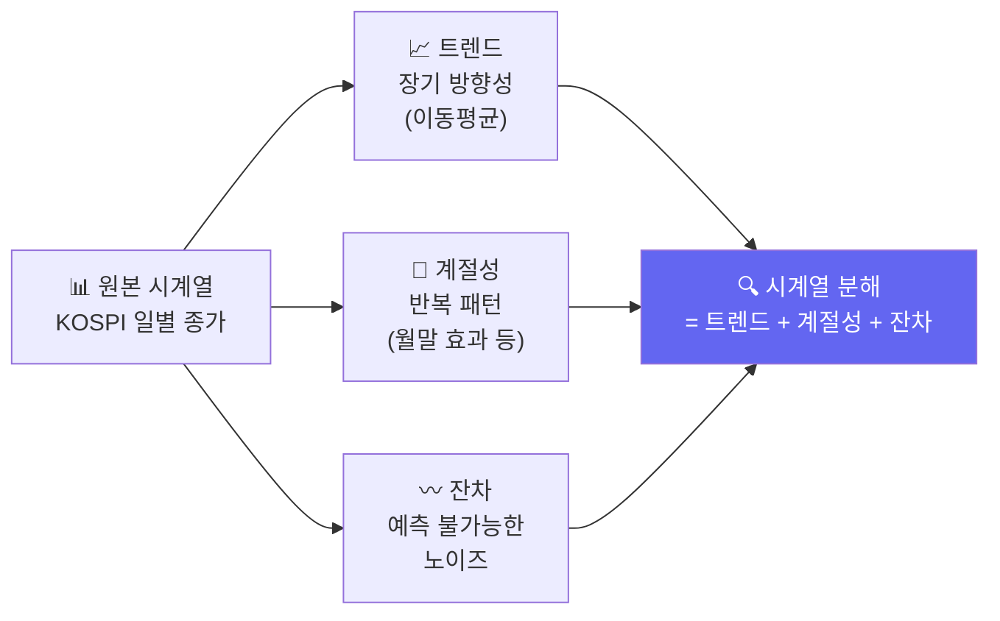

# Day 034 — 시계열 분석 기초: KOSPI 추세·계절성·정상성

> 주가는 단순한 숫자 모음이 아닙니다. 시간의 흐름이 담긴 **시계열 데이터**입니다.
> KOSPI 실제 데이터로 시계열의 특성을 분석해봅니다.

---

## 왜 배우나요?

Transformer, LSTM 같은 시계열 딥러닝 모델을 이해하려면 먼저 **시계열이란 무엇인지** 알아야 합니다.

- 주가는 날짜 순서가 중요합니다 (시간 종속성)
- 계절성이 있습니다 (월말 효과, 실적 발표 시즌 등)
- 트렌드가 있습니다 (장기 상승/하락 흐름)

---

## 1. KOSPI 지수 데이터 수집

```python
import pandas as pd
import numpy as np
import matplotlib.pyplot as plt

# KOSPI 지수와 삼성전자 실제 데이터 수집
try:
    import FinanceDataReader as fdr

    kospi   = fdr.DataReader('KS11',   '2020-01-01', '2024-12-31')['Close']
    samsung = fdr.DataReader('005930', '2020-01-01', '2024-12-31')['Close']
    print(f"✅ KOSPI 데이터: {len(kospi)}일")
    print(f"✅ 삼성전자 데이터: {len(samsung)}일")

except Exception:
    np.random.seed(42)
    n = 1200
    dates = pd.date_range('2020-01-01', periods=n, freq='B')
    # KOSPI 지수 (2020년 2100 → 2024년 2700 수준)
    kospi_changes = np.random.randn(n) * 15
    kospi_prices  = 2100 + np.cumsum(kospi_changes)
    kospi_prices  = np.clip(kospi_prices, 1800, 3200)
    kospi   = pd.Series(kospi_prices.round(2), index=dates, name='KS11')

    # 삼성전자 주가
    sam_changes = np.random.randn(n) * 800
    sam_prices  = 55000 + np.cumsum(sam_changes)
    sam_prices  = np.clip(sam_prices, 40000, 90000)
    samsung = pd.Series(sam_prices.round(0), index=dates, name='005930')
    print("⚠️  오프라인 시뮬레이션 사용")

# 월별 평균 KOSPI
kospi_df = pd.DataFrame({'kospi': kospi})
kospi_df['year']  = kospi_df.index.year
kospi_df['month'] = kospi_df.index.month

monthly_avg = kospi_df.groupby(['year', 'month'])['kospi'].mean().unstack()
print("\n연도별 월 평균 KOSPI:")
print(monthly_avg.round(0).to_string())
```

---

## 2. 시계열 분해: 트렌드 + 계절성 + 잔차



```python
# KOSPI 시계열 분해
kospi_series = pd.Series(kospi.values, index=pd.to_datetime(kospi.index))

# 트렌드: 이동평균
trend_20  = kospi_series.rolling(20).mean()   # 단기 (약 1개월)
trend_60  = kospi_series.rolling(60).mean()   # 중기 (약 3개월)
trend_250 = kospi_series.rolling(250).mean()  # 장기 (약 1년)

fig, axes = plt.subplots(4, 1, figsize=(12, 14))

# 원본
axes[0].plot(kospi_series.index, kospi_series.values, 'k-', linewidth=0.8, alpha=0.7)
axes[0].set_title('① 원본 KOSPI 시계열')
axes[0].set_ylabel('지수')

# 트렌드
axes[1].plot(kospi_series.index, kospi_series.values,  'gray',   linewidth=0.5, alpha=0.5, label='원본')
axes[1].plot(kospi_series.index, trend_20.values,  'blue',   linewidth=1.5, label='20일 평균')
axes[1].plot(kospi_series.index, trend_60.values,  'orange', linewidth=1.5, label='60일 평균')
axes[1].plot(kospi_series.index, trend_250.values, 'red',    linewidth=2.0, label='250일 평균(연)')
axes[1].set_title('② 트렌드 (이동평균)')
axes[1].legend()

# 계절성: 월별 평균 수익률
monthly_ret = kospi_series.resample('ME').last().pct_change().dropna()
axes[2].bar(monthly_ret.index, monthly_ret.values * 100,
            color=['green' if r > 0 else 'red' for r in monthly_ret.values], alpha=0.7)
axes[2].axhline(y=0, color='black', linestyle='-', linewidth=0.5)
axes[2].set_title('③ 월별 수익률 (계절성 파악)')
axes[2].set_ylabel('수익률 (%)')

# 잔차: 원본 - 트렌드
residual = kospi_series - trend_60
axes[3].plot(kospi_series.index, residual.values, 'purple', linewidth=0.7, alpha=0.7)
axes[3].axhline(y=0, color='black', linestyle='--', linewidth=0.5)
axes[3].set_title('④ 잔차 (트렌드 제거 후 노이즈)')
axes[3].set_ylabel('지수 차이')

plt.suptitle('KOSPI 시계열 분해', fontsize=14, fontweight='bold')
plt.tight_layout()
plt.savefig('timeseries_decompose.png', dpi=120)
print("저장: timeseries_decompose.png")
```

---

## 3. 정상성(Stationarity) — 딥러닝 입력 준비

딥러닝 모델에 주가를 그대로 넣으면 안 됩니다!  
**정상성**이 없는 데이터(주가)는 학습이 제대로 되지 않습니다.

**해결책**: 주가 대신 **수익률(로그 수익률)**을 사용합니다.

```python
# 수익률로 변환 (정상화)
ret = kospi_series.pct_change().dropna()
log_ret = np.log(kospi_series / kospi_series.shift(1)).dropna()

fig, axes = plt.subplots(2, 2, figsize=(12, 8))

# 원본 주가 (비정상)
axes[0, 0].plot(kospi_series.index, kospi_series.values, 'b-', linewidth=0.8)
axes[0, 0].set_title('원본 KOSPI (비정상 — 딥러닝에 직접 사용 ❌)')
axes[0, 0].set_ylabel('지수')

# 수익률 (정상)
axes[0, 1].plot(ret.index, ret.values * 100, 'g-', linewidth=0.6, alpha=0.7)
axes[0, 1].axhline(y=0, color='red', linestyle='--', linewidth=0.5)
axes[0, 1].set_title('일별 수익률 (정상 — 딥러닝 입력 ✅)')
axes[0, 1].set_ylabel('수익률 (%)')

# 원본 분포
axes[1, 0].hist(kospi_series.values, bins=30, color='blue', alpha=0.7)
axes[1, 0].set_title('원본 분포 (치우침 있음)')

# 수익률 분포
axes[1, 1].hist(ret.values * 100, bins=40, color='green', alpha=0.7)
axes[1, 1].set_title('수익률 분포 (정규분포에 가까움)')
axes[1, 1].set_xlabel('수익률 (%)')

plt.suptitle('정상성: 원본 주가 vs 수익률 비교', fontsize=13, fontweight='bold')
plt.tight_layout()
plt.savefig('stationarity.png', dpi=120)
print("저장: stationarity.png")

# 기초 통계
print(f"\n수익률 기초 통계:")
print(f"  평균 일수익률: {ret.mean()*100:.3f}%")
print(f"  표준편차 (변동성): {ret.std()*100:.3f}%")
print(f"  연환산 변동성: {ret.std()*np.sqrt(252)*100:.1f}%")
print(f"  상승일 비율: {(ret > 0).mean():.1%}")
```

---

## 4. 자기상관(Autocorrelation) — "어제가 오늘에 영향을 줄까?"

주가에 **자기상관**이 있다면, 과거 데이터로 미래를 예측할 수 있습니다.

```python
# 수익률의 자기상관 계산
lags = 20
acf_values = [ret.autocorr(lag=i) for i in range(1, lags + 1)]

plt.figure(figsize=(10, 4))
plt.bar(range(1, lags + 1), acf_values,
        color=['steelblue' if abs(v) < 2/np.sqrt(len(ret)) else 'red' for v in acf_values])
plt.axhline(y=  2/np.sqrt(len(ret)), color='orange', linestyle='--', label='95% 신뢰 구간')
plt.axhline(y= -2/np.sqrt(len(ret)), color='orange', linestyle='--')
plt.axhline(y=0, color='black', linewidth=0.5)
plt.xlabel('시차 (lag일)')
plt.ylabel('자기상관 계수')
plt.title('KOSPI 수익률 자기상관 분석\n(신뢰구간 밖 = 유의미한 상관)')
plt.legend()
plt.tight_layout()
plt.savefig('autocorrelation.png', dpi=120)
print("저장: autocorrelation.png")

print(f"\n유의미한 시차:")
ci = 2 / np.sqrt(len(ret))
for i, v in enumerate(acf_values, 1):
    if abs(v) > ci:
        print(f"  {i}일 시차: 자기상관 = {v:.4f} (통계적으로 유의)")
```

---

## 5. 월별 효과 분석 (코스피의 계절성)

```python
# 요일별, 월별 평균 수익률
ret_df = pd.DataFrame({'ret': ret})
ret_df['weekday'] = ret_df.index.dayofweek  # 0=월, 4=금
ret_df['month']   = ret_df.index.month

# 요일별 평균 수익률
weekday_ret = ret_df.groupby('weekday')['ret'].mean() * 100
# 월별 평균 수익률
monthly_ret2 = ret_df.groupby('month')['ret'].mean() * 100

fig, (ax1, ax2) = plt.subplots(1, 2, figsize=(12, 4))

weekday_names = ['월', '화', '수', '목', '금']
ax1.bar(weekday_names, weekday_ret.values,
        color=['green' if v > 0 else 'red' for v in weekday_ret.values], alpha=0.8)
ax1.axhline(y=0, color='black', linewidth=0.5)
ax1.set_title('요일별 평균 수익률 (KOSPI)')
ax1.set_ylabel('평균 수익률 (%)')

month_names = ['1월','2월','3월','4월','5월','6월','7월','8월','9월','10월','11월','12월']
ax2.bar(month_names, monthly_ret2.values,
        color=['green' if v > 0 else 'red' for v in monthly_ret2.values], alpha=0.8)
ax2.axhline(y=0, color='black', linewidth=0.5)
ax2.set_title('월별 평균 수익률 (KOSPI)')
ax2.tick_params(axis='x', rotation=45)

plt.suptitle('코스피 계절성 분석', fontsize=13)
plt.tight_layout()
plt.savefig('seasonality.png', dpi=120)
print("저장: seasonality.png")

# 결과 해석
best_month  = monthly_ret2.idxmax()
worst_month = monthly_ret2.idxmin()
print(f"\n📈 역대 가장 좋았던 달: {best_month}월 (평균 {monthly_ret2[best_month]:.3f}%)")
print(f"📉 역대 가장 나빴던 달: {worst_month}월 (평균 {monthly_ret2[worst_month]:.3f}%)")
```

---

## 핵심 정리

- **시계열**: 시간 순서가 중요한 데이터 — 섞으면 의미 없음
- **트렌드**: 장기적 방향성 (이동평균으로 파악)
- **계절성**: 반복되는 패턴 (월말 효과, 명절 전후 등)
- **정상성**: 딥러닝 입력을 위해 주가 → 수익률로 변환
- **자기상관**: 과거 데이터가 미래에 영향을 주는지 측정

## 실습 과제

```python
# 과제: SK하이닉스 + NAVER 시계열 비교 분석
# 1) 두 종목의 수익률 계산
# 2) 두 종목 간 상관관계 계산 (corr)
# 3) 월별 평균 수익률 비교 그래프
# 4) "두 종목이 같이 움직이는가?" 결론 내리기

try:
    import FinanceDataReader as fdr
    skhynix = fdr.DataReader('000660', '2020-01-01', '2024-12-31')['Close']
    naver   = fdr.DataReader('035420', '2020-01-01', '2024-12-31')['Close']
except Exception:
    np.random.seed(55)
    n = 1200
    dates = pd.date_range('2020-01-01', periods=n, freq='B')
    skhynix = pd.Series(100000 + np.cumsum(np.random.randn(n) * 2500), index=dates)
    naver   = pd.Series(280000 + np.cumsum(np.random.randn(n) * 5000), index=dates)

# 나머지를 채워보세요!
```

---

➡️ [Day 035 — 딥러닝 시계열 예측: LSTM으로 삼성전자 주가 예측](21.md) 에서 계속됩니다.
