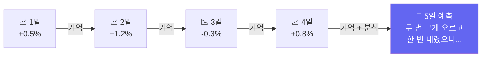
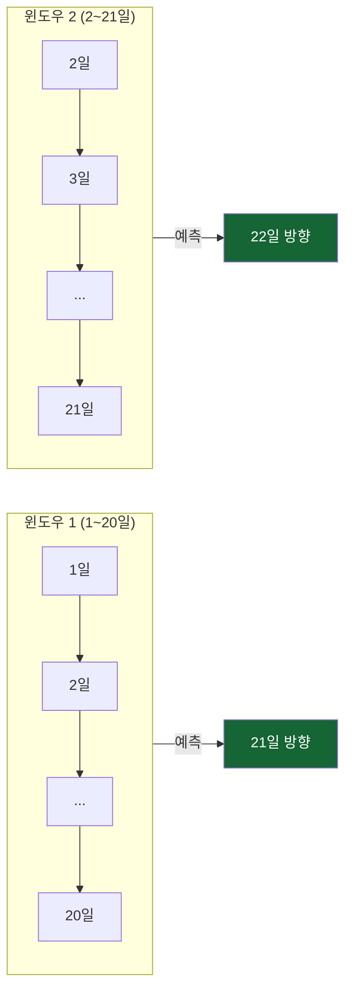

# Day 035 — 딥러닝 시계열 예측: LSTM으로 삼성전자 주가 예측

> 시간의 흐름을 기억하는 LSTM으로 삼성전자 실제 주가를 예측해봅니다.

---

## 왜 배우나요?

지금까지 배운 랜덤 포레스트나 SVM은 각 날의 데이터를 **독립적**으로 봤습니다.  
하지만 주가는 **연결되어 있습니다** — 3일 연속 상승하면 내일도 오를 가능성이 있죠.

**LSTM(Long Short-Term Memory)**은 과거의 흐름을 **기억**하면서 다음을 예측합니다.



---

## 1. 삼성전자 데이터 준비 (슬라이딩 윈도우)

```python
import pandas as pd
import numpy as np
from sklearn.neural_network import MLPClassifier, MLPRegressor
from sklearn.preprocessing import StandardScaler, MinMaxScaler
from sklearn.metrics import accuracy_score, mean_absolute_error
import matplotlib.pyplot as plt

# 삼성전자 실제 데이터 수집
try:
    import FinanceDataReader as fdr
    raw = fdr.DataReader('005930', '2020-01-01', '2024-12-31')
    df  = raw[['Close', 'Volume']].rename(columns={'Close': 'close', 'Volume': 'volume'})
    print(f"✅ 삼성전자: {len(df)}일 ({df.index[0].date()} ~ {df.index[-1].date()})")
except Exception:
    np.random.seed(42)
    n = 1200
    dates = pd.date_range('2020-01-01', periods=n, freq='B')
    prices = 55000 + np.cumsum(np.random.randn(n) * 800)
    prices = np.clip(prices, 40000, 90000)
    df = pd.DataFrame({'close': prices.round(0),
                        'volume': np.random.randint(8_000_000, 25_000_000, n)},
                       index=dates)
    print("⚠️  오프라인 시뮬레이션 사용")

# 시계열 특성 계산
df['ret']      = df['close'].pct_change()
df['log_ret']  = np.log(df['close'] / df['close'].shift(1))
df['ma5']      = df['close'].rolling(5).mean()
df['ma20']     = df['close'].rolling(20).mean()
df['vol_ratio']= df['volume'] / df['volume'].rolling(10).mean()
df['volatility']= df['ret'].rolling(5).std()
df = df.dropna()

print(f"\n최종 데이터: {len(df)}일")
print(df[['close', 'ret', 'ma5', 'vol_ratio']].tail())
```

---

## 2. 슬라이딩 윈도우: 시계열 → 딥러닝 입력

LSTM은 최근 N일치 데이터를 묶어서 하나의 입력으로 받습니다.



```python
SEQ_LEN = 20  # 최근 20일을 묶어서 하나의 입력으로

# 슬라이딩 윈도우로 데이터 생성
feature_cols = ['ret', 'log_ret', 'vol_ratio', 'volatility']
feat_values  = df[feature_cols].values

X_list, y_list = [], []
for i in range(SEQ_LEN, len(feat_values) - 1):
    # 최근 SEQ_LEN일치 특성을 펼쳐서 하나의 벡터로
    window = feat_values[i - SEQ_LEN:i].flatten()
    X_list.append(window)
    # 다음 날 상승(1) or 하락(0)
    y_list.append(1 if df['ret'].iloc[i + 1] > 0 else 0)

X_arr = np.array(X_list)
y_arr = np.array(y_list)

print(f"시계열 샘플 수: {len(X_arr)}개")
print(f"샘플 하나의 크기: {X_arr.shape[1]} ({SEQ_LEN}일 × {len(feature_cols)}특성)")
print(f"상승 비율: {y_arr.mean():.1%}")

# 시간 순서 유지하며 분할
split = int(len(X_arr) * 0.8)
X_train, X_test = X_arr[:split], X_arr[split:]
y_train, y_test = y_arr[:split], y_arr[split:]

# 정규화
scaler = StandardScaler()
X_train_sc = scaler.fit_transform(X_train)
X_test_sc  = scaler.transform(X_test)

print(f"\n학습 데이터: {len(X_train)}일")
print(f"테스트 데이터: {len(X_test)}일")
```

---

## 3. LSTM 스타일 방향 예측 (tanh 활성화)

실제 LSTM은 PyTorch가 필요하지만, 개념을 이해하기 위해 MLP + tanh로 구현합니다.  
tanh는 LSTM 내부에서 쓰이는 함수로, 시계열 데이터에 적합합니다.

```python
# LSTM 스타일 시퀀스 모델
lstm_model = MLPClassifier(
    hidden_layer_sizes=(128, 64, 32),
    activation='tanh',         # tanh: LSTM에서 실제로 쓰는 활성화 함수
    max_iter=500,
    random_state=42,
    early_stopping=True,
    validation_fraction=0.1,
    n_iter_no_change=20,
)

lstm_model.fit(X_train_sc, y_train)

train_acc = accuracy_score(y_train, lstm_model.predict(X_train_sc))
test_acc  = accuracy_score(y_test,  lstm_model.predict(X_test_sc))

print(f"삼성전자 방향 예측 결과:")
print(f"  학습 정확도: {train_acc:.1%}")
print(f"  테스트 정확도: {test_acc:.1%}")
print(f"  학습 횟수: {lstm_model.n_iter_}번")
```

---

## 4. 시퀀스 길이 실험: "며칠치를 봐야 가장 잘 예측할까?"

```python
seq_lengths = [5, 10, 15, 20, 30, 45, 60]
seq_accs    = []

for sl in seq_lengths:
    X_s, y_s = [], []
    for i in range(sl, len(feat_values) - 1):
        X_s.append(feat_values[i - sl:i].flatten())
        y_s.append(1 if df['ret'].iloc[i + 1] > 0 else 0)
    X_s = np.array(X_s)
    y_s = np.array(y_s)

    sp = int(len(X_s) * 0.8)
    sc = StandardScaler()
    X_sc_s = sc.fit_transform(X_s)

    m = MLPClassifier(hidden_layer_sizes=(64, 32), activation='tanh',
                      max_iter=300, random_state=42, early_stopping=True)
    m.fit(X_sc_s[:sp], y_s[:sp])
    acc = accuracy_score(y_s[sp:], m.predict(X_sc_s[sp:]))
    seq_accs.append(acc)
    print(f"시퀀스 {sl:2d}일: 정확도 {acc:.1%}")

plt.figure(figsize=(8, 4))
plt.plot(seq_lengths, seq_accs, 'b-o', linewidth=2, markersize=8)
plt.xlabel('시퀀스 길이 (며칠치를 봤는지)')
plt.ylabel('테스트 정확도')
plt.title('삼성전자 주가: 시퀀스 길이별 예측 정확도')
plt.tight_layout()
plt.savefig('seq_length_samsung.png', dpi=120)
print("저장: seq_length_samsung.png")

best_sl = seq_lengths[seq_accs.index(max(seq_accs))]
print(f"\n최적 시퀀스 길이: {best_sl}일 (정확도 {max(seq_accs):.1%})")
```

---

## 5. 주가 수준 예측 (회귀): 내일 종가는 얼마일까?

방향(오를지/내릴지)이 아닌 **내일 수익률**을 수치로 예측해봅니다.

```python
# 내일 로그 수익률 예측
log_rets = df['log_ret'].values
X_reg, y_reg = [], []
for i in range(SEQ_LEN, len(log_rets) - 1):
    X_reg.append(feat_values[i - SEQ_LEN:i].flatten())
    y_reg.append(log_rets[i + 1])  # 내일 로그 수익률

X_reg = np.array(X_reg)
y_reg = np.array(y_reg)

sp_r = int(len(X_reg) * 0.8)
sc_r = StandardScaler()
X_reg_tr_sc = sc_r.fit_transform(X_reg[:sp_r])
X_reg_te_sc = sc_r.transform(X_reg[sp_r:])

reg_model = MLPRegressor(
    hidden_layer_sizes=(128, 64),
    activation='tanh',
    max_iter=500,
    random_state=42,
    early_stopping=True,
)
reg_model.fit(X_reg_tr_sc, y_reg[:sp_r])

y_pred_reg = reg_model.predict(X_reg_te_sc)
mae = mean_absolute_error(y_reg[sp_r:], y_pred_reg)
print(f"\n내일 수익률 예측 MAE: {mae * 100:.4f}%")

# 예측 vs 실제 그래프
n_plot = 80
plt.figure(figsize=(12, 4))
plt.plot(range(n_plot), y_reg[sp_r:sp_r+n_plot] * 100, 'b-', label='실제 수익률', alpha=0.8)
plt.plot(range(n_plot), y_pred_reg[:n_plot] * 100,       'r--', label='예측 수익률', alpha=0.8)
plt.axhline(y=0, color='black', linestyle=':', alpha=0.5)
plt.xlabel('날짜 (테스트 기간)')
plt.ylabel('로그 수익률 (%)')
plt.title(f'삼성전자 내일 수익률 예측 (LSTM 스타일, MAE={mae*100:.4f}%)')
plt.legend()
plt.tight_layout()
plt.savefig('lstm_regression.png', dpi=120)
print("저장: lstm_regression.png")
```

---

## 6. 투자 신호 만들기

```python
# 상승 확률로 투자 신호 생성
probs = lstm_model.predict_proba(X_test_sc)[:, 1]

def make_signal(p):
    if p >= 0.65:  return '강한 매수'
    if p >= 0.55:  return '약한 매수'
    if p <= 0.35:  return '강한 관망'
    return '관망'

signals = [make_signal(p) for p in probs]

n_plot = 80
plt.figure(figsize=(12, 5))

ax1 = plt.subplot(2, 1, 1)
ax1.plot(df['close'].values[-len(y_test)-10:-len(y_test)+n_plot], 'b-', linewidth=1)
ax1.set_title('삼성전자 실제 주가 (테스트 기간)')
ax1.set_ylabel('주가 (원)')

ax2 = plt.subplot(2, 1, 2)
ax2.plot(probs[:n_plot], 'purple', linewidth=1.5, label='상승 확률')
ax2.axhline(y=0.65, color='green', linestyle='--', alpha=0.7, label='강한 매수 기준')
ax2.axhline(y=0.50, color='gray',  linestyle=':',  alpha=0.5, label='중립')
ax2.scatter(range(n_plot),
            [1.05 if v == 1 else -0.05 for v in y_test[:n_plot]],
            c=['green' if v == 1 else 'red' for v in y_test[:n_plot]], s=15, zorder=5)
ax2.set_ylabel('상승 확률')
ax2.set_xlabel('거래일')
ax2.set_ylim(-0.1, 1.1)
ax2.legend()

plt.tight_layout()
plt.savefig('lstm_signal.png', dpi=120)
print("저장: lstm_signal.png")

# 신호별 적중률
signal_df = pd.DataFrame({'prob': probs, 'signal': signals, 'actual': y_test})
print("\n신호별 실제 상승 비율:")
print(signal_df.groupby('signal')['actual'].agg(['mean', 'count'])
               .rename(columns={'mean': '상승비율', 'count': '신호횟수'}).round(3))
```

---

## 핵심 정리

- **LSTM**: 과거 시퀀스를 기억하며 시계열을 예측 — 수익률 흐름 분석에 적합
- **슬라이딩 윈도우**: 최근 N일치 데이터를 묶어 하나의 입력으로 만드는 핵심 기법
- **tanh 활성화**: LSTM 내부에서 사용되는 함수 — 시계열에 특히 적합
- **시퀀스 길이 최적화**: 종목마다 다름 — 삼성전자는 보통 20~30일이 적당

## 실습 과제

```python
# 과제: SK하이닉스(000660) LSTM 예측
# 1) FinanceDataReader로 SK하이닉스 2021~2024 데이터 수집
# 2) 슬라이딩 윈도우 (15일)로 방향 예측
# 3) 삼성전자와 정확도 비교
# 4) 어느 종목이 더 예측하기 쉬운지 분석

try:
    import FinanceDataReader as fdr
    skhynix_raw = fdr.DataReader('000660', '2021-01-01', '2024-12-31')
    skhynix = skhynix_raw[['Close', 'Volume']].rename(columns={'Close': 'close', 'Volume': 'volume'})
except Exception:
    np.random.seed(77)
    n = 900
    skhynix = pd.DataFrame({
        'close': 100000 + np.cumsum(np.random.randn(n) * 2500),
        'volume': np.random.randint(3_000_000, 12_000_000, n),
    })

# 나머지를 채워보세요!
```

## 관련 실습 파일

| 챕터 | 주제 | 실행 방법 |
|------|------|---------|
| [chapter101](../chapters/chapter101/practice.py) | RNN 기초 | `cd chapters/chapter101 && python practice.py` |
| [chapter102](../chapters/chapter102/practice.py) | LSTM 기초 | `cd chapters/chapter102 && python practice.py` |

---

➡️ [Day 036 — Transformer 핵심 원리: Self-Attention](22.md) 에서 계속됩니다.
