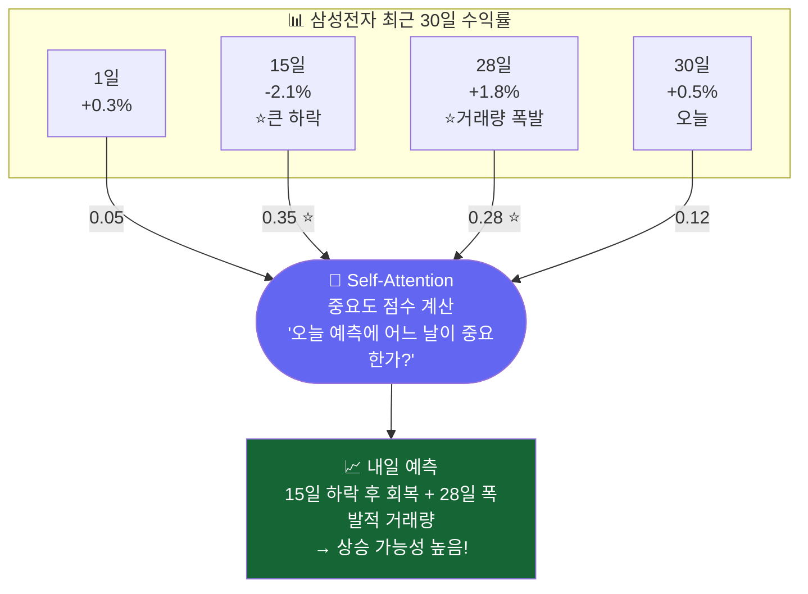

# Day 036 — Transformer 핵심 원리: Self-Attention으로 주가 패턴 찾기

> "30일 중 어느 날이 오늘 예측에 가장 중요한가?" — Transformer가 스스로 찾아냅니다.

---

## 왜 배우나요?

LSTM은 데이터를 **순서대로** 처리하기 때문에:
- 오래된 날의 정보가 점점 희미해집니다
- 병렬 처리가 어렵습니다

**Transformer**는 다릅니다:
- 30일치 데이터를 **한꺼번에** 봅니다
- 각 날짜의 **중요도(Attention 점수)**를 직접 계산합니다
- 중요한 날은 높은 가중치, 덜 중요한 날은 낮은 가중치

---

## 1. Attention 핵심 개념



---

## 2. Attention 수식 이해 (Softmax + 가중 합)

```python
import numpy as np
import pandas as pd
import matplotlib.pyplot as plt

# ─── Attention 핵심 수식 ─────────────────────────────────────
# 1) 각 날짜와 현재 날짜의 "유사도(점수)" 계산
# 2) Softmax로 0~1 사이 확률처럼 변환
# 3) 중요도(Attention 가중치)로 정보를 합산
# ─────────────────────────────────────────────────────────────

def softmax(x: np.ndarray) -> np.ndarray:
    """수치 안정성을 고려한 Softmax"""
    e = np.exp(x - np.max(x))
    return e / e.sum()

def self_attention_1d(seq: np.ndarray) -> tuple:
    """
    단순화된 Self-Attention
    seq: (seq_len,) 형태의 시계열 (수익률 등)
    """
    seq_len = len(seq)
    # 각 날짜 쌍의 유사도 계산 (내적)
    scores_matrix = np.outer(seq, seq)  # (seq_len × seq_len)

    # 마지막 날을 기준으로 각 날짜의 중요도 계산
    query  = seq[-1]      # 마지막 날 (현재 시점)
    scores = seq * query  # 각 날짜와 현재 날짜의 유사도

    # 스케일링 (seq_len의 제곱근으로 나눔 — 수치 안정성)
    scores = scores / np.sqrt(seq_len)

    # Softmax → 중요도 가중치 (합이 1)
    weights = softmax(scores)

    # 가중 합 계산 (중요한 날의 정보를 더 많이 사용)
    context = np.dot(weights, seq)

    return weights, context

# 예시: 수익률 시퀀스에 Attention 적용
example_returns = np.array([
    0.003, 0.005, -0.002, 0.001, 0.008,   # 1~5일: 보통
    0.012, -0.020, 0.003, 0.004, 0.002,   # 6~10일: 6일 급등, 7일 급락
    0.001, 0.003, -0.001, 0.002, 0.005,   # 11~15일: 안정
    0.018, 0.002, -0.003, 0.001, 0.004,   # 16~20일: 16일 큰 상승
])

weights, context = self_attention_1d(example_returns)

print("=== Self-Attention 결과 ===")
print(f"시퀀스 길이: {len(example_returns)}일")
print(f"Context 벡터: {context:.6f}")
print(f"\n가중치 합계: {weights.sum():.4f} (항상 1.0)")
print(f"\n상위 5개 중요 날짜:")
top5 = np.argsort(weights)[-5:][::-1]
for rank, day in enumerate(top5, 1):
    print(f"  {rank}위: {day+1}일째 (수익률 {example_returns[day]*100:+.2f}%, 가중치 {weights[day]:.4f})")
```

---

## 3. Attention 시각화

```python
fig, (ax1, ax2) = plt.subplots(2, 1, figsize=(12, 7))

days_x = np.arange(1, len(example_returns) + 1)

# 상단: 수익률
bars = ax1.bar(days_x, example_returns * 100,
               color=['green' if r > 0 else 'red' for r in example_returns], alpha=0.8)
ax1.axhline(y=0, color='black', linewidth=0.5)
ax1.set_title('입력: 최근 20일 수익률', fontsize=12)
ax1.set_ylabel('수익률 (%)')

# 하단: Attention 가중치
ax2.bar(days_x, weights, color='orange', alpha=0.8, label='Attention 가중치')
# 상위 3개 강조
top3 = np.argsort(weights)[-3:]
for d in top3:
    ax2.bar(d + 1, weights[d], color='red', alpha=0.9)
    ax2.annotate(f'{weights[d]:.3f}', (d + 1, weights[d]),
                 ha='center', va='bottom', fontsize=9, fontweight='bold')

ax2.set_title('Attention 가중치: 어느 날이 예측에 중요한가? (빨간색 = 상위 3일)', fontsize=12)
ax2.set_xlabel('날짜 (일)')
ax2.set_ylabel('중요도 점수 (합=1)')

plt.suptitle('Self-Attention 시각화', fontsize=14, fontweight='bold')
plt.tight_layout()
plt.savefig('attention_visualization.png', dpi=120)
print("저장: attention_visualization.png")
```

---

## 4. 삼성전자 실제 데이터에 Attention 적용

```python
# 삼성전자 데이터 로드
try:
    import FinanceDataReader as fdr
    raw = fdr.DataReader('005930', '2023-01-01', '2024-12-31')
    samsung_ret = raw['Close'].pct_change().dropna().values
    print(f"✅ 삼성전자 수익률: {len(samsung_ret)}일")
except Exception:
    np.random.seed(42)
    samsung_ret = np.random.randn(400) * 0.012
    print("⚠️  오프라인 시뮬레이션 사용")

# 여러 시점에서 Attention 중요도 계산
SEQ_LEN = 30

n_samples = 5
step = len(samsung_ret) // (n_samples + 1)
fig, axes = plt.subplots(n_samples, 2, figsize=(14, 3 * n_samples))

for idx in range(n_samples):
    start = (idx + 1) * step
    seq = samsung_ret[start:start + SEQ_LEN]
    if len(seq) < SEQ_LEN:
        break

    w, ctx = self_attention_1d(seq)
    sample_date = f"구간 {idx+1}"

    # 수익률
    axes[idx, 0].bar(range(SEQ_LEN), seq * 100,
                     color=['g' if r > 0 else 'r' for r in seq], alpha=0.7)
    axes[idx, 0].set_title(f'{sample_date}: 수익률')
    axes[idx, 0].set_ylabel('%')

    # Attention 가중치
    axes[idx, 1].bar(range(SEQ_LEN), w, color='orange', alpha=0.8)
    top_day = np.argmax(w)
    axes[idx, 1].bar(top_day, w[top_day], color='darkred')
    axes[idx, 1].set_title(f'{sample_date}: Attention (가장 중요한 날: {top_day+1}일째)')

plt.suptitle('삼성전자 실제 수익률의 Self-Attention 패턴 분석', fontsize=13)
plt.tight_layout()
plt.savefig('samsung_attention.png', dpi=120)
print("저장: samsung_attention.png")
```

---

## 5. Positional Encoding — "순서를 알려주기"

Transformer는 모든 날을 동시에 보기 때문에 **날짜 순서 정보**를 별도로 추가해야 합니다.

```python
def positional_encoding(seq_len: int, d_model: int = 8) -> np.ndarray:
    """
    Positional Encoding: 각 시점에 위치 정보를 추가
    - sin/cos 함수를 사용해 각 위치에 고유한 패턴 부여
    """
    pe = np.zeros((seq_len, d_model))
    positions = np.arange(seq_len).reshape(-1, 1)
    dims = np.arange(0, d_model, 2)

    pe[:, 0::2] = np.sin(positions / (10000 ** (dims / d_model)))
    pe[:, 1::2] = np.cos(positions / (10000 ** (dims / d_model)))
    return pe

pe = positional_encoding(seq_len=30, d_model=8)

plt.figure(figsize=(10, 4))
plt.imshow(pe.T, aspect='auto', cmap='RdYlBu')
plt.colorbar()
plt.xlabel('날짜 위치 (0=가장 오래된 날)')
plt.ylabel('임베딩 차원')
plt.title('Positional Encoding: 날짜 위치를 패턴으로 표현\n(각 열이 고유한 위치 정보를 가짐)')
plt.tight_layout()
plt.savefig('positional_encoding.png', dpi=120)
print("저장: positional_encoding.png")

print("\nPositional Encoding 특성:")
print(f"  - 크기: {pe.shape} (30일 × 8차원)")
print(f"  - 각 행(날짜)이 고유한 패턴을 가짐")
print(f"  - 첫 3일의 위치 벡터:")
for i in range(3):
    print(f"    {i+1}일째: {pe[i].round(3)}")
```

---

## 6. Attention으로 한국 주가 방향 예측

```python
from sklearn.neural_network import MLPClassifier
from sklearn.preprocessing import StandardScaler
from sklearn.metrics import accuracy_score

# Attention 가중치를 특성으로 활용한 주가 예측
def make_attention_features(returns: np.ndarray, seq_len: int = 20):
    """
    슬라이딩 윈도우 + Attention 가중치를 특성으로 만들기
    """
    X_list, y_list = [], []
    for i in range(seq_len, len(returns) - 1):
        seq = returns[i - seq_len:i]
        weights, context = self_attention_1d(seq)

        # 특성: [원본 수익률, Attention 가중 평균, 상위 3일 수익률]
        top3_idx = np.argsort(weights)[-3:]
        features = np.concatenate([
            seq,                              # 원본 시퀀스
            weights,                          # Attention 가중치
            [context],                        # Context 벡터
            seq[top3_idx],                    # 상위 3개 중요 날짜의 수익률
        ])
        X_list.append(features)
        y_list.append(1 if returns[i + 1] > 0 else 0)

    return np.array(X_list), np.array(y_list)

# 삼성전자 Attention 기반 예측
X_att, y_att = make_attention_features(samsung_ret, seq_len=20)

split = int(len(X_att) * 0.8)
sc = StandardScaler()
X_tr_sc = sc.fit_transform(X_att[:split])
X_te_sc = sc.transform(X_att[split:])

att_model = MLPClassifier(hidden_layer_sizes=(128, 64), activation='relu',
                           max_iter=400, random_state=42, early_stopping=True)
att_model.fit(X_tr_sc, y_att[:split])

att_acc = accuracy_score(y_att[split:], att_model.predict(X_te_sc))
print(f"\n삼성전자 Attention 기반 예측 정확도: {att_acc:.1%}")

# 기준 비교 (Attention 없이)
X_base = np.array([samsung_ret[i-20:i] for i in range(20, len(samsung_ret)-1)])
y_base = np.array([1 if samsung_ret[i+1] > 0 else 0 for i in range(20, len(samsung_ret)-1)])
sp2 = int(len(X_base) * 0.8)
sc2 = StandardScaler()
X_b_tr = sc2.fit_transform(X_base[:sp2])
X_b_te = sc2.transform(X_base[sp2:])
base_model = MLPClassifier(hidden_layer_sizes=(128, 64), max_iter=400,
                            random_state=42, early_stopping=True)
base_model.fit(X_b_tr, y_base[:sp2])
base_acc = accuracy_score(y_base[sp2:], base_model.predict(X_b_te))

print(f"기준 모델 (Attention 없이): {base_acc:.1%}")
print(f"Attention 효과: {(att_acc - base_acc)*100:+.1f}%p")
```

---

## 핵심 정리

- **Self-Attention**: 시퀀스 내 각 시점의 중요도를 직접 계산 — "어느 날이 중요한가?"
- **Softmax**: 중요도 점수를 0~1 사이 확률로 변환 (합이 1)
- **Context 벡터**: 중요도 가중치로 정보를 합산한 결과
- **Positional Encoding**: 날짜 순서를 Transformer에게 알려주는 방법
- **핵심 장점**: 오래된 데이터도 중요하면 놓치지 않음 (LSTM의 장기 의존성 문제 해결)

## 실습 과제

```python
# 과제: KOSPI 지수에 Attention 적용
# 1) FinanceDataReader로 KOSPI(KS11) 데이터 수집
# 2) Self-Attention으로 중요한 날 찾기
# 3) 급락/급등이 있던 날이 높은 Attention을 받는지 확인
# 4) 시각화

try:
    import FinanceDataReader as fdr
    kospi_ret = fdr.DataReader('KS11', '2023-01-01', '2024-12-31')['Close'].pct_change().dropna().values
except Exception:
    np.random.seed(33)
    kospi_ret = np.random.randn(400) * 0.008

# 힌트: make_attention_features(kospi_ret, seq_len=30)
# 나머지를 채워보세요!
```

## 관련 실습 파일

| 챕터 | 주제 | 실행 방법 |
|------|------|---------|
| [chapter103](/api/chapters/chapter103/source/raw) | Transformer 기초 | `POST /api/chapters/chapter103/run` |

---

➡️ [Day 037 — Transformer로 코스피 주가 예측하기](23.md) 에서 계속됩니다.
