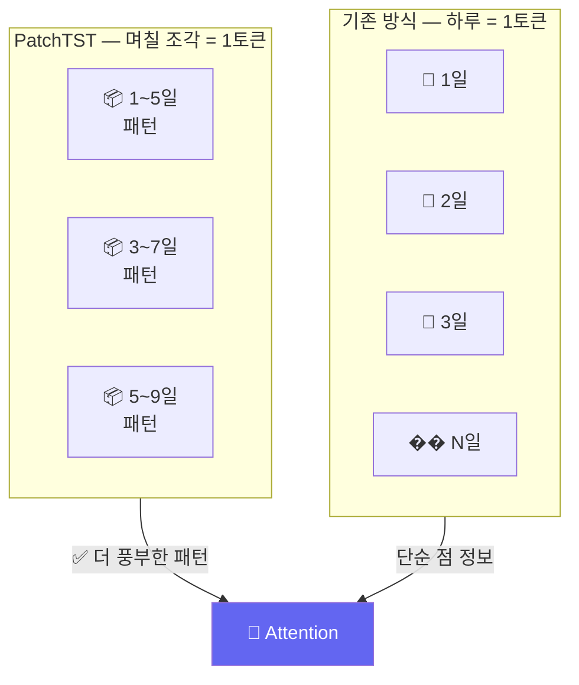

# Day 038 — PatchTST: 조각(Patch) 기반 한국 주식 시계열 분석

> 주가 시계열을 "조각"으로 나눠 Transformer에 입력하는 PatchTST 아이디어를 실제 코스피 데이터로 구현합니다.

---

## 왜 PatchTST인가?

기존 Transformer를 시계열에 직접 적용하면 **점 하나(하루)**를 하나의 토큰으로 봅니다.  
하지만 주가는 하루가 아닌 **며칠간의 패턴**이 중요합니다:
- 3일 연속 상승 → 추세
- 거래량 폭발 후 급등 → 세력 진입 패턴

**PatchTST**는 시계열을 겹치는 조각(Patch)으로 나눠 패턴을 더 잘 포착합니다.



---

## 1. 삼성전자 데이터 준비

```python
import numpy as np
import pandas as pd
from sklearn.preprocessing import StandardScaler
from sklearn.neural_network import MLPClassifier
from sklearn.metrics import accuracy_score
import matplotlib.pyplot as plt

# 삼성전자 + SK하이닉스 데이터 수집
try:
    import FinanceDataReader as fdr
    sam  = fdr.DataReader('005930', '2020-01-01', '2024-12-31')
    sky  = fdr.DataReader('000660', '2020-01-01', '2024-12-31')
    sam  = sam[['Close', 'Volume']].rename(columns={'Close': 'close', 'Volume': 'volume'})
    sky  = sky[['Close', 'Volume']].rename(columns={'Close': 'close', 'Volume': 'volume'})
    print(f"✅ 삼성전자: {len(sam)}일, SK하이닉스: {len(sky)}일")
except Exception:
    np.random.seed(42)
    n = 1200
    dates = pd.date_range('2020-01-01', periods=n, freq='B')
    sam = pd.DataFrame({'close': np.clip(55000 + np.cumsum(np.random.randn(n)*800), 40000, 90000),
                         'volume': np.random.randint(8_000_000, 25_000_000, n)}, index=dates)
    sky = pd.DataFrame({'close': np.clip(80000 + np.cumsum(np.random.randn(n)*3000), 50000, 200000),
                         'volume': np.random.randint(3_000_000, 12_000_000, n)}, index=dates)
    print("⚠️  오프라인 시뮬레이션")

def prepare_features(df):
    df = df.copy()
    df['ret']        = df['close'].pct_change()
    df['log_ret']    = np.log(df['close'] / df['close'].shift(1))
    df['vol_ratio']  = df['volume'] / df['volume'].rolling(10).mean()
    df['volatility'] = df['ret'].rolling(5).std()
    df['ma_cross']   = (df['close'].rolling(5).mean() > df['close'].rolling(20).mean()).astype(int)
    return df.dropna()

sam = prepare_features(sam)
sky = prepare_features(sky)

FEAT_COLS = ['ret', 'log_ret', 'vol_ratio', 'volatility', 'ma_cross']
```

---

## 2. Patch 생성 함수

```python
def make_patches(seq: np.ndarray, patch_len: int = 5, stride: int = 2) -> np.ndarray:
    """
    시계열을 겹치는 Patch로 변환
    seq:       (seq_len, n_feat)
    patch_len: 하나의 Patch가 몇 일인지
    stride:    Patch 간 간격
    반환:      (n_patches, patch_len * n_feat)
    """
    seq_len  = len(seq)
    n_feat   = seq.shape[1]
    patches  = []
    start = 0
    while start + patch_len <= seq_len:
        patch = seq[start:start + patch_len].flatten()  # (patch_len × n_feat,)
        patches.append(patch)
        start += stride
    return np.array(patches)   # (n_patches, patch_len * n_feat)


def softmax(x):
    e = np.exp(x - x.max(axis=-1, keepdims=True))
    return e / e.sum(axis=-1, keepdims=True)


def patch_attention(patches: np.ndarray) -> np.ndarray:
    """
    Patch들 간의 Self-Attention
    patches: (n_patches, d_patch)
    반환:    (n_patches, d_patch) — 컨텍스트 업데이트된 Patch
    """
    d = patches.shape[1]
    np.random.seed(42)
    Wq = np.random.randn(d, d // 2) * 0.05
    Wk = np.random.randn(d, d // 2) * 0.05
    Wv = np.random.randn(d, d)      * 0.05

    Q = patches @ Wq
    K = patches @ Wk
    V = patches @ Wv

    scores  = (Q @ K.T) / np.sqrt(d // 2)
    weights = softmax(scores)
    context = weights @ V
    return context + patches   # Residual connection


# 예시: 삼성전자 20일 시퀀스에서 Patch 생성
example_seq = sam[FEAT_COLS].values[:20]
patches = make_patches(example_seq, patch_len=5, stride=2)
print(f"원본 시퀀스: {example_seq.shape} → Patches: {patches.shape}")
print(f"  ({len(example_seq)}일 × {len(FEAT_COLS)}특성) → ({patches.shape[0]}개 Patch × {patches.shape[1]}차원)")
```

---

## 3. PatchTST 특성 생성 + 예측

```python
SEQ_LEN    = 30
PATCH_LEN  = 5
STRIDE     = 3

def encode_with_patches(feat_vals, idx):
    """한 샘플의 Patch Attention 인코딩"""
    seq     = feat_vals[idx - SEQ_LEN:idx]           # (30, 5)
    patches = make_patches(seq, PATCH_LEN, STRIDE)   # (n_patches, 25)
    encoded = patch_attention(patches)               # (n_patches, 25)
    # 마지막 Patch + 평균 Patch → 분류 특성
    return np.concatenate([encoded[-1], encoded.mean(axis=0)])


feat_vals = sam[FEAT_COLS].values
n_total   = len(feat_vals)
X_list, y_list = [], []

for i in range(SEQ_LEN, n_total - 1):
    X_list.append(encode_with_patches(feat_vals, i))
    y_list.append(1 if sam['ret'].iloc[i + 1] > 0 else 0)

X_arr = np.array(X_list)
y_arr = np.array(y_list)

split = int(len(X_arr) * 0.8)
sc = StandardScaler()
X_tr = sc.fit_transform(X_arr[:split])
X_te = sc.transform(X_arr[split:])

clf = MLPClassifier(hidden_layer_sizes=(128, 64), activation='relu',
                    max_iter=400, random_state=42, early_stopping=True)
clf.fit(X_tr, y_arr[:split])
acc = accuracy_score(y_arr[split:], clf.predict(X_te))
print(f"\n삼성전자 PatchTST 예측 정확도: {acc:.1%}")
```

---

## 4. Patch 크기 실험

```python
patch_params = [
    (3, 1), (5, 2), (5, 3), (7, 3), (10, 5),
]
results = []
for pl, st in patch_params:
    X_p, y_p = [], []
    for i in range(SEQ_LEN, n_total - 1):
        seq     = feat_vals[i - SEQ_LEN:i]
        patches = make_patches(seq, pl, st)
        if len(patches) < 2:
            continue
        enc = patch_attention(patches)
        X_p.append(np.concatenate([enc[-1], enc.mean(axis=0)]))
        y_p.append(1 if sam['ret'].iloc[i + 1] > 0 else 0)

    X_p = np.array(X_p)
    y_p = np.array(y_p)
    sp  = int(len(X_p) * 0.8)
    sc_p = StandardScaler()
    m = MLPClassifier(hidden_layer_sizes=(64, 32), max_iter=300,
                      random_state=42, early_stopping=True)
    m.fit(sc_p.fit_transform(X_p[:sp]), y_p[:sp])
    a = accuracy_score(y_p[sp:], m.predict(sc_p.transform(X_p[sp:])))
    results.append((f"len={pl},st={st}", a))
    print(f"Patch({pl},{st}): {a:.1%}")

# 시각화
labels = [r[0] for r in results]
accs   = [r[1] * 100 for r in results]
plt.figure(figsize=(9, 4))
bars = plt.bar(labels, accs, color='#6366f1', alpha=0.85)
for bar, a in zip(bars, accs):
    plt.text(bar.get_x() + bar.get_width()/2, bar.get_height() + 0.2,
             f'{a:.1f}%', ha='center', va='bottom', fontsize=9)
plt.ylabel('테스트 정확도 (%)')
plt.title('삼성전자 PatchTST: Patch 크기별 예측 성능')
plt.tight_layout()
plt.savefig('patchtst_params.png', dpi=120)
print("저장: patchtst_params.png")
```

---

## 5. 삼성전자 vs SK하이닉스 PatchTST 비교

```python
def run_patchtst(df_stock, seq_len=30, patch_len=5, stride=3, label='종목'):
    fv = df_stock[FEAT_COLS].values
    X_s, y_s = [], []
    for i in range(seq_len, len(fv) - 1):
        seq = fv[i - seq_len:i]
        patches = make_patches(seq, patch_len, stride)
        if len(patches) < 2:
            continue
        enc = patch_attention(patches)
        X_s.append(np.concatenate([enc[-1], enc.mean(axis=0)]))
        y_s.append(1 if df_stock['ret'].iloc[i + 1] > 0 else 0)
    X_s = np.array(X_s)
    y_s = np.array(y_s)
    sp = int(len(X_s) * 0.8)
    sc_s = StandardScaler()
    m = MLPClassifier(hidden_layer_sizes=(64, 32), max_iter=300, random_state=42, early_stopping=True)
    m.fit(sc_s.fit_transform(X_s[:sp]), y_s[:sp])
    a = accuracy_score(y_s[sp:], m.predict(sc_s.transform(X_s[sp:])))
    print(f"{label}: PatchTST 정확도 {a:.1%}")
    return a

sam_acc = run_patchtst(sam, label='삼성전자')
sky_acc = run_patchtst(sky, label='SK하이닉스')

plt.figure(figsize=(6, 4))
plt.bar(['삼성전자', 'SK하이닉스'], [sam_acc*100, sky_acc*100],
        color=['steelblue', '#f59e0b'], alpha=0.85)
plt.ylabel('PatchTST 정확도 (%)')
plt.title('PatchTST: 종목별 예측 성능 비교')
plt.ylim(45, 70)
plt.tight_layout()
plt.savefig('patchtst_compare.png', dpi=120)
print("저장: patchtst_compare.png")
```

---

## 핵심 정리

- **Patch**: 시계열을 며칠 단위 조각으로 나눈 것 — 하루 단위보다 패턴 포착에 유리
- **Stride**: Patch 간 겹침 설정 — 작을수록 정보 밀도 높음
- **PatchTST**: Patch 단위 Attention → 로컬 패턴(상승 추세 등)을 글로벌 컨텍스트와 연결
- **핵심 장점**: 같은 Attention으로 "5일 상승 추세" 같은 패턴을 하나의 토큰으로 처리

## 실습 과제

```python
# 과제: KOSPI 섹터별 비교 — 반도체 vs IT 서비스
# 삼성전자(005930), SK하이닉스(000660): 반도체
# 카카오(035720), NAVER(035420): IT 서비스

try:
    import FinanceDataReader as fdr
    stocks = {
        '삼성전자': fdr.DataReader('005930', '2022-01-01', '2024-12-31'),
        'SK하이닉스': fdr.DataReader('000660', '2022-01-01', '2024-12-31'),
        '카카오':   fdr.DataReader('035720', '2022-01-01', '2024-12-31'),
        'NAVER':  fdr.DataReader('035420', '2022-01-01', '2024-12-31'),
    }
    for k in stocks:
        stocks[k] = stocks[k][['Close','Volume']].rename(columns={'Close':'close','Volume':'volume'})
except Exception:
    np.random.seed(0)
    stocks = {}
    for name, start_price in [('삼성전자',60000),('SK하이닉스',100000),('카카오',40000),('NAVER',150000)]:
        n = 600
        stocks[name] = pd.DataFrame({'close': start_price + np.cumsum(np.random.randn(n)*start_price*0.015),
                                       'volume': np.random.randint(1_000_000, 20_000_000, n)})

# 각 종목에 PatchTST 적용 후 섹터별 평균 비교
# 나머지를 채워보세요!
```

## 관련 실습 파일

| 챕터 | 주제 | 실행 방법 |
|------|------|---------|
| [chapter104](/api/chapters/chapter104/source/raw) | PatchTST 기초 | `POST /api/chapters/chapter104/run` |

---

➡️ [Day 039 — 멀티헤드 Attention & 종목 간 관계 분석](25.md) 에서 계속됩니다.
