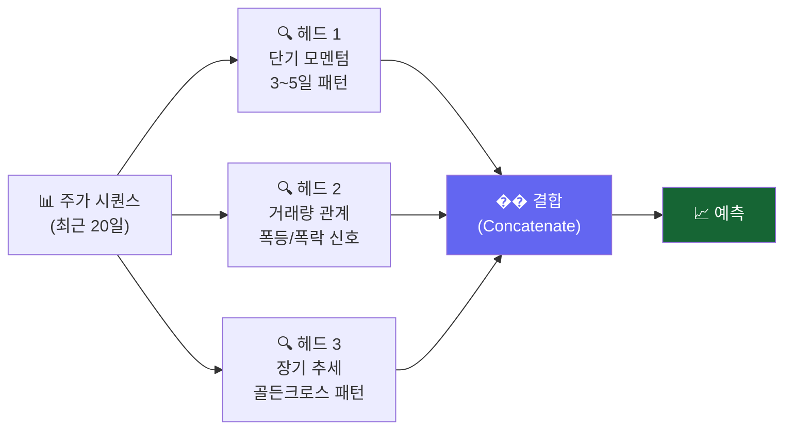

# Day 039 — 멀티헤드 Attention & 종목 간 관계 분석

> 여러 관점의 Attention으로 코스피 종목들 사이의 숨겨진 관계를 찾아봅니다.

---

## 왜 멀티헤드인가?

주가 흐름에는 여러 관점이 동시에 존재합니다:
- **헤드 1**: 단기 모멘텀 패턴 (3~5일)
- **헤드 2**: 거래량 이상 패턴
- **헤드 3**: 장기 추세 방향

**Multi-Head Attention**은 이 여러 관점을 동시에 포착합니다.



---

## 1. 멀티헤드 Attention 완전 구현

```python
import numpy as np
import pandas as pd
from sklearn.preprocessing import StandardScaler
from sklearn.neural_network import MLPClassifier
from sklearn.metrics import accuracy_score
import matplotlib.pyplot as plt


class MultiHeadAttention:
    """
    Multi-Head Self-Attention 완전 구현
    - n_heads개의 독립 Attention Head를 병렬로 실행
    - 각 Head가 서로 다른 관점의 패턴을 학습
    """

    def __init__(self, d_model: int, n_heads: int, seed: int = 42):
        assert d_model % n_heads == 0, "d_model은 n_heads의 배수여야 합니다."
        self.d_model  = d_model
        self.n_heads  = n_heads
        self.head_dim = d_model // n_heads
        rng = np.random.default_rng(seed)

        # 각 헤드별 독립적인 Q/K/V 투영 행렬
        self.Wq = rng.normal(0, 0.05, (n_heads, d_model, self.head_dim))
        self.Wk = rng.normal(0, 0.05, (n_heads, d_model, self.head_dim))
        self.Wv = rng.normal(0, 0.05, (n_heads, d_model, self.head_dim))
        # 출력 투영
        self.Wo = rng.normal(0, 0.05, (d_model, d_model))

    @staticmethod
    def _softmax(x):
        e = np.exp(x - x.max(axis=-1, keepdims=True))
        return e / e.sum(axis=-1, keepdims=True)

    def forward(self, x: np.ndarray):
        """
        x: (seq_len, d_model)
        반환: (seq_len, d_model), head_weights list
        """
        head_outs    = []
        head_weights = []
        for h in range(self.n_heads):
            Q = x @ self.Wq[h]  # (seq_len, head_dim)
            K = x @ self.Wk[h]
            V = x @ self.Wv[h]
            scores  = (Q @ K.T) / np.sqrt(self.head_dim)
            weights = self._softmax(scores)    # (seq_len, seq_len)
            head_out = weights @ V             # (seq_len, head_dim)
            head_outs.append(head_out)
            head_weights.append(weights)
        concat = np.concatenate(head_outs, axis=-1)  # (seq_len, d_model)
        return (concat + x) @ self.Wo, head_weights   # residual


def positional_encoding(seq_len, d_model):
    pe = np.zeros((seq_len, d_model))
    pos = np.arange(seq_len).reshape(-1, 1)
    dims = np.arange(0, d_model, 2)
    pe[:, 0::2] = np.sin(pos / (10000 ** (dims / d_model)))
    pe[:, 1::2] = np.cos(pos / (10000 ** (dims / d_model)))
    return pe
```

---

## 2. 여러 코스피 종목 데이터 준비

```python
# 4개 종목 수집 (2개 섹터 비교)
TICKERS = {
    '삼성전자':  '005930',
    'SK하이닉스': '000660',
    '카카오':   '035720',
    'NAVER':  '035420',
}

stock_data = {}
try:
    import FinanceDataReader as fdr
    for name, code in TICKERS.items():
        raw = fdr.DataReader(code, '2021-01-01', '2024-12-31')
        stock_data[name] = raw[['Close', 'Volume']].rename(
            columns={'Close': 'close', 'Volume': 'volume'})
    print(f"✅ {len(stock_data)}개 종목 로드")
except Exception:
    np.random.seed(42)
    n = 800
    dates = pd.date_range('2021-01-01', periods=n, freq='B')
    for name, sp in zip(['삼성전자','SK하이닉스','카카오','NAVER'],[60000,100000,40000,150000]):
        prices = sp + np.cumsum(np.random.randn(n) * sp * 0.015)
        stock_data[name] = pd.DataFrame(
            {'close': prices, 'volume': np.random.randint(1_000_000, 20_000_000, n)},
            index=dates)
    print("⚠️  오프라인 시뮬레이션")


def compute_features(df):
    df = df.copy()
    df['ret']       = df['close'].pct_change()
    df['log_ret']   = np.log(df['close'] / df['close'].shift(1))
    df['vol_ratio'] = df['volume'] / df['volume'].rolling(10).mean()
    df['volatility']= df['ret'].rolling(5).std()
    return df.dropna()

for k in stock_data:
    stock_data[k] = compute_features(stock_data[k])

FEAT_COLS = ['ret', 'log_ret', 'vol_ratio', 'volatility']

# 수익률 상관관계 분석
rets = pd.DataFrame({
    name: df['ret'] for name, df in stock_data.items()
}).dropna()

corr = rets.corr()
print("\n종목 간 수익률 상관관계:")
print(corr.round(3))

plt.figure(figsize=(6, 5))
im = plt.imshow(corr.values, cmap='RdYlGn', vmin=-1, vmax=1)
plt.colorbar(im, label='상관계수')
plt.xticks(range(len(corr)), corr.columns, rotation=30, ha='right')
plt.yticks(range(len(corr)), corr.index)
for i in range(len(corr)):
    for j in range(len(corr)):
        plt.text(j, i, f'{corr.iloc[i,j]:.2f}', ha='center', va='center',
                 fontsize=10, color='black')
plt.title('코스피 종목 간 수익률 상관관계')
plt.tight_layout()
plt.savefig('stock_correlation.png', dpi=120)
print("저장: stock_correlation.png")
```

---

## 3. Multi-Head Attention으로 종목 예측

```python
SEQ_LEN = 20
D_MODEL = 8
N_HEADS = 4   # 4개 관점으로 분석

mha = MultiHeadAttention(d_model=D_MODEL, n_heads=N_HEADS)

def encode_with_mha(feat_vals, idx, seq_len=SEQ_LEN):
    seq  = feat_vals[idx - seq_len:idx]            # (20, 4)
    # 입력 임베딩
    np.random.seed(42)
    W_emb = np.random.randn(seq.shape[1], D_MODEL) * 0.1
    emb   = seq @ W_emb + positional_encoding(seq_len, D_MODEL)
    out, weights = mha.forward(emb)
    return out[-1], weights   # 마지막 시점 + 헤드별 가중치


results = {}
for stock_name, df_stock in stock_data.items():
    fv = df_stock[FEAT_COLS].values
    X_s, y_s = [], []
    for i in range(SEQ_LEN, len(fv) - 1):
        encoded, _ = encode_with_mha(fv, i)
        X_s.append(encoded)
        y_s.append(1 if df_stock['ret'].iloc[i + 1] > 0 else 0)

    X_s = np.array(X_s)
    y_s = np.array(y_s)
    sp  = int(len(X_s) * 0.8)
    sc  = StandardScaler()
    clf = MLPClassifier(hidden_layer_sizes=(64, 32), max_iter=400,
                        random_state=42, early_stopping=True)
    clf.fit(sc.fit_transform(X_s[:sp]), y_s[:sp])
    acc = accuracy_score(y_s[sp:], clf.predict(sc.transform(X_s[sp:])))
    results[stock_name] = acc
    print(f"{stock_name}: {acc:.1%}")

# 종목별 정확도 비교
plt.figure(figsize=(8, 4))
colors = ['#1d4ed8', '#7c3aed', '#d97706', '#059669']
bars = plt.bar(list(results.keys()), [v*100 for v in results.values()],
               color=colors, alpha=0.85)
for bar, (k, v) in zip(bars, results.items()):
    plt.text(bar.get_x() + bar.get_width()/2, bar.get_height() + 0.3,
             f'{v:.1%}', ha='center', va='bottom', fontweight='bold')
plt.ylabel('Multi-Head Attention 예측 정확도 (%)')
plt.title(f'코스피 4개 종목 Multi-Head Attention ({N_HEADS}개 헤드) 예측 결과')
plt.ylim(45, 70)
plt.tight_layout()
plt.savefig('mha_results.png', dpi=120)
print("저장: mha_results.png")
```

---

## 4. 헤드 수 실험

```python
# 헤드 수에 따른 예측 성능 변화 (삼성전자 기준)
samsung = stock_data['삼성전자']
fv_sam  = samsung[FEAT_COLS].values

head_accs = {}
for n_h in [1, 2, 4, 8]:
    if D_MODEL % n_h != 0:
        continue
    mha_h = MultiHeadAttention(d_model=D_MODEL, n_heads=n_h)
    X_h, y_h = [], []
    for i in range(SEQ_LEN, len(fv_sam) - 1):
        np.random.seed(42)
        W_e = np.random.randn(len(FEAT_COLS), D_MODEL) * 0.1
        emb = fv_sam[i-SEQ_LEN:i] @ W_e + positional_encoding(SEQ_LEN, D_MODEL)
        out, _ = mha_h.forward(emb)
        X_h.append(out[-1])
        y_h.append(1 if samsung['ret'].iloc[i+1] > 0 else 0)
    X_h = np.array(X_h)
    y_h = np.array(y_h)
    sp  = int(len(X_h) * 0.8)
    sc  = StandardScaler()
    clf = MLPClassifier(hidden_layer_sizes=(64, 32), max_iter=400,
                        random_state=42, early_stopping=True)
    clf.fit(sc.fit_transform(X_h[:sp]), y_h[:sp])
    a = accuracy_score(y_h[sp:], clf.predict(sc.transform(X_h[sp:])))
    head_accs[f'{n_h}헤드'] = a
    print(f"헤드 {n_h}개: {a:.1%}")

plt.figure(figsize=(6, 4))
plt.bar(list(head_accs.keys()), [v*100 for v in head_accs.values()],
        color='#6366f1', alpha=0.85)
plt.ylabel('테스트 정확도 (%)')
plt.title('삼성전자: 헤드 수별 예측 성능')
plt.ylim(45, 70)
plt.tight_layout()
plt.savefig('head_count.png', dpi=120)
print("저장: head_count.png")
```

---

## 5. 헤드별 Attention 패턴 비교

```python
# 하나의 예시 시퀀스에서 4개 헤드의 Attention 패턴 시각화
mha4 = MultiHeadAttention(d_model=8, n_heads=4)
example_fv = fv_sam[-SEQ_LEN:]
np.random.seed(42)
W_e2 = np.random.randn(len(FEAT_COLS), 8) * 0.1
emb2 = example_fv @ W_e2 + positional_encoding(SEQ_LEN, 8)
_, head_weights = mha4.forward(emb2)

fig, axes = plt.subplots(1, 4, figsize=(14, 4))
head_labels = ['헤드1\n단기패턴', '헤드2\n거래량', '헤드3\n추세', '헤드4\n노이즈']
for h, (ax, label) in enumerate(zip(axes, head_labels)):
    w = head_weights[h]   # (20, 20) — 마지막 날 기준
    im = ax.imshow(w[-5:], aspect='auto', cmap='Blues', vmin=0)
    ax.set_title(label, fontsize=10)
    ax.set_xlabel('참조 날짜')
    ax.set_ylabel('예측 날짜')
plt.suptitle('삼성전자 Multi-Head Attention 패턴 비교 (마지막 5일 × 20일 가중치)', fontsize=11)
plt.tight_layout()
plt.savefig('multihead_patterns.png', dpi=120)
print("저장: multihead_patterns.png")
```

---

## 핵심 정리

- **Multi-Head Attention**: 여러 헤드가 서로 다른 패턴(모멘텀·거래량·추세)을 독립적으로 학습
- **헤드 수**: 너무 적으면 다양성 부족, 너무 많으면 학습 불안정 — 4~8개가 적당
- **종목 간 상관관계**: 상관 높은 종목(삼성전자~SK하이닉스)은 비슷한 Attention 패턴
- **섹터 특성**: 반도체 종목군 vs IT 서비스 종목군의 예측 가능성 차이 존재

## 실습 과제

```python
# 과제: 코스피 섹터 ETF vs 개별 종목 비교
# 1) KODEX 반도체(091160), KODEX IT(266360) ETF 데이터 수집
# 2) 삼성전자, SK하이닉스와 Attention 패턴 비교
# 3) "ETF가 더 예측하기 쉬운가?" 분석

try:
    import FinanceDataReader as fdr
    etf_data = {
        'KODEX반도체': fdr.DataReader('091160', '2022-01-01', '2024-12-31'),
        'KODEX IT':    fdr.DataReader('266360', '2022-01-01', '2024-12-31'),
    }
    for k in etf_data:
        etf_data[k] = etf_data[k][['Close','Volume']].rename(
            columns={'Close':'close','Volume':'volume'})
except Exception:
    np.random.seed(5)
    n = 600
    etf_data = {
        'KODEX반도체': pd.DataFrame({'close': 10000 + np.cumsum(np.random.randn(n)*150),
                                      'volume': np.random.randint(500_000, 3_000_000, n)}),
        'KODEX IT':    pd.DataFrame({'close': 12000 + np.cumsum(np.random.randn(n)*120),
                                      'volume': np.random.randint(300_000, 2_000_000, n)}),
    }

# 나머지를 채워보세요!
```

## 관련 실습 파일

| 챕터 | 주제 | 실행 방법 |
|------|------|---------|
| [chapter105](../chapters/chapter105/practice.py) | Multi-Head Attention | `cd chapters/chapter105 && python practice.py` |

---

➡️ [Day 040 — 한국 주식 AI 백테스트 & 종합 평가](26.md) 에서 계속됩니다.
