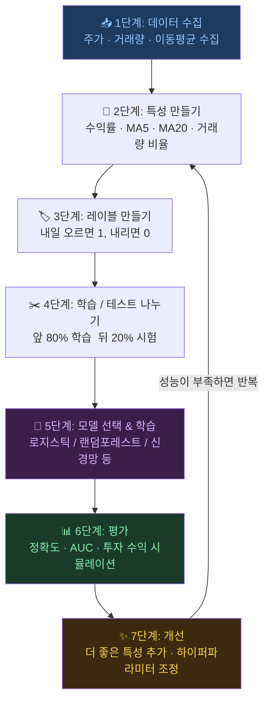

# 주식 AI 용어 사전

> 어려운 말을 쉽게! 개발자도 이해할 수 있는 AI 주식 용어 설명

---

## 가

| 용어 | 쉬운 설명 | 주식 예시 |
|------|---------|---------|
| **가중치 (Weight)** | 컴퓨터가 배운 "중요도 점수". 클수록 그 정보를 더 많이 사용함 | "모멘텀 팩터"에 높은 가중치 → 최근 많이 오른 주식에 더 집중 |
| **가중합 (Weighted Sum)** | 입력값마다 가중치를 곱한 뒤 모두 더한 값. 뉴런이 판단을 시작하기 전에 만드는 1차 점수 | 수익률·거래량·이평선에 각각 중요도를 곱해 하나의 점수로 합침 |
| **거래량 (Volume)** | 하루에 주식이 얼마나 많이 사고 팔렸는지 | 거래량이 갑자기 늘면 뭔가 일어나고 있다는 신호! |
| **골든크로스** | 5일 평균 주가가 20일 평균 주가를 위로 뚫을 때 | 상승 신호로 많이 사용됨 |
| **과적합 (Overfitting)** | 공부는 잘했는데 시험은 못 보는 것. 학습 데이터만 외워버린 상태 | 학습 정확도 95%, 테스트 정확도 52% → 과적합! |

---

## 나

| 용어 | 쉬운 설명 | 주식 예시 |
|------|---------|---------|
| **뉴런 (Neuron)** | 신경망의 기본 계산 단위. 여러 입력에 가중치를 곱해 합산하고 하나의 신호를 출력함. 뇌의 신경세포가 다른 세포들로부터 신호를 받아 판단하는 것과 같은 원리 | 수익률·거래량·이평선을 각각의 중요도(가중치)로 합산해 "오를 가능성" 점수를 계산하는 작은 판단기 |

---

## 다

| 용어 | 쉬운 설명 | 주식 예시 |
|------|---------|---------|
| **데드크로스** | 5일 평균이 20일 평균 아래로 내려갈 때 | 하락 신호로 많이 사용됨 |
| **드롭아웃 (Dropout)** | 학습할 때 뉴런 일부를 랜덤으로 끔. 외우지 않고 진짜로 배우게 함 | 과적합 방지 방법 중 하나 |

---

## 라

| 용어 | 쉬운 설명 | 주식 예시 |
|------|---------|---------|
| **레이블 (Label, 정답표)** | 각 데이터에 붙이는 **정답 이름표**. AI는 이 정답을 보며 배움. 영어 *label*은 "이름표"란 뜻으로, 각 입력 데이터가 어떤 답에 해당하는지 알려 줌. 레이블이 있어야 지도학습이 가능! | 2024년 1월 3일 주가 데이터 → 레이블 = **1** (다음 날 올랐으니까). 2024년 1월 4일 주가 데이터 → 레이블 = **0** (다음 날 내렸으니까) |

> 📌 **레이블 = 정답** 한 줄 요약  
> 문제지(데이터)에 선생님이 빨간 펜으로 써준 정답이 바로 레이블입니다.  
> AI는 이 정답을 보면서 "이런 입력일 때는 1(상승)이구나" 를 반복해서 외워 나갑니다.

---

## 마

| 용어 | 쉬운 설명 | 주식 예시 |
|------|---------|---------|
| **머신러닝 (Machine Learning)** | 컴퓨터가 데이터를 보고 스스로 규칙을 배우는 것 | 주가 데이터 보고 "이런 패턴일 때 오른다"를 스스로 발견 |
| **최소제곱법 (Least Squares)** | 오차를 제곱해서 모두 더한 값이 가장 작아지도록 직선이나 모델을 맞추는 방법. 선형회귀의 대표적인 학습 아이디어 | 예측 주가선과 실제 주가 점들의 거리 제곱합이 가장 작아지는 직선을 찾기 |
| **모멘텀 (Momentum)** | 최근에 많이 올랐던 주식은 계속 오르는 경향 | 최근 3개월 수익률로 계산 |

---

## 바

| 용어 | 쉬운 설명 | 주식 예시 |
|------|---------|---------|
| **배깅 (Bagging)** | 여러 모델을 독립적으로 만들고 평균 낸 것 | 랜덤 포레스트가 대표 예시 |
| **편향 (Bias)** | 가중합에 마지막으로 더하는 보정값. 판단 기준을 조금 위아래로 옮기는 역할 | 같은 신호라도 편향이 크면 더 쉽게 "상승" 쪽으로 판단할 수 있음 |
| **비지도학습** | 정답(레이블) 없이 데이터 안의 패턴이나 무리를 찾는 학습 방식 | 비슷한 움직임의 종목끼리 자동으로 묶기 |
| **백테스트 (Backtest)** | 과거 데이터로 투자 전략을 테스트해보는 것 | "이 전략을 2020년부터 썼으면 얼마나 벌었을까?" |
| **부스팅 (Boosting)** | 이전 모델의 실수를 다음 모델이 보완하며 발전 | XGBoost, LightGBM이 대표 예시 |

---

## 사

| 용어 | 쉬운 설명 | 주식 예시 |
|------|---------|---------|
| **스칼라 (Scalar)** | 숫자 하나 | 오늘 수익률 `+0.8%`, 편향 `-0.1`, 학습률 `0.01` |
| **샤프 비율 (Sharpe Ratio)** | 수익 대비 위험. 높을수록 안전하게 많이 번 것 | 수익 10%, 변동성 5% → 샤프 비율 2.0 (우수!) |
| **수익률 (Return)** | 주가가 얼마나 변했는지 %로 표현 | 6만원 → 6만2천원 = +3.3% 수익률 |
| **순전파 (Forward Pass)** | 입력 데이터가 입력층 → 은닉층 → 출력층 방향으로 흘러가며 예측값을 만드는 과정. 물이 위에서 아래로 흐르듯 층을 따라 앞으로만 계산이 흘러감 | 주가 특성(수익률·거래량·이평선) 입력 → 은닉층에서 패턴 계산 → 상승 확률 출력 |
| **시그모이드 함수 (Sigmoid)** | 점수 `z`를 0~1 사이 값으로 바꾸는 함수. 확률처럼 읽기 쉬워서 분류 출력층에서 자주 사용 | 상승 점수 `0.44`를 넣어 상승 확률 `0.61`처럼 바꿔 보여줌 |
| **슬라이딩 윈도우** | 최근 N일치 데이터를 묶어서 하나의 입력으로 만드는 방법 | 최근 20일 주가를 한 묶음으로 보기 |

---

## 아

| 용어 | 쉬운 설명 | 주식 예시 |
|------|---------|---------|
| **활성화 함수 (Activation Function)** | 뉴런이 만든 점수를 다음 층으로 넘기기 전에 모양을 바꿔주는 함수. 비선형 패턴을 배우게 해줌 | ReLU로 은닉층 뉴런을 통과시키거나, sigmoid로 상승 확률을 만듦 |
| **앙상블 (Ensemble)** | 여러 모델을 합쳐서 예측하는 방법. 다수결! | 로지스틱 + RF + 부스팅 → 세 모델 투표로 결정 |
| **오차 (Error)** | 예측값과 실제값의 차이. 한 문제를 얼마나 틀렸는지 보여주는 값 | 상승 확률 0.7로 예측했는데 실제 정답이 1이면 오차는 -0.3 |
| **역전파 (Backpropagation)** | 예측이 틀렸을 때 오차를 출력층에서 입력층 방향으로 거꾸로 전달하면서 각 뉴런의 가중치를 조금씩 수정하는 과정. 시험을 본 뒤 틀린 문제를 뒤에서부터 되짚어 수정하는 것과 같은 원리 | 상승 예측이 틀리면, 출력 → 은닉층2 → 은닉층1 방향으로 오차가 역으로 흘러 모든 뉴런이 조금씩 조정됨 |
| **은닉층 (Hidden Layer)** | 입력층과 출력층 사이에 있는 중간 계산 층. '은닉(숨을 은)'이란 이름은 사람이 직접 들여다보기 어렵기 때문에 붙여진 것. 여기서 복잡한 패턴 인식이 일어남 | 층이 많을수록 더 복잡한 패턴(예: 3일 상승 후 거래량 폭발 시 추가 상승 등)을 학습 가능 |
| **인공신경망 (ANN, Artificial Neural Network)** | 사람의 뇌 신경세포(뉴런) 구조를 수학으로 모방한 모델. 입력층·은닉층·출력층으로 구성되며, 데이터를 보고 스스로 패턴을 학습함 | 주가·거래량·이평선을 입력하면 "내일 오를 확률"을 스스로 계산해 출력 |
| **이동평균 (Moving Average)** | 최근 N일치 주가의 평균. 주가의 흐름을 부드럽게 보여줌 | MA5 = 최근 5일 평균, MA20 = 최근 20일 평균 |

---

## 자

| 용어 | 쉬운 설명 | 주식 예시 |
|------|---------|---------|
| **정규화 (Normalization)** | 서로 다른 크기의 숫자들을 비슷한 범위로 맞추는 것 | 주가(6만)와 거래량(1천만)을 같은 크기로 맞춤 |
| **정밀도 (Precision)** | "오른다"고 했을 때 정말 오른 비율 | 10번 매수 신호 중 6번 오름 → 정밀도 60% |
| **지도학습** | 정답을 알려주며 가르치는 방법 | "이 날 주가 올랐어"라고 레이블 주며 학습 |
| **선형변환 (Linear Transformation)** | 벡터에 가중치 행렬을 곱하고 편향을 더해 새로운 점수나 새로운 벡터로 바꾸는 계산 | `[수익률, 거래량, MA]` 입력을 은닉층 점수들로 바꾸는 과정 |

---

## 차

| 용어 | 쉬운 설명 | 주식 예시 |
|------|---------|---------|
| **벡터 (Vector)** | 숫자 여러 개를 한 묶음으로 담은 것 | `[수익률, 거래량, 이동평균]`처럼 한 종목의 입력 특성을 한 줄로 묶은 값 |
| **비용 (Cost, Loss)** | 여러 오차를 합쳐서 "모델이 전체적으로 얼마나 틀렸는지"를 숫자 하나로 나타낸 값. 낮을수록 좋음 | 학습이 잘되면 비용이 0.9 → 0.2처럼 점점 줄어듦 |
| **초과 수익** | 시장 평균보다 더 번 금액 | 시장 +5%, 내 전략 +8% → 초과 수익 +3% |
| **추론 (推論, Inference)** | 훈련이 끝난 AI가 한 번도 본 적 없는 새 데이터로 예측하는 것. 推(밀 추)+論(논할 론). 영어 *infer*는 라틴어 *inferre*(안으로 나르다) → 근거로부터 결론을 끌어냄 | 오늘의 주가를 입력하면 "내일 오를 것 같다" 고 바로 답함 |

---

## 카

| 용어 | 쉬운 설명 | 주식 예시 |
|------|---------|---------|
| **클러스터링 (Clustering)** | 비슷한 것끼리 자동으로 묶는 방법. 정답(레이블)이 없어도 시작할 수 있는 대표적인 비지도학습 | 비슷한 주가 패턴을 가진 종목들을 자동 그룹화 |

---

## 타

| 용어 | 쉬운 설명 | 주식 예시 |
|------|---------|---------|
| **테스트 데이터** | 학습에 사용하지 않고 최종 시험용으로 남겨둔 데이터 | 뒤 20% 기간으로 모델 최종 평가 |
| **트리 (Tree)** | 스무고개처럼 질문을 반복해서 답을 찾는 모델 구조 | "5일 평균 > 6만?" → Yes/No → 다음 질문 |
| **특성 (Feature)** | 예측에 사용하는 입력 정보 | 수익률, 이동평균, 거래량 등 |

---

## 파

| 용어 | 쉬운 설명 | 주식 예시 |
|------|---------|---------|
| **패치 (Patch)** | 긴 시계열을 잘게 나눈 조각 | 60일 주가를 8일씩 7조각으로 나눔 |
| **피드백 (Feedback)** | 신경망이 "순전파 → 오차 계산 → 역전파 → 가중치 수정"을 반복하는 학습 사이클. 예측 결과를 다시 학습에 반영해 점점 더 정확해지는 것 | 예측이 틀릴 때마다 피드백을 받아 수천 번 반복 학습 → 오차 감소 |
| **포트폴리오** | 여러 종목을 함께 보유하는 것. 계란을 한 바구니에 담지 않기! | 삼성전자 30% + 카카오 20% + 현대차 50% |

---

## 하

| 용어 | 쉬운 설명 | 주식 예시 |
|------|---------|---------|
| **하이퍼파라미터** | 모델 설정값. 학습 전에 사람이 정해주는 것 | 트리 깊이, 학습 횟수, 학습 속도 등 |
| **학습 (學習, Learning)** | 컴퓨터가 많은 데이터를 보며 스스로 규칙을 발견하는 전체 과정. 學(배울 학)+習(익힐 습). 논어의 "학이시습지(學而時習之)"에서 유래. 영어 *learn*은 고대 영어 *leornian*(흔적을 따라가다) | 주가 500일치를 보며 "이 패턴일 때 오른다"를 스스로 알게 됨 |
| **학습 데이터 (Training Data)** | 모델에게 가르쳐줄 데이터 | 앞 80% 기간 데이터로 학습 |
| **훈련 (訓練, Training)** | 모델이 데이터를 보고 예측하고 틀리면 수정하는 반복 연습 과정. 訓(가르칠 훈)+練(익힐 련). 원래 군사 용어로, 병사를 몸에 익히게 반복 단련하는 것에서 유래. 영어 *train*은 라틴어 *trahere*(끌어당기다) | 수백~수천 번 반복하며 조금씩 개선 |

---

## 자주 헷갈리는 분류

| 용어 | 쉬운 설명 | 예시 |
|------|---------|---------|
| **회귀 (Regression)** | 숫자 하나를 맞히는 문제. 특히 가격처럼 **연속값**을 예측할 때 사용 | 내일 종가가 `61,300원`일까? |
| **분류 (Classification)** | 여러 답안 칸 중 하나를 고르는 문제. 보통 **이산값**이나 범주를 맞힘 | 내일 주가가 `상승`일까 `하락`일까? |
| **레이블 (Label)** | 데이터에 붙은 정답 이름표 | 오늘 데이터의 레이블이 `상승`이면 "내일 올랐다"는 뜻 |
| **지도학습 (Supervised Learning)** | 레이블을 보면서 배우는 학습 | `상승/하락` 정답을 보고 예측 규칙 학습 |
| **비지도학습 (Unsupervised Learning)** | 레이블 없이 데이터 구조를 찾는 학습 | 비슷한 종목끼리 무리 찾기 |
| **연속값 (Continuous Value)** | 값 사이가 자연스럽게 이어지는 숫자 | 주가, 매출, 온도 |
| **이산값 (Discrete Value)** | 값이 뚝뚝 끊어져 있는 숫자나 범주 | 상승/하락, 1등급/2등급/3등급 |
| **이진 분류 (Binary Classification)** | 정답이 2개뿐인 분류 | 스팸/정상, 상승/하락 |
| **다중 클래스 분류 (Multiclass Classification)** | 정답이 3개 이상인 분류 | 하락/보합/상승 |
| **군집화 (Clustering)** | 레이블 없이 비슷한 데이터끼리 자동으로 묶는 것 | 성장주 무리, 안정주 무리, 하락주 무리 찾기 |

---

## 영어 약어 사전

| 약어 | 전체 이름 | 뜻 |
|------|---------|---|
| **AUC** | Area Under Curve | 모델이 얼마나 잘 구분하는지. 0.5=찍기, 1.0=완벽 |
| **CNN** | Convolutional Neural Network | 패턴을 창문으로 훑으며 찾는 신경망 |
| **GBM** | Gradient Boosting Machine | 실수를 보완하며 발전하는 모델 |
| **LSTM** | Long Short-Term Memory | 중요한 건 오래, 불필요한 건 빨리 잊는 신경망 |
| **MA** | Moving Average | 이동평균 |
| **MDD** | Maximum Drawdown | 최대 낙폭. 얼마나 많이 잃었나의 최악값 |
| **ML** | Machine Learning | 머신러닝 |
| **MLP** | Multi-Layer Perceptron | 여러 층이 있는 기본 신경망 |
| **RF** | Random Forest | 랜덤 포레스트 |
| **RNN** | Recurrent Neural Network | 순서를 기억하며 처리하는 신경망 |
| **SVM** | Support Vector Machine | 구분선으로 나누는 분류 모델 |

---

## 주식 투자 AI를 만드는 순서

