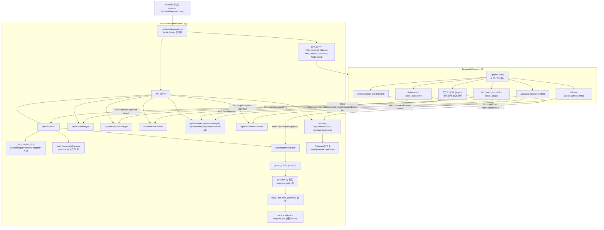

# AI/ML Basic Class — 퀀트를 위한 머신러닝과 딥러닝

## 실행 제반여건 한눈에 보기

이 저장소를 실행하기 전에 아래 항목(소프트웨어/기술스택/요소기술/플랫폼/사양/비용)을 먼저 확인하세요.

### 1) 필수 소프트웨어(SW)

| 구분 | 필수/권장 | 비고 |
|---|---|---|
| Git | 필수 | 저장소 clone 용도 |
| Python 3.11+ | 필수(로컬 실행 시) | Dockerfile 기준 `python:3.11-slim` |
| pip + venv | 필수(로컬 실행 시) | `python3 -m venv .venv` |
| Docker Engine / Docker Desktop | 권장(가장 쉬운 실행) | `docker compose up --build -d` |
| Docker Compose Plugin | 권장 | `docker compose version`으로 확인 |
| Ollama 모델 파일 | 권장(LLM 해설 기능 사용 시) | `llama3.2` 기본(약 2GB 내외), `llama3.1` 대안(약 5GB 내외, 버전/양자화별 상이) |

### 2) 주요 기술스택

- **Backend:** FastAPI, Uvicorn
- **ML/DS:** NumPy, Pandas, scikit-learn, Matplotlib, Seaborn
- **데이터/통신:** HTTPX, python-multipart, FinanceDataReader
- **LLM 연동:** Ollama (`OLLAMA_URL`, `OLLAMA_MODEL`)
- **벡터DB:** Qdrant
- **Frontend:** 정적 HTML/JS (FastAPI에서 SPA 형태로 서빙)
- **배포/실행:** Docker, Docker Compose

### 3) 알아야 할 IT 요소기술(최소)

- REST API 기본(요청/응답, JSON)
- Python 가상환경(.venv) 활성화 후 패키지 설치(`source .venv/bin/activate` 후 `pip install -r requirements.txt`)
- 컨테이너 기본(Docker 이미지/컨테이너/볼륨/포트)
- 로그 확인 및 기본 트러블슈팅(`docker compose logs`, `uvicorn` 로그)
- (선택) LLM/벡터DB 개념(Ollama, Qdrant 역할 이해)

### 4) 필요한 플랫폼

| 플랫폼 | 사용 목적 |
|---|---|
| 로컬 PC (Windows/macOS/Linux) | 개발/학습/실습 실행 |
| Docker 실행 환경 | 앱/LLM/벡터DB 통합 실행 |
| 클라우드(IaaS) 선택 | 원격 실습 서버 운영 시(예: AWS EC2, OpenStack) |

### 5) 권장 PC 사양

| 구분 | 최소 사양(학습/기본 실습) | 권장 사양(LLM 포함 원활 실행) |
|---|---|---|
| CPU | 4코어 | 8코어 이상 |
| RAM | 16GB | 32GB 이상 |
| 저장공간 | 여유 20GB+ | 여유 50GB+ (모델/데이터/이미지 포함) |
| GPU | 필수 아님(CPU 가능) | NVIDIA GPU 권장(응답속도 개선) |
| 네트워크 | 모델/패키지 다운로드 가능한 인터넷 | 동일 |

> 참고: Docker + Ollama + Qdrant + Python 라이브러리/데이터셋까지 고려하면 디스크 여유 공간이 충분해야 합니다.

### 6) 클라우드 사용 시 대략 비용(예시)

아래는 **2026년 5월 기준, 24시간 상시 구동 가정의 대략적인 월 비용 예시**입니다. (리전/환율/트래픽/디스크/과금정책 변경에 따라 크게 달라질 수 있음)

| 시나리오 | 예시 구성 | 월 예상 비용(USD) |
|---|---|---|
| 최소 실습형 (CPU) | 2 vCPU / 4GB RAM + 스토리지 30~50GB | 약 $25 ~ $60 |
| 표준 실습형 (CPU) | 4 vCPU / 8GB RAM + 스토리지 50~100GB | 약 $60 ~ $140 |
| LLM 가속형 (GPU) | GPU 1장 + 8~16 vCPU + 30GB+ RAM | 약 $300+ |

- 비용 절감 팁: 수업 시간에만 인스턴스 실행(Stop/Start), 스냅샷/백업 최소화, 트래픽 모니터링.
- 로컬 PC 자원이 충분하면 Docker 기반 로컬 실행이 일반적으로 가장 저렴합니다.

## AI, ML, DL: 알고리즘과 기법의 관점에서 이해하기

**AI(인공지능)의 머신러닝(ML)과 딥러닝(DL)은 본질적으로 데이터를 처리하고 학습하기 위한 수학적 알고리즘과 구조적 기법의 집합**입니다. 이를 보다 구체적으로 분류하여 설명해 드립니다.

---

## 1. 개념적 계층 구조
AI는 가장 넓은 범주이며, ML과 DL은 그 구현을 위한 구체적인 방법론입니다.

- **AI (Artificial Intelligence):** 인간의 지능을 모방하는 모든 기술 (가장 넓은 개념)
- **ML (Machine Learning):** 데이터를 통해 컴퓨터가 스스로 학습하게 하는 **알고리즘**
- **DL (Deep Learning):** 인간의 뇌 신경망을 모방한 인공신경망(ANN) 구조를 활용한 **ML의 하위 기법**

---

## 2. 왜 '알고리즘'이자 '기법'인가?

### ① 수학적 알고리즘으로서의 면모
ML/DL 모델의 핵심은 **최적화(Optimization)**와 **통계(Statistics)**입니다.
- **경사하강법 (Gradient Descent):** 모델의 오차를 최소화하기 위해 가중치를 조절하는 알고리즘.
- **오차 역전파 (Backpropagation):** 출력층의 오차를 입력층 방향으로 전달하며 학습시키는 알고리즘.
- **확률적 모델링:** 데이터의 분포를 수학적으로 정의하고 예측하는 과정.

### ② 구조적 기법(Architecture)으로서의 면모
데이터의 특성에 따라 모델을 설계하는 방식 자체가 하나의 고도화된 기술(Technique)입니다.
- **CNN (Convolutional Neural Networks):** 이미지의 특징을 추출하기 위한 필터링 기법.
- **RNN (Recurrent Neural Networks):** 시계열 데이터나 텍스트의 순서를 기억하기 위한 순환 구조 기법.
- **Transformer:** 데이터 간의 관계를 파악하는 'Attention' 메커니즘을 활용한 최신 기법 (ChatGPT의 기반).

---

## 3. 전통적 알고리즘 vs AI 모델

| 구분 | 전통적 알고리즘 (Rule-based) | AI 모델 (ML/DL) |
| :--- | :--- | :--- |
| **핵심** | 사람이 규칙을 직접 정의 (If-Then) | 데이터에서 규칙을 스스로 찾아냄 |
| **유연성** | 정해진 조건 외의 데이터에 취약 | 새로운 데이터 패턴에 대한 적응력이 높음 |
| **결과물** | 특정 작업을 수행하는 코드 | 데이터를 함수로 변환한 **모델(Model)** |

---

## 4. 결론: "모델"은 무엇인가?

결국 우리가 말하는 **'모델'**이란, 특정 **알고리즘**을 사용해 데이터를 학습시킨 결과로 얻어진 **복잡한 수식(함수)**을 의미합니다.

> **"AI 모델링은 데이터라는 재료를 알고리즘이라는 요리법을 통해, 예측이나 판단을 수행하는 수학적 함수로 만들어내는 과정이다."**

## 따라서 알고리즘의 수학적배경이나 복잡한 알고리즘, 기법을 이해하려 시간을 보내는 것은 무의미 합니다.
## 주식투자도 기법이 있듯이 본 과정은 알려져 있는 알고리즘, 기법을 AI 코딩을 통해 솔루션을 만드는 과정 입니다.

문서와 연결된 실습 코드 + FastAPI 백엔드 + 주식 AI 실험실(웹 앱)로 구성된 AI/ML 학습 환경입니다.  
실습을 선택하고 **"실행"** 버튼만 누르면 Python 코드와 실행 결과를 브라우저에서 바로 확인할 수 있습니다.

이 저장소는 크게 3층으로 움직입니다.

1. **FE(웹 화면)** 가 사용자의 입력, 버튼 선택, 차트 렌더링을 담당합니다.
2. **BE(FastAPI)** 가 데이터를 가공하고 ML/DL 모델을 실행해 결과를 계산합니다.
3. **Ollama** 가 계산된 결과를 받아 사람이 읽기 쉬운 자연어 설명으로 바꿔 줍니다.

즉, 이 repo에서는 **ML/DL의 숫자 결과는 백엔드가 만들고, Ollama는 그 결과를 설명하는 AI 해설사 역할**을 맡습니다.

## 웹앱 전체 실행/연동 다이어그램 (BE 진입점 → Chapter 실행 → FE 연동)



---

## 빠른 시작 (요약)

### Docker 권장 실행 (가장 쉬운 방법)

```bash
git clone https://github.com/edumgt/python-ai-basic-lab.git
cd python-ai-basic-lab
docker compose up --build -d
docker exec ai-lab-ollama ollama pull llama3.2
```

- 앱: http://localhost:8000
- API 상태 확인: http://localhost:8000/api/health
- API 문서: http://localhost:8000/docs

### 로컬 Python 실행 (Docker 없이)

```bash
python3 -m venv .venv
source .venv/bin/activate        # Windows: .venv\Scripts\activate
pip install -r requirements.txt
uvicorn backend.app.main:app --reload --host 0.0.0.0 --port 8000
```

---

## 사전 준비 

### 선수 repo - https://github.com/edumgt/edumgt-lab-init
### 선수 repo - https://github.com/edumgt/investment-analysis
### 선수 repo - https://github.com/edumgt/python-basic-lab
### 선수 repo - https://github.com/edumgt/docker-class

---

## 프로젝트 진행 전 Serving 인프라 구축

### https://github.com/edumgt/aws-ec2-alb-lab
### https://github.com/edumgt/openstack-private-cloud
### https://github.com/edumgt/python-crawling-lab


---

### 1단계: Docker Desktop 설치

| OS | 설치 링크 | 비고 |
|---|---|---|
| **Windows** | [Docker Desktop for Windows](https://docs.docker.com/docker-for-windows/) | WSL2 백엔드 권장 |
| **macOS** | [Docker Desktop for Mac](https://docs.docker.com/docker-for-mac/) | Apple Silicon 지원 |
| **Linux** | [Docker Engine](https://docs.docker.com/engine/install/) | Compose Plugin 함께 설치 |

설치 후 정상 동작 확인:

```bash
docker version
docker compose version
```

> **Windows WSL2 포트 충돌 시**  
> PowerShell에서 `netsh interface portproxy show all` 로 포트 현황 확인.  
> 자세한 트러블슈팅은 [docker-class → WSL 포트 80 문제 해결](https://github.com/edumgt/docker-class#7-wsl-%ED%8F%AC%ED%8A%B8-80-%ED%8A%B8%EB%9F%AC%EB%B8%94%EC%8A%88%ED%8C%85) 참고.

---

### 2단계: 프로젝트 클론

```bash
git clone https://github.com/edumgt/python-ai-basic-lab
cd python-ai-basic-lab
```

---

### 3단계: 전체 AI 스택 실행 (Docker Compose)

```bash
# 빌드 후 백그라운드 실행
docker compose up --build -d
```

컨테이너가 실행되면 다음 서비스가 준비됩니다:

| 서비스 | 컨테이너명 | 역할 | 접속 주소 |
|---|---|---|---|
| `app` | `ai-lab-app` | FastAPI 학습 서버 · 주식 AI 실험실 | http://localhost:8000 |
| `ollama` | `ai-lab-ollama` | 로컬 LLM — 자연어 설명 생성 | http://localhost:11434 |
| `qdrant` | `ai-lab-qdrant` | 벡터 DB — 의미 기반 검색 | http://localhost:6333 |

---

### 4단계: Ollama 언어 모델 다운로드

```bash
# llama3.2 모델 다운로드 (최초 1회, 약 2GB)
docker exec ai-lab-ollama ollama pull llama3.2

# 사용 가능한 모델 확인
docker exec ai-lab-ollama ollama list
```

> **더 큰 모델을 원한다면**  
> `docker exec ai-lab-ollama ollama pull llama3.1`  (8B, 약 5GB)  
> 모델명은 `docker-compose.yml`의 `OLLAMA_MODEL` 환경변수로 변경합니다.

> **GPU 가속 (NVIDIA)**  
> `docker-compose.yml`의 GPU 섹션 주석을 해제하면 응답 속도가 크게 향상됩니다.

---

## 이 repo에서 Ollama의 역할

Ollama는 이 저장소에서 **머신러닝/딥러닝 모델 자체를 학습시키는 도구가 아닙니다.**  
실제 예측값, 정확도, AUC, 특성 중요도, 신호표 같은 숫자는 `backend/app/main.py` 안의 `scikit-learn` 모델이 계산합니다.

Ollama는 그 다음 단계에서 이런 일을 합니다.

- 사용자가 웹앱에서 실행한 **ML/DL 결과를 요약**
- `정확도`, `AUC`, `정밀도`, `전략 수익률`, `주요 특성`을 보고 **쉬운 한국어 설명 생성**
- 사용자가 챗창에서 "왜 이렇게 나왔나요?" 같은 질문을 하면 **결과 기반 질의응답**
- `/api/ollama/status` 로 연결 상태를 확인하고, 온라인이면 모델명을 배지에 표시

쉽게 말하면:

- **ML/DL 모델** = 시험 점수를 계산하는 채점기
- **Ollama** = 그 점수를 보고 "왜 이런 점수가 나왔는지" 설명해 주는 선생님

현재 연결 흐름은 다음과 같습니다.

1. FE가 `/api/stock/analyze`, `/api/stock/predict-target`, `/api/hotel-stock/train` 같은 API를 호출
2. BE가 `scikit-learn` 모델로 결과 계산
3. FE가 결과를 카드, 표, 차트로 시각화
4. 사용자가 질문하면 `/api/chat` 이 Ollama에 프롬프트를 보내 자연어 설명 생성
5. Ollama가 오프라인이면 BE의 fallback 설명으로 기본 해설 제공

---

## 오전 수업에서 강사와 같이 내용 분석 및 웹앱 실행하여 테스트
## 오후 수업에서 각자 homework 의 ch01 ~ ch12 까지의 py 를 직접 실행 하여 오류 수정 및 git repo 로 구성하여 , 강사 이메일로 초대
## 각 py 파일은 개인별 환경, 필요한 파일 경로 오류, 파일 자체의 오탈자 등으로 오류가 있는 파일이며, 해당 수정 후 결과를 캡쳐하여 본인 repo 에 저장한다.

## 수정 파일의 내용을 주식 관련 업무로 변경한다.
## AI 를 이용한 이 repo 의 fork repo 에서 웹앱 개편
## 이 repo docs 의 내용에 대한 본인 내용 추가
## homework 의 소스 변경 및 수행 결과 캡쳐 이미지 등으로 수행 결과 저장
## 매일 commit 수 50번 이상의 기록이 있을 것
## 순수 python 만으로 연습은 https://github.com/edumgt/python-ml-class 을 이용 합니다.

---

## BE / FE 기술스택

### 백엔드(BE)

| 구분 | 기술 | 이 repo에서 하는 일 |
|---|---|---|
| 웹 프레임워크 | **FastAPI** | 문서 API, 실습 API, 주가 분석 API, Ollama 연동 API 제공 |
| 서버 실행 | **Uvicorn** | FastAPI 앱 서빙 |
| 데이터 처리 | **pandas**, **numpy** | CSV 파싱, 특성 생성, 시계열 가공 |
| ML / DL | **scikit-learn** | 로지스틱 회귀, 랜덤 포레스트, GBM, SVM, KNN, MLP 실행 |
| 입력 검증 | **Pydantic** | 요청 데이터 구조 검증 |
| 파일 업로드 | **python-multipart** | CSV 업로드 처리 |
| 외부 AI 호출 | **httpx** | Ollama API 호출 |
| 시세 데이터 보조 | **FinanceDataReader** | 금융 데이터 실습 보조 |

### 프론트엔드(FE)

| 구분 | 기술 | 이 repo에서 하는 일 |
|---|---|---|
| 기본 UI | **HTML + Vanilla JavaScript** | SPA, 실습 페이지, 대시보드 동작 |
| 스타일 | **Tailwind CSS** | 카드, 배지, 반응형 레이아웃 |
| 표/그리드 | **AG Grid** | 실습 목록, 표 데이터, 결과 테이블 표시 |
| 차트 | **ApexCharts** | 중요도 차트, 주가 곡선, 시계열 결과 시각화 |
| 캔버스 시각화 | **Canvas API** | 뉴럴 네트워크 애니메이션, 신경망 흐름 표현 |
| 브라우저 저장 | **LocalStorage** | 최근 실행 기록, 마지막 선택 상태 저장 |

### Docker 스택

| 서비스 | 이미지/역할 | 비고 |
|---|---|---|
| `app` | FastAPI + FE 정적 파일 제공 | ML/DL 계산의 중심 |
| `ollama` | 로컬 LLM 서버 | 결과 요약, 질의응답 |
| `qdrant` | 벡터 DB | 확장형 검색/의미기반 기능을 위한 기반 |

---

## Docker + Ollama + ML/DL 결과 도출 흐름

이 저장소의 핵심은 **"Docker로 전체 스택을 띄우고, FE에서 실습을 누르면, BE가 ML/DL 결과를 계산하고, Ollama가 그 결과를 설명한다"** 는 점입니다.

### 전체 처리 흐름

```text
브라우저(FE)
  -> FastAPI(BE)
      -> 데이터 전처리(pandas/numpy)
      -> 특성 생성(feature engineering)
      -> 모델 학습/예측(scikit-learn)
      -> 지표 계산(accuracy, AUC, precision, confusion matrix ...)
      -> 결과 반환(JSON)
  -> 차트/카드 렌더링(ApexCharts, AG Grid)
  -> 사용자 질문 입력
  -> /api/chat
      -> Ollama
      -> 결과 요약/설명 생성
```

### 중요한 포인트

- **머신러닝/딥러닝 결과를 만드는 주체는 BE의 Python 코드**입니다.
- **Ollama는 결과 해설과 대화형 설명을 담당**합니다.
- 따라서 Ollama가 꺼져 있어도 핵심 ML/DL 실습은 돌아가고, 설명 품질만 달라집니다.

---

## 웹앱별 ML / DL 처리 예시

### 1. 주식 AI 실험실 `/lab`

사용자가 날짜, 종가, 거래량을 입력하거나 `삼성전자`, `카카오`, `NAVER`, 내장 CSV를 불러오면 BE가 다음 순서로 처리합니다.

1. 입력 행을 `date`, `close`, `volume` 구조로 정리
2. 파생 특성 생성
   - `ret`
   - `ret_5`
   - `ma5`
   - `ma20`
   - `vol_ratio`
3. 다음 날 상승 여부를 `target`으로 생성
4. 앞 80% 구간으로 학습, 뒤쪽 구간으로 테스트
5. 선택 모델 실행
   - ML: `로지스틱 회귀`, `랜덤 포레스트`, `그래디언트 부스팅`
   - DL: `신경망(MLPClassifier)`
6. 결과 계산
   - `accuracy`
   - `AUC`
   - `precision`
   - `feature_importance`
   - `portfolio_return`
   - `buyhold_return`
   - `signals`
7. 사용자가 질문하면 Ollama가 "왜 거래량 비율이 중요했는지" 같은 설명 생성

예시:

- `랜덤 포레스트`를 선택하면 BE가 트리 앙상블로 분류를 수행하고, FE는 특성 중요도와 포트폴리오 곡선을 그립니다.
- `신경망`을 선택하면 MLP 결과뿐 아니라 `nn_viz` 데이터를 받아 신경망 활성화 흐름도 함께 보여 줍니다.

### 2. 예측 실험실 `/predict`

CSV를 업로드하면 회사별로 같은 파이프라인을 돌려 **한 화면에서 비교**합니다.

입력 CSV 조건:

- `date`
- `company`
- `close`
- `volume`

BE는 회사별로 10개 특성을 만듭니다.

- 일간 수익률
- 5일 수익률
- MA5 비율
- MA20 비율
- 거래량 비율
- RSI
- 변동성
- 골든크로스
- 20일 모멘텀
- 거래량 변화율

그 뒤 모델을 선택해 회사별 예측 결과를 만듭니다.

- `로지스틱 회귀`
- `랜덤 포레스트`
- `그래디언트 부스팅`
- `신경망`

결과 예시:

- `롯데호텔`은 거래량 관련 특성이 중요할 수 있고
- `현대자동차`는 추세/이동평균 관련 특성이 더 중요하게 나올 수 있습니다.

FE는 이를 회사 카드, 특성 중요도 차트, 모델 성능 비교 탭으로 보여 줍니다.

### 3. 호텔-주가 실험실 `/hotel-stock`

이 페이지는 **가상 롯데호텔 데이터셋**으로 ML과 DL을 더 시각적으로 비교하는 실습입니다.

BE는 다음 특성을 가진 데이터를 생성합니다.

- 30개 호텔 예약률 특성
- 4개 계절/월/분기 특성
- 7개 주가 파생 특성

즉 총 **41개 특성**으로 다음 달 상승/하락을 예측합니다.

실행 가능한 모델:

- ML
  - 로지스틱 회귀
  - 결정 트리
  - 랜덤 포레스트
  - 그래디언트 부스팅
  - SVM
  - KNN
- DL
  - 단층 신경망
  - 2층 신경망
  - 3층 신경망
  - 심층 신경망

반환 결과:

- `accuracy`
- `auc`
- `precision`
- `recall`
- `confusion_matrix`
- `feature_importance`
- `signals`
- `price_series`
- `nn_viz`

이 결과를 FE가 다음처럼 보여 줍니다.

- 상단 성능 카드
- 중요도 차트
- 주가 시뮬레이션 차트
- 예측 신호표
- 혼동행렬
- 신경망 시뮬레이션

---

## 아주 쉬운 예시 시나리오

### 예시 1. `/lab` 에서 삼성전자 샘플 분석

1. 사용자가 `삼성전자` 버튼 클릭
2. FE가 표를 채움
3. 사용자가 `랜덤 포레스트` 선택 후 `AI 분석 시작!`
4. BE가 5개 파생 특성을 만든 뒤 모델 학습
5. `accuracy`, `AUC`, `정밀도`, `특성 중요도`, `수익률 곡선` 반환
6. FE가 결과 카드와 차트 렌더링
7. 사용자가 "왜 매수 신호가 적게 나왔나요?"라고 질문
8. Ollama가 수치 기반으로 간단한 한국어 설명 생성

### 예시 2. `/predict` 에서 CSV 업로드 후 모델 비교

1. 사용자가 샘플 CSV 업로드
2. FE가 `/api/stock/predict-target` 호출
3. BE가 회사별로 10개 특성 생성
4. `GBM` 과 `신경망`을 번갈아 실행
5. 회사별 `AUC`, `상승 확률`, `특성 중요도` 비교
6. 사용자는 "회사마다 어떤 특성이 중요한지"를 한 화면에서 확인

### 예시 3. `/hotel-stock` 에서 ML vs DL 비교

1. 사용자가 `랜덤 포레스트` 실행
2. FE가 중요도, 혼동행렬, 가격 시뮬레이션 표시
3. 같은 데이터로 `2층 신경망` 실행
4. BE가 MLP를 다시 학습하고 `nn_viz` 까지 반환
5. FE가 신경망 시뮬레이션 탭을 열어 층별 활성화 흐름 표시
6. 사용자는 "트리 모델은 해석이 쉽고, MLP는 구조가 더 복잡하다"는 차이를 눈으로 확인

---

## 한 줄 요약

- **FE**는 보여 주는 층
- **BE**는 계산하는 층
- **ML/DL 모델**은 예측을 만드는 층
- **Ollama**는 그 결과를 설명하는 층
- **Docker Compose**는 이 모든 층을 한 번에 실행하는 도구

---

## `data/` CSV 데이터셋 설명

이 저장소의 `data/` 폴더에는 작은 연습용 CSV가 들어 있습니다.  
일부는 바로 웹앱과 연결되고, 일부는 데이터 구조를 읽거나 개념을 설명하기 위한 예시 데이터입니다.

### 한눈에 보는 데이터셋 표

| 파일 | 주요 열 | 무엇을 담고 있나요? | 추천 웹앱 |
|---|---|---|---|
| `experiment_log.csv` | `run_id`, `model`, `params`, `accuracy`, `f1` | 모델별 실험 기록과 성능 비교 | `/datasets` |
| `financial_statements.csv` | `year`, `revenue`, `operating_income`, `depreciation`, `capex`, `working_capital_change`, `tax_rate` | 재무제표 기반 DCF 기초 실습 | `/`, `/datasets` |
| `gender_approval.csv` | `gender`, `pred_approve` | 아주 작은 범주형 분류 예시 | `/datasets` |
| `personal_info.csv` | `name`, `email`, `phone`, `score` | 개인정보/민감정보 예시와 마스킹 설명 | `/datasets` |
| `stock_ohlcv.csv` | `date`, `open`, `high`, `low`, `close` | 기본 주가 시계열(OHLC) | `/lab`, `/datasets` |
| `stock_universe.csv` | `ticker`, `momentum`, `volatility`, `pe` | 여러 종목의 정적 팩터 비교 | `/datasets` |
| `stocks_features.csv` | `ticker`, `annual_return`, `volatility`, `per` | 군집화/종목 특성 비교용 데이터 | `/`, `/datasets` |
| `student_performance.csv` | `student_id`, `study_minutes`, `attendance_rate`, `pass_label` | 지도학습 분류 개념 예시 | `/datasets` |
| `traffic_timeseries.csv` | `date`, `traffic` | 짧은 시계열 맛보기 데이터 | `/lab`, `/datasets` |

### 파일별로 조금 더 쉽게 설명하면

#### 1. `stock_ohlcv.csv`

- 주가 실습에서 가장 바로 쓰기 쉬운 데이터입니다.
- `OHLCV` 중 현재 파일은 `open`, `high`, `low`, `close` 중심으로 들어 있습니다.
- 날짜별 가격 흐름을 보고 시계열 특성을 만들기 좋습니다.
- `/lab`에서 내장 데이터 버튼으로 바로 불러와 ML 모델 실습에 연결할 수 있습니다.

초급자식으로 말하면:

- "하루하루 주가 일기장"에 가깝습니다.
- 어제보다 오늘이 어땠는지, 며칠 연속 올랐는지를 살펴보는 재료입니다.

#### 2. `traffic_timeseries.csv`

- 날짜별 트래픽만 들어 있는 아주 짧은 시계열입니다.
- 주가가 아닌 데이터도 "시간 순서"만 있으면 시계열처럼 다뤄볼 수 있다는 것을 보여 줍니다.
- BE에서 이 데이터를 `/lab` 형식에 맞게 바꿔 주어 실습할 수 있습니다.

초급자식으로 말하면:

- "매일 방문자 수를 적은 출석부" 같은 데이터입니다.
- 주가가 아니어도 날짜 순서가 있으면 흐름을 배울 수 있다는 뜻입니다.

#### 3. `financial_statements.csv`

- 연도별 재무 정보가 들어 있습니다.
- 매출, 영업이익, 감가상각, CAPEX, 운전자본 변화, 세율 같은 값으로 재무 해석을 연습합니다.
- 숫자가 많아 보여도 핵심은 "회사가 얼마나 벌고, 얼마나 쓰고, 얼마가 남는지"를 보는 것입니다.

초급자식으로 말하면:

- 회사의 "돈 벌고 돈 쓰는 가계부" 같은 표입니다.

#### 4. `stocks_features.csv`

- 종목별 `annual_return`, `volatility`, `per` 이 들어 있습니다.
- 수익률, 흔들림 정도, 밸류에이션을 함께 보며 종목을 비교하거나 군집화할 때 좋습니다.
- 학습 허브의 군집 관련 실습과 연결해 보기 좋습니다.

초급자식으로 말하면:

- 여러 종목의 성격표를 한 줄씩 적어 놓은 카드 모음입니다.
- "잘 오르는 편인지", "많이 흔들리는지", "비싼 편인지"를 비교합니다.

#### 5. `stock_universe.csv`

- 여러 종목의 `momentum`, `volatility`, `pe` 가 담긴 간단한 유니버스 표입니다.
- 팩터 기반 비교, 분포 확인, 산점도 시각화에 적합합니다.
- 현재는 `/datasets`에서 구조를 빠르게 읽고 시각화하는 용도로 가장 잘 맞습니다.

#### 6. `experiment_log.csv`

- 모델 실험 결과를 간단히 적어 둔 로그입니다.
- `params`, `accuracy`, `f1` 을 보며 "어떤 설정이 더 나았는지"를 읽는 연습에 좋습니다.
- 하이퍼파라미터 튜닝과 실험 관리의 입문 예시로 볼 수 있습니다.

초급자식으로 말하면:

- "이번엔 이렇게 해봤더니 몇 점 나왔는지" 적어 둔 실험 노트입니다.

#### 7. `student_performance.csv`

- 공부 시간, 출석률, 합격 여부가 들어 있는 전형적인 지도학습 예시입니다.
- 주식과 직접 관련은 없지만, `특성 -> 정답(label)` 구조를 가장 쉽게 이해하는 데 도움이 됩니다.

초급자식으로 말하면:

- "얼마나 공부했고, 학교를 잘 나왔는지"를 보고 합격 여부를 맞히는 표입니다.

#### 8. `gender_approval.csv`

- 아주 작은 범주형 분류 예시입니다.
- 실제 서비스 데이터라기보다 분류, 편향, 단순 예측 개념을 조심스럽게 설명하는 데 가깝습니다.
- 샘플 수가 작기 때문에 "진짜 모델링용"보다는 "구조 읽기용" 데이터로 보는 편이 좋습니다.

#### 9. `personal_info.csv`

- 이름, 이메일, 전화번호, 점수가 들어 있는 개인정보 예시입니다.
- 민감한 열이 포함된 데이터를 다룰 때 마스킹과 안전한 미리보기가 왜 필요한지 설명하는 용도입니다.
- 실제 분석보다 **데이터 윤리와 안전한 UI** 관점에서 보는 것이 더 중요합니다.

### 웹앱 연결 기준으로 보면

- 바로 `주식 AI 실험실`로 연결되는 데이터
  - `stock_ohlcv.csv`
  - `traffic_timeseries.csv`
- `학습 허브` 개념 실습과 잘 맞는 데이터
  - `financial_statements.csv`
  - `stocks_features.csv`
- `데이터셋 허브`에서 구조와 차트를 먼저 보는 데이터
  - `experiment_log.csv`
  - `gender_approval.csv`
  - `personal_info.csv`
  - `stock_universe.csv`
  - `student_performance.csv`

### 가장 추천하는 시작 순서

1. `/datasets` 에서 데이터 구조를 먼저 봅니다.
2. `stock_ohlcv.csv` 또는 `traffic_timeseries.csv` 를 선택합니다.
3. 연결 버튼으로 `/lab` 으로 이동합니다.
4. 모델을 바꿔가며 결과 카드와 차트를 읽습니다.
5. 익숙해지면 `/predict` 나 `/hotel-stock` 으로 확장합니다.

---

### 5단계: 브라우저에서 접속

| URL | 설명 |
|---|---|
| http://localhost:8000 | AI/ML 문서 연계 실습 환경 |
| http://localhost:8000/lab | 📊 주식 AI 실험실 (직접 데이터 입력 + AI 분석) |
| http://localhost:8000/predict | 🎯 주가 예측 타겟팅 실험실 (CSV 업로드 기반 다중 종목 비교) |
| http://localhost:8000/datasets | 🗂 내장 CSV 데이터셋 허브 (data/ 폴더 시각화 + 웹앱 연결) |
| http://localhost:8000/hotel-stock | 🏨 멀티팩터 주식 AI 모델 비교실 (ML vs DL 비교) |
| http://localhost:8000/api/health | API 상태 확인 |
| http://localhost:8000/docs | FastAPI Swagger UI |
| http://localhost:6333/dashboard | Qdrant 대시보드 |

---

### Docker 관리 명령어

```bash
# 실행 상태 확인
docker compose ps

# 실시간 로그 확인
docker compose logs -f app
docker compose logs -f ollama

# 재시작
docker compose restart app

# 중지 (데이터 유지)
docker compose down

# 완전 초기화 (볼륨 포함 삭제)
docker compose down -v
```

---

### 로컬 Python으로 실행 (Docker 없이)

Docker 없이 직접 실행하는 방법입니다. Ollama는 별도 실행이 필요합니다.

```bash
python3 -m venv .venv
source .venv/bin/activate          # Windows: .venv\Scripts\activate
pip install -r requirements.txt
uvicorn backend.app.main:app --reload --host 0.0.0.0 --port 8000
```

Ollama URL을 환경변수로 지정:

```bash
export OLLAMA_URL=http://localhost:11434   # Ollama가 다른 호스트에 있다면 해당 주소로
uvicorn backend.app.main:app --reload --host 0.0.0.0 --port 8000
```

---

## 개발자 검증 (스모크 체크)

이 저장소의 기본 실행 검증은 `scripts/runtime_smoke_check.sh` 입니다.

```bash
python3 -m venv .venv
source .venv/bin/activate
pip install -r requirements.txt
bash scripts/runtime_smoke_check.sh
```

검증 항목:

1. 필수 라이브러리 import 확인
2. 대표 챕터 practice 실행 확인
3. FastAPI 기동 후 `/api/health`, `/api/chapters`, `chapter07/run` API 스모크 확인

---

## 현재 포함된 실습 챕터 (backend/app/chapters)

현재 저장소에는 총 **22개 챕터** 실습 코드(`practice.py`)가 포함되어 있습니다.

- 기초/중급: `chapter05`, `chapter06`, `chapter07`, `chapter08`, `chapter09`, `chapter10`, `chapter11`, `chapter21`, `chapter27`, `chapter30`
- 퀀트/심화: `chapter100`, `chapter101`, `chapter102`, `chapter103`, `chapter104`, `chapter105`, `chapter106`, `chapter107`, `chapter108`, `chapter109`, `chapter110`, `chapter112`

실행 중인 서버에서 챕터 목록은 아래 API로 바로 확인할 수 있습니다.

```bash
curl -s http://localhost:8000/api/chapters | python -m json.tool
```

---

## 학습 목표

- 머신러닝 핵심 모델 (회귀, SVM, Random Forest, Ensemble/XGBoost/LightGBM) 이해 및 실습
- 딥러닝 모델 (MLP, CNN, RNN/LSTM, Transformer) 구조 파악 및 퀀트 적용
- 하이퍼파라미터 튜닝 (GridSearch, Optuna), 교차 검증 (Purged K-Fold, Walk-Forward) 실습
- 클러스터링 (K-Means, DBSCAN, Hierarchical) 을 통한 종목 군집화
- 최신 시계열 Transformer 모델 (PatchTST, TFT, iTransformer) 학습
- **주식 AI 실험실**: 주가 데이터를 직접 입력해 ML/DL 모델로 분석하고 Ollama AI의 자연어 설명 체험

---

## 프로젝트 구성

```
python-ai-basic-lab/
├── docs/                   # 학습 문서 (01.md ~ 12.md) + 용어 사전
├── data/                   # 실데이터셋 CSV (stock_ohlcv, macro, dart, external 등)
├── backend/app/            # FastAPI 서버 (문서 연계 실습 API + 주식 분석 API + Ollama 연동)
│   ├── chapters/           # docs와 연결된 실습 코드 모음 (README.md + practice.py)
│   ├── dart_utils.py       # DART 공시·재무제표 유틸리티
│   ├── external_market_utils.py  # FRED·World Bank 거시경제 데이터 유틸리티
│   └── main.py             # API 라우터
├── frontend/               # 브라우저 UI (FastAPI 가 FileResponse 로 서빙)
│   ├── index.html          # 메인 랜딩 페이지 (/)
│   ├── stock_lab.html      # 실데이터 모델 비교 실험실 (/lab)
│   ├── stock_predict.html  # 파일 업로드형 예측 (/predict)
│   ├── stock_advisor.html  # 이벤트 투자 컨설팅 (/advisor)
│   ├── dart_lab.html       # DART 공시 투자 파이프라인 (/dart)
│   ├── macro_lab.html      # 거시경제 투자 파이프라인 (/macro)
│   ├── datasets.html       # 데이터셋 허브 (/datasets)
│   ├── hotel_stock.html    # 호텔 주가 멀티모델 실험실 (/hotel-stock)
│   ├── stock_lab.js        # 실험실 그리드·차트·챗봇 로직
│   ├── app.js              # 실습 학습 로직
│   ├── nn_viz.js           # 뉴런 계산 시각화 로직
│   └── styles.css          # 공통 스타일
├── scripts/                # 자동 생성 및 검증 스크립트
│   ├── refresh_datasets.py # 실데이터 자동 갱신
│   └── runtime_smoke_check.sh  # import·챕터·API 통합 검증
├── Dockerfile              # FastAPI 앱 이미지
├── docker-compose.yml      # app + ollama + qdrant
└── requirements.txt        # pip 의존성 목록
```

### 웹앱 라우트 요약

| URL | 화면 파일 | 설명 |
|-----|-----------|------|
| `/` | `index.html` | 메인 랜딩 — 전체 화면 안내 및 추천 순서 |
| `/lab` | `stock_lab.html` | 실데이터 기반 4종 ML/DL 모델 비교 |
| `/predict` | `stock_predict.html` | CSV 업로드 → 타겟 예측 + 특성 중요도 |
| `/advisor` | `stock_advisor.html` | 뉴스·이벤트 문장 → 업종 영향도 컨설팅 |
| `/dart` | `dart_lab.html` | DART 재무 + 공시 → 투자 관찰 점수 |
| `/macro` | `macro_lab.html` | FRED·World Bank 거시 데이터 → ML 예측 |
| `/datasets` | `datasets.html` | `data/` CSV 미리보기 + 자동 차트 |
| `/hotel-stock` | `hotel_stock.html` | 호텔 주가 멀티모델 시계열 실험실 |

---

## 학습 로드맵

### 모듈 1–5: 기초 과정 (chapter01 ~ 99)

| 모듈 | 챕터 범위 | 주제 |
|------|-----------|------|
| 모듈 1 | chapter01 ~ 05 | Python·NumPy·Pandas·확률·선형대수 기초 |
| 모듈 2 | chapter06 ~ 15 | 데이터 분석·전처리·피처 엔지니어링 |
| 모듈 3 | chapter16 ~ 20 | 머신러닝 기초 (회귀·트리·군집·평가) |
| 모듈 4 | chapter21 ~ 30 | 딥러닝 기초 (신경망·역전파·CNN 기초) |
| 모듈 5 | chapter31 ~ 99 | 심화 (하이퍼파라미터·앙상블·시계열·배포) |

각 챕터: **10분 개념 학습 + 30분 Python 실습**

### 모듈 6: 퀀트 ML/DL 실전 (chapter100 ~ 114 + docs/01~12.md)

| 문서 | Day | 주제 | 관련 챕터/웹앱 |
|------|-----|------|-----------|
| [docs/01.md](docs/01.md) | Day 029 | 퀀트 AI 모델 지도: 회귀부터 Transformer까지 | chapter06, 08, 21, `/lab`, `/hotel-stock` |
| [docs/02.md](docs/02.md) | Day 030 | 모델링 기본기: 튜닝, 검증, 평가, 군집화 | chapter09, 10, 107, `/predict` |
| [docs/03.md](docs/03.md) | Day 031 | 시계열 모델 1: RNN, LSTM, Transformer 기초 | chapter21, `/hotel-stock` |
| [docs/04.md](docs/04.md) | Day 032 | 시계열 모델 2: PatchTST, TFT, iTransformer | chapter103, 112, `/predict`, `/hotel-stock` |
| [docs/05.md](docs/05.md) | Day 033 | 웹앱 실습 1: 학습 허브에서 한 챕터 실행하기 | `/` |
| [docs/06.md](docs/06.md) | Day 034 | 웹앱 실습 2: 같은 데이터로 모델 4종 비교하기 | `/lab` |
| [docs/07.md](docs/07.md) | Day 035 | 웹앱 실습 3: 개념 놀이터로 지도학습과 군집화 익히기 | `/lab?chapter=chapter09&concept=clustering` |
| [docs/08.md](docs/08.md) | Day 036 | 웹앱 실습 4: 뉴런 계산과 신경망 맛보기 | `/lab?chapter=chapter21...` |
| [docs/09.md](docs/09.md) | Day 037 | 웹앱 실습 5: CSV 업로드로 다중 종목 예측하기 | `/predict` |
| [docs/10.md](docs/10.md) | Day 038 | 웹앱 실습 6: 평가와 백테스트 읽기 | `/lab?chapter=chapter10`, `/lab?chapter=chapter107` |
| [docs/11.md](docs/11.md) | Day 039 | 웹앱 실습 7: 호텔 주가 멀티모델 실험실 | `/hotel-stock` |
| [docs/12.md](docs/12.md) | Day 040–041 | 웹앱 실습 8: 종합 미니 프로젝트 | `/`, `/lab`, `/predict`, `/hotel-stock` |

---

## 퀀트 핵심 개념

| 개념 | 설명 |
|------|------|
| **IC (Information Coefficient)** | 예측값과 실제 수익률의 Pearson 상관 |
| **Rank IC** | 순위 기반 Spearman 상관 — 이상치에 강건 |
| **ICIR** | IC / IC 표준편차 — 신호 일관성 측정 |
| **Walk-Forward Validation** | 미래 데이터 누출 방지 시계열 교차 검증 |
| **Purged K-Fold** | 학습/검증 경계에 Embargo 기간 추가 |
| **Long-Short Backtest** | 상위/하위 분위 포트폴리오 수익률 비교 |

---

## 문서 인덱스

| 문서 | 설명 |
|------|------|
| [docs/voca.md](docs/voca.md) | AI/ML·퀀트 용어 사전 (한국어, 개발자 눈높이) |
| [docs/01.md](docs/01.md) | 머신러닝 개요, 선형·로지스틱 회귀, 삼성전자 데이터셋 |
| [docs/02.md](docs/02.md) | SVM — 주가 구분선 긋기 |
| [docs/03.md](docs/03.md) | Decision Tree · Random Forest — 스무고개 모델 |
| [docs/04.md](docs/04.md) | 앙상블 · Gradient Boosting · XGBoost · LightGBM |
| [docs/05.md](docs/05.md) | 클러스터링 — 비슷한 종목끼리 자동 분류 |
| [docs/06.md](docs/06.md) | 딥러닝 기초 — MLP로 주가 방향 예측 |
| [docs/07.md](docs/07.md) | CNN — 주가 차트 패턴 탐지 |
| [docs/08.md](docs/08.md) | RNN · LSTM — 주가 흐름 기억하기 |
| [docs/09.md](docs/09.md) | Transformer · Attention — 중요한 날 집중하기 |
| [docs/10.md](docs/10.md) | PatchTST · TFT · iTransformer — 더 스마트한 예측 |
| [docs/11.md](docs/11.md) | 모델 평가 · 투자 시뮬레이션 · 하이퍼파라미터 튜닝 |
| [docs/12.md](docs/12.md) | 종합 실전 예측 프로젝트 (특성공학·예측해석·웹앱 적용) |

---

## CSV 데이터셋 상세 가이드 — 알고리즘 활용처 & 학습 정교화 데이터 규모

`data/` 폴더의 CSV 파일이 어떤 ML/DL 알고리즘에서 쓰이는지,  
그리고 모델 정확도를 높이려면 몇 건까지 데이터를 늘려야 하는지 설명합니다.

---

### 📂 stock_ohlcv.csv — 주가 OHLCV 시계열

| 항목 | 내용 |
|---|---|
| **컬럼** | `date, open, high, low, close, volume` |
| **현재 건수** | 약 260건 (1종목 약 1년치 일별 데이터) |
| **사용 알고리즘** | 로지스틱 회귀, 랜덤 포레스트, 그래디언트 부스팅, 신경망(MLP), LSTM, RNN, Transformer, PatchTST, TFT |
| **API 엔드포인트** | `POST /api/stock/analyze` |

**데이터 규모별 정교화 수준**

| 건수 (일별 데이터) | 기간 | 정교화 수준 | 비고 |
|---|---|---|---|
| 현재 ~260건 | 약 1년 | 기초 실습 가능 | ML 기초 모델은 동작 |
| 500건 | 약 2년 | 검증 가능 | 교차검증 시작 가능 |
| 1,000건 | 약 4년 | 중급 | 계절성·사이클 패턴 학습 시작 |
| 2,000건+ | 약 8년+ | 양호 | LSTM·Transformer 의미 있는 학습 |
| 5,000건+ | 약 20년+ | 정교 | 다양한 시장 국면 포함, 모든 모델 최적 |

> 💡 `yfinance`로 `005930.KS` 등 KRX 종목을 10~20년치 다운로드하면 정교한 학습이 가능합니다.

---

### 📂 traffic_timeseries.csv — 트래픽 시계열 예제

| 항목 | 내용 |
|---|---|
| **컬럼** | `date, close, volume` |
| **현재 건수** | 12건 (데모용 최소 샘플) |
| **사용 알고리즘** | RNN, LSTM, Transformer (시계열 패턴 학습 데모) |
| **API 엔드포인트** | `POST /api/stock/analyze` |

**데이터 규모별 정교화 수준**

| 건수 | 정교화 수준 | 비고 |
|---|---|---|
| 현재 12건 | 데모 화면 확인 전용 | 실제 예측 불가 |
| 100건+ | 기초 패턴 학습 | RNN·LSTM 기초 실습 |
| 500건+ | 중급 시계열 예측 | 계절성·추세 학습 가능 |
| 2,000건+ | 정교 | Transformer·PatchTST 효과 체감 |

> 💡 실제 트래픽·판매량·에너지 소비량 데이터를 추가하면 범용 시계열 예측 실습이 가능합니다.

---

### 📂 dart_fundamentals.csv — DART 재무제표

| 항목 | 내용 |
|---|---|
| **컬럼** | `stock_code, ticker, corp_name, sector, year, revenue, operating_income, net_income, ...` (37개 컬럼) |
| **현재 건수** | 약 32건 (8종목 × 4년치) |
| **사용 알고리즘** | 로지스틱 회귀, 랜덤 포레스트, 그래디언트 부스팅, 신경망(MLP) |
| **API 엔드포인트** | `POST /api/macro/train`, `/api/dart/pipeline` |

**데이터 규모별 정교화 수준**

| 건수 | 종목 × 연도 기준 | 정교화 수준 |
|---|---|---|
| 현재 32건 | 8종목 × 4년 | 데모 수준, 과적합 위험 |
| 50건+ | 10종목 × 5년 | 기초 분류 가능 |
| 200건+ | 40종목 × 5년 | ML 모델 의미 있는 학습 |
| 500건+ | 100종목 × 5년 | 신뢰 가능한 분류 |
| 1,000건+ | 100종목 × 10년 | 정교한 재무 ML 모델 |

> 💡 `OpenDartReader`로 KOSPI 200 종목의 10년치 재무제표를 수집하면 산업별 패턴 학습이 가능합니다.

---

### 📂 dart_disclosures.csv — 공시 텍스트

| 항목 | 내용 |
|---|---|
| **컬럼** | `stock_code, ticker, corp_name, sector, receipt_date, report_name, report_category, ...` |
| **현재 건수** | 약 65건 |
| **사용 알고리즘** | TF-IDF + 코사인 유사도, KoBERT, FinBERT, 마르코프체인 |
| **API 엔드포인트** | `POST /api/stock/news-consult` (내부 테마 분류) |

**데이터 규모별 정교화 수준**

| 건수 | 정교화 수준 | 비고 |
|---|---|---|
| 현재 65건 | 기초 TF-IDF 분류 가능 | KoBERT 파인튜닝 불가 |
| 200건+ | TF-IDF·코사인 유사도 신뢰도 향상 | 테마 분류 개선 |
| 500건+ | KoBERT/FinBERT 파인튜닝 시작 가능 | 라벨링 필요 |
| 2,000건+ | NLP 모델 학습 가능 | 감성 라벨 포함 시 |
| 10,000건+ | 정교한 금융 NLP 분류기 | 실전 뉴스 분류 수준 |

---

### 📂 external_invest_ml_dataset.csv — DART + 거시경제 결합 데이터

| 항목 | 내용 |
|---|---|
| **컬럼** | 재무 37개 + 거시경제(FRED·WorldBank) 10개 + 레이블 2개 = 51개 컬럼 |
| **현재 건수** | 약 22건 |
| **사용 알고리즘** | 로지스틱 회귀, 랜덤 포레스트, 그래디언트 부스팅, 신경망(MLP) |
| **예측 목표** | `label_next_revenue_up` (다음 해 매출 증가 여부) |
| **API 엔드포인트** | `POST /api/macro/train` |

**데이터 규모별 정교화 수준**

| 건수 | 정교화 수준 | 비고 |
|---|---|---|
| 현재 22건 | 데모 수준, 통계적으로 불안정 | 결과 해석 주의 |
| 100건+ | 기초 분류 가능 | 20종목 × 5년 |
| 500건+ | 중급 — 교차검증 의미 있음 | 100종목 × 5년 |
| 1,000건+ | 양호 — 섹터별 패턴 구분 가능 | 200종목 × 5년 |

---

### 📂 external_macro_pipeline.csv — FRED·WorldBank 거시경제 연간 지표

| 항목 | 내용 |
|---|---|
| **컬럼** | `year, fred_fedfunds, fred_cpi_yoy, fred_unrate, fred_dgs10, fred_vix, fred_oil_wti, wb_*` |
| **현재 건수** | 80건 (1947~2026년 연간) |
| **사용 알고리즘** | 선형 회귀 (거시 트렌드 예측), LSTM (거시 시계열), Transformer |
| **정교화 수준** | 80건으로 거시 트렌드 분석 충분. 월별 또는 분기별 데이터로 전환하면 LSTM 효과 증대 |

---

### 📂 macro_fred_signals.csv — FRED 월별 경제 시계열

| 항목 | 내용 |
|---|---|
| **컬럼** | `date, series_id, title, value` |
| **현재 건수** | 약 39,548건 (여러 시리즈 × 월별 데이터) |
| **사용 알고리즘** | LSTM, Transformer, 선형 회귀, Gradient Boosting |
| **정교화 수준** | **이미 충분** — 시리즈 수와 기간이 넉넉함. 추가 시리즈(산업생산·주택착공 등) 추가 시 더 풍부해짐 |

---

### 📂 stocks_features.csv / stock_universe.csv — 종목별 특성·유니버스

| 항목 | 내용 |
|---|---|
| **컬럼** | `ticker, annual_return, volatility, beta, per, roe` / `ticker, sector, momentum_3m, ...` |
| **현재 건수** | 각 9건 |
| **사용 알고리즘** | K-Means (종목 군집화), 로지스틱 회귀 |

**데이터 규모별 정교화 수준**

| 건수 | K-Means 군집 품질 | 비고 |
|---|---|---|
| 현재 9건 | 군집 경계 불안정 | K=2~3만 의미 있음 |
| 50건+ | 기초 군집화 가능 | K=3~5 |
| 200건+ | 의미 있는 섹터 군집 | K=5~8 |
| 500건+ | 정교 — 다양한 업종 포함 | K=10+ |

> 💡 KOSPI 200 종목 전체를 넣으면 방어주·성장주·고변동주 군집이 명확하게 구분됩니다.

---

### 📂 dart_company_profiles.csv — 기업 기본 정보

| 항목 | 내용 |
|---|---|
| **컬럼** | `stock_code, corp_name, sector, ceo_name, established_date, homepage, address` |
| **현재 건수** | 9건 |
| **사용 알고리즘** | TF-IDF + 코사인 유사도 (업종 텍스트 분류), K-Means |
| **정교화** | 종목 수를 늘릴수록 텍스트 유사도 기반 분류 정확도가 향상됨 (목표: 100종목+) |

---

### 📂 experiment_log.csv — 실험 기록

| 항목 | 내용 |
|---|---|
| **컬럼** | `run_id, ticker, model, lookback_days, features, accuracy, auc, sharpe, max_drawdown` |
| **현재 건수** | 6건 |
| **사용 알고리즘** | 참고용 (실험 이력 추적) |
| **정교화** | 실험을 반복할수록 자동으로 누적. 100건+ 쌓이면 하이퍼파라미터 최적화 패턴 분석에 활용 가능 |

---

## 알고리즘별 권장 학습 데이터 규모

| 알고리즘 | 최소 (기초 실습) | 적정 (검증 가능) | 정교 (실전 수준) | 관련 CSV |
|---|---|---|---|---|
| 로지스틱 회귀 | 100건 | 500건 | 2,000건+ | `stock_ohlcv`, `dart_fundamentals`, `external_invest_ml_dataset` |
| SVM | 100건 | 500건 | 2,000건+ | `stocks_features`, `dart_disclosures` (TF-IDF 벡터화 후) |
| KNN | 50건 | 200건 | 1,000건+ | `stocks_features`, `stock_universe` |
| 의사결정나무 | 100건 | 300건 | 1,000건+ | `dart_fundamentals`, `external_invest_ml_dataset` |
| 랜덤 포레스트 | 200건 | 1,000건 | 5,000건+ | `stock_ohlcv`, `dart_fundamentals`, `external_invest_ml_dataset` |
| 그래디언트 부스팅 | 200건 | 1,000건 | 5,000건+ | `stock_ohlcv`, `dart_fundamentals`, `external_invest_ml_dataset` |
| 신경망 MLP | 500건 | 2,000건 | 10,000건+ | `stock_ohlcv`, `external_invest_ml_dataset` |
| K-Means | 30건 | 200건 | 500건+ | `stocks_features`, `stock_universe`, `dart_fundamentals` |
| TF-IDF + 코사인 유사도 | 50건 | 200건 | 1,000건+ | `dart_disclosures`, `dart_company_profiles` |
| RNN | 100 시점 | 500 시점 | 2,000 시점+ | `stock_ohlcv`, `traffic_timeseries`, `macro_fred_signals` |
| LSTM | 100 시점 | 500 시점 | 2,000 시점+ | `stock_ohlcv`, `traffic_timeseries`, `macro_fred_signals` |
| Transformer (PatchTST·TFT·iTransformer) | 500 시점 | 2,000 시점 | 5,000 시점+ | `stock_ohlcv`, `macro_fred_signals` |
| KoBERT / FinBERT | 500건 (레이블 필요) | 2,000건 | 10,000건+ | `dart_disclosures` (감성 라벨 추가 후) |
| Word2Vec | 10,000 토큰+ | 100,000 토큰+ | 1,000,000 토큰+ | `dart_disclosures` 텍스트 (외부 말뭉치 추가 권장) |
| LoRA / QLoRA 파인튜닝 | 1,000 instruction 쌍 | 5,000 쌍 | 10,000 쌍+ | `dart_disclosures` (instruction 형식 변환 후) |
| 몬테카를로 시뮬레이션 | 1,000회 시뮬레이션 | 10,000회 | 100,000회+ | `stock_ohlcv` (μ·σ 추정용) |

> **핵심 원칙**
> - 데이터가 많을수록 과적합이 줄고, 다양한 시장 국면을 학습해 실전 성능이 높아집니다.
> - 단순히 건수를 늘리는 것보다 **다양한 기간(상승장·하락장·횡보장)과 다양한 섹터**를 포함시키는 것이 더 중요합니다.
> - 시계열 모델(LSTM·Transformer)은 건수보다 **시점 수(days)**가 핵심입니다.
> - NLP 모델(KoBERT·FinBERT·Word2Vec)은 건수보다 **도메인 텍스트의 다양성**이 중요합니다.
